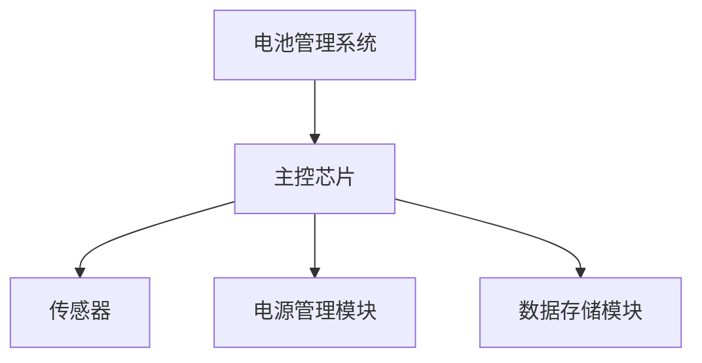

                 

# 价值投资中的新一代电池技术分析

---

## 关键词  
价值投资、电池技术、新能源、储能系统、技术分析、投资策略、电池性能

---

## 摘要  
随着全球能源结构转型和新能源技术的快速发展，电池技术作为新能源领域的核心技术，正在成为价值投资者关注的焦点。本文从技术与投资的双重角度，详细分析了新一代电池技术的核心原理、市场趋势、企业竞争力以及投资价值评估方法。通过对电池技术的深入剖析，结合实际案例和数学模型，为投资者提供了一套系统化的分析框架，帮助他们在新能源领域做出更明智的投资决策。

---

## 第一部分: 价值投资与电池技术概述

### 第1章: 价值投资与电池技术的背景介绍

#### 1.1 价值投资的基本概念
##### 1.1.1 价值投资的定义与核心理念
价值投资是一种以基本面分析为核心的长期投资策略，强调以低于资产内在价值的价格买入优质资产。其核心理念包括：  
- **安全边际**：买入价格低于内在价值，以降低风险。  
- **长期视角**：关注企业的长期盈利能力，而非短期价格波动。  
- **竞争优势**：投资具有护城河的企业，以确保长期收益。

##### 1.1.2 电池技术在现代经济中的重要性
电池技术是新能源革命的核心技术之一，广泛应用于以下领域：  
1. **电动汽车**：电池技术决定了新能源汽车的续航里程和成本。  
2. **储能系统**：电池是实现可再生能源（如风能、太阳能）稳定输出的关键技术。  
3. **消费电子**：电池性能直接影响设备的使用体验。  

##### 1.1.3 价值投资与电池技术的结合  
随着全球能源转型，电池技术的创新和产业化发展为投资者提供了新的机遇。投资者需要结合技术发展趋势和企业基本面，找到具有长期竞争优势的标的。

---

#### 1.2 电池技术的基本原理
##### 1.2.1 电池的基本组成与工作原理
电池主要由**正极材料**、**负极材料**、**电解液**和**隔膜**组成。其工作原理包括：  
1. **放电过程**：正极材料释放电子，通过外电路流向负极，负极与电解液发生反应释放能量。  
2. **充电过程**：外部电源将电子从负极输送到正极，将化学能储存在正极材料中。  

##### 1.2.2 不同类型电池的技术特点
1. **锂离子电池**：能量密度高、循环寿命长，但成本较高。  
2. **钠离子电池**：成本低、安全性高，适合储能领域。  
3. **固态电池**：能量密度更高，安全性更好，但技术尚未成熟。  

##### 1.2.3 电池技术的演进与未来趋势
电池技术的未来发展方向包括：  
1. **提高能量密度**：通过新型材料和结构设计提升储能能力。  
2. **降低成本**：优化生产工艺，降低材料成本。  
3. **提高安全性**：改进电池结构和化学成分，降低爆炸风险。  

---

### 第2章: 电池技术的核心概念与分析框架

#### 2.1 电池技术的核心指标分析
##### 2.1.1 能量密度与续航能力
- **能量密度**：单位体积或单位质量的电池储能能力。  
- **续航能力**：电池支持设备运行的时间或距离。  

##### 2.1.2 循环寿命与稳定性
- **循环寿命**：电池充放电次数。  
- **稳定性**：电池在不同温度、湿度等环境条件下的性能一致性。  

##### 2.1.3 成本与制造效率
- **材料成本**：正负极材料、电解液等的成本占比。  
- **制造效率**：生产过程的自动化程度和良品率。  

---

#### 2.2 电池技术的创新与突破
##### 2.2.1 新型电池技术的发展现状
1. **全固态电池**：通过使用固态电解质，显著提高电池安全性。  
2. **高镍电池**：通过提高正极材料中镍的比例，提升能量密度。  
3. **钠离子电池**：利用钠离子的优异储能特性，降低成本。  

##### 2.2.2 创新技术对投资价值的影响
技术创新可以带来以下投资机会：  
- 提高企业的市场竞争力。  
- 降低生产成本，提升利润率。  
- 扩大市场应用范围，如储能领域。  

##### 2.2.3 技术壁垒与竞争优势
1. **技术壁垒**：专利、工艺和研发能力决定了企业的技术优势。  
2. **成本优势**：规模化生产和技术进步可以降低单位产品成本。  

---

## 第二部分: 电池技术的经济与市场分析

### 第3章: 电池技术的市场现状与趋势

#### 3.1 电池技术的市场现状与趋势
##### 3.1.1 全球电池市场的规模与结构
- **市场规模**：2023年全球电池市场规模约为$1000$亿美元，预计未来几年将以$20\%$以上的年增长率扩大。  
- **市场结构**：电动汽车电池占据最大市场份额，储能电池增长最快。  

##### 3.1.2 新能源汽车与储能系统的驱动作用
- **电动汽车**：电池技术的提升直接推动了新能源汽车的普及。  
- **储能系统**：随着可再生能源的广泛应用，储能电池的需求持续增长。  

##### 3.1.3 政策支持与行业监管的影响
- **政策支持**：政府通过补贴、税收优惠等手段推动电池技术发展。  
- **行业监管**：严格的技术标准和环保要求提升了行业门槛。  

---

### 第4章: 电池技术的经济与市场分析

#### 4.1 电池技术的经济性分析
##### 4.1.1 电池成本的构成与优化
1. **材料成本**：正负极材料、电解液、隔膜等占总成本的$70\%$以上。  
2. **制造成本**：设备折旧、人工成本等占总成本的$20\%$左右。  

##### 4.1.2 电池技术的经济性与投资回报
- **规模效应**：大规模生产可以显著降低成本，提升利润率。  
- **技术进步**：新型电池技术可以带来更高的附加值。  

#### 4.2 电池技术的市场竞争力分析
##### 4.2.1 市场需求预测
- **电动汽车**：预计到2030年，电动汽车电池需求将占总需求的$60\%$。  
- **储能系统**：储能电池需求年增长率将超过$30\%$。  

##### 4.2.2 企业竞争格局
1. **头部企业**：宁德时代、比亚迪、松下等企业占据全球主要市场份额。  
2. **新兴企业**：初创公司通过技术创新和差异化竞争，逐步崛起。  

---

## 第三部分: 电池技术的价值投资策略

### 第5章: 电池技术的价值投资策略

#### 5.1 电池技术的价值评估模型
##### 5.1.1 技术价值评估
- **技术成熟度**：评估电池技术的商业化可行性。  
- **技术壁垒**：评估企业的技术竞争优势。  

##### 5.1.2 市场价值评估
- **市场规模**：评估电池技术的市场容量和增长潜力。  
- **竞争格局**：评估企业的市场地位和竞争优势。  

#### 5.2 电池技术投资的逻辑与方法
##### 5.2.1 技术驱动型投资
- **技术创新**：投资具有突破性技术的企业。  
- **技术产业化**：关注技术已进入商业化阶段的企业。  

##### 5.2.2 市场驱动型投资
- **市场规模**：投资需求增长快的领域，如储能电池。  
- **政策支持**：关注政策鼓励的行业和技术方向。  

---

## 第四部分: 电池技术的系统架构与投资实战

### 第6章: 电池技术的系统架构设计

#### 6.1 系统功能设计
##### 6.1.1 电池管理系统（BMS）
- **功能**：监控电池状态、优化充放电过程、提高安全性。  
- **架构**：通过传感器采集数据，经主控芯片处理后，实现对电池的智能管理。  

##### 6.1.2 电池生产系统
- **流程**：原材料采购、正负极制备、电池组装、检测与包装。  
- **优化点**：自动化生产、质量控制、降本增效。  

#### 6.2 系统架构设计
##### 6.2.1 系统架构图

##### 6.2.2 数据流分析
- **数据采集**：传感器采集电池温度、电压、电流等参数。  
- **数据处理**：主控芯片对数据进行分析，生成控制指令。  
- **数据输出**：通过通信模块将数据传送到上层系统。  

---

### 第7章: 电池技术投资的实战分析

#### 7.1 项目实战
##### 7.1.1 项目背景
- **目标**：分析某电池企业的技术优势和投资价值。  
- **数据来源**：企业财报、行业报告、专利数据。  

##### 7.1.2 数据分析
1. **财务指标**：ROE（净资产收益率）、毛利率、研发投入占比。  
2. **技术指标**：能量密度、循环寿命、成本优势。  

##### 7.1.3 投资建议
- **短期**：关注行业需求增长和政策支持。  
- **长期**：布局具有技术壁垒和成本优势的企业。  

---

## 第五部分: 总结与展望

### 第8章: 总结与展望

#### 8.1 总结
- 电池技术是新能源领域的重要驱动力，其技术创新和产业化发展为投资者提供了丰富的投资机会。  
- 价值投资者需要结合技术分析和基本面研究，找到具有长期竞争优势的企业。  

#### 8.2 展望
- **技术创新**：新型电池技术（如固态电池、钠离子电池）将逐步商业化。  
- **市场需求**：储能系统和电动汽车电池需求将持续增长。  
- **投资机会**：具有技术壁垒和成本优势的企业将成为投资热点。  

---

## 第六部分: 拓展阅读与参考资料

### 6.1 拓展阅读
1. **书籍推荐**：  
   - 《The Intelligent Investor》（《聪明的投资者》）  
   - 《Battery Science and Technology》（《电池科学与技术》）  

2. **行业报告**：  
   - 全球电池市场分析报告  
   - 新能源汽车行业研究报告  

### 6.2 投资者建议
1. **持续学习**：关注电池技术的最新进展和行业动态。  
2. **分散投资**：合理配置电池技术和其它领域的投资组合。  
3. **长期持有**：避免短期波动，关注企业的长期价值。  

---

通过以上分析，投资者可以更好地理解电池技术的价值投资机会，并在新能源领域做出更明智的投资决策。

