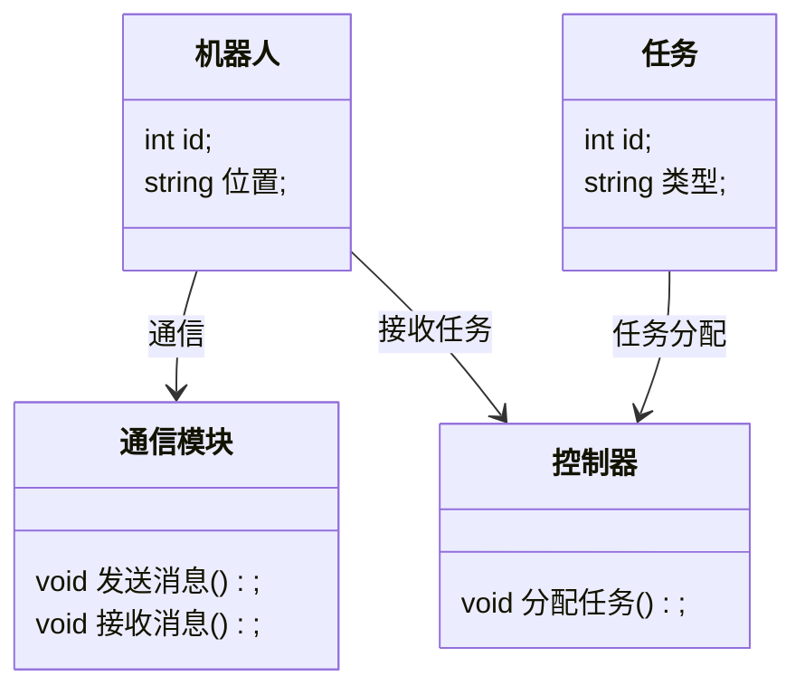
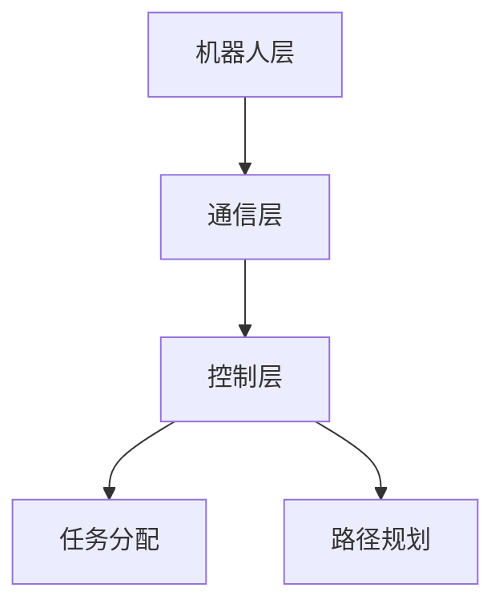

                 


# 价值投资中的智能仓储机器人协作系统分析

## 关键词：智能仓储，机器人协作系统，价值投资，系统分析，算法，系统架构，项目实战

## 摘要：  
智能仓储机器人协作系统是现代仓储管理的重要组成部分，其通过机器人之间的协作优化仓储效率，降低运营成本，从而对企业价值产生深远影响。本文从价值投资的角度，详细分析了智能仓储机器人协作系统的构成、算法原理、系统架构及实际应用案例。通过路径规划、任务分配和协作控制算法的深入探讨，结合系统架构设计和项目实战，本文为投资者提供了从技术角度评估企业仓储系统价值的新视角，为智能仓储机器人协作系统的优化和未来发展提供了重要参考。

---

## 第一部分: 智能仓储机器人协作系统概述

### 第1章: 问题背景与核心概念

#### 1.1 问题背景
智能仓储系统的效率直接影响企业的运营成本和利润，而机器人协作系统作为智能仓储的核心，能够显著提升仓储管理的效率和灵活性。然而，传统仓储系统存在人工操作效率低、资源浪费严重的问题，而智能仓储机器人协作系统通过自动化和智能化的协作方式，能够有效解决这些问题。

#### 1.2 核心概念与联系
智能仓储机器人协作系统是由多个机器人组成的协作网络，通过通信和任务分配机制完成仓储任务。系统的核心要素包括机器人、通信模块、任务分配算法和协作控制算法。通过ER图（实体关系图）可以清晰地看到各实体之间的关系，例如机器人与任务、机器人与通信模块之间的关联。

---

## 第二部分: 智能仓储机器人协作系统的算法原理

### 第2章: 算法原理与数学模型

#### 2.1 路径规划算法
路径规划是机器人协作系统中的关键算法，A*算法是一种常用的选择。通过优先级队列和启发式函数，A*算法能够在复杂环境中找到最优路径。以下是A*算法的伪代码示例：

```python
def a_star(start, goal):
    open_set = {start}
    closed_set = set()
    came_from = {}
    g_score = {start: 0}
    f_score = {start: heuristic(start, goal)}
    
    while open_set:
        current = pop(open_set, key=lambda x: f_score[x])
        if current == goal:
            break
        neighbors = get_neighbors(current)
        for neighbor in neighbors:
            tentative_g = g_score[current] + distance(current, neighbor)
            if neighbor in g_score and g_score[neighbor] <= tentative_g:
                continue
            came_from[neighbor] = current
            g_score[neighbor] = tentative_g
            f_score[neighbor] = g_score[neighbor] + heuristic(neighbor, goal)
            if neighbor not in open_set:
                add_to(open_set, neighbor)
    return came_from
```

#### 2.2 任务分配算法
任务分配算法需要考虑机器人的负载和位置，蚁群算法是一种有效的选择。以下是蚁群算法的数学模型：

$$
\text{信息素更新规则: } \Delta \tau_{ij} = \frac{1}{\text{路径长度}}
$$

$$
\text{蚂蚁选择路径的概率: } p_{ij} = \frac{\tau_{ij}^{\alpha} \cdot \eta_{ij}^{\beta}}{\sum_{k} \tau_{ik}^{\alpha} \cdot \eta_{ik}^{\beta}}
$$

---

## 第三部分: 智能仓储机器人协作系统的系统分析

### 第3章: 系统分析与架构设计

#### 3.1 项目介绍
项目目标是设计一个高效的智能仓储机器人协作系统，实现任务分配、路径规划和协作控制。项目范围包括仓储环境建模、机器人通信和任务分配算法的实现。

#### 3.2 系统功能设计
领域模型通过Mermaid类图展示各实体之间的关系，包括机器人、任务、通信模块和控制器。



#### 3.3 系统架构设计
系统架构采用分层设计，包括机器人层、通信层和控制层。以下是系统架构图：



---

## 第四部分: 项目实战与案例分析

### 第4章: 项目实战

#### 4.1 环境安装与配置
开发环境包括Python、ROS和一些依赖库，如numpy和scipy。

#### 4.2 核心代码实现
以下是路径规划算法的实现代码：

```python
import math

def heuristic(a, b):
    return abs(a[0] - b[0]) + abs(a[1] - b[1])

def a_star_search(grid, start, goal):
    open_set = {start}
    closed_set = set()
    came_from = {}
    g_score = {start: 0}
    f_score = {start: heuristic(start, goal)}
    
    while open_set:
        current = sorted(open_set, key=lambda x: f_score[x])[0]
        open_set.remove(current)
        if current == goal:
            return came_from
        neighbors = []
        if grid[current[0]+1][current[1]] != '障碍':
            neighbors.append((current[0]+1, current[1]))
        if grid[current[0]-1][current[1]] != '障碍':
            neighbors.append((current[0]-1, current[1]))
        for neighbor in neighbors:
            tentative_g = g_score[current] + heuristic(current, neighbor)
            if neighbor not in g_score or tentative_g < g_score[neighbor]:
                came_from[neighbor] = current
                g_score[neighbor] = tentative_g
                f_score[neighbor] = tentative_g + heuristic(neighbor, goal)
                if neighbor not in open_set:
                    open_set.add(neighbor)
    return None
```

---

## 第五部分: 总结与展望

### 第5章: 总结与最佳实践

#### 5.1 内容回顾
本文详细分析了智能仓储机器人协作系统的构成、算法和系统架构，通过实际案例展示了系统的应用价值。

#### 5.2 投资策略与注意事项
投资者在选择智能仓储机器人协作系统时，应考虑系统的可扩展性、算法的优化潜力以及企业的实际需求。

---

以上目录结构和内容框架希望能够帮助您撰写一篇结构清晰、内容详实的专业技术博客文章。

