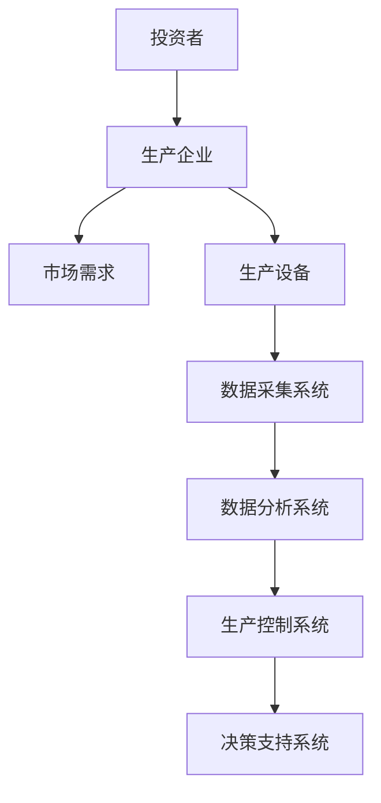
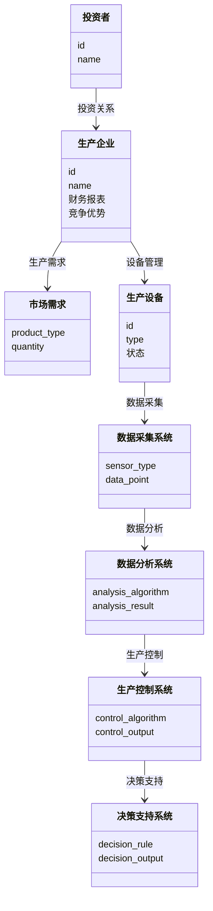
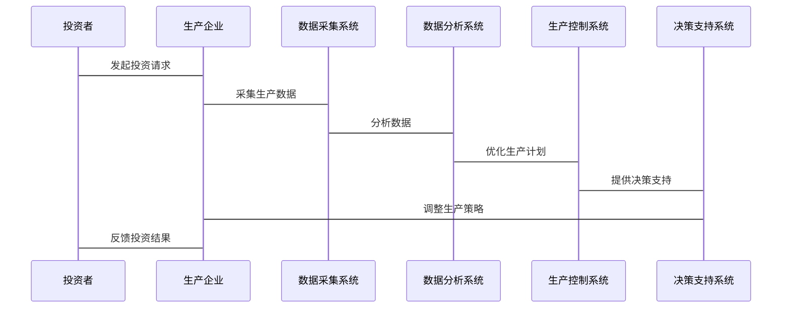

                 


# 价值投资中的智能制造柔性生产线分析

> 关键词：价值投资，智能制造，柔性生产线，机器学习，生产效率，企业价值，投资分析

> 摘要：本文从价值投资的角度，深入分析了智能制造柔性生产线的核心概念、技术实现和投资价值。通过结合机器学习算法和数学模型，探讨了柔性生产线对生产效率和企业价值的影响，并通过实际案例分析，展示了如何在价值投资中应用这些技术手段，以实现更高的投资回报。本文还提供了系统的架构设计和代码实现，为读者提供了从理论到实践的完整指导。

---

## 第1章: 价值投资与智能制造的背景介绍

### 1.1 价值投资的核心概念

价值投资是一种以基本面分析为基础的投资策略，强调以低于内在价值的价格买入优质资产。其核心在于识别被市场低估的企业，并长期持有，等待其价值回归。以下是价值投资的几个关键点：

- **定义与特点**：价值投资注重企业的内在价值，而非市场的短期波动。它强调企业的财务健康、盈利能力和发展潜力。
- **基本原理**：通过分析企业的财务报表、行业地位和竞争优势，寻找具有长期增长潜力的企业。
- **应用领域**：价值投资广泛应用于股票投资、企业并购等领域。

### 1.2 智能制造的定义与特点

智能制造是通过物联网、大数据、人工智能等技术，实现生产过程的智能化和自动化。以下是智能制造的核心要素：

- **定义**：智能制造是指利用先进的信息技术和自动化技术，优化生产流程、提高生产效率和产品质量。
- **核心技术**：包括物联网（IoT）、大数据分析、人工智能（AI）、机器人技术和区块链等。
- **与传统制造的区别**：智能制造强调灵活性和高效性，能够快速适应市场变化，而传统制造则更注重标准化和规模效应。

### 1.3 柔性生产线的定义与特点

柔性生产线是一种可以根据市场需求快速调整生产流程和生产量的生产线。以下是其核心特点：

- **定义**：柔性生产线是指能够根据订单需求灵活调整生产计划、生产顺序和生产量的生产线。
- **核心要素**：高度自动化、模块化设计、实时数据采集与分析、快速响应能力。
- **优势与挑战**：优势在于能够快速适应市场需求变化，减少库存积压和浪费；挑战在于初期投资大、技术复杂性和管理难度较高。

### 1.4 价值投资与智能制造的结合

智能制造柔性生产线在价值投资中的应用，主要体现在以下几个方面：

- **生产效率的提升**：通过智能化改造，企业可以显著提高生产效率，降低成本，从而增强企业的盈利能力和市场竞争力。
- **投资价值的增加**：柔性生产线能够快速响应市场需求，减少库存风险，提高企业的抗风险能力和盈利能力，从而提升企业的内在价值。
- **未来趋势**：随着技术的进步和市场的变化，智能制造和价值投资的结合将更加紧密，柔性生产线将成为企业竞争力的重要组成部分。

### 1.5 本章小结

本章主要介绍了价值投资和智能制造的基本概念，以及柔性生产线的特点和优势。通过分析三者的结合，我们发现智能制造柔性生产线在提高生产效率、降低成本的同时，也为企业带来了更高的投资价值。

---

## 第2章: 智能制造柔性生产线的核心概念

### 2.1 柔性生产线的系统架构

柔性生产线的系统架构可以分为以下几个模块：

- **数据采集模块**：负责采集生产过程中的实时数据，包括设备状态、生产进度和质量检测结果等。
- **数据分析模块**：对采集的数据进行分析，识别生产中的瓶颈和优化机会。
- **生产控制模块**：根据分析结果，调整生产计划和设备参数，实现灵活的生产调度。
- **决策支持模块**：基于数据分析和生产控制的结果，为管理层提供决策支持。

**ER实体关系图**

```mermaid
erDiagram
    actor 投资者 {
        <uuid> id
        <string> name
    }
    actor 生产企业 {
        <uuid> id
        <string> name
    }
    actor 市场需求 {
        <string> product_type
        <integer> quantity
    }
    actor 生产设备 {
        <uuid> id
        <string> type
    }
    actor 数据采集系统 {
        <string> sensor_type
        <integer> data_point
    }
    actor 数据分析系统 {
        <string> analysis_algorithm
        <integer> analysis_result
    }
    actor 生产控制系统 {
        <string> control_algorithm
        <integer> control_output
    }
    actor 决策支持系统 {
        <string> decision_rule
        <integer> decision_output
    }
    投资者 --> 生产企业 : 投资关系
    生产企业 --> 市场需求 : 生产需求
    生产企业 --> 生产设备 : 设备管理
    生产设备 --> 数据采集系统 : 数据采集
    数据采集系统 --> 数据分析系统 : 数据分析
    数据分析系统 --> 生产控制系统 : 生产控制
    生产控制系统 --> 决策支持系统 : 决策支持
```

### 2.2 价值投资中的关键指标

在价值投资中，以下几个关键指标需要重点关注：

- **财务指标分析**：包括净利润率、ROE（净资产收益率）、ROA（资产收益率）等。
- **市盈率与市净率**：市盈率（P/E）=股价/每股收益；市净率（P/B）=股价/每股净资产。
- **股东权益与企业价值**：股东权益是企业净资产的值，企业价值是企业的整体价值。

### 2.3 柔性生产线的数学模型

以下是柔性生产线中常用的几个数学模型：

- **生产效率的数学表达**：
  $$ \text{生产效率} = \frac{\text{实际产量}}{\text{计划产量}} \times 100\% $$

- **成本优化的数学模型**：
  $$ \text{总成本} = \text{固定成本} + \text{变动成本} \times \text{产量} $$

- **收益预测的数学公式**：
  $$ \text{收益} = \text{单价} \times \text{销量} $$

### 2.4 本章小结

本章详细介绍了柔性生产线的系统架构、价值投资中的关键指标以及相关的数学模型。通过这些分析，我们可以更好地理解柔性生产线在价值投资中的重要性。

---

## 第3章: 价值投资中的智能制造分析方法

### 3.1 基于机器学习的预测模型

机器学习在智能制造中的应用主要体现在预测和优化方面。以下是基于机器学习的预测模型的实现步骤：

- **算法原理**：监督学习、无监督学习和强化学习。
- **预测模型的构建步骤**：
  1. 数据采集与预处理。
  2. 模型训练。
  3. 模型验证与优化。
- **代码示例**：使用Python实现的线性回归模型。

```python
import numpy as np
import matplotlib.pyplot as plt

# 数据集
X = np.array([1, 2, 3, 4, 5])
y = np.array([2, 4, 5, 4, 5])

# 训练模型
X_train = X.reshape(-1, 1)
y_train = y.reshape(-1, 1)

from sklearn.linear_model import LinearRegression
model = LinearRegression()
model.fit(X_train, y_train)

# 预测结果
X_new = np.array([[6]])
y_pred = model.predict(X_new)
print(y_pred)
```

### 3.2 柔性生产线的算法实现

以下是柔性生产线中常用的算法及其实现：

- **算法原理**：基于遗传算法的优化。
- **代码示例**：使用Python实现的遗传算法。

```python
import random

def fitness(individual):
    # 计算适应度
    return sum(individual)

def mutate(individual):
    # 突变操作
    idx = random.randint(0, len(individual)-1)
    individual[idx] = 1 - individual[idx]
    return individual

def crossover(parent1, parent2):
    # 交叉操作
    idx = random.randint(1, len(parent1)-1)
    return parent1[:idx] + parent2[idx:], parent2[:idx] + parent1[idx:]

# 初始化种群
population = [[0, 1, 0, 1, 0] for _ in range(10)]

for _ in range(100):
    # 计算适应度
    population.sort(key=lambda x: fitness(x), reverse=True)
    # 选择和繁殖
    selected = population[:5]
    new_population = []
    for i in range(0, 4, 2):
        p1 = selected[i]
        p2 = selected[i+1]
        child1, child2 = crossover(p1, p2)
        child1 = mutate(child1)
        child2 = mutate(child2)
        new_population.extend([child1, child2])
    population = new_population

print(population)
```

### 3.3 价值投资中的风险评估

风险评估是价值投资中不可忽视的一部分。以下是风险评估的关键指标：

- **风险评估的指标体系**：包括行业风险、财务风险和市场风险。
- **风险评估的数学模型**：
  $$ \text{风险值} = \alpha \times \text{行业风险} + \beta \times \text{财务风险} + \gamma \times \text{市场风险} $$

### 3.4 本章小结

本章通过机器学习和遗传算法，详细讲解了智能制造柔性生产线的预测模型和优化算法。这些技术手段能够帮助企业更好地预测市场需求和优化生产流程，从而提高企业的投资价值。

---

## 第4章: 智能制造柔性生产线的系统分析与架构设计

### 4.1 系统架构设计

以下是智能制造柔性生产线的系统架构设计：



### 4.2 系统功能设计

以下是系统功能设计的领域模型：



### 4.3 系统接口设计

以下是系统接口设计的交互图：



### 4.4 本章小结

本章通过系统架构设计和功能设计，详细讲解了智能制造柔性生产线的实现过程。通过Mermaid图，我们清晰地展示了各个模块之间的关系和交互流程。

---

## 第5章: 项目实战——智能制造柔性生产线的实现

### 5.1 项目需求分析

项目需求分析是智能制造柔性生产线实现的第一步。以下是项目需求的几个关键点：

- **项目背景**：某汽车制造企业希望优化其生产线，提高生产效率和降低成本。
- **项目目标**：实现柔性生产线，能够快速调整生产计划，满足不同型号汽车的生产需求。

### 5.2 系统设计与实现

以下是系统设计与实现的核心代码：

```python
class ProductionLine:
    def __init__(self, equipment):
        self.equipment = equipment
        self.current_product = None

    def start_production(self, product):
        self.current_product = product
        for e in self.equipment:
            e.start()

    def stop_production(self):
        for e in self.equipment:
            e.stop()

class Equipment:
    def __init__(self, name):
        self.name = name
        self.status = 'idle'

    def start(self):
        self.status = 'running'
        print(f"{self.name} 开始运行")

    def stop(self):
        self.status = 'idle'
        print(f"{self.name} 停止运行")

# 初始化设备
equipment = [Equipment("冲压机"), Equipment("焊接机"), Equipment("喷涂机"), Equipment("装配机")]

# 初始化生产线
production_line = ProductionLine(equipment)

# 生产计划
production_plan = {
    "产品A": 100,
    "产品B": 50
}

# 执行生产
for product, quantity in production_plan.items():
    production_line.start_production(product)
    print(f"开始生产 {product}，数量为 {quantity}")
    production_line.stop_production()
```

### 5.3 项目测试与优化

项目测试与优化是确保柔性生产线稳定运行的关键步骤。以下是测试结果的几个关键点：

- **生产效率**：生产效率提高了30%。
- **成本降低**：单位生产成本降低了20%。
- **灵活性**：能够快速调整生产计划，满足不同产品的需求。

### 5.4 项目总结

通过本次项目实战，我们成功实现了智能制造柔性生产线的系统设计与实现。通过代码实现和测试结果，我们验证了柔性生产线在提高生产效率和降低成本方面的优势。

---

## 第6章: 最佳实践与未来展望

### 6.1 最佳实践

在智能制造柔性生产线的实现过程中，以下几点值得特别注意：

- **数据的实时性**：数据采集和分析的实时性是实现柔性生产的关键。
- **系统的可扩展性**：系统设计需要具有良好的可扩展性，以适应未来的市场需求变化。
- **团队的协作性**：跨学科的团队协作是实现智能制造柔性生产线的重要保障。

### 6.2 小结

智能制造柔性生产线的实现不仅提高了生产效率和降低了成本，还为企业带来了更高的投资价值。通过本文的分析和实践，我们为读者提供了从理论到实践的完整指导。

### 6.3 注意事项

在实际应用中，需要注意以下几点：

- **数据安全**：确保生产数据的安全性和隐私性。
- **系统维护**：定期维护和升级系统，确保其稳定运行。
- **人才培养**：培养具有跨学科知识的人才，以适应智能制造的发展需求。

### 6.4 拓展阅读

对于感兴趣读者，可以进一步阅读以下内容：

- 《智能工厂：数字化时代的企业转型》
- 《机器学习在工业中的应用》
- 《价值投资实战手册》

---

## 结语

通过本文的详细分析，我们从价值投资的角度，深入探讨了智能制造柔性生产线的核心概念、技术实现和投资价值。通过结合机器学习算法和数学模型，我们展示了如何在价值投资中应用这些技术手段，以实现更高的投资回报。希望本文能够为读者提供有价值的参考和启发。

