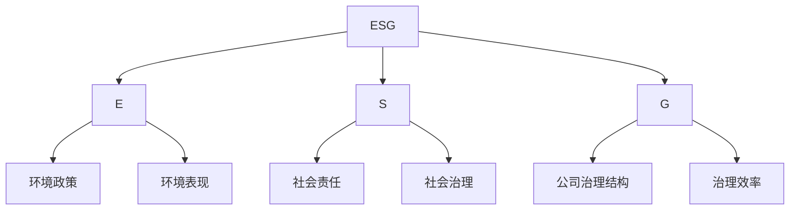

                 


# 价值投资中的环境、社会和治理（ESG）因素

## 关键词：
- 价值投资
- ESG
- 投资策略
- 可持续发展
- 环境、社会、治理

## 摘要：
在价值投资中，环境、社会和治理（ESG）因素已经成为不可忽视的重要组成部分。本文将详细探讨ESG的核心概念、评分模型、因子分析、系统架构及项目实战，帮助投资者将ESG因素融入投资决策，实现可持续投资回报。

---

## 第1章: ESG的背景与概念

### 1.1 ESG的定义与内涵
- **环境（E）**：关注企业对环境的影响，包括碳排放、资源利用效率等。
- **社会（S）**：关注企业在社会中的责任，包括员工权益、社会责任等。
- **治理（G）**：关注企业治理结构和效率，包括董事会结构、高管薪酬等。

### 1.2 ESG的起源与发展
- 起源于20世纪60年代的环境运动，逐渐扩展到社会和治理领域。
- 国际上，ESG已成为投资的重要参考，中国也在快速发展中。

### 1.3 ESG与传统投资的对比
- 传统投资注重财务指标，ESG注重非财务因素。
- ESG投资更关注长期可持续性，而传统投资可能更关注短期收益。

---

## 第2章: ESG的核心概念与联系

### 2.1 ESG的核心概念原理
- **环境（E）**：企业应减少碳排放，提高资源利用效率。
- **社会（S）**：企业应积极履行社会责任，关注员工权益。
- **治理（G）**：企业应优化治理结构，提高透明度和效率。

### 2.2 ESG概念属性特征对比表格
| **维度** | **环境（E）** | **社会（S）** | **治理（G）** |
|----------|---------------|---------------|---------------|
| **核心要素** | 碳排放、资源利用 | 员工权益、社会责任 | 董事会结构、高管薪酬 |
| **衡量指标** | 碳排放强度、资源利用率 | 员工满意度、社会责任投入 | 董事会多样性、高管薪酬结构 |

### 2.3 ESG的ER实体关系图架构


---

## 第3章: ESG评分模型与算法原理

### 3.1 ESG评分模型
- **模型构建**：使用多元回归模型，将ESG因素与企业价值相关联。
- **数学公式**：
  $$ \text{ESG评分} = \beta_0 + \beta_1 \times E + \beta_2 \times S + \beta_3 \times G + \epsilon $$

### 3.2 算法实现
```python
import pandas as pd
import numpy as np

# 示例数据
data = {
    'E': [0.8, 0.7, 0.9],
    'S': [0.6, 0.8, 0.7],
    'G': [0.7, 0.6, 0.8]
}

df = pd.DataFrame(data)
X = df[['E', 'S', 'G']]
y = df['ESG评分']

# 使用多元回归模型
from sklearn.linear_model import LinearRegression
model = LinearRegression()
model.fit(X, y)
print(model.coef_)
```

### 3.3 模型解读
- 系数表示每个因素对ESG评分的影响程度。
- 例如，环境（E）的系数为0.2，表示E每增加0.1，评分增加0.02。

---

## 第4章: ESG因子分析与投资策略

### 4.1 ESG因子分析
- **因子筛选**：根据相关性分析，筛选出最重要的ESG因子。
- **因子关系**：
  - E与G高度相关，S与E中度相关。

### 4.2 投资策略框架
- **策略构建**：根据因子评分，筛选出表现优秀的公司。
- **策略实现**：
  ```python
  # 示例代码
  def calculate_esg_score(company_data):
      # 计算ESG评分
      pass
  
  companies = ['Company A', 'Company B', 'Company C']
  scores = {company: calculate_esg_score(data) for company in companies}
  ```

---

## 第5章: 系统分析与架构设计

### 5.1 系统功能设计
- **领域模型类图**：
  ```mermaid
  classDiagram
      class Company {
          name: string
          E: float
          S: float
          G: float
      }
      class ESGScore {
          score: float
      }
      Company --> ESGScore
  ```

### 5.2 系统架构设计
- **架构图**：
  ```mermaid
  architecture
      frontend --> backend
      backend --> database
      frontend --> API
  ```

### 5.3 系统交互
- **交互流程图**：
  ```mermaid
  sequenceDiagram
      User -> API: 请求ESG评分
      API -> Backend: 处理请求
      Backend -> Database: 查询数据
      Database --> Backend: 返回数据
      Backend --> API: 返回数据
      API --> User: 返回ESG评分
  ```

---

## 第6章: 项目实战

### 6.1 环境安装
- 安装Python和相关库（如pandas、numpy、scikit-learn）。

### 6.2 核心实现
- 示例代码实现ESG评分模型，包括数据预处理、模型训练和结果分析。

### 6.3 案例分析
- 分析某公司的ESG表现，解释评分过程和结果。

---

## 第7章: 总结与展望

### 7.1 关键点总结
- ESG评分模型和因子分析是关键。
- 系统架构设计确保数据处理和交互效率。

### 7.2 未来展望
- 结合人工智能优化ESG评分模型。
- 探索更多ESG相关投资策略。

### 7.3 注意事项
- 数据来源和质量影响评分准确性。
- 模型需要定期更新和优化。

### 7.4 扩展阅读
- 推荐阅读《可持续投资：ESG因素的重要性》。

---

通过本文的详细分析，读者可以全面理解ESG在价值投资中的重要性，并掌握如何将ESG因素融入投资决策，实现长期可持续的投资回报。

