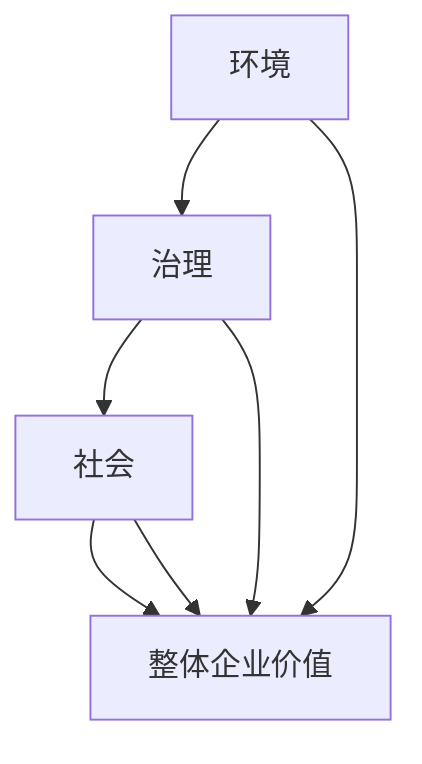

                 

# 价值投资中的环境、社会和治理（ESG）因素考量

> 关键词：价值投资, ESG, 可持续投资, 企业治理, 环境影响, 社会责任

> 摘要：本文深入探讨了环境、社会和治理（ESG）因素在价值投资中的重要性。通过分析ESG的核心概念、对企业价值的影响、行业差异、治理结构、投资策略、风险管理等方面，揭示ESG如何成为投资决策的关键因素。结合实际案例和系统架构，本文展示了如何将ESG因素融入投资组合管理，以实现长期可持续收益。

---

## 第一部分：ESG的定义与重要性

### 第1章：ESG的定义与核心要素

#### 1.1 ESG的定义与核心要素

- **环境（Environmental）**：指企业在运营过程中对环境的影响，包括碳排放、资源消耗、污染治理等方面。企业对环境的管理能力直接影响其长期成本和风险。
- **社会（Social）**：指企业在社会中的责任履行情况，包括员工权益、劳工条件、社区关系、产品安全等方面。良好的社会表现有助于提升企业声誉和客户信任。
- **治理（Governance）**：指企业的管理结构和决策机制，包括董事会构成、高管薪酬、透明度、股东权利等方面。高效的治理结构能够提升企业运营效率和抗风险能力。

**图1-1：ESG三者的相互关系与整体性**

---

#### 1.2 ESG与传统投资的对比

- **传统投资的核心要素**：主要关注财务指标（如收入、利润、市盈率）和市场趋势，较少考虑非财务因素。
- **ESG投资的核心要素**：在传统财务指标的基础上，额外关注环境、社会和治理因素，注重企业的可持续发展能力。
- **区别**：ESG投资更注重长期价值和风险管理，而传统投资更关注短期收益和市场波动。

---

#### 1.3 ESG在价值投资中的重要性

- **对企业价值的影响**：ESG因素通过影响企业的运营成本、声誉风险和抗风险能力，最终影响其市场价值。
- **对投资组合风险的降低**：通过筛选高ESG评级的企业，投资者可以降低投资组合的系统性风险，尤其是在环境危机或社会动荡时。
- **对长期收益的推动**：研究表明，长期来看，ESG表现良好的企业往往能为投资者带来超额收益。

---

### 第2章：ESG与企业价值的关系

#### 2.1 ESG因素对企业价值的影响路径

- **环境因素对企业成本的影响**：高环境成本（如碳税、资源消耗）可能降低企业利润率，但优秀的环境管理也能提升企业形象。
- **社会因素对企业声誉的影响**：良好的社会形象有助于吸引优秀员工、客户和投资者，从而提升企业估值。
- **治理因素对企业效率的影响**：高效的治理结构能够优化决策流程，提升企业运营效率和抗风险能力。

---

#### 2.2 ESG评级对企业价值的具体体现

- **不同评级对企业估值的影响**：高评级企业通常享有更高的市盈率和市净率，尤其是在ESG投资兴起的背景下。
- **评级变化对企业股价的影响**：评级上调往往带来股价上涨，而评级下调可能导致股价下跌。
- **评级对企业融资成本的影响**：高评级企业更容易获得低成本融资，尤其是在ESG投资趋势下。

---

#### 2.3 ESG投资的长期收益分析

- **长期投资回报的驱动因素**：ESG投资通过降低风险和提升企业质量，实现长期稳定的收益。
- **ESG投资与企业可持续发展的关系**：企业可持续发展能力越强，长期投资回报越高。
- **ESG投资的社会经济效益**：通过支持环保、社会责任强的企业，推动社会整体进步。

---

## 第二部分：ESG因素的分析框架

### 第3章：ESG因素的行业分析

#### 3.1 不同行业的ESG表现差异

- **高碳行业的ESG挑战**：如能源、化工等行业，环境风险高，但通过技术创新可以降低风险。
- **高科技行业的ESG优势**：如科技、信息技术等行业，社会影响较小，但治理结构可能较为复杂。
- **公用事业行业的ESG特征**：如电力、水务等行业，环境和社会影响较大，治理结构较为稳定。

---

#### 3.2 行业ESG风险的识别与评估

- **行业风险的分类与评估方法**：根据行业特点，制定不同的ESG风险评估标准。
- **ESG风险对企业竞争力的影响**：高风险行业可能面临更多的监管压力和舆论风险，影响企业的市场地位。
- **行业ESG风险的动态变化**：随着政策和技术的变化，行业ESG风险会不断调整。

---

### 第4章：ESG因素的企业治理分析

#### 4.1 公司治理结构的ESG评估

- **股权结构的合理性分析**：分散的股权结构可能增加代理成本，而集中的股权结构可能面临治理不透明的风险。
- **董事会结构的独立性评估**：独立董事会成员比例高有助于提升治理效率。
- **高管薪酬与绩效考核机制**：合理的薪酬结构能够激励高管追求长期价值。

---

#### 4.2 内部控制与风险管理

- **内部控制系统的设计**：建立完善的内部控制系统，确保ESG目标的实现。
- **风险管理的具体措施**：通过定期风险评估和应急预案，降低ESG相关风险。

---

## 第三部分：ESG投资策略与风险管理

### 第5章：ESG投资策略

#### 5.1 ESG主题投资

- **主题投资的定义与特点**：专注于特定ESG主题（如可再生能源、绿色科技）的投资策略。
- **主题投资的优势**：能够精准捕捉ESG趋势下的投资机会。

---

#### 5.2 ESG指数投资

- **指数投资的定义与特点**：通过投资ESG指数基金，分散风险的同时获得市场平均收益。
- **指数投资的优势**：操作简单，费用低，适合普通投资者。

---

### 第6章：ESG投资的风险管理

#### 6.1 ESG投资组合的风险管理

- **投资组合的构建与优化**：通过资产配置和风险对冲，降低ESG投资的波动性。
- **风险对冲的具体方法**：使用衍生品（如期货、期权）对冲ESG投资中的系统性风险。

---

## 第四部分：案例分析与未来趋势

### 第7章：案例分析

#### 7.1 成功案例：特斯拉的ESG投资

- **案例背景**：特斯拉在环境和治理方面的表现突出，推动了其股价的持续上涨。
- **经验总结**：技术创新与ESG理念的结合是成功的关键。

---

#### 7.2 失败案例：某石化企业的ESG危机

- **案例背景**：某石化企业在环境管理上的失误导致重大环境污染事件，股价大幅下跌。
- **经验总结**：忽视环境风险可能带来巨大的系统性风险。

---

### 第8章：未来趋势

#### 8.1 ESG投资的未来发展

- **ESG投资的全球发展趋势**：随着全球对可持续发展的关注，ESG投资将加速增长。
- **技术对ESG投资的影响**：大数据和人工智能将推动ESG评估的精准化和自动化。

---

## 结语

ESG因素正在成为价值投资中的核心考量，通过本文的分析，投资者可以更好地理解ESG的重要性，并将其融入投资决策中。未来，随着技术的进步和社会的发展，ESG投资将继续深化，为投资者和企业创造更大的价值。

--- 

**注**：本文内容基于当前知识水平创作，部分数据和案例可能需要进一步验证和补充。

