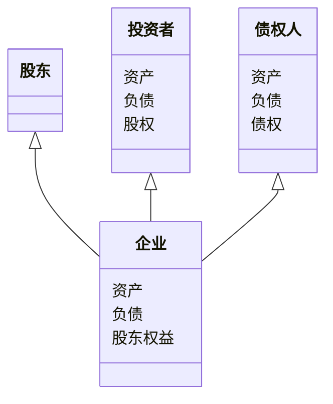
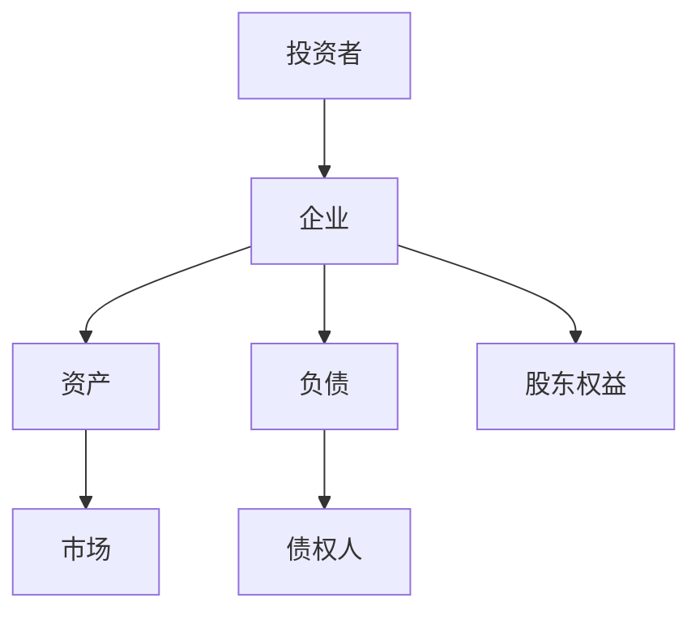
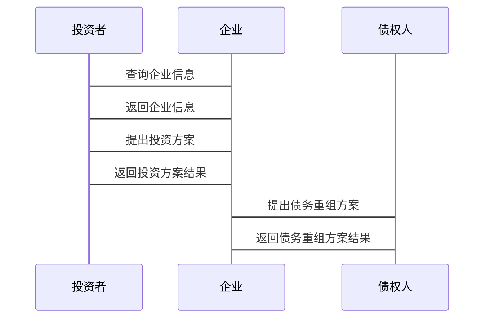

                 

# 《价值投资中的破产重组机会》

## 关键词：
- 价值投资
- 破产重组
- 投资机会
- 股价评估
- 风险管理

## 摘要：
本文深入探讨了价值投资与破产重组的结合，分析了破产重组中的投资机会，提供了数学模型和系统架构设计。通过案例分析和实战指导，帮助读者识别和把握破产重组中的价值投资机会。

---

# 第1章: 价值投资与破产重组概述

## 1.1 价值投资的基本概念

### 1.1.1 价值投资的定义
价值投资是一种以企业内在价值为核心的投资策略，强调以低于内在价值的价格买入优质资产。其核心在于寻找市场低估的公司，并长期持有。

**安全边际**：价值投资者强调安全边际，即买入价格与内在价值的差距，以降低投资风险。

**内在价值**：企业未来现金流的现值，计算公式为：
$$ V = \sum_{t=1}^{n} \frac{CF_t}{(1 + r)^t} $$

### 1.1.2 价值投资的核心原则
- **安全边际**：买入价格低于内在价值。
- **长期投资**：关注企业的长期价值，而非短期波动。
- **复利效应**：长期持有的复利效应是价值投资的核心优势。

### 1.1.3 价值投资与破产重组的关联
破产重组为企业提供了价值重构的机会，价值投资者可以通过识别这些机会，以更低的价格买入优质资产。

---

## 1.2 破产重组的基本概念

### 1.2.1 研究破产重组的背景
企业破产重组是指企业因财务困境而通过法律程序进行资产和债务重组的过程，目的是恢复企业的经营能力和偿债能力。

### 1.2.2 破产重组的主要类型
- **自愿重组**：企业主动申请重组。
- **强制重组**：债权人申请企业破产，法院强制执行。

### 1.2.3 破产重组的法律框架
破产重组的法律框架包括《企业破产法》和相关法规，明确了重组程序、债权处理和资产分配等内容。

---

## 1.3 破产重组中的投资机会

### 1.3.1 研究破产重组中的投资机会
破产重组过程中，企业可能因债务减少和资产优化而恢复价值，为投资者提供低价买入的机会。

### 1.3.2 破产重组中的风险与收益
- **风险**：破产重组失败可能导致投资损失。
- **收益**：成功重组可能带来高额回报。

### 1.3.3 破产重组与价值投资的结合点
- 破产重组提供了价值重构的机会。
- 价值投资者可以通过分析企业基本面，识别潜在的投资机会。

---

## 1.4 本章小结
本章介绍了价值投资的基本概念、核心原则以及与破产重组的关联，分析了破产重组中的投资机会和相关风险。通过理解这些内容，投资者可以更好地把握破产重组中的投资机会。

---

# 第2章: 价值投资的核心概念与分析框架

## 2.1 价值投资的核心概念

### 2.1.1 安全边际
安全边际是价值投资的核心原则之一，通过买入价格低于内在价值，降低投资风险。

### 2.1.2 股价与内在价值的关系
股价围绕内在价值波动，价值投资者关注长期内在价值，而非短期股价波动。

### 2.1.3 长期投资与复利效应
长期投资通过复利效应实现财富增长，是价值投资的重要策略。

---

## 2.2 破产重组中的价值评估

### 2.2.1 企业价值评估的基本方法
企业价值评估的基本方法包括现金流折现法（DCF）和可比公司法。

### 2.2.2 破产重组中的资产重构
资产重构是指通过出售非核心资产或引入新投资者，优化企业资产结构。

### 2.2.3 破产重组中的债务重组
债务重组是指通过调整债务结构和偿付方式，降低企业的财务负担。

---

## 2.3 价值投资中的风险管理

### 2.3.1 风险管理的核心原则
- **分散投资**：通过多元化投资降低风险。
- **风险控制**：设定止损点，避免重大损失。

### 2.3.2 研究破产重组中的风险
- **企业基本面风险**：企业盈利能力下降。
- **市场风险**：市场波动影响股价。

### 2.3.3 破产重组中的风险控制
通过深入分析企业基本面和市场环境，制定合理的投资策略，降低投资风险。

---

## 2.4 本章小结
本章详细阐述了价值投资的核心概念和分析框架，分析了破产重组中的价值评估和风险管理策略，为后续章节奠定了理论基础。

---

# 第3章: 破产重组中的机会识别

## 3.1 研究破产重组中的企业价值重构

### 3.1.1 企业价值重构的机制
企业价值重构通过资产优化和债务重组，提升企业的经营能力和偿债能力。

### 3.1.2 企业价值重构的案例分析
以某破产企业为例，分析其通过资产出售和债务重组实现价值重构的过程。

---

## 3.2 研究破产重组中的资产重组策略

### 3.2.1 资产重组的主要方式
- **资产出售**：出售非核心资产，优化资产结构。
- **资产注入**：引入新资产，提升企业价值。

### 3.2.2 资产重组中的价值提升
通过资产优化和债务重组，提升企业的市场竞争力和盈利能力。

---

## 3.3 研究破产重组中的债务重组机会

### 3.3.1 债务重组的基本流程
债务重组的基本流程包括债务确认、协商谈判和方案实施。

### 3.3.2 债务重组中的利益平衡
债务重组需要平衡债权人和债务人的利益，确保方案的可行性和公平性。

---

## 3.4 本章小结
本章分析了破产重组中的机会识别，重点探讨了企业价值重构、资产重组策略和债务重组机会，为投资者提供了具体的分析框架。

---

# 第4章: 价值投资中的数学模型与分析方法

## 4.1 现金流折现模型

### 4.1.1 现金流折现模型的定义
现金流折现模型（DCF）是评估企业内在价值的重要工具，通过将未来现金流折现为现值。

### 4.1.2 现金流折现模型的公式
$$ PV = \sum_{t=1}^{n} \frac{CF_t}{(1 + r)^t} $$

### 4.1.3 现金流折现模型的案例分析
以某破产企业为例，计算其未来现金流的现值，评估其内在价值。

---

## 4.2 股权价值评估模型

### 4.2.1 股权价值评估模型的定义
股权价值评估模型用于计算企业的股权价值，帮助投资者评估投资机会。

### 4.2.2 股权价值评估模型的公式
$$ V = \frac{E}{1 - D/WACC} $$

### 4.2.3 股权价值评估模型的案例分析
以某破产企业为例，计算其股权价值，评估其投资价值。

---

## 4.3 研究破产重组中的债务与股权比例分析

### 4.3.1 破产重组中的债务与股权比例分析
通过分析债务与股权的比例，评估企业的财务健康状况和投资风险。

### 4.3.2 研究破产重组中的资产与负债匹配分析
通过资产与负债的匹配分析，评估企业的偿债能力和经营风险。

---

## 4.4 本章小结
本章详细阐述了价值投资中的数学模型与分析方法，通过现金流折现模型和股权价值评估模型，帮助投资者评估破产重组中的投资机会。

---

# 第5章: 破产重组中的系统分析与架构设计

## 5.1 研究破产重组中的问题场景

### 5.1.1 问题场景介绍
破产重组过程中，企业可能面临资产出售、债务重组和股权结构调整等问题。

### 5.1.2 项目介绍
以某破产企业为例，分析其破产重组的过程和关键问题。

---

## 5.2 系统功能设计

### 5.2.1 领域模型类图

### 5.2.2 系统架构设计

---

## 5.3 系统接口设计

### 5.3.1 系统接口设计
- **投资者接口**：提供企业信息查询和投资决策支持。
- **债权人接口**：提供债务重组方案和债权处理信息。
- **企业接口**：提供资产和负债信息，支持破产重组过程。

---

## 5.4 系统交互设计

### 5.4.1 系统交互序列图

---

## 5.5 本章小结
本章通过系统分析与架构设计，明确了破产重组中的问题场景和系统功能设计，为投资者提供了具体的分析框架和实施指南。

---

# 《价值投资中的破产重组机会》

## 最佳实践

### 1. 风险管理
- **分散投资**：通过多元化投资降低风险。
- **设定止损点**：避免重大损失。

### 2. 小结
通过深入分析破产重组中的投资机会，投资者可以更好地把握价值投资的潜力。

### 3. 注意事项
- **企业基本面分析**：关注企业的盈利能力和发展前景。
- **市场环境分析**：关注宏观经济环境和市场波动。

### 4. 拓展阅读
- 《价值投资入门》
- 《企业破产法解读》
- 《财务报表分析与投资决策》

---

# 结语

通过本文的分析，投资者可以更好地理解价值投资与破产重组的结合，把握破产重组中的投资机会。未来，随着市场环境的变化和企业重组的复杂性增加，投资者需要不断提升自身的分析能力和风险管理能力，以应对各种挑战和机遇。

