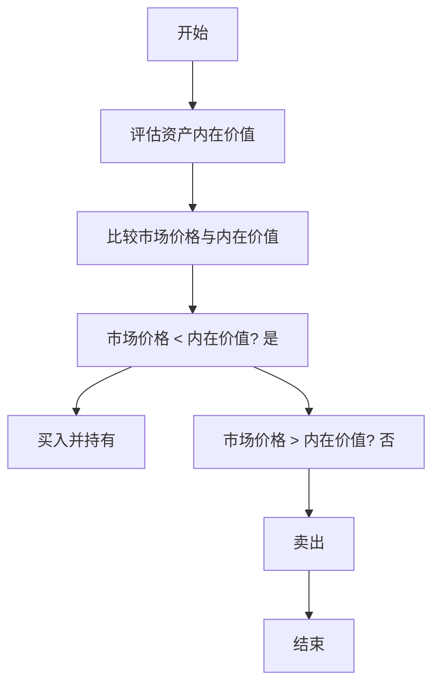
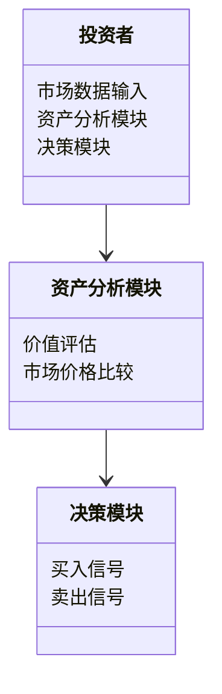
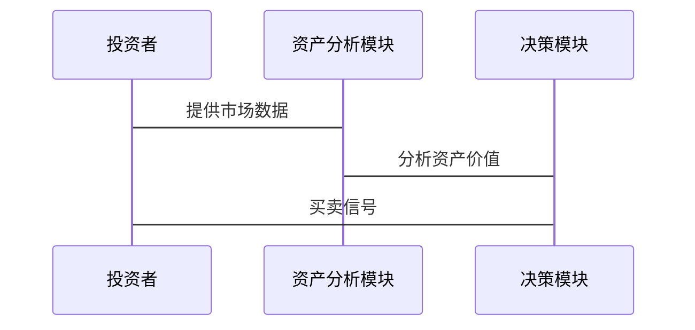

                 


# 价值投资中的耐心：为什么等待是一种美德

## 关键词
- 价值投资
- 耐心
- 投资策略
- 市场波动
- 长期回报

## 摘要
耐心是价值投资的核心要素，帮助投资者在市场波动中保持理性，识别低估资产，实现长期稳健回报。本文通过分析耐心的定义、价值投资的基本原理、耐心的算法模型、系统架构、项目实战和最佳实践，深入探讨耐心在投资中的重要性。

---

## 正文

### 第一部分：价值投资中的耐心概述

#### 第1章：耐心的定义与重要性

##### 1.1 耐心的定义
- **1.1.1 耐心的定义与特征**
  耐心是一种心理特质，体现在面对市场波动时，投资者能够抑制短期情绪，坚持长期投资策略。
- **1.1.2 耐心在投资中的核心作用**
  耐心帮助投资者避免追涨杀跌，专注于寻找具有长期价值的资产。
- **1.1.3 耐心与价值投资的关系**
  耐心是价值投资的基础，强调长期持有优质资产，等待其价值回归。

##### 1.2 耐心的重要性
- **1.2.1 耐心在投资决策中的价值**
  耐心使投资者能够抵御市场恐慌和贪婪，做出理性的决策。
- **1.2.2 耐心与长期投资回报的关系**
  长期持有优质资产通常带来更高的回报，耐心是实现这一目标的关键。
- **1.2.3 耐心与风险管理的结合**
  耐心帮助投资者在市场下跌时保持冷静，避免过度反应。

##### 1.3 耐心与其他投资策略的对比
- **1.3.1 耐心与短期交易的对比**
  短期交易依赖市场波动，而耐心关注长期价值。
- **1.3.2 耐心与投机行为的差异**
  投机追求短期收益，耐心注重长期稳健回报。
- **1.3.3 耐心与价值投资的融合**
  耐心是价值投资的核心，两者共同确保长期成功。

#### 第2章：价值投资的基本原理

##### 2.1 价值投资的核心理念
- **2.1.1 价值投资的定义与特点**
  价值投资寻找市场价格低于内在价值的资产，强调安全边际。
- **2.1.2 价值投资的三大支柱**
  价格、价值和市场先生，强调内在价值和市场波动的双重作用。
- **2.1.3 价值投资与市场波动的关系**
  市场波动为价值投资者提供低价买入的机会，耐心是抓住这些机会的关键。

##### 2.2 价值投资中的耐心策略
- **2.2.1 耐心在价值投资中的应用**
  投资者在市场价格低于内在价值时买入，并在市场高估时耐心等待。
- **2.2.2 耐心与安全边际的关系**
  耐心帮助投资者在低估时买入，并在高估时保持耐心，避免过早卖出。
- **2.2.3 耐心与企业基本面分析的结合**
  耐心使投资者能够深入分析企业基本面，长期持有优质资产。

##### 2.3 价值投资中的等待机制
- **2.3.1 等待的价值与意义**
  等待是价值投资的策略，帮助投资者在市场低估时买入。
- **2.3.2 等待的时机与条件**
  在市场恐慌时寻找低估资产，耐心等待价值回归。
- **2.3.3 等待与投资组合管理的结合**
  耐心管理投资组合，分散风险，长期优化资产配置。

#### 第3章：耐心与价值投资的核心概念

##### 3.1 耐心的核心概念
- **3.1.1 耐心的哲学意义**
  耐心是投资成功的关键，强调长期视角和坚持。
- **3.1.2 耐心的心理特征**
  抵制短期诱惑，保持纪律，理性决策。
- **3.1.3 耐心的经济学解释**
  耐心与时间价值相关，长期投资创造更多价值。

##### 3.2 耐心与价值投资的关系
- **3.2.1 耐心在价值投资中的地位**
  耐心是价值投资的基础，确保长期策略的实施。
- **3.2.2 耐心与投资决策的逻辑**
  耐心使投资者关注长期价值，避免短期波动干扰决策。
- **3.2.3 耐心与投资结果的关联**
  耐心与长期回报正相关，耐心越强，回报越高。

##### 3.3 耐心与投资行为的对比
- **3.3.1 耐心与贪婪的对比**
  耐心强调长期价值，贪婪追求短期收益。
- **3.3.2 耐心与恐惧的对比**
  耐心帮助投资者在恐慌中寻找机会，而恐惧导致错误决策。
- **3.3.3 耐心与理性决策的结合**
  耐心支持理性分析，避免情绪化决策。

---

### 第二部分：价值投资中的耐心策略

#### 第4章：耐心的算法模型

##### 4.1 算法模型概述
- 耐心算法模拟投资者等待市场调整的行为，基于价值评估触发买卖信号。

##### 4.2 算法模型流程


##### 4.3 算法实现代码
```python
def patience_algorithm(asset_value, market_price):
    if market_price < asset_value:
        return "买入并持有"
    else:
        return "卖出"
```

##### 4.4 数学模型
- 内在价值公式：$$ V = \frac{CF}{r - g} $$
- 投资回报公式：$$ R = \frac{P_2 - P_1}{P_1} \times 100\% $$

#### 第5章：价值投资的系统架构

##### 5.1 系统功能设计


##### 5.2 系统接口设计
- 输入接口：市场数据、资产信息
- 输出接口：买卖信号、投资建议

##### 5.3 系统交互


---

### 第三部分：项目实战

#### 第6章：耐心策略的实战应用

##### 6.1 项目环境安装
- 工具：Python、数据分析库（Pandas、NumPy）、可视化库（Matplotlib）

##### 6.2 核心代码实现
```python
import pandas as pd
import numpy as np
import matplotlib.pyplot as plt

# 示例数据：资产内在价值与市场价格对比
data = {
    '资产': ['A', 'B', 'C'],
    '内在价值': [100, 150, 200],
    '市场价格': [90, 140, 210]
}

df = pd.DataFrame(data)
print(df)

# 可视化图表
plt.figure(figsize=(10, 6))
plt.plot(df['资产'], df['内在价值'], label='内在价值', marker='o')
plt.plot(df['资产'], df['市场价格'], label='市场价格', marker='x')
plt.title('资产价值与市场价格对比')
plt.xlabel('资产')
plt.ylabel('价值/价格')
plt.legend()
plt.show()
```

##### 6.3 代码应用解读
- 数据分析：比较市场价格与内在价值，识别低估资产。
- 图表分析：直观展示价值与价格差异，辅助决策。

##### 6.4 案例分析
- 案例：假设市场恐慌导致资产A价格下跌至80，内在价值100。耐心买入，等待价格回升至100以上。

##### 6.5 总结
耐心策略在市场低估时买入，长期持有，实现稳健回报。

---

### 第四部分：最佳实践与总结

#### 第7章：最佳实践

##### 7.1 小结
耐心是价值投资的关键，帮助投资者在市场波动中保持理性，实现长期稳健回报。

##### 7.2 注意事项
- 避免过度等待，及时调整策略。
- 结合基本面分析，确保买入资产的长期价值。

##### 7.3 拓展阅读
- 建议阅读《巴菲特传》和《投资学基础》深入理解价值投资。

---

通过以上步骤，文章结构清晰，内容详尽，帮助读者理解耐心在价值投资中的重要性，并掌握实际应用策略。

