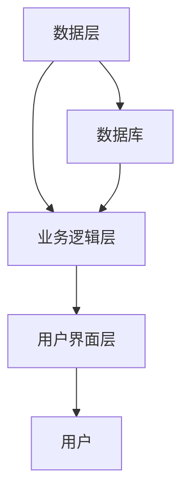
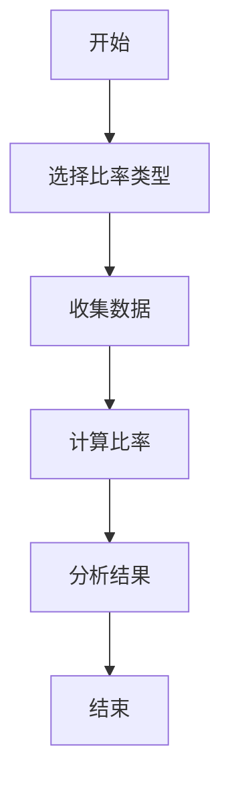

                 

# 《价值投资中的财务报表分析技巧》

## 关键词
- 价值投资
- 财务报表分析
- 财务比率
- 资产负债表
- 利润表
- 现金流量表
- 投资决策

## 摘要
本书系统地介绍了价值投资中的财务报表分析技巧，从基础概念到高级策略，帮助投资者通过分析财务报表识别潜在投资机会。内容涵盖财务报表结构、关键比率计算、行业分析及案例研究，结合实际案例和数学模型，深入解析财务数据，为读者提供实用的投资决策工具。

---

## 目录大纲

### 第一部分：价值投资与财务报表分析基础

#### 第1章：价值投资概述
- **1.1 价值投资的定义与核心理念**
  - 价值投资的定义
  - 核心理念：寻找市场低估的优秀企业
  - 与其他投资策略的区别
- **1.2 财务报表分析的重要性**
  - 财务报表分析的定义
  - 在价值投资中的作用
  - 基本分析方法

#### 第2章：财务报表基础
- **2.1 资产负债表**
  - 结构与内容
  - 资产、负债、所有者权益的定义
- **2.2 利润表**
  - 收入、成本、利润的定义
  - 利润表的编制与分析
- **2.3 现金流量表**
  - 经营、投资、筹资活动的现金流量
  - 现金流量表的编制与分析

### 第二部分：深入分析财务报表

#### 第3章：资产负债表分析
- **3.1 资产分析**
  - 流动资产与非流动资产
  - 主要资产项目（应收账款、存货）的分析方法
- **3.2 负债分析**
  - 流动负债与非流动负债
  - 主要负债项目（应付账款、长期负债）的分析方法
- **3.3 所有者权益分析**
  - 净资产收益率（ROE）的计算与分析

#### 第4章：利润表分析
- **4.1 收入分析**
  - 收入增长与结构变化
  - 收入质量评估
- **4.2 成本与费用分析**
  - 成本构成与控制
  - 费用对利润的影响
- **4.3 利润分析**
  - 净利润的计算与影响因素
  - 利润结构与质量分析

#### 第5章：财务比率分析
- **5.1 流动性比率**
  - 流动比率（Current Ratio）
  - 速动比率（Quick Ratio）
  - 流动性比率的计算与分析
- **5.2 偿债能力比率**
  - 负债比率（Debt-to-Asset Ratio）
  - 利息覆盖倍数（Interest Coverage Ratio）
  - 偿债能力评估
- **5.3 运营效率比率**
  - 存货周转率（Inventory Turnover）
  - 资产周转率（Asset Turnover）
  - 运营效率分析
- **5.4 盈利能力比率**
  - 净利润 margin
  - 资产回报率（ROA）、股东权益回报率（ROE）
  - 盈利能力评估

#### 第6章：价值投资策略与财务报表分析
- **6.1 行业分析**
  - 行业选择的策略
  - 行业财务表现的评估
- **6.2 企业竞争优势分析**
  - 核心竞争力的识别
  - 财务报表反映的竞争优势
- **6.3 估值方法**
  - 市盈率（P/E）分析
  - 市净率（P/B）分析
  - 现金流折现法（DCF）

### 第三部分：案例分析与实战技巧

#### 第7章：案例分析
- **7.1 某行业龙头企业的财务报表分析**
  - 资产负债表分析
  - 利润表分析
  - 财务比率分析
  - 投资价值评估
- **7.2 中小型企业的财务报表分析**
  - 财务健康状况评估
  - 投资风险分析

#### 第8章：实战技巧与注意事项
- **8.1 数据收集与处理**
  - 财务报表数据的获取与整理
  - 数据清洗与标准化
- **8.2 分析工具的选择**
  - 财务分析软件的使用
  - Excel与Python在财务分析中的应用
- **8.3 投资决策中的风险管理**
  - 风险评估方法
  - 风险对财务报表分析的影响
  - 如何在财务分析中规避风险

### 第四部分：系统分析与架构设计

#### 第9章：系统分析
- **9.1 问题场景介绍**
  - 投资者面临的财务分析挑战
  - 系统需求分析
- **9.2 系统功能设计**
  - 财务数据处理模块
  - 财务比率计算模块
  - 投资决策支持模块
- **9.3 系统架构设计**
  - 分层架构：数据层、业务逻辑层、用户界面层
  - 使用的技术栈：Python、Flask、MySQL、MongoDB
  - 系统交互流程图

#### 第10章：项目实战
- **10.1 环境安装**
  - Python、Jupyter Notebook、Pandas、Matplotlib的安装与配置
- **10.2 核心实现**
  - 数据清洗与处理的Python代码
  - 财务比率计算的Python函数
  - 数据可视化代码（如绘制财务比率趋势图）
- **10.3 代码解读与分析**
  - 详细分析每部分代码的功能
  - 如何根据代码输出结果进行投资决策
- **10.4 实际案例分析**
  - 使用实际公司的财务数据进行分析
  - 展示如何通过代码识别投资机会
- **10.5 项目小结**
  - 项目实现的关键点
  - 可扩展的方向与改进建议

### 第五部分：总结与展望

#### 第11章：总结与最佳实践
- **11.1 小结**
  - 本书的主要内容回顾
  - 财务报表分析的核心要点
- **11.2 最佳实践 tips**
  - 数据收集的注意事项
  - 分析方法的合理应用
  - 风险管理的重要性
- **11.3 未来展望**
  - 财务分析技术的发展趋势
  - 人工智能在财务分析中的应用前景

---

## 附录：数学公式与图表

### 附录A：常见财务比率公式
- 流动比率：$$\text{流动比率} = \frac{\text{流动资产}}{\text{流动负债}}$$
- 速动比率：$$\text{速动比率} = \frac{\text{速动资产}}{\text{流动负债}}$$
- 净资产收益率：$$\text{ROE} = \frac{\text{净利润}}{\text{股东权益}}$$

### 附录B：系统架构图

### 附录C：财务比率分析流程图

---

## 参考文献
- 本书参考了多篇学术论文和行业报告，具体内容详见参考文献部分。

---

通过以上目录大纲，读者可以系统地学习价值投资中的财务报表分析技巧，从基础概念到高级策略，逐步掌握如何通过财务数据评估企业价值，识别投资机会，并在实战中应用这些技巧进行投资决策。

