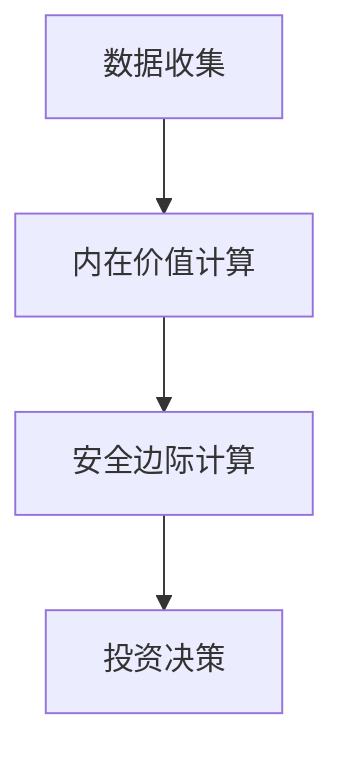
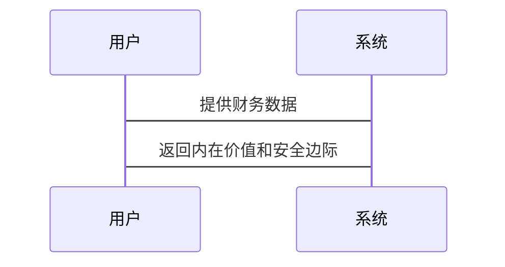

                 


# 价值投资中的质量vs价格：巴菲特的演变

## 关键词：价值投资，质量，价格，巴菲特，投资模型，内在价值，安全边际

## 摘要：本文深入探讨了价值投资中的质量与价格之间的关系，分析了巴菲特的投资理念演变，并通过具体的算法和数学模型，展示了如何在实际投资中应用这些理论。文章从背景介绍、核心概念、算法原理、数学模型、系统分析、项目实战到最佳实践，全面解析了价值投资的精髓。

---

# 第一部分：价值投资基础

## 第1章：价值投资概述

### 1.1 价值投资的定义与核心理念

#### 1.1.1 价值投资的定义
- 价值投资是一种长期投资策略，强调购买价格低于其内在价值的资产。
- 核心理念：市场先生是人类情绪的反映，价格波动与内在价值无关。

#### 1.1.2 价值投资的核心理念
- 寻找具有持续竞争优势的企业。
- 着重于企业的基本面分析，而非市场情绪。

#### 1.1.3 价值投资与价格投资的区别
- 价值投资：基于内在价值，寻找被市场低估的机会。
- 价格投资：基于短期价格波动，追求短期收益。

### 1.2 巴菲特的投资理念演变

#### 1.2.1 巴菲特早期的投资理念
- 受导师本·格雷厄姆影响，注重安全边际和内在价值。
- 早期投资策略：寻找低估的股票，关注账面价值与市场价值的差异。

#### 1.2.2 巴菲特中期的投资策略
- 开始关注企业的竞争优势和管理层质量。
- 强调企业护城河的重要性，开始投资于可口可乐、吉列等具有强大竞争优势的企业。

#### 1.2.3 巴菲特后期的投资哲学
- 强调企业文化和价值观，注重管理层的诚实与能力。
- 从“烟屁股”投资转向长期持有的优质企业。

### 1.3 质量与价格的关系

#### 1.3.1 质量与价格的定义
- 质量：企业的基本面，包括盈利能力、竞争优势、管理层等。
- 价格：市场的估值，反映市场情绪和投资者预期。

#### 1.3.2 质量与价格的关系分析
- 质量决定企业的长期价值，价格反映市场的短期情绪。
- 价值投资的核心：找到质量高且价格低于内在价值的资产。

#### 1.3.3 质量与价格在投资中的应用
- 质量是内在价值的基础，价格是投资机会的信号。
- 投资者需要在质量与价格之间找到平衡点。

---

## 第二部分：价值投资的核心概念与联系

## 第2章：核心概念与联系

### 2.1 核心概念

#### 2.1.1 内在价值
- 内在价值是企业未来现金流的现值。
- 计算公式：$$\text{内在价值} = \sum_{t=1}^{n} \frac{CF_t}{(1 + r)^t}$$，其中$CF_t$是第$t$年的现金流，$r$是折现率。

#### 2.1.2 安全边际
- 安全边际 = 内在价值 - 市场价格。
- 安全边际越大，投资风险越小。

#### 2.1.3 质量与价格的量化评估
- 质量评估：ROE、ROA、净利润率等财务指标。
- 价格评估：市盈率、市净率、股息率等估值指标。

### 2.2 核心概念的对比分析

#### 2.2.1 内在价值与市场价值的对比
| 比较维度 | 内在价值 | 市场价值 |
|----------|----------|----------|
| 计算方式 | 现金流折现 | 市场交易 |
| 受影响因素 | 企业基本面 | 市场情绪 |

#### 2.2.2 质量与价格的对比
| 比较维度 | 质量 | 价格 |
|----------|------|------|
| 定义 | 企业基本面 | 市场估值 |
| 受影响因素 | 盈利能力、竞争优势 | 市场情绪、投资者预期 |

#### 2.2.3 安全边际与其他投资指标的对比
| 比较维度 | 安全边际 | PE（市盈率） |
|----------|----------|------------|
| 定义 | 内在价值与市场价格的差额 | 每股收益与股价的比率 |
| 作用 | 降低投资风险 | 估值参考 |

### 2.3 实体关系图

#### 2.3.1 内在价值与质量的关系
- 内在价值由质量决定，质量越高，内在价值越大。

#### 2.3.2 质量与价格的相互作用
- 质量高的企业，价格可能高于质量低的企业，但长期来看，质量决定价格走势。

#### 2.3.3 安全边际在质量与价格中的应用
- 安全边际为质量与价格之间的缓冲区，确保投资的稳定性。

---

## 第三部分：价值投资的算法原理

## 第3章：算法原理

### 3.1 巴菲特模型

#### 3.1.1 巴菲特模型的定义
- 巴菲特模型是一种基于内在价值的投资模型，强调质量与价格的结合。

#### 3.1.2 巴菲特模型的算法步骤
1. 评估企业的内在价值。
2. 比较内在价值与市场价格。
3. 确定安全边际。
4. 投资于具有足够安全边际的企业。

#### 3.1.3 巴菲特模型的优缺点
- 优点：稳定性高，风险可控。
- 缺点：需要大量基本面分析，对投资者能力要求高。

### 3.2 巴菲特模型的实现

#### 3.2.1 巴菲特模型的实现步骤
1. 收集企业的财务数据。
2. 计算内在价值。
3. 比较内在价值与市场价格。
4. 确定安全边际。
5. 投资决策。

#### 3.2.2 巴菲特模型的代码实现
```python
def calculate_intrinsic_value(enterprise, discount_rate):
    # 计算未来现金流
    cash_flows = []
    for year in range(1, 10):
        cash_flows.append(enterprise.profit * (1 + enterprise.growth_rate)**year)
    # 现金流折现
    intrinsic_value = sum(cash_flows) / (1 + discount_rate)**year
    return intrinsic_value

def calculate_margin_of_safety(intrinsic_value, market_price):
    return intrinsic_value - market_price
```

#### 3.2.3 巴菲特模型的案例分析
- 案例：可口可乐的内在价值计算与安全边际分析。

---

## 第四部分：价值投资的数学模型与公式

## 第4章：数学模型与公式

### 4.1 内在价值的数学模型

#### 4.1.1 内在价值公式
$$\text{内在价值} = \sum_{t=1}^{n} \frac{\text{CF}_t}{(1 + r)^t}$$

#### 4.1.2 现金流折现模型
- 现金流折现模型是计算内在价值的核心工具。

### 4.2 投资决策的数学模型

#### 4.2.1 安全边际公式
$$\text{安全边际} = \text{内在价值} - \text{市场价格}$$

#### 4.2.2 质量评估指标
- ROE：$$\text{ROE} = \frac{\text{净利润}}{\text{股东权益}}$$
- ROA：$$\text{ROA} = \frac{\text{净利润}}{\text{总资产}}$$

---

## 第五部分：价值投资的系统分析与架构设计

## 第5章：系统分析与架构设计

### 5.1 系统功能设计

#### 5.1.1 系统功能模块
- 数据收集模块：收集企业财务数据。
- 内在价值计算模块：基于现金流折现模型计算内在价值。
- 安全边际计算模块：计算内在价值与市场价格的差额。
- 投资决策模块：基于安全边际做出投资决策。

#### 5.1.2 系统架构图


### 5.2 系统接口设计

#### 5.2.1 数据接口
- 数据输入接口：接收企业财务数据。
- 数据输出接口：输出计算结果。

### 5.3 系统交互设计

#### 5.3.1 系统交互图


---

## 第六部分：价值投资的项目实战

## 第6章：项目实战

### 6.1 环境安装

#### 6.1.1 环境要求
- Python 3.8+
- Pandas、Numpy等数据分析库。

### 6.2 系统核心实现

#### 6.2.1 环境安装代码
```bash
pip install pandas numpy
```

#### 6.2.2 核心代码实现
```python
import pandas as pd
import numpy as np

def calculate_intrinsic_value(enterprise_data, discount_rate):
    # 计算未来现金流
    cash_flows = []
    for year in range(1, 10):
        cf = enterprise_data['profit'] * (1 + enterprise_data['growth_rate'])**year
        cash_flows.append(cf)
    # 现金流折现
    intrinsic_value = np.sum(cash_flows) / (1 + discount_rate)**year
    return intrinsic_value

def calculate_margin_of_safety(intrinsic_value, market_price):
    return intrinsic_value - market_price

# 示例数据
enterprise_data = {
    'profit': 100,
    'growth_rate': 0.05,
    'discount_rate': 0.08
}

market_price = 50

intrinsic_value = calculate_intrinsic_value(enterprise_data, enterprise_data['discount_rate'])
margin_of_safety = calculate_margin_of_safety(intrinsic_value, market_price)

print(f"内在价值：{intrinsic_value}")
print(f"安全边际：{margin_of_safety}")
```

### 6.3 实际案例分析

#### 6.3.1 案例分析：可口可乐
- 计算可口可乐的内在价值和安全边际，评估其投资价值。

---

## 第七部分：价值投资的总结与展望

## 第7章：总结与展望

### 7.1 最佳实践 tips

#### 7.1.1 投资建议
- 选择具有强大竞争优势的企业。
- 留意管理层的诚实与能力。
- 长期持有优质资产。

#### 7.1.2 风险提示
- 市场波动可能影响短期价格。
- 企业基本面变化可能影响长期价值。

### 7.2 小结

#### 7.2.1 价值投资的核心
- 质量与价格的结合是价值投资的核心。
- 内在价值是投资决策的基础。
- 安全边际是降低投资风险的关键。

### 7.3 注意事项

#### 7.3.1 投资者需具备的能力
- 基本面分析能力。
- 财务数据分析能力。
- 长期投资的耐心。

### 7.4 拓展阅读

#### 7.4.1 推荐书籍
- 《聪明的投资者》——本·格雷厄姆
- 《巴菲特致股东的信》——巴菲特

---

通过以上结构和内容，我们深入探讨了价值投资中的质量与价格的关系，分析了巴菲特的投资理念演变，并通过具体的算法和数学模型，展示了如何在实际投资中应用这些理论。文章从背景介绍、核心概念、算法原理、数学模型、系统分析、项目实战到最佳实践，全面解析了价值投资的精髓。

