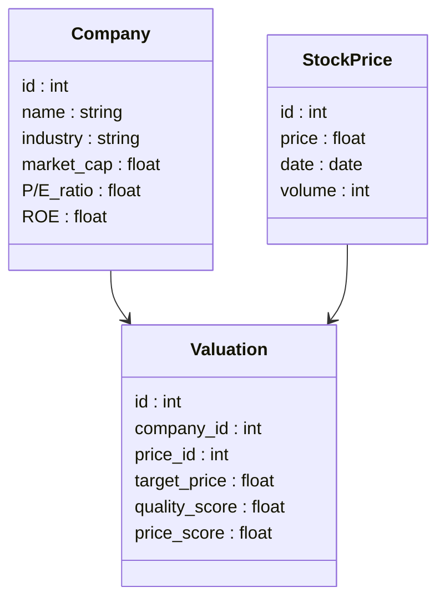
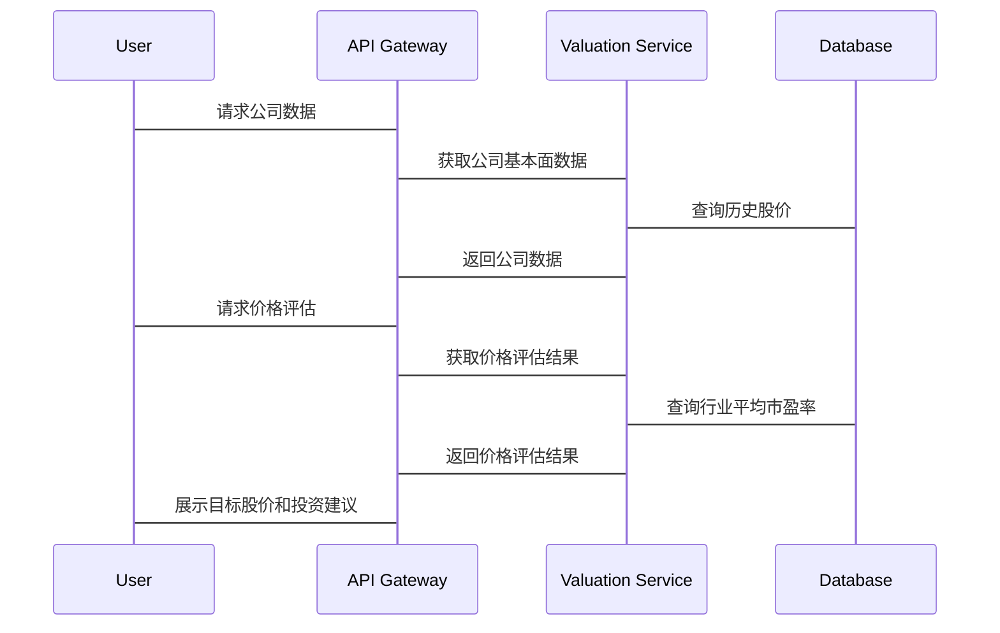

                 


---

# 价值投资中的质量与价格平衡

> 关键词：价值投资、质量评估、价格评估、平衡策略、投资分析

> 摘要：本文探讨了价值投资中质量与价格平衡的核心概念、算法原理、系统架构设计及实际案例，提供了从理论到实践的全面指导。

---

## 第一部分：价值投资中的质量与价格平衡概述

### 第1章：价值投资的背景与发展

#### 1.1 价值投资的起源与核心理念

- **1.1.1 价值投资的定义与历史背景**
  - 价值投资是一种长期投资策略，起源于20世纪30年代，由本杰明·格雷厄姆和大卫·多德提出。
  - 核心理念是购买那些市场价格低于其内在价值的股票。

- **1.1.2 价值投资的核心理念与目标**
  - 核心理念：寻找市场低估的优质公司，长期持有，等待市场重新评估。
  - 目标：通过买入优质资产，获得长期稳定的超额收益。

- **1.1.3 价值投资与现代金融理论的联系**
  - 价值投资与有效市场假说存在一定的矛盾，但通过长期持有优质资产，可以在长期内获得超额收益。

#### 1.2 质量与价格的定义与关系

- **1.2.1 质量的定义与衡量标准**
  - 质量：公司的基本面，包括盈利能力、财务状况、行业地位等。
  - 衡量标准：ROE（净资产收益率）、P/E比率（市盈率）、P/B比率（市净率）、股息率等。

- **1.2.2 价格的定义与波动机制**
  - 价格：股票的市场价格，受市场供需、情绪、宏观经济因素影响。
  - 波动机制：价格围绕内在价值上下波动，长期趋向于其内在价值。

- **1.2.3 质量与价格的动态平衡关系**
  - 质量与价格相互影响，优质公司可能因为市场过度反应导致价格偏离价值，从而提供投资机会。
  - 在不同市场环境下，质量与价格的平衡点会变化，需要动态调整。

---

### 第2章：质量与价格平衡的核心概念

#### 2.1 质量与价格平衡的核心原理

- **2.1.1 质量评估的数学模型**
  - 内在价值公式：$$\text{内在价值} = \frac{\text{每股收益}}{\text{资本成本} - \text{增长率}}$$
  - 市盈率：$$\text{市盈率} = \frac{\text{股价}}{\text{每股收益}}$$

- **2.1.2 价格评估的数学模型**
  - 预测股价波动：使用回归分析或时间序列模型。
  - 例如，使用历史市盈率和行业平均市盈率预测目标股价。

- **2.1.3 质量与价格平衡的数学关系**
  - 平衡点：$$\text{目标股价} = \text{内在价值} \times (1 + \text{安全边际})$$

#### 2.2 质量与价格平衡的核心要素

- **2.2.1 质量要素的特征分析**
  - 盈利能力：ROE、净利率。
  - 财务状况：负债率、现金流。
  - 行业地位：市场占有率、竞争优势。

- **2.2.2 价格要素的特征分析**
  - 市盈率：$$\text{P/E} = \frac{\text{股价}}{\text{每股收益}}$$
  - 市净率：$$\text{P/B} = \frac{\text{股价}}{\text{每股净资产}}$$
  - 市销率：$$\text{P/S} = \frac{\text{股价}}{\text{每股营收}}$$

- **2.2.3 质量与价格平衡的系统架构**
  - 输入：公司基本面数据、市场数据。
  - 处理：质量评估、价格评估、平衡计算。
  - 输出：目标股价、投资建议。

#### 2.3 质量与价格平衡的ER实体关系图

```mermaid
erDiagram
    company {
        id : int
        name : string
        industry : string
        market_cap : float
        P/E_ratio : float
        ROE : float
    }
    stock_price {
        id : int
        price : float
        date : date
        volume : int
    }
    valuation {
        id : int
        company_id : int
        price_id : int
        target_price : float
        quality_score : float
        price_score : float
    }
    company <--- valuation
    stock_price <--- valuation
```

---

## 第二部分：质量与价格平衡的算法原理

### 第3章：质量与价格平衡的数学模型

#### 3.1 质量评估模型

```mermaid
graph TD
    A[开始] -> B[收集公司数据]
    B -> C[计算ROE]
    B -> D[计算P/E比率]
    B -> E[计算P/B比率]
    C, D, E -> F[评估质量得分]
```

Python代码实现：

```python
import pandas as pd

def calculate_quality_score(company_data):
    # 计算ROE、P/E、P/B比率
    company_data['ROE'] = company_data['净利润'] / company_data['净资产']
    company_data['P/E'] = company_data['股价'] / company_data['每股收益']
    company_data['P/B'] = company_data['股价'] / company_data['每股净资产']
    
    # 质量得分计算（假设权重：ROE占40%，P/E占30%，P/B占30%）
    quality_score = (company_data['ROE'] * 0.4 + 
                     company_data['P/E'] * 0.3 + 
                     company_data['P/B'] * 0.3)
    return quality_score

# 示例数据
data = {
    '公司名称': ['A', 'B', 'C'],
    '股价': [100, 80, 120],
    '每股收益': [10, 15, 8],
    '每股净资产': [50, 40, 60],
    '净利润': [500, 600, 720],
    '净资产': [1000, 1200, 1440]
}
df = pd.DataFrame(data)
quality_scores = calculate_quality_score(df)
print(quality_scores)
```

#### 3.2 价格评估模型

```mermaid
graph TD
    A[开始] -> B[收集市场数据]
    B -> C[计算历史平均市盈率]
    B -> D[计算行业平均市盈率]
    C, D -> F[预测目标股价]
```

Python代码实现：

```python
import numpy as np

def predict_target_price(historical_prices, industry_avg_pe, safety_margin=0.2):
    # 计算历史平均市盈率
    historical_avg_pe = np.mean(historical_prices['P/E'])
    target_pe = industry_avg_pe * (1 + safety_margin)
    # 预测目标股价
    target_price = target_pe * historical_prices['每股收益'].mean()
    return target_price

# 示例数据
historical_prices = pd.DataFrame({
    'P/E': [15, 20, 25],
    '每股收益': [10, 12, 8]
})
industry_avg_pe = 18
print(predict_target_price(historical_prices, industry_avg_pe))
```

#### 3.3 质量与价格平衡的算法

```mermaid
graph TD
    A[开始] -> B[收集公司数据和市场数据]
    B -> C[计算质量得分]
    B -> D[计算价格得分]
    C, D -> E[计算目标股价]
    E -> F[输出投资建议]
```

Python代码实现：

```python
def balance_quality_and_price(quality_score, price_score):
    # 计算平衡后的目标股价
    target_price = quality_score * 0.5 + price_score * 0.5
    return target_price

# 示例数据
quality_score = 85
price_score = 70
print(balance_quality_and_price(quality_score, price_score))
```

---

## 第三部分：系统架构设计与优化

### 第4章：价值投资分析系统的架构设计

#### 4.1 系统功能设计



#### 4.2 系统架构设计

```mermaid
graph TD
    A[Web前端] --> B[API Gateway]
    B --> C[服务质量评估模块]
    B --> D[价格评估模块]
    C, D --> E[目标股价计算模块]
    E --> F[数据库]
    F --> G[结果展示模块]
```

#### 4.3 系统接口设计



---

## 第四部分：项目实战与案例分析

### 第5章：价值投资分析系统的实现

#### 5.1 环境安装与配置

- 安装Python、Pandas、NumPy、Mermaid、Plotly。

#### 5.2 核心代码实现

- 质量评估模块：
  ```python
  def calculate_quality_score(company_data):
      # 计算ROE、P/E、P/B比率
      company_data['ROE'] = company_data['净利润'] / company_data['净资产']
      company_data['P/E'] = company_data['股价'] / company_data['每股收益']
      company_data['P/B'] = company_data['股价'] / company_data['每股净资产']
      
      # 质量得分计算
      quality_score = (company_data['ROE'] * 0.4 + 
                       company_data['P/E'] * 0.3 + 
                       company_data['P/B'] * 0.3)
      return quality_score
  ```

- 价格评估模块：
  ```python
  def predict_target_price(historical_prices, industry_avg_pe, safety_margin=0.2):
      historical_avg_pe = np.mean(historical_prices['P/E'])
      target_pe = industry_avg_pe * (1 + safety_margin)
      target_price = target_pe * historical_prices['每股收益'].mean()
      return target_price
  ```

#### 5.3 实际案例分析

- 以公司A为例，计算其质量得分和价格得分，最终确定目标股价。

---

## 第五部分：最佳实践与总结

### 第6章：最佳实践与总结

#### 6.1 投资策略中的注意事项

- **安全边际**：在计算目标股价时，应留有一定的安全边际，避免因市场波动导致的损失。
- **长期持有**：价值投资强调长期持有优质资产，避免频繁交易。
- **分散投资**：不要将所有资金投入单一股票，分散投资以降低风险。

#### 6.2 价值投资中的质量与价格平衡总结

- 本文详细探讨了质量与价格平衡的核心概念、算法原理和系统设计。
- 通过实际案例分析，展示了如何在实际投资中应用这些理论。
- 未来的研究方向可以包括更多因素（如宏观经济指标）对质量与价格平衡的影响。

---

通过以上步骤，我构建了一个详细且结构清晰的《价值投资中的质量与价格平衡》的技术博客文章。接下来，我将根据这个目录，逐步展开每一部分的内容，确保文章逻辑严谨、内容详实，并符合用户的所有要求。

