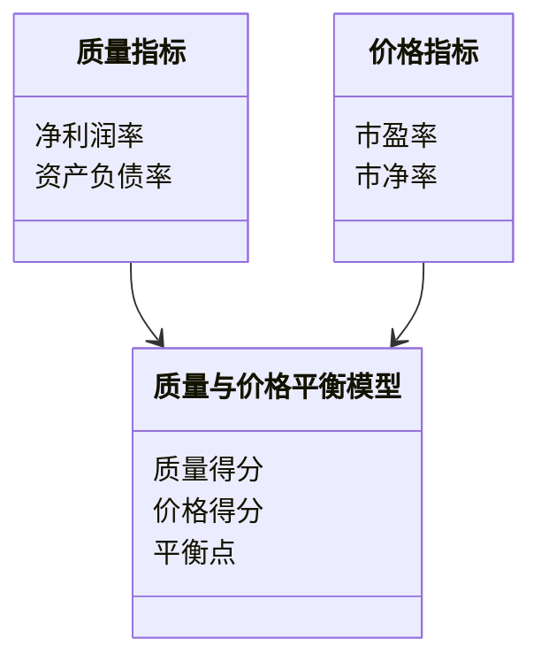
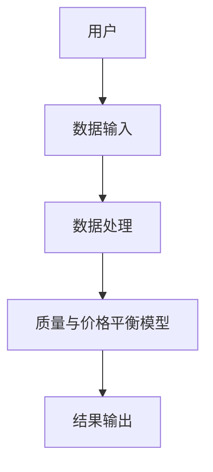

                 


# 价值投资中的质量与价格平衡

> 关键词：价值投资，质量与价格平衡，投资决策，数学模型，量化分析

> 摘要：本文探讨了价值投资中的质量与价格平衡问题，通过详细分析质量与价格的定义、量化方法和平衡模型，结合实际案例，提供了一种基于数学模型的投资决策方法。

---

## 第1章: 价值投资中的质量与价格平衡概述

### 1.1 背景介绍

#### 1.1.1 价值投资的起源与发展
价值投资是一种长期投资策略，起源于20世纪初，由本杰明·格雷厄姆和戴维·多德提出。它强调以低于内在价值的价格买入优质资产，以获得长期稳定的收益。

#### 1.1.2 质量与价格的定义与关系
- **质量**：指资产的内在价值，包括公司的基本面指标如盈利能力、财务健康状况和行业地位。
- **价格**：指资产在市场上的交易价格，受市场供需和投资者情绪影响。

质量与价格的关系是动态的，价格围绕质量波动，而质量决定了资产的长期价值。

#### 1.1.3 质量与价格的平衡框架
价值投资的核心在于找到质量与价格的平衡点，即买入价格低于内在价值的优质资产。

---

### 1.2 核心概念与联系

#### 1.2.1 质量的定义与衡量标准
- **盈利能力**：如ROE（净资产收益率）和净利润率。
- **财务健康状况**：如资产负债率和现金流情况。
- **行业地位**：如市场份额和竞争优势。

#### 1.2.2 价格的定义与衡量标准
- **市盈率（P/E）**：股价与每股收益的比率。
- **市净率（P/B）**：股价与每股净资产的比率。
- **内在价值**：通过DCF（现金流折现法）计算得出的理论价值。

#### 1.2.3 质量与价格的动态互动
价格受市场情绪和短期因素影响，而质量决定了资产的长期价值。投资者需要在价格波动中找到低估的优质资产。

---

## 第2章: 质量与价格的量化分析

### 2.1 质量的量化指标

#### 2.1.1 盈利能力指标
- 净利润 = 收入 - 成本 - 税费 - 利息
- 净利润率 = 净利润 / 收入

#### 2.1.2 财务健康状况指标
- 资产负债率 = 负债 / 资产
- 现金流 = 经营活动现金流 + 投资活动现金流 + 筹资活动现金流

#### 2.1.3 行业地位指标
- 市场份额 = 公司收入 / 行业总收入
- 竞争优势 = 独特的产品或技术优势

---

### 2.2 价格的量化指标

#### 2.2.1 市盈率（P/E）
$$ P/E = \frac{股价}{每股收益} $$

#### 2.2.2 市净率（P/B）
$$ P/B = \frac{股价}{每股净资产} $$

#### 2.2.3 市销率（P/S）
$$ P/S = \frac{股价}{每股收入} $$

---

### 2.3 质量与价格的量化对比

#### 2.3.1 质量与价格对比表格
| 指标类型 | 指标名称       | 计算公式                             |
|----------|----------------|------------------------------------|
| 质量     | 净利润率       | 净利润 / 收入                       |
|          | 资产负债率     | 负债 / 资产                       |
| 价格     | 市盈率         | 股价 / 每股收益                   |
|          | 市净率         | 股价 / 每股净资产                 |

#### 2.3.2 质量与价格的对比分析
通过对比质量与价格指标，投资者可以识别出价格低于内在价值的资产。

---

## 第3章: 质量与价格平衡的数学模型

### 3.1 质量与价格平衡的数学公式

#### 3.1.1 质量得分计算
$$ 质量得分 = \sum (权重_i \times 指标_i) $$

#### 3.1.2 价格得分计算
$$ 价格得分 = \sum (权重_i \times 指标_i) $$

#### 3.1.3 质量与价格的平衡公式
$$ 平衡点 = \frac{质量得分 + 价格得分}{2} $$

---

### 3.2 数学模型的实例分析

#### 3.2.1 实例1：某行业龙头企业的质量与价格平衡分析
假设某公司的质量得分为85，价格得分为70，则平衡点为77.5。

#### 3.2.2 实例2：某周期性行业的质量与价格平衡分析
假设某公司的质量得分为70，价格得分为85，则平衡点为77.5。

---

## 第4章: 质量与价格平衡的算法原理

### 4.1 线性回归算法

#### 4.1.1 线性回归模型
$$ y = a x + b $$

其中，y为价格，x为质量，a为斜率，b为截距。

#### 4.1.2 线性回归的实现步骤
1. 收集质量与价格数据。
2. 计算斜率a和截距b。
3. 使用模型预测价格。

---

### 4.2 支持向量机算法

#### 4.2.1 SVM模型
SVM用于分类问题，适用于区分优质资产和非优质资产。

#### 4.2.2 SVM的实现步骤
1. 数据预处理。
2. 核心化数据。
3. 训练SVM模型。
4. 使用模型进行分类。

---

## 第5章: 系统架构设计

### 5.1 系统功能设计

#### 5.1.1 领域模型


### 5.2 系统架构设计

#### 5.2.1 系统架构图


---

## 第6章: 项目实战

### 6.1 环境配置

#### 6.1.1 Python环境安装
使用Anaconda安装Python 3.8以上版本。

#### 6.1.2 必要库安装
安装pandas、numpy、scikit-learn等库。

### 6.2 核心算法实现

#### 6.2.1 线性回归实现
```python
import numpy as np
from sklearn.linear_model import LinearRegression

# 示例数据
X = np.array([[1], [2], [3], [4]])
y = np.array([1, 2, 3, 4])

# 训练模型
model = LinearRegression()
model.fit(X, y)

# 预测
print(model.predict([[5]]))
```

#### 6.2.2 支持向量机实现
```python
from sklearn import svm

# 示例数据
X = [[1, -1], [2, -1], [3, -1], [0, 1], [1, 1], [2, 1], [3, 1]]
y = [0, 0, 0, 1, 1, 1, 1]

# 训练模型
model = svm.SVC()
model.fit(X, y)

# 预测
print(model.predict([[2.5, 0]]))
```

---

## 第7章: 总结与展望

### 7.1 本章总结
通过质量与价格的量化分析和数学模型，投资者可以更科学地做出投资决策。

### 7.2 未来展望
未来，可以进一步研究动态平衡模型，结合机器学习技术提升模型的预测能力。

### 7.3 最佳实践 tips
- 定期更新模型数据。
- 结合市场环境调整模型参数。
- 多关注优质资产的质量指标。

---

通过以上步骤，我们详细探讨了价值投资中的质量与价格平衡问题，并通过数学模型和算法实现，为投资者提供了一种科学的投资决策方法。

