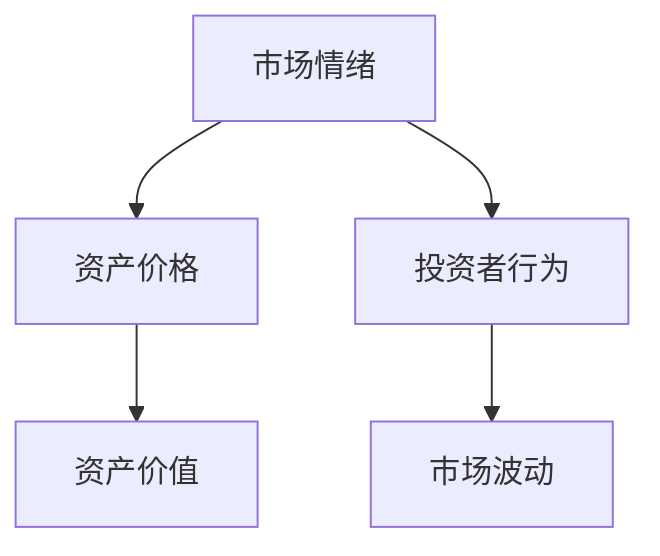
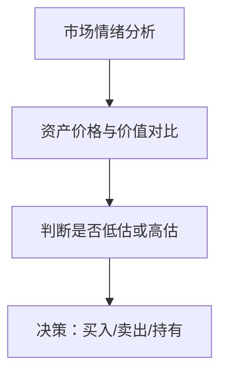
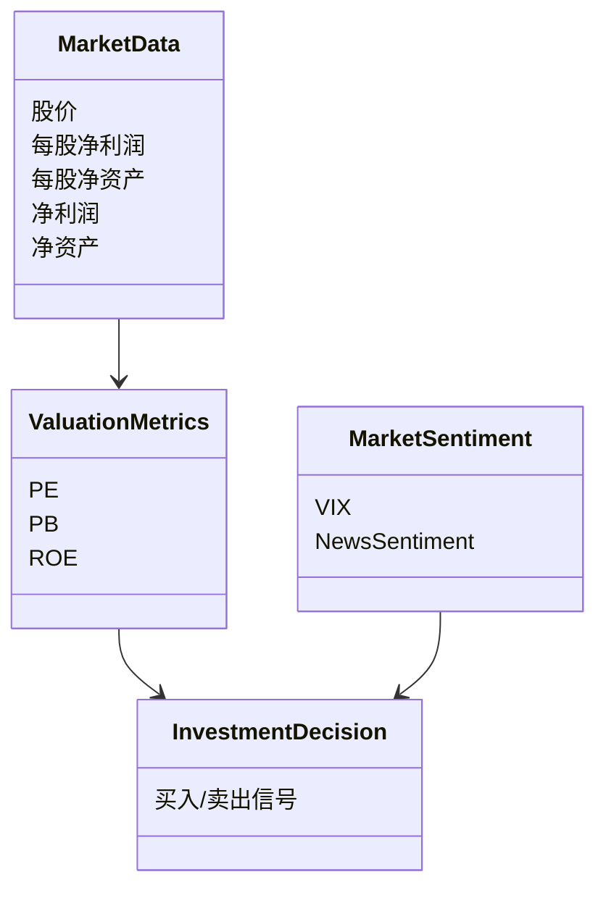
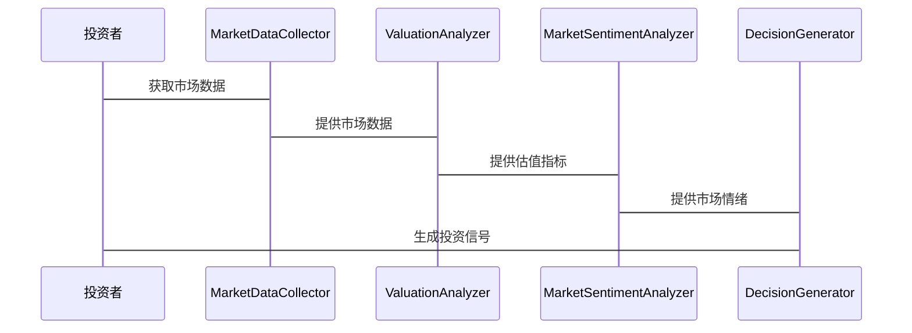

                 


# 价值投资中的逆向思维：当别人恐惧时贪婪

---

## 关键词：价值投资，逆向思维，市场情绪，安全边际，投资策略，贪婪与恐惧

---

## 摘要：  
本文将深入探讨价值投资中的逆向思维策略，特别是在市场恐慌时如何利用贪婪寻找投资机会。通过分析市场情绪、基本面指标和安全边际，结合技术化的思维方式，为读者提供一种系统化的投资方法。文章从背景介绍、核心概念、算法原理、数学模型、系统架构到项目实战，全面解析逆向思维在价值投资中的应用，并通过具体案例和最佳实践，帮助读者在复杂市场中找到投资机会。

---

## 第一部分：背景介绍

### 1.1 逆向思维与价值投资的核心概念

#### 1.1.1 逆向思维的定义  
逆向思维是指在市场普遍悲观或乐观时，采取与市场情绪相反的策略。例如，在市场恐慌时买入低估资产，在市场狂热时卖出高估资产。

#### 1.1.2 价值投资的定义  
价值投资是一种以基本面分析为基础的投资方法，旨在通过分析企业的内在价值，寻找市场价格低于内在价值的投资机会。

#### 1.1.3 逆向思维与价值投资的结合  
逆向思维与价值投资的结合，强调在市场恐慌时寻找低估资产，在市场狂热时规避高估风险。这种策略利用市场的非理性波动，捕捉长期收益。

---

### 1.2 问题背景与挑战

#### 1.2.1 市场情绪的波动性  
市场情绪受投资者心理影响，呈现周期性波动。恐慌和贪婪交替出现，导致资产价格与内在价值脱节。

#### 1.2.2 投资者行为的非理性  
投资者常常受情绪驱动，忽视基本面分析，导致市场泡沫和恐慌的出现。

#### 1.2.3 逆向思维的挑战  
逆向思维需要投资者在市场恐慌时保持冷静，同时具备扎实的基本面分析能力，能够在市场底部找到优质资产。

---

## 第二部分：核心概念与联系

### 2.1 逆向思维的核心原理

#### 2.1.1 市场情绪与资产价格的关系  
市场情绪通过影响投资者行为，进而影响资产价格。当市场恐慌时，资产价格可能低于其内在价值；当市场狂热时，资产价格可能高于其内在价值。

#### 2.1.2 市场情绪的量化指标  
- 市场恐慌指数（VIX）：衡量市场波动性的指标，数值越高，市场恐慌情绪越强。
- 市场情绪指标（例如基于新闻 sentiment 的分析）：通过自然语言处理技术分析新闻和社交媒体，量化市场情绪。

#### 2.1.3 逆向思维的决策逻辑  
- 在市场恐慌时，寻找价格低于内在价值的资产。
- 在市场狂热时，规避价格高于内在价值的资产。

---

### 2.2 核心概念的联系

#### 2.2.1 实体关系图（ER图）  


#### 2.2.2 算法流程图  


---

## 第三部分：算法原理与数学模型

### 3.1 逆向思维算法的数学模型

#### 3.1.1 市盈率（P/E）计算公式  
$$ P/E = \frac{\text{股价}}{\text{每股净利润}} $$  
市盈率低于行业平均水平时，资产可能被低估。

#### 3.1.2 市净率（P/B）计算公式  
$$ P/B = \frac{\text{股价}}{\text{每股净资产}} $$  
市净率低于行业平均水平时，资产可能被低估。

#### 3.1.3 净资产收益率（ROE）计算公式  
$$ ROE = \frac{\text{净利润}}{\text{净资产}} $$  
ROE 高于行业平均水平时，资产可能具有较高的内在价值。

#### 3.1.4 逆向思维决策流程  
1. 收集市场数据（股价、基本面指标）。
2. 计算 P/E、P/B、ROE 等指标。
3. 比较指标与行业平均水平。
4. 结合市场情绪（VIX、新闻 sentiment）判断是否低估或高估。
5. 生成买入/卖出信号。

---

### 3.2 算法实现示例

#### 3.2.1 Python代码实现  
```python
import pandas as pd
import numpy as np

def calculate_pe(df):
    df['PE'] = df['股价'] / df['每股净利润']
    return df

def calculate_pb(df):
    df['PB'] = df['股价'] / df['每股净资产']
    return df

def calculate_roe(df):
    df['ROE'] = df['净利润'] / df['净资产']
    return df

# 示例数据
data = {
    '股价': [10, 20, 30, 40],
    '每股净利润': [2, 3, 4, 5],
    '每股净资产': [5, 6, 7, 8],
    '净利润': [100, 150, 200, 250],
    '净资产': [500, 600, 700, 800]
}

df = pd.DataFrame(data)
df = calculate_pe(df)
df = calculate_pb(df)
df = calculate_roe(df)

print(df)
```

---

## 第四部分：系统架构与设计

### 4.1 系统功能设计

#### 4.1.1 领域模型（Mermaid类图）  


#### 4.1.2 系统架构设计（Mermaid架构图）  
```mermaid
container 投资决策系统 {
    MarketDataCollector
    ValuationAnalyzer
    MarketSentimentAnalyzer
    DecisionGenerator
}
MarketDataCollector --> ValuationAnalyzer
ValuationAnalyzer --> DecisionGenerator
MarketSentimentAnalyzer --> DecisionGenerator
DecisionGenerator --> 投资者
```

#### 4.1.3 接口与交互设计（Mermaid序列图）  


---

## 第五部分：项目实战与案例分析

### 5.1 环境安装

#### 5.1.1 Python环境搭建  
- 安装 Python 3.8 或更高版本。
- 安装必要的库：pandas、numpy、scikit-learn、requests。

#### 5.1.2 数据源获取  
- 股票数据：通过 Yahoo Finance 或 Alpha Vantage 获取。
- 市场情绪数据：通过 API 获取 VIX 指数和新闻 sentiment 数据。

---

### 5.2 核心代码实现

#### 5.2.1 数据获取与预处理  
```python
import requests
import pandas as pd
from bs4 import BeautifulSoup

# 获取股票数据
url = "https://query1.finance.yahoo.com/v8/finance/chart/AAPL"
response = requests.get(url)
soup = BeautifulSoup(response.text, 'html.parser')
data = soup.find('pre').get_text()
data = eval(data)
df = pd.DataFrame(data['chart']['result'][0]['indicator'])
```

#### 5.2.2 估值指标计算  
```python
df['PE'] = df['adjclose'] / df['eps']
df['PB'] = df['adjclose'] / df['bookvalue'])
df['ROE'] = df['netincome'] / df['bookvalue'])
```

#### 5.2.3 市场情绪分析  
```python
import sentiment_analyzer

vix = get_vix_data()
news_sentiment = sentiment_analyzer.get_sentiment("AAPL")
```

#### 5.2.4 逆向思维决策  
```python
signal = '买入' if (df['PE'] < industry_pe) and (vix > 30) else '卖出'
print(signal)
```

---

## 第六部分：最佳实践与总结

### 6.1 最佳实践

#### 6.1.1 风险管理  
- 设置止损点，避免过度亏损。
- 分散投资，降低单一资产的风险。

#### 6.1.2 持续学习  
- 关注行业动态，更新估值模型。
- 学习市场情绪分析的新方法。

#### 6.1.3 系统优化  
- 定期回测投资策略，优化决策逻辑。
- 引入机器学习算法，提升市场情绪预测能力。

### 6.2 总结  
逆向思维是一种有效的投资策略，特别是在市场恐慌时，可以通过基本面分析和安全边际寻找投资机会。然而，投资者需要具备扎实的分析能力和冷静的决策心态。通过系统化的分析和量化方法，可以在复杂市场中找到长期收益的机会。

---

## 第七部分：注意事项与拓展阅读

### 7.1 注意事项

#### 7.1.1 数据质量  
确保数据来源可靠，避免因数据错误导致决策失误。

#### 7.1.2 模型局限性  
逆向思维模型依赖于历史数据和假设，未来市场可能发生变化，需灵活调整策略。

#### 7.1.3 心理因素  
逆向思维需要强大的心理素质，特别是在市场恐慌时，保持冷静至关重要。

### 7.2 拓展阅读

#### 7.2.1 经典书籍  
- 《价值投资入门》
- 《逆向思考的艺术》

#### 7.2.2 技术博客  
- 量化投资技术博客
- 机器学习在金融中的应用

---

通过本文的系统化分析，读者可以掌握逆向思维在价值投资中的应用，并在实际操作中灵活运用这些策略，抓住市场恐慌带来的投资机会。

