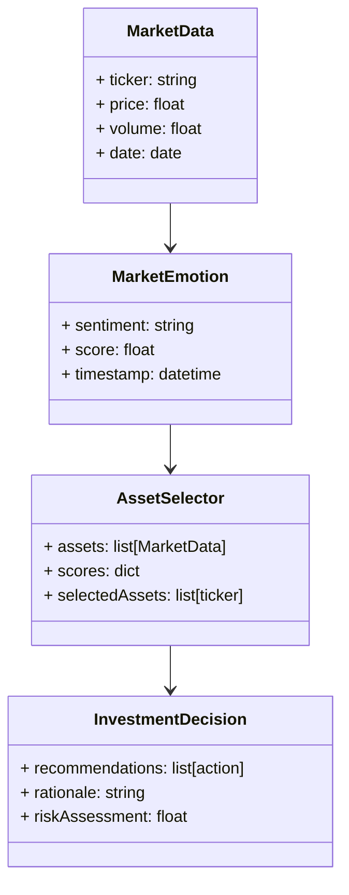
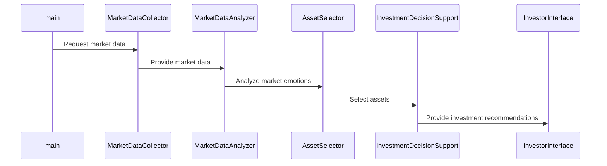
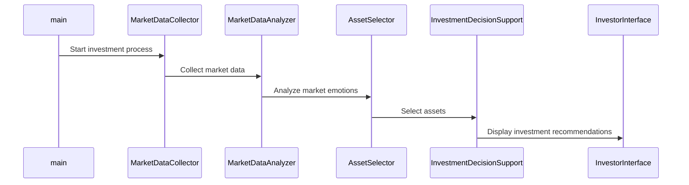

                 


# 价值投资中的逆向思维：当别人恐惧时贪婪

## 关键词
价值投资，逆向思维，市场情绪，风险管理，投资策略，资产配置

## 摘要
本文深入探讨了价值投资中的逆向思维策略，重点分析了在市场恐慌时如何保持贪婪，寻找投资机会。文章从逆向思维的哲学基础出发，结合系统的投资框架和风险管理策略，详细讲解了如何在复杂多变的市场环境中，运用逆向思维实现稳健投资。通过实际案例分析和系统架构设计，文章为投资者提供了实用的投资策略和工具。

---

# 第一部分: 逆向思维在价值投资中的基础

## 第1章: 逆向思维与价值投资概述

### 1.1 逆向思维的定义与起源

#### 1.1.1 逆向思维的定义
逆向思维是指在面对问题时，从相反的角度出发，寻找解决问题的方法。在投资领域，逆向思维意味着在市场恐慌时寻找机会，在市场狂热时保持冷静。

#### 1.1.2 逆向思维的起源与发展
逆向思维的哲学基础可以追溯到古希腊哲学家亚里士多德的辩证法，后来在投资领域，本杰明·格雷厄姆和沃伦·巴菲特等人将其应用于价值投资。

#### 1.1.3 逆向思维在投资领域的应用
逆向思维帮助投资者在市场低谷时发现低估资产，在市场高点时规避风险。例如，在2008年金融危机期间，许多投资者通过逆向思维找到了廉价的优质资产。

### 1.2 价值投资的基本原理

#### 1.2.1 价值投资的定义
价值投资是一种投资策略，强调购买市场价格低于其内在价值的资产。其核心在于寻找市场的非理性定价。

#### 1.2.2 价值投资的核心理念
价值投资的核心理念是“安全边际”，即购买价格远低于内在价值的资产，以降低风险并确保收益。

#### 1.2.3 价值投资与逆向思维的结合
逆向思维与价值投资的结合意味着在市场恐慌时，投资者应积极寻找低估资产，而避免在市场狂热时盲目跟风。

### 1.3 逆向思维与价值投资的关系

#### 1.3.1 逆向思维在价值投资中的作用
逆向思维帮助投资者在市场低谷时发现低估资产，在市场高点时规避风险，从而实现长期稳健的投资收益。

#### 1.3.2 逆向思维与传统投资策略的对比
传统投资策略通常基于市场趋势和短期波动，而逆向思维则关注市场非理性定价和长期价值。

#### 1.3.3 逆向思维在价值投资中的优势
逆向思维的优势在于能够在市场恐慌时发现机会，避免市场情绪的干扰，从而实现超额收益。

## 第2章: 逆向思维的哲学基础

### 2.1 逆向思维的哲学思考

#### 2.1.1 逆向思维的辩证法分析
逆向思维体现了辩证法中的矛盾分析，强调在对立面中寻找机会。

#### 2.1.2 逆向思维与人性的对比
人性通常倾向于趋利避害，而逆向思维则要求投资者在市场恐慌时保持贪婪，在市场狂热时保持恐惧。

#### 2.1.3 逆向思维与市场情绪的关系
市场情绪往往呈现周期性波动，逆向思维要求投资者在市场低谷时积极行动，在市场高点时保持谨慎。

### 2.2 逆向思维与市场心理

#### 2.2.1 市场情绪的波动规律
市场情绪通常表现出周期性波动，从狂热到恐慌，再从恐慌到狂热，循环往复。

#### 2.2.2 逆向思维与市场恐慌的关联
逆向思维要求投资者在市场恐慌时保持冷静，分析市场波动的原因，并寻找投资机会。

#### 2.2.3 逆向思维在市场低谷中的应用
在市场低谷时，逆向思维投资者会积极寻找低估资产，分析企业的基本面，寻找长期投资机会。

## 第3章: 逆向思维的投资策略

### 3.1 逆向思维的投资框架

#### 3.1.1 投资框架的构建
投资框架应包括市场分析、资产筛选、风险评估和投资决策等环节。

#### 3.1.2 逆向思维在投资框架中的位置
逆向思维贯穿整个投资框架，特别是在市场恐慌时，投资者应积极寻找机会。

#### 3.1.3 投资框架的优化与调整
投资框架应根据市场变化和投资者自身情况不断优化和调整，以适应不同的市场环境。

### 3.2 逆向思维与资产配置

#### 3.2.1 资产配置的定义与重要性
资产配置是指将资金分配到不同资产类别中，以实现风险分散和收益最大化。

#### 3.2.2 逆向思维在资产配置中的应用
逆向思维要求投资者在市场低谷时增加对低估资产的配置，在市场高点时减少高估资产的配置。

#### 3.2.3 资产配置的动态调整
资产配置应根据市场变化和投资者目标进行动态调整，以确保投资组合的长期稳健。

### 3.3 逆向思维与风险管理

#### 3.3.1 风险管理的定义与重要性
风险管理是指通过识别、评估和控制风险，以减少投资损失。

#### 3.3.2 逆向思维在风险管理中的应用
逆向思维要求投资者在市场恐慌时保持冷静，避免非理性决策，并制定有效的风险管理策略。

#### 3.3.3 风险管理的工具与方法
常用的工具和方法包括止损、分散投资和风险评估模型等。

---

# 第二部分: 逆向思维的系统分析与架构

## 第4章: 逆向思维的系统架构设计

### 4.1 系统功能设计

#### 4.1.1 系统功能模块
系统功能模块包括市场数据采集、市场情绪分析、资产筛选、投资决策支持等。

#### 4.1.2 领域模型类图


#### 4.1.3 系统架构图


### 4.2 系统接口设计

#### 4.2.1 接口描述
系统接口包括数据采集接口、情绪分析接口、资产筛选接口和投资决策支持接口。

#### 4.2.2 接口交互图


### 4.3 系统交互流程

#### 4.3.1 交互流程描述
系统交互流程包括数据采集、情绪分析、资产筛选和投资决策支持四个步骤。

#### 4.3.2 交互流程图


---

## 第5章: 逆向思维的项目实战

### 5.1 环境安装

#### 5.1.1 系统要求
需要安装Python、Pandas、NumPy、Scikit-learn和Matplotlib等工具。

#### 5.1.2 安装命令
```bash
pip install pandas numpy scikit-learn matplotlib
```

### 5.2 核心实现代码

#### 5.2.1 市场数据采集
```python
import pandas as pd
import requests

def get_market_data(ticker):
    url = f"https://api.example.com/{ticker}"
    response = requests.get(url)
    data = response.json()
    return pd.DataFrame(data)
```

#### 5.2.2 市场情绪分析
```python
from sklearn.feature_extraction.text import TfidfVectorizer
from sklearn.naive_bayes import MultinomialNB

def analyze_sentiment(texts):
    vectorizer = TfidfVectorizer()
    X = vectorizer.fit_transform(texts)
    model = MultinomialNB()
    model.fit(X, ['negative', 'neutral', 'positive'])
    return model.predict(X)
```

#### 5.2.3 资产筛选
```python
def select_assets(data, threshold=0.8):
    selected = data[data['score'] > threshold]
    return selected['ticker'].tolist()
```

### 5.3 实际案例分析

#### 5.3.1 案例背景
以2008年金融危机为例，许多优质资产价格大幅下跌，提供了逆向思维投资的机会。

#### 5.3.2 案例分析
通过市场数据采集和情绪分析，发现某些优质资产价格低于内在价值，从而进行投资。

### 5.4 项目小结

#### 5.4.1 项目总结
通过逆向思维系统实现市场数据采集、情绪分析和资产筛选，帮助投资者在市场恐慌时发现机会。

#### 5.4.2 项目优化
可以进一步优化算法，引入更多数据源和分析方法，提高系统的准确性和效率。

---

## 第6章: 逆向思维的最佳实践

### 6.1 小结

#### 6.1.1 核心观点总结
逆向思维是价值投资的重要策略，强调在市场恐慌时寻找机会，避免非理性决策。

#### 6.1.2 技术总结
通过系统架构设计和算法实现，可以帮助投资者更有效地应用逆向思维进行投资。

### 6.2 注意事项

#### 6.2.1 投资者注意事项
投资者应保持冷静，避免被市场情绪左右，同时注重风险管理和资产配置。

#### 6.2.2 系统设计注意事项
系统设计应注重数据的准确性和算法的高效性，同时确保系统的稳定性和可扩展性。

### 6.3 拓展阅读

#### 6.3.1 推荐书籍
1. 《逆向思维：在投资中获得超额收益的艺术》
2. 《价值投资实战：从理论到实践》

#### 6.3.2 推荐文章
1. 逆向思维在股票投资中的应用
2. 价值投资与风险管理的结合

---

# 结语

通过本文的详细分析，读者可以深入了解逆向思维在价值投资中的重要性，并通过系统的架构设计和实际案例分析，掌握如何在市场恐慌时保持贪婪，寻找投资机会。逆向思维不仅是一种投资策略，更是一种思维方式，帮助投资者在复杂多变的市场环境中实现长期稳健的收益。

