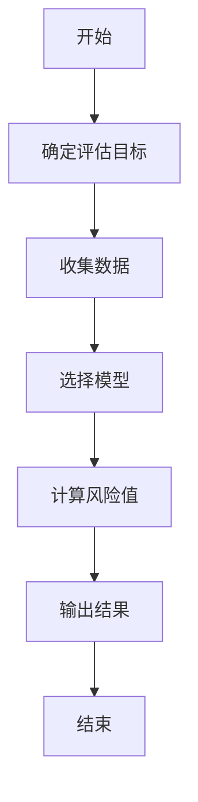
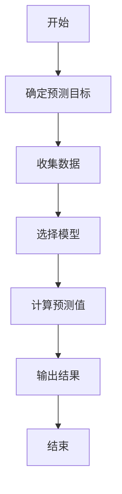
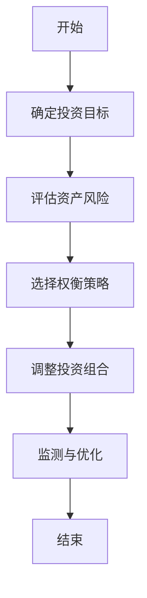
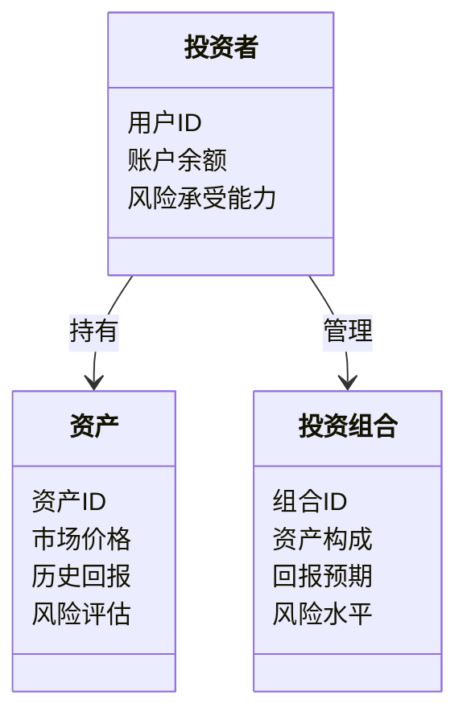
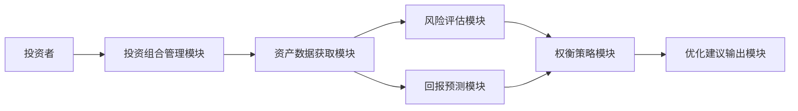

                 


# 价值投资中的风险与回报权衡

> 关键词：价值投资、风险评估、回报预测、风险-回报权衡、投资策略、投资模型

> 摘要：本文探讨了价值投资中的风险与回报权衡问题。通过分析风险与回报的基本概念、评估方法和权衡策略，结合数学模型和实际案例，帮助投资者更好地理解和应用这些原则。文章从背景介绍、核心概念、算法原理、系统分析、项目实战到总结，层层深入，为读者提供了全面的视角和实用的指导。

---

## 第一部分：价值投资的背景与核心概念

### 第1章：价值投资的起源与发展

#### 1.1 价值投资的起源

**1.1.1 价值投资的定义**

价值投资是一种以内在价值为导向的投资策略，强调通过分析企业的基本面，寻找市场价格低于其内在价值的投资机会。其核心理念是购买低于内在价值的资产，长期持有，等待价格回归。

**1.1.2 价值投资的核心理念**

- **长期视角**：关注企业的长期价值，而非短期市场波动。
- **安全边际**：买入价格低于内在价值，以降低风险。
- **价值发现**：寻找市场低估的优质企业。

**1.1.3 价值投资与其它投资策略的对比**

| 投资策略 | 核心理念 | 适用场景 | 风险特征 |
|----------|----------|----------|----------|
| 价值投资 | 寻找低估资产 | 市场低迷期 | 中低风险 |
| 技术分析 | 通过价格和成交量预测趋势 | 市场波动期 | 高风险 |
| 成长投资 | 投资高成长企业 | 高增长行业 | 高风险 |

#### 1.2 价值投资的哲学基础

**1.2.1 价值投资的长期视角**

价值投资者相信市场短期波动无法预测，长期趋势由企业基本面决定。这种视角要求投资者具备耐心和纪律性，避免被短期市场情绪左右。

**1.2.2 投资者心态与决策框架**

投资者的心态和决策框架直接影响投资结果。价值投资强调理性决策，避免贪婪和恐惧的情绪化投资。

**1.2.3 价值投资与市场周期的关系**

市场周期分为繁荣、衰退、萧条和复苏四个阶段。价值投资者通常在市场衰退或萧条阶段寻找低估资产，在市场繁荣阶段保持谨慎。

### 第2章：风险与回报的基本概念

#### 2.1 风险的定义与分类

**2.1.1 风险的定义**

风险是投资过程中可能发生的损失或收益低于预期的可能性。它反映了市场波动和不确定性对投资结果的影响。

**2.1.2 风险的分类**

| 风险类型 | 定义 | 来源 |
|----------|------|------|
| 系统性风险 | 影响整个市场的风险 | 经济衰退、战争、政策变化 |
| 非系统性风险 | 仅影响特定资产或行业的风险 | 企业业绩下滑、管理问题 |

**2.1.3 风险的度量方法**

- **标准差**：衡量资产回报的波动性，标准差越大，风险越高。
- **最大回撤**：资产在一定时间内的最大跌幅。
- **VaR（在险值）**：在一定置信水平下，可能的最大损失。

#### 2.2 回报的定义与分类

**2.2.1 回报的定义**

回报是投资者在一定时间内的收益，包括资本收益和分红收益。

**2.2.2 回报的分类**

| 回报类型 | 定义 | 计算公式 |
|----------|------|----------|
| 简单回报 | 未考虑复利的回报 | \( R = \frac{P_t - P_{t-1}}{P_{t-1}} \) |
| 复合回报 | 考虑复利的回报 | \( R = (1 + R_1)(1 + R_2)...(1 + R_n) - 1 \) |

#### 2.3 风险与回报的关系

**2.3.1 风险与回报的正相关性**

一般来说，风险越高，潜在回报也越高。但并非所有高风险投资都能带来高回报，关键在于风险与回报的匹配。

**2.3.2 风险与回报的负相关性**

在某些情况下，降低风险可能意味着放弃部分潜在回报，但通过合理配置资产，可以在降低风险的同时保持一定水平的回报。

**2.3.3 风险与回报的动态平衡**

通过动态调整投资组合，可以在不同市场环境下找到风险与回报的最佳平衡点。

---

## 第二部分：价值投资中的风险分析

### 第3章：风险评估模型

#### 3.1 风险评估的基本原理

**3.1.1 风险评估的步骤**

1. 确定评估目标：明确风险评估的具体对象和范围。
2. 收集数据：获取相关资产的历史数据和市场信息。
3. 选择模型：根据具体情况选择合适的风险评估模型。
4. 计算风险值：利用模型计算风险指标。
5. 输出结果：分析风险评估结果并制定应对策略。

#### 3.2 风险评估的数学模型

**3.2.1 风险值的计算公式**

使用标准差衡量资产的风险：

$$ \sigma = \sqrt{\frac{1}{n-1} \sum_{i=1}^{n} (R_i - \bar{R})^2} $$

其中，\( R_i \) 是第 \( i \) 个回报，\( \bar{R} \) 是平均回报，\( n \) 是数据点数量。

**3.2.2 风险调整后的回报计算**

通过夏普比率衡量风险调整后的回报：

$$ \text{夏普比率} = \frac{E[R_p - R_f]}{\sigma_p} $$

其中，\( E[R_p - R_f] \) 是投资组合的超额回报期望值，\( \sigma_p \) 是投资组合的波动性。

#### 3.3 风险评估的流程图



---

## 第三部分：价值投资中的回报分析

### 第4章：回报预测模型

#### 4.1 回报预测的基本原理

**4.1.1 回报预测的步骤**

1. 确定预测目标：明确预测的对象和时间范围。
2. 收集数据：获取相关资产的历史回报数据和市场信息。
3. 选择模型：根据具体情况选择合适的风险评估模型。
4. 计算预测值：利用模型计算风险指标。
5. 输出结果：分析风险评估结果并制定应对策略。

#### 4.2 回报预测的数学模型

**4.2.1 简单线性回归模型**

$$ R_i = a + bX_i + \epsilon_i $$

其中，\( R_i \) 是回报，\( X_i \) 是自变量，\( a \) 是截距，\( b \) 是回归系数，\( \epsilon_i \) 是误差项。

**4.2.2 多元线性回归模型**

$$ R_i = a + b_1X_{i1} + b_2X_{i2} + ... + b_kX_{ik} + \epsilon_i $$

**4.2.3 时间序列分析模型**

使用ARIMA模型预测回报：

$$ \phi(B)(1 - B)^d R_t = \theta(B) \epsilon_t $$

其中，\( B \) 是后移算子，\( d \) 是差分阶数，\( \phi(B) \) 和 \( \theta(B) \) 是多项式系数。

#### 4.3 回报预测的流程图



---

## 第四部分：风险与回报的权衡策略

### 第5章：风险与回报的权衡方法

#### 5.1 风险与回报的权衡原理

**5.1.1 权衡的基本概念**

在价值投资中，风险与回报的权衡是通过调整投资组合的构成来实现的。投资者需要在追求高回报的同时，控制可能的风险。

**5.1.2 权衡的步骤**

1. 确定投资目标：明确投资的预期回报和可承受风险。
2. 评估资产风险：使用风险评估模型计算各资产的风险。
3. 选择权衡策略：根据风险承受能力和回报需求，选择合适的权衡方法。
4. 调整投资组合：根据权衡结果调整资产配置。
5. 监测与优化：定期监测投资组合的表现，进行动态调整。

#### 5.2 风险与回报的权衡模型

**5.2.1 线性权衡模型**

$$ R_p = \sum_{i=1}^{n} w_i R_i $$

其中，\( R_p \) 是投资组合的回报，\( w_i \) 是各资产的权重，\( R_i \) 是各资产的回报。

**5.2.2 非线性权衡模型**

$$ R_p = f(R_1, R_2, ..., R_n) $$

其中，\( f \) 是非线性函数，用于计算投资组合的回报。

**5.2.3 综合权衡模型**

$$ R_p = \alpha \cdot R_{\text{avg}} + \beta \cdot R_{\text{std}} $$

其中，\( R_{\text{avg}} \) 是平均回报，\( R_{\text{std}} \) 是回报的标准差，\( \alpha \) 和 \( \beta \) 是权衡系数。

#### 5.3 风险与回报的权衡流程图



---

## 第五部分：系统分析与架构设计方案

### 第6章：系统分析与架构设计方案

#### 6.1 问题场景介绍

投资者需要在不同的市场环境下，根据风险与回报的权衡结果，动态调整投资组合。系统需要能够实时获取市场数据，计算风险和回报指标，并提供优化建议。

#### 6.2 系统功能设计

**领域模型**



**系统架构设计**



---

## 第六部分：项目实战

### 第7章：项目实战

#### 7.1 环境安装

需要安装以下工具和库：

- Python 3.x
- Jupyter Notebook
- Pandas、NumPy、Scikit-learn、Matplotlib

#### 7.2 系统核心实现源代码

**风险评估代码**

```python
import pandas as pd
import numpy as np

def calculate_standard_deviation(returns):
    return np.std(returns)

def calculate_value_at-risk(returns, confidence_level=0.95):
    returns_sorted = np.sort(returns)
    index = int(len(returns_sorted) * (1 - confidence_level))
    return returns_sorted[index]
```

**回报预测代码**

```python
from sklearn.linear_model import LinearRegression

def predict_returns(features, target):
    model = LinearRegression()
    model.fit(features, target)
    return model.predict(features)
```

#### 7.3 代码应用解读与分析

通过上述代码，投资者可以计算资产的风险和预测回报。例如，使用 `calculate_standard_deviation` 函数计算资产的波动性，使用 `predict_returns` 函数预测未来回报。

#### 7.4 实际案例分析

假设我们有一个股票的历史回报数据，可以通过上述代码计算其标准差（波动性）和预测未来回报。

#### 7.5 项目小结

通过实战项目，我们可以将理论应用于实际投资决策，帮助投资者更好地理解风险与回报的权衡。

---

## 第七部分：总结、最佳实践、注意事项和拓展阅读

### 第8章：总结

本文系统地探讨了价值投资中的风险与回报权衡问题，从理论到实践，结合数学模型和实际案例，为投资者提供了全面的视角和实用的指导。

### 第9章：最佳实践 tips

- **分散投资**：通过分散投资降低非系统性风险。
- **长期视角**：坚持价值投资的长期理念，避免短期波动干扰。
- **定期调整**：根据市场变化和自身风险承受能力，定期调整投资组合。

### 第10章：注意事项

- **市场风险**：市场波动可能影响资产价格，需保持警惕。
- **数据质量**：确保使用的数据准确可靠，避免错误决策。
- **模型局限性**：数学模型仅供参考，实际投资需结合市场判断。

### 第11章：拓展阅读

- 建议阅读《投资学》（作者：杰里夫·弗里德曼）深入了解投资学基础。
- 推荐学习《Python金融数据分析》（作者：马顿·乌伊杰尔）掌握数据处理和分析技能。

---

通过本文的深入分析，投资者可以更好地理解和应用风险与回报的权衡策略，从而做出更明智的投资决策。

