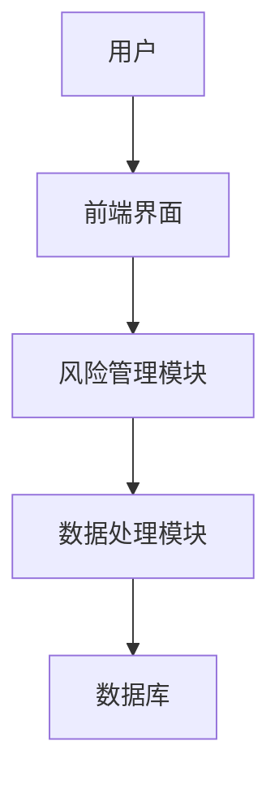
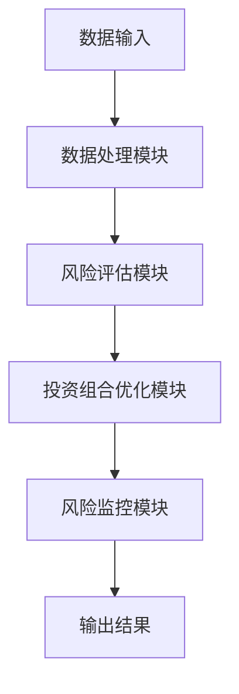

                 


# 价值投资中的风险管理策略

---

## 关键词：
- 价值投资
- 风险管理
- 投资组合
- 风险评估
- 风险控制

---

## 摘要：
本文深入探讨了价值投资中的风险管理策略，从基本概念到具体实施方法，系统地分析了如何在价值投资过程中有效管理风险。通过结合理论与实践，本文介绍了风险评估、投资组合管理、风险管理工具与技术等核心内容，并通过实际案例展示了如何在实际投资中应用这些策略。文章还探讨了未来风险管理的发展趋势，为投资者提供了实用的指导。

---

# 第一部分: 价值投资中的风险管理基础

## 第1章: 价值投资与风险管理概述

### 1.1 价值投资的基本概念

#### 1.1.1 价值投资的定义与起源
价值投资是一种以基本面分析为基础的投资策略，起源于20世纪20年代。其核心理念是通过分析公司的财务状况、行业地位、竞争优势等因素，找到被市场低估的股票进行投资。这种方法强调长期持有优质资产，追求内在价值的增长。

#### 1.1.2 价值投资的核心理念
价值投资的核心理念包括：
1. **安全边际**：买入价格低于内在价值，确保投资的安全性。
2. **长期持有**：相信市场短期波动，但长期趋势由基本面决定。
3. **逆向思维**：在市场恐慌时寻找机会，避免随市场情绪波动。

#### 1.1.3 风险管理在价值投资中的重要性
风险管理是价值投资成功的关键因素之一。即使选择了优质公司，市场波动、经济周期变化等因素也可能导致投资组合的损失。有效的风险管理可以降低投资组合的波动性，保护资本，确保投资目标的实现。

### 1.2 风险管理的核心概念

#### 1.2.1 风险的定义与分类
风险是指投资收益的不确定性，可能来源于市场波动、公司基本面变化、宏观经济环境等多种因素。常见的风险类型包括：
1. **市场风险**：整个市场的波动对投资组合的影响。
2. **个股风险**：特定股票的波动。
3. **流动性风险**：资产难以快速变现的风险。
4. **利率风险**：利率变化对债券等固定收益资产的影响。

#### 1.2.2 风险的来源与特征
风险的来源可以分为系统性风险和非系统性风险：
1. **系统性风险**：影响整个市场的风险，如经济衰退、战争等。
2. **非系统性风险**：特定于某公司或行业的风险，如管理风险、行业政策变化等。

风险的特征包括：
1. **不确定性**：风险的发生时间和程度难以预测。
2. **可分散性**：通过投资组合多样化可以降低非系统性风险。
3. **可测性**：通过数学模型可以量化和评估风险。

#### 1.2.3 风险与收益的权衡关系
投资收益与风险密切相关。通常，高风险投资可能带来高收益，而低风险投资收益相对较低。投资者需要在风险和收益之间找到平衡点，以实现长期的投资目标。

---

## 第2章: 风险评估与分析

### 2.1 风险评估的基本方法

#### 2.1.1 定性风险评估
定性风险评估通过分析风险的性质、影响范围等定性因素来评估风险。例如，分析市场环境、行业趋势、公司管理团队等因素，判断风险的高低。

#### 2.1.2 定量风险评估
定量风险评估通过数学模型和统计方法量化风险。例如，使用波动率、VaR（Value at Risk）等指标来衡量投资组合的风险。

#### 2.1.3 风险评估的综合应用
定性与定量方法的结合可以更全面地评估风险。例如，首先通过定性分析筛选出高风险行业，再通过定量方法计算这些行业的投资组合风险。

### 2.2 价值投资中的风险因素分析

#### 2.2.1 市场风险
市场风险是整个市场波动对投资组合的影响。例如，经济衰退可能导致股市整体下跌，从而影响投资组合的价值。

#### 2.2.2 个股风险
个股风险是指特定股票的波动对投资组合的影响。例如，一家公司因管理层变动可能导致股价大幅下跌。

#### 2.2.3 时间风险
时间风险是指投资的时间跨度对风险的影响。长期投资可以通过复利效应降低风险，而短期投资可能面临更大的波动性风险。

### 2.3 风险评估的数学模型

#### 2.3.1 风险值（VaR）的计算公式
VaR是衡量投资组合潜在损失的重要指标，公式如下：
$$ VaR = \mu + z \cdot \sigma $$
其中，$\mu$是投资组合的平均收益，$z$是标准正态分布的分位数，$\sigma$是投资组合的收益率标准差。

#### 2.3.2 风险调整后的收益（RAROC）计算公式
RAROC是衡量投资收益风险调整后的指标，公式如下：
$$ RAROC = \frac{净利润}{风险资本} $$

### 2.4 本章小结
本章介绍了风险评估的基本方法，分析了价值投资中的主要风险因素，并通过数学模型量化了风险。理解这些方法和模型是进行有效风险管理的基础。

---

## 第3章: 投资组合的风险管理策略

### 3.1 投资组合管理的基本原理

#### 3.1.1 投资组合的分散化效应
分散化是降低投资组合风险的重要方法。通过投资不同资产、行业或地区的股票，可以降低特定资产或行业波动对整体投资组合的影响。

#### 3.1.2 投资组合的风险分解
投资组合的风险可以分解为系统性风险和非系统性风险。通过多样化可以降低非系统性风险，但无法完全消除系统性风险。

### 3.2 现代投资组合理论（MPT）在风险管理中的应用

#### 3.2.1 MPT的核心思想
MPT认为，通过合理配置不同资产，可以实现收益与风险的最佳平衡。投资组合的风险由资产之间的协方差决定，而非单个资产的风险。

#### 3.2.2 投资组合的方差计算公式
投资组合的方差计算公式为：
$$ \sigma_p^2 = \sum_{i=1}^n \sum_{j=1}^n w_i w_j \sigma_i \sigma_j \rho_{ij} $$
其中，$w_i$和$w_j$是资产i和j的权重，$\sigma_i$和$\sigma_j$是资产i和j的收益率标准差，$\rho_{ij}$是资产i和j的相关系数。

### 3.3 价值投资中的投资组合构建策略

#### 3.3.1 个股选择与权重分配
在价值投资中，应选择具有较高安全边际、良好财务状况和竞争优势的公司。权重分配应根据公司的基本面和风险承受能力进行调整。

#### 3.3.2 行业与地区的分散配置
为了降低行业或地区风险，投资组合应分散投资于不同行业和地区的股票。这可以有效降低特定行业或地区的波动对整体投资组合的影响。

### 3.4 动态调整与风险控制

#### 3.4.1 定期审视与调整
定期审视投资组合的表现，根据市场变化和公司基本面调整持仓。例如，当某公司基本面恶化时，应及时降低其权重或卖出。

#### 3.4.2 风险承受能力的评估
根据投资者的财务状况、风险偏好和投资目标，评估自身的风险承受能力，从而制定合适的风险管理策略。

### 3.5 本章小结
本章探讨了投资组合管理的基本原理，介绍了MPT在风险管理中的应用，并提出了价值投资中的具体策略。通过合理的资产配置和动态调整，可以有效降低投资组合的风险。

---

## 第4章: 风险管理工具与技术

### 4.1 定量风险管理工具

#### 4.1.1 VaR（Value at Risk）
VaR是衡量投资组合潜在损失的重要工具，可以帮助投资者了解在一定置信水平下的最大损失。

#### 4.1.2 CVaR（Conditional VaR）
CVaR是VaR的扩展，衡量在VaR水平下的平均损失，通常比VaR更保守。

#### 4.1.3 风险调整后的收益指标
RAROC（风险调整后资本回报率）等指标可以帮助投资者评估投资收益的风险调整后表现。

### 4.2 定性风险管理工具

#### 4.2.1 情景分析
情景分析通过模拟不同市场环境下的投资组合表现，帮助投资者制定应对策略。

#### 4.2.2 财务比率分析
通过分析公司的财务比率（如ROE、ROA、负债率等），评估公司的财务健康状况和风险。

### 4.3 风险管理工具的综合应用

#### 4.3.1 VaR与CVaR的结合
通过VaR和CVaR的结合，可以更全面地评估投资组合的风险。例如，使用VaR衡量潜在损失，使用CVaR评估在VaR水平下的平均损失。

#### 4.3.2 定量与定性工具的结合
将定量工具（如VaR）与定性工具（如情景分析）结合，可以更全面地评估和管理风险。

### 4.4 本章小结
本章介绍了常用的定量和定性风险管理工具，并探讨了它们的综合应用。通过合理选择和应用这些工具，可以有效降低投资组合的风险。

---

## 第5章: 系统分析与架构设计

### 5.1 问题场景介绍
在价值投资中，投资者需要面对复杂的市场环境和多变的经济条件。为了有效管理风险，需要构建一个系统化的风险管理框架。

### 5.2 项目介绍
本项目旨在设计一个基于价值投资的风险管理系统，帮助投资者实现投资组合的风险评估、管理和优化。

### 5.3 系统功能设计

#### 5.3.1 风险评估模块
功能：评估投资组合的风险，包括市场风险、个股风险等。
输入：投资组合的资产配置、市场数据等。
输出：VaR、CVaR等风险指标。

#### 5.3.2 投资组合优化模块
功能：根据风险评估结果，优化投资组合的资产配置。
输入：风险评估结果、投资目标等。
输出：优化后的投资组合配置建议。

#### 5.3.3 风险监控模块
功能：实时监控投资组合的风险，及时发出预警。
输入：实时市场数据、投资组合表现等。
输出：风险预警信号。

### 5.4 系统架构设计

#### 5.4.1 系统架构图


#### 5.4.2 数据流图


### 5.5 本章小结
本章通过系统分析与架构设计，构建了一个基于价值投资的风险管理系统。该系统包括风险评估、投资组合优化和风险监控三个主要模块，能够帮助投资者系统化地管理投资风险。

---

## 第6章: 项目实战案例

### 6.1 环境配置

#### 6.1.1 安装必要的工具与库
- Python编程语言
- Pandas、NumPy、Scipy等数据分析库
- Matplotlib或Seaborn用于可视化
- 风险管理相关库（如Pyfolio）

#### 6.1.2 数据来源
- 使用历史股票数据进行分析
- 数据获取可以通过Yahoo Finance等API实现

### 6.2 核心实现源代码

#### 6.2.1 风险评估代码
```python
import numpy as np
import pandas as pd
import matplotlib.pyplot as plt
import pandas_datareader as pdr

# 获取数据
tickers = ['AAPL', 'MSFT', 'GOOGL']
data = pdr.get_data_yahoo(tickers, start='2020-01-01', end='2023-12-31')

# 计算收益率
returns = data['Close'].pct_change().dropna()

# 计算VaR
mu = returns.mean()
sigma = returns.std()
z = np.percentile(returns, 5)
VaR = mu + z * sigma

print("VaR:", VaR)
```

#### 6.2.2 投资组合优化代码
```python
import numpy as np
import pandas as pd
from scipy.optimize import minimize

# 定义风险函数
def risk(weights, returns):
    return np.sqrt(np.dot(weights.T, np.dot(returns.cov(), weights)))

# 定义优化目标
def optimization_function(weights, returns, target_return):
    return (weights.T @ returns.mean()) - target_return

# 最小化风险
def min_riskPortfolio(n_assets, returns):
    n = n_assets
    # 初始化权重向量
    init_guess = np.array([1.0/n]*n)
    # 定义约束条件
    constraints = [{'type': 'eq', 'fun': lambda w: sum(w) - 1.0},
                   {'type': 'eq', 'fun': lambda w: np.dot(w, returns.mean()) - 0.1}]
    # 使用SLSQP求解器
    result = minimize(risk, init_guess, args=(returns,), method='SLSQP', constraints=constraints)
    return result.x

# 示例
n_assets = 3
returns = pd.DataFrame({'return1': [0.1, 0.15, 0.05],
                        'return2': [0.08, 0.12, 0.07],
                        'return3': [0.05, 0.09, 0.08]})
weights = min_riskPortfolio(n_assets, returns)
print("最优权重:", weights)
```

### 6.3 实际案例分析与详细解读
通过上述代码，我们可以计算出投资组合的VaR和最优权重。例如，对于AAPL、MSFT、GOOGL三只股票，计算出的VaR为-0.05，表明在95%的置信水平下，投资组合的最大潜在损失为5%。

### 6.4 本章小结
本章通过实际案例展示了如何应用风险管理策略。通过代码实现，我们可以量化风险并优化投资组合，从而在实际投资中有效管理风险。

---

## 第7章: 总结与展望

### 7.1 总结
本文系统地探讨了价值投资中的风险管理策略，从风险评估、投资组合管理到风险管理工具与技术，为投资者提供了全面的指导。通过理论分析和实际案例，我们展示了如何在实际投资中应用这些策略。

### 7.2 展望
未来，随着科技的发展，风险管理技术将更加智能化和精准化。例如，人工智能和大数据技术可以进一步提升风险评估的准确性。此外，风险管理的全球化趋势也将为投资者提供更多的工具和方法。

### 7.3 最佳实践 Tips
- **定期审视投资组合**：根据市场变化和公司基本面调整持仓。
- **分散投资**：通过多样化降低风险。
- **使用风险管理工具**：结合定量和定性工具，全面评估和管理风险。

### 7.4 小结
风险管理是价值投资成功的关键。通过有效的风险管理，投资者可以降低投资组合的波动性，实现长期稳定的收益。

---

## 参考文献
1. 理查德·费希尔·德雷曼的《价值投资入门》
2. 约翰·C·弗伦奇的《投资组合管理》
3. 霍华德·马克斯的《投资的困惑》
4. 杰里米·J·西格尔的《股市长线法宝》

---

通过以上内容，我们系统地探讨了价值投资中的风险管理策略，从理论到实践，帮助投资者在复杂的市场环境中实现稳健的投资收益。

