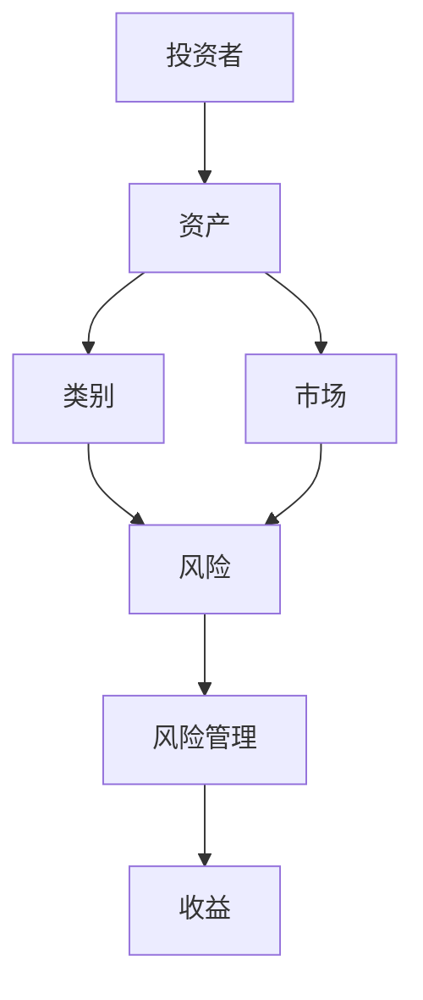

                 

# 价值投资中的风险管理：分散投资的艺术

---

## 关键词：
- 价值投资
- 风险管理
- 分散投资
- 投资组合
- 风险指标
- 市场波动

---

## 摘要：
本文系统阐述了价值投资中的风险管理及其分散投资的艺术。通过分析风险管理的基本概念、分散投资的原理、投资组合的构建与优化，以及市场波动对投资策略的影响，本文为投资者提供了全面的风险管理框架和实际操作指南。文章从理论到实践，结合数学模型和案例分析，深入探讨了如何通过分散投资降低风险、优化收益，帮助投资者在复杂多变的市场中实现稳健的投资回报。

---

# 第一部分: 价值投资中的风险管理基础

## 第1章: 风险管理的基本概念

### 1.1 风险的定义与分类
#### 1.1.1 风险的定义
风险是指在投资活动中，由于不确定性因素的存在，可能导致投资收益低于预期甚至出现本金损失的可能性。在价值投资中，风险主要来源于市场的波动、个股的基本面变化以及宏观经济环境的变化。

#### 1.1.2 风险的类型
1. **市场风险**：由于整体市场波动导致的资产价格下跌风险。
2. **流动性风险**：资产在短期内难以以合理价格变现的风险。
3. **信用风险**：债券发行人或企业无法按时偿还本金和利息的风险。
4. **操作风险**：由于人为错误或系统故障导致的投资损失风险。
5. **通货膨胀风险**：通货膨胀可能导致实际投资回报下降的风险。

#### 1.1.3 风险在价值投资中的重要性
价值投资强调长期持有优质资产，但市场波动和个股基本面变化仍然可能导致短期损失。因此，风险管理是价值投资策略中不可或缺的一部分，通过科学的分散投资策略，可以有效降低整体投资组合的风险。

---

### 1.2 价值投资中的风险管理
#### 1.2.1 价值投资的核心理念
价值投资的核心理念是寻找被市场低估的优质资产，长期持有并分享其成长收益。这一策略强调安全边际和长期稳健的回报，而非短期的市场波动。

#### 1.2.2 风险管理在价值投资中的作用
1. **降低波动性**：通过分散投资减少单一资产带来的风险。
2. **提高投资组合的稳定性**：科学的资产配置能够平衡收益与风险。
3. **实现长期目标**：有效的风险管理能够帮助投资者在市场波动中保持投资纪律，避免过度交易和恐慌性抛售。

#### 1.2.3 风险管理的基本原则
1. **分散投资**：不要将所有资金投入到单一资产或行业。
2. **长期视角**：关注企业的基本面，避免短期市场波动的干扰。
3. **动态调整**：定期审视投资组合，根据市场变化和个人风险承受能力进行调整。

---

### 1.3 分散投资的艺术
#### 1.3.1 分散投资的定义
分散投资是指将资金分配到不同的资产类别、行业或地域，以降低单一资产或市场带来的风险。通过多样化，投资者可以减少特定资产或市场的波动对整体投资组合的影响。

#### 1.3.2 分散投资的核心思想
分散投资的核心思想是“不要把所有鸡蛋放在一个篮子里”。通过合理的资产配置，投资者可以平衡风险与收益，避免因单一资产的大幅波动而导致的重大损失。

#### 1.3.3 分散投资与风险控制的关系
分散投资是风险控制的重要手段，通过科学的资产配置和多元化投资，可以有效降低投资组合的整体风险，同时提高收益的稳定性。

---

## 第2章: 风险管理的核心概念与联系

### 2.1 风险管理的核心原理
#### 2.1.1 风险与收益的平衡
在投资中，风险与收益是密切相关的。高风险通常意味着高收益，但同时也意味着更大的潜在损失。通过风险管理，投资者可以在风险可控的前提下，追求更高的收益。

#### 2.1.2 投资组合的风险分散机制
投资组合的风险分散机制是指通过将资金分配到不同的资产类别或行业中，降低单一资产或市场波动对整体投资组合的影响。分散投资的效果取决于资产之间的相关性：资产相关性越低，分散效果越显著。

#### 2.1.3 风险管理的数学模型
在风险管理中，数学模型是重要的工具。例如，现代投资组合理论（MPT）通过优化投资组合的收益与风险比，帮助投资者找到最优的资产配置方案。

---

### 2.2 核心概念对比表格
#### 2.2.1 风险与收益的对比
| **维度**       | **风险**              | **收益**             |
|----------------|-----------------------|----------------------|
| 定义           | 可能的损失或收益下降 | 预期的收益           |
| 影响           | 投资组合稳定性        | 投资目标的实现       |
| 管理方法       | 分散投资、对冲策略     | 优化资产配置、选择优质资产 |

#### 2.2.2 分散投资与集中投资的对比
| **维度**       | **分散投资**          | **集中投资**          |
|----------------|-----------------------|-----------------------|
| 风险控制       | 有效降低单一资产风险  | 风险集中，波动较大    |
| 收益潜力       | 稳定性较高            | 收益潜力较大          |
| 适用场景       | 保守型投资者          | 追求高收益的投资者    |

---

### 2.3 ER实体关系图

---

## 第3章: 分散投资的算法原理

### 3.1 分散投资的数学模型
#### 3.1.1 投资组合的期望收益与方差
投资组合的期望收益可以用以下公式计算：
$$ E(r_p) = \sum_{i=1}^{n} w_i E(r_i) $$
其中，\( w_i \) 是资产 \( i \) 的权重，\( E(r_i) \) 是资产 \( i \) 的期望收益。

投资组合的方差（风险）可以用以下公式计算：
$$ Var(r_p) = \sum_{i=1}^{n} \sum_{j=1}^{n} w_i w_j \sigma_i \sigma_j \rho_{ij} $$
其中，\( \sigma_i \) 和 \( \sigma_j \) 是资产 \( i \) 和 \( j \) 的标准差，\( \rho_{ij} \) 是资产 \( i \) 和 \( j \) 的相关系数。

#### 3.1.2 马科维茨的有效前沿理论
马科维茨的有效前沿理论指出，在给定风险水平下，投资组合的收益最大化；或者在给定收益水平下，风险最小化。这种组合被称为有效组合。

#### 3.1.3 风险分散的数学公式
通过分散投资，投资组合的总风险可以表示为：
$$ \sigma_p^2 = \sum_{i=1}^{n} \sum_{j=1}^{n} w_i w_j \sigma_i \sigma_j \rho_{ij} $$

---

### 3.2 分散投资的算法流程
#### 3.2.1 确定投资目标与风险承受能力
1. 确定投资目标（如长期资本增值、稳定的收入来源等）。
2. 评估自身的风险承受能力（如保守型、稳健型或激进型）。

#### 3.2.2 选择合适的资产类别
1. 根据投资目标选择股票、债券、房地产等不同资产类别。
2. 考虑资产的地理分布，分散地域风险。

#### 3.2.3 构建投资组合并优化风险收益比
1. 使用数学模型优化投资组合的权重。
2. 定期审视并调整投资组合。

---

### 3.3 分散投资的案例分析
#### 3.3.1 历史案例分析
在2008年全球金融危机期间，分散投资的策略帮助投资者避免了单一资产的大幅亏损。

#### 3.3.2 现实中的分散投资策略
例如，将资金分配到股票、债券、黄金和房地产等多种资产中，以降低市场波动的影响。

#### 3.3.3 分散投资的实际效果评估
通过分析历史数据，分散投资确实能够降低投资组合的波动性，提高收益的稳定性。

---

## 第4章: 投资组合的风险管理

### 4.1 投资组合的构建原理
#### 4.1.1 资产配置的基本原则
1. 根据风险承受能力确定股票、债券等资产的比例。
2. 定期审视并调整资产配置比例。

#### 4.1.2 个股选择的标准与方法
1. 选择基本面良好、估值合理的公司。
2. 分散行业和地域风险。

#### 4.1.3 风险分散的具体策略
1. 避免过度集中于单一行业或公司。
2. 结合价值和成长风格进行投资。

---

### 4.2 投资组合的风险指标
#### 4.2.1 方差与标准差的计算
$$ 标准差 = \sqrt{方差} $$

#### 4.2.2 夏普比率与特雷诺比率的解释
- **夏普比率**：衡量投资组合在承担单位风险时所获得的超额收益。
- **特雷诺比率**：衡量投资组合在承担系统性风险时的超额收益。

#### 4.2.3 最大回撤的定义与应用
最大回撤是指在一定时间段内，投资组合从最高点到最低点的跌幅。它是衡量投资组合风险的重要指标。

---

### 4.3 投资组合的优化与调整
#### 4.3.1 定期调整投资组合的必要性
1. 市场环境变化。
2. 个人风险承受能力的变化。

#### 4.3.2 风险指标的变化对投资组合的影响
1. 方差增加可能意味着投资组合的风险上升。
2. 夏普比率下降可能意味着投资组合的超额收益减少。

#### 4.3.3 不同市场环境下的投资组合调整策略
1. 在牛市中，增加高成长性资产的比例。
2. 在熊市中，增加防御性资产的比例。

---

## 第5章: 市场波动与风险管理

### 5.1 市场波动的定义与影响
#### 5.1.1 市场波动的来源
1. 宏观经济因素（如利率、通货膨胀）。
2. 市场情绪变化。

#### 5.1.2 市场波动对投资组合的影响
1. 短期内可能导致投资组合价值的大幅波动。
2. 长期内可能影响投资组合的长期收益。

#### 5.1.3

---

### 5.2 应对市场波动的策略
#### 5.2.1 灵活调整投资组合
1. 在市场波动加剧时，增加防御性资产的比例。
2. 在市场波动减小时，适当增加高风险资产的比例。

#### 5.2.2 保持长期投资视角
市场波动通常是短期的，长期来看，优质资产的价值会回归其内在价值。

#### 5.2.3 加强风险监控
1. 定期审视投资组合的风险指标。
2. 及时应对潜在的风险。

---

### 5.3 市场波动下的风险管理
#### 5.3.1 使用对冲工具
1. 通过期货、期权等工具对冲市场风险。
2. 选择低相关性的资产进行对冲。

#### 5.3.2 保持充足流动性
1. 在市场波动加剧时，保持一定的现金头寸以应对潜在的市场机会或风险。

#### 5.3.3 风险管理的系统化方法
1. 利用技术指标进行市场监控。
2. 结合基本面分析进行风险评估。

---

## 第6章: 系统化风险管理策略

### 6.1 风险管理的系统化方法
#### 6.1.1 风险识别
1. 识别潜在的风险来源。
2. 分析风险的性质和影响。

#### 6.1.2 风险量化
1. 使用数学模型量化风险。
2. 评估风险对投资组合的影响。

#### 6.1.3 风险对冲
1. 使用金融工具对冲系统性风险。
2. 通过多样化投资对冲非系统性风险。

---

### 6.2 风险管理的数学模型
#### 6.2.1 风险价值（VaR）
VaR是指在一定置信水平下，投资组合可能遭受的最大损失。例如，95%置信水平下的VaR表示在95%的概率下，投资组合的最大损失。

#### 6.2.2 风险调整后的收益（RAROC）
RAROC是指风险调整后的资本回报率，用于衡量投资组合的风险调整后收益。

---

### 6.3 系统化风险管理的案例分析
#### 6.3.1 使用VaR模型进行风险监控
通过VaR模型，投资者可以量化投资组合在不同置信水平下的潜在损失。

#### 6.3.2 应用RAROC进行风险调整
通过RAROC模型，投资者可以评估投资组合的风险调整后收益，从而做出更科学的投资决策。

---

## 第7章: 风险管理的最佳实践与小结

### 7.1 最佳实践 tips
1. **定期审视投资组合**：根据市场变化和个人风险承受能力调整投资策略。
2. **保持分散投资**：避免过度集中于单一资产或行业。
3. **长期视角**：关注企业的基本面，避免短期市场波动的干扰。
4. **使用风险管理工具**：如VaR、RAROC等模型，帮助量化和监控风险。

---

### 7.2 小结
通过科学的风险管理策略，投资者可以在复杂多变的市场中降低投资风险，实现稳健的收益。分散投资是价值投资中降低风险的重要手段，通过合理的资产配置和多样化投资，投资者可以有效控制风险，实现长期的投资目标。

---

### 7.3 注意事项
1. **避免过度分散**：过于分散可能导致投资组合的收益下降。
2. **关注流动性风险**：在市场波动加剧时，确保投资组合的流动性。
3. **定期评估风险指标**：及时发现和应对潜在风险。

---

### 7.4 拓展阅读
1. **《风险管理：理论与实践》**：深入探讨风险管理的理论与实际应用。
2. **《投资组合管理》**：系统介绍投资组合的构建与优化方法。

---

通过本文的系统阐述，读者可以全面了解价值投资中的风险管理及其分散投资的艺术。无论是理论还是实践，风险管理都是投资成功的关键因素之一。希望本文能够为投资者提供有价值的参考，帮助他们在复杂多变的市场中实现稳健的投资回报。

