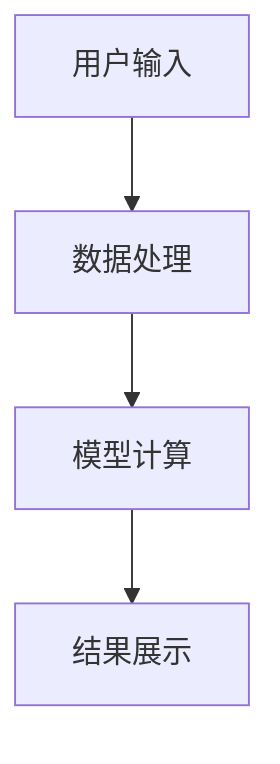

                 


# 安全边际：价值投资中的风险管理工具

## 关键词：价值投资、风险管理、安全边际、内在价值、投资策略

## 摘要：  
安全边际是价值投资中不可或缺的风险管理工具。它通过在买入价格与资产的内在价值之间预留缓冲空间，帮助投资者在市场波动和估值错误中保持稳健。本文详细探讨安全边际的定义、计算方法、应用策略及其在投资组合中的重要性，通过实际案例和系统设计提供全面的指导。

---

# 第一部分：安全边际的核心概念

## 第1章：安全边际的定义与作用

### 1.1 安全边际的定义
安全边际是指资产的买入价格低于其内在价值的部分。它为投资者提供了一种保护机制，即使估值存在误差或市场出现短期波动，也能最大限度地减少损失。

### 1.2 安全边际的核心作用
- **风险缓冲**：当市场价格波动时，安全边际确保投资者不会因短期价格波动而蒙受重大损失。
- **估值保护**：即使内在价值计算存在误差，安全边际也能帮助投资者避免过度亏损。

### 1.3 安全边际与投资回报的关系
安全边际宽度越大，初始买入价格越低，潜在回报率越高。然而，过宽的安全边际可能意味着低估优质资产，错失潜在收益。

---

## 第2章：内在价值的计算方法

### 2.1 内在价值的基本概念
内在价值是资产在未来现金流的现值，反映了其真实价值。常见的计算方法包括：
- **股利折现模型（DDM）**
- **现金流折现模型（DCF）**
- **市盈率与市净率分析**

### 2.2 现金流折现模型（DCF）的数学公式
$$\text{内在价值} = \sum_{t=1}^{\infty} \frac{\text{现金流}_t}{(1+r)^t}$$

其中：
- $\text{现金流}_t$：第$t$年的现金流。
- $r$：折现率，反映市场的风险偏好。

### 2.3 内在价值计算的步骤
1. **预测未来现金流**：基于公司财务状况和行业前景，预测未来几年的现金流。
2. **选择折现率**：根据市场利率和投资风险确定合适的折现率。
3. **计算现值**：将未来现金流折现，求和得到内在价值。

---

## 第3章：安全边际的计算与应用

### 3.1 安全边际宽度的确定
安全边际通常以内在价值的一定比例计算。例如：
- **30%的安全边际**：买入价格 = 内在价值 × 70%
- **50%的安全边际**：买入价格 = 内在价值 × 50%

### 3.2 安全边际的应用策略
1. **买入决策**：只有当买入价格低于内在价值时，才考虑投资。
2. **动态调整**：定期重新评估资产价值，根据市场变化调整安全边际宽度。

### 3.3 案例分析：以苹果公司为例
假设苹果公司的内在价值为$300，设定30%的安全边际：
$$\text{买入价格} = 300 × 70\% = 210$$
当市场价格接近210时，投资者可以考虑建仓。

---

## 第4章：系统化投资中的安全边际应用

### 4.1 投资系统架构设计
1. **数据采集**：收集目标资产的财务数据和市场信息。
2. **模型计算**：使用DCF等方法计算内在价值。
3. **安全边际评估**：确定买入价格是否低于内在价值的一定比例。
4. **风险监控**：实时跟踪市场波动，调整投资组合。

### 4.2 系统设计的实现步骤
1. **环境搭建**：安装Python、Pandas、NumPy等工具。
2. **数据处理**：编写代码计算内在价值和安全边际。
3. **结果展示**：生成可视化图表，帮助投资者理解。

### 4.3 代码实现：计算内在价值
```python
import pandas as pd
import numpy as np

def calculate_intrinsic_value(cash_flows, discount_rate):
    # 计算各年的现值
    pv_flows = [cf / (1 + discount_rate)**t for t, cf in enumerate(cash_flows, start=1)]
    # 现值总和
    intrinsic_value = sum(pv_flows)
    return intrinsic_value

# 示例数据：现金流和折现率
cash_flows = [100, 120, 130, 140, 150]
discount_rate = 0.08

iv = calculate_intrinsic_value(cash_flows, discount_rate)
print(f"内在价值为：{iv}")
```

### 4.4 系统交互图


---

## 第5章：最佳实践与注意事项

### 5.1 投资策略建议
- **长期视角**：安全边际在长期投资中更为有效，短期交易难以体现其价值。
- **分散投资**：结合安全边际策略，分散投资降低风险。

### 5.2 风险管理注意事项
- **定期复盘**：定期评估投资组合的安全边际，确保风险可控。
- **动态调整**：根据市场变化，灵活调整安全边际宽度。

### 5.3 小结
安全边际是价值投资者的重要工具，通过科学的计算和系统化的管理，帮助投资者在市场中稳健前行。

---

## 第6章：结论与展望

### 6.1 结论
安全边际作为风险管理的核心工具，帮助投资者在不确定的市场中实现稳健投资。通过系统化的方法和工具，投资者可以更好地应用安全边际策略。

### 6.2 未来展望
随着技术进步，AI和大数据在安全边际计算中的应用将更加广泛，为投资者提供更精准的决策支持。

---

## 参考文献
- 略

---

通过以上详细分析，安全边际在价值投资中的重要性不言而喻。投资者通过科学的方法和系统化的工具，可以在风险可控的前提下，实现长期稳健的投资回报。

