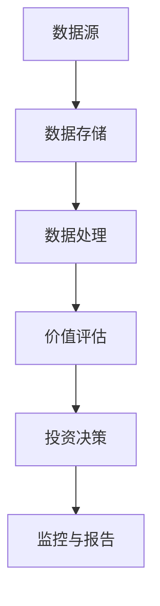

                 


# 价值投资之父格雷厄姆的投资哲学

## 关键词：格雷厄姆、价值投资、安全边际、内在价值、投资哲学

## 摘要：  
本篇文章将深入探讨价值投资之父本杰明·格雷厄姆的投资哲学，从其核心概念、安全边际理论到内在价值评估，逐步分析其投资理念的数学模型与实际应用。文章不仅详细阐述了格雷厄姆的投资策略，还包括其对现代投资理论的深远影响，并通过实际案例展示其投资哲学在实践中的应用。

---

# 第一部分: 格雷厄姆投资哲学的背景与核心概念

## 第1章: 格雷厄姆的生平与价值投资的起源

### 1.1 格雷厄姆的生平
本杰明·格雷厄姆（1897-1976）是20世纪著名的投资家和经济学家，被誉为“价值投资之父”。他出生于伦敦，后随家迁居美国，曾在哥伦比亚大学任教，并撰写了许多经典的投资著作，如《证券分析》和《聪明的投资者》。他的投资哲学深刻影响了沃伦·巴菲特等后来的投资大师。

### 1.2 价值投资的起源
价值投资的理念起源于20世纪20年代的美国经济繁荣时期。当时，市场投机气氛浓厚，投资者更关注短期价格波动而非企业的实际价值。格雷厄姆意识到这种投机行为的危险性，开始倡导基于企业基本面的长期投资策略。

### 1.3 格雷厄姆投资哲学的核心思想
格雷厄姆的投资哲学强调以低于内在价值的价格买入优质股票，并长期持有。他认为市场波动是投资者的盟友，而非敌人，通过安全边际的计算来降低投资风险。

---

## 第2章: 格雷厄姆投资哲学的核心概念

### 2.1 安全边际
**安全边际**是格雷厄姆投资理念的核心之一。它是指股票的内在价值与市场价格之间的差距。通过安全边际，投资者可以确保在市场价格波动时，依然能够获得正收益。

#### 2.1.1 安全边际的公式
$$ \text{安全边际} = \text{内在价值} - \text{市场价格} $$

#### 2.1.2 安全边际的重要性
安全边际提供了风险缓冲，确保在市场价格下跌时，投资者仍能避免损失。例如，如果一只股票的内在价值为100元，市场价格为80元，安全边际为20元，即使市场价格下跌至85元，投资者仍能保持5元的收益。

### 2.2 内在价值
**内在价值**是格雷厄姆评估股票的核心指标，指的是企业未来现金流的现值。计算内在价值通常使用现金流折现模型（DCF模型）。

#### 2.2.1 内在价值的计算公式
$$ V = \frac{E}{1 + r} $$
其中，V为内在价值，E为未来现金流，r为折现率。

#### 2.2.2 内在价值的影响因素
- 企业的盈利能力
- 财务状况
- 行业地位
- 竞争优势

### 2.3 市场先生
**市场先生**是格雷厄姆用来描述市场波动的拟人化概念。市场先生每天会提供一个价格，投资者可以选择接受或拒绝。通过与市场先生互动，投资者可以利用市场波动来实现收益。

---

## 第3章: 格雷厄姆投资哲学的核心要素

### 3.1 投资的三要素
1. **价格**：市场价格波动不定，但内在价值是其根基。
2. **价值**：内在价值是投资决策的核心。
3. **安全**：通过安全边际确保投资的本金安全。

### 3.2 投资的四个阶段
1. **识别**：发现具有潜力的企业。
2. **评估**：计算内在价值并确定安全边际。
3. **决策**：在安全边际足够的情况下买入。
4. **监控**：定期评估企业基本面和市场价格。

### 3.3 投资的五种主要策略
1. **买入并持有**：长期持有优质股票。
2. **价值重估**：寻找被市场低估的企业。
3. **安全边际投资**：确保投资价格低于内在价值。
4. **分散投资**：降低单一投资的风险。
5. **长期思维**：避免短期市场波动的干扰。

---

# 第二部分: 格雷厄姆投资哲学的核心原理

## 第4章: 价值评估方法

### 4.1 现金流折现模型（DCF模型）
现金流折现模型是计算内在价值的核心工具。其基本步骤如下：

1. 预测未来现金流。
2. 确定合理的折现率。
3. 将未来现金流折现为现值。

#### 4.1.1 DCF模型的公式
$$ V = \sum_{t=1}^{n} \frac{CF_t}{(1 + r)^t} $$
其中，$CF_t$为第t年的现金流，r为折现率，n为预测年数。

#### 4.1.2 DCF模型的实现步骤
1. 收集企业的财务数据，预测未来现金流。
2. 确定合理的折现率，通常使用加权平均资本成本（WACC）。
3. 计算各年的现金流现值，并求和得到内在价值。

### 4.2 市盈率与市净率分析
市盈率（P/E）和市净率（P/B）是常用的估值指标。

#### 4.2.1 市盈率公式
$$ \text{市盈率} = \frac{\text{股价}}{\text{每股收益}} $$

#### 4.2.2 市净率公式
$$ \text{市净率} = \frac{\text{股价}}{\text{每股净资产}} $$

---

## 第5章: 安全边际的计算与应用

### 5.1 安全边际的计算
安全边际的计算基于内在价值与市场价格的差异。

#### 5.1.1 计算公式
$$ \text{安全边际} = \text{内在价值} - \text{市场价格} $$

#### 5.1.2 安全边际的百分比计算
$$ \text{安全边际率} = \frac{\text{安全边际}}{\text{市场价格}} \times 100\% $$

### 5.2 安全边际在投资组合中的应用
通过分散投资和选择具有较大安全边际的股票，投资者可以降低整体投资组合的风险。

---

## 第6章: 投资策略与组合管理

### 6.1 投资策略的核心要素
1. **买入策略**：选择具有较大安全边际的股票。
2. **卖出策略**：当市场价格超过内在价值时卖出。
3. **持有策略**：长期持有优质股票，避免频繁交易。

### 6.2 投资组合管理
1. **分散投资**：避免过度集中在单一股票或行业。
2. **定期评估**：定期检查投资组合的内在价值和市场价格。
3. **动态调整**：根据市场变化和个人财务状况调整投资组合。

---

# 第三部分: 格雷厄姆投资哲学的实际应用

## 第7章: 价值评估的数学模型与代码实现

### 7.1 Python代码实现DCF模型
以下代码展示了如何使用Python计算企业的内在价值。

```python
def calculate_intrinsic_value(FCF, discount_rate):
    # FCF: 自由现金流
    # discount_rate: 折现率
    # 预测未来5年的现金流
    cash_flows = [100, 120, 130, 150, 180]
    # 计算现值
    PV = sum(cash_flow / (1 + discount_rate) ** t for t, cash_flow in enumerate(cash_flows))
    return PV

# 示例计算
FCF = 100
discount_rate = 0.08
intrinsic_value = calculate_intrinsic_value(FCF, discount_rate)
print(f"内在价值为：{intrinsic_value:.2f}")
```

### 7.2 安全边际的计算
假设某股票的内在价值为120元，市场价格为100元，则安全边际为20元。

$$ \text{安全边际} = 120 - 100 = 20 $$

---

## 第8章: 投资决策系统的架构设计

### 8.1 系统功能设计
1. **数据采集**：获取企业的财务数据和市场数据。
2. **价值评估**：计算内在价值和安全边际。
3. **投资决策**：基于安全边际和内在价值生成买入、卖出信号。
4. **监控与报告**：定期评估投资组合的表现。

### 8.2 系统架构图


---

## 第9章: 项目实战——投资可口可乐的案例分析

### 9.1 投资背景
可口可乐是一家具有强大竞争优势的企业，符合格雷厄姆的价值投资理念。

### 9.2 投资分析
1. **计算内在价值**：使用DCF模型预测未来现金流，计算内在价值。
2. **确定安全边际**：比较市场价格与内在价值，确保足够的安全边际。
3. **投资决策**：在市场价格低于内在价值时买入。

### 9.3 投资结果
通过长期持有可口可乐股票，投资者可以获得稳定的收益，体现了格雷厄姆投资哲学的有效性。

---

## 第10章: 格雷厄姆投资哲学的最佳实践

### 10.1 格雷厄姆的十大投资原则
1. 以合理价格买入优质股票。
2. 避免投机行为。
3. 重视安全边际。
4. 长期投资，避免短期波动。
5. 分散投资，降低风险。
6. 坚持基本面分析。
7. 保持耐心，避免贪婪。
8. 知识储备，持续学习。
9. 风险管理，控制仓位。
10. 独立思考，避免跟风。

### 10.2 小结
格雷厄姆的投资哲学不仅是一种投资方法，更是一种生活哲学。通过安全边际和内在价值的计算，投资者可以在市场波动中保持冷静，实现长期稳定的收益。

### 10.3 注意事项
- 投资者需具备扎实的财务分析能力。
- 避免过度依赖单一指标，结合多种方法进行评估。
- 长期投资需要耐心和纪律，避免情绪化决策。

### 10.4 拓展阅读
- 《证券分析》——本杰明·格雷厄姆
- 《聪明的投资者》——本杰明·格雷厄姆
- 《投资最重要的少数事》——彼得·林奇

---

通过以上章节的详细阐述，我们可以看到格雷厄姆的价值投资哲学不仅在理论上具有深度，在实际操作中也具有极强的指导意义。无论是对于个人投资者还是机构投资者，格雷厄姆的投资理念都提供了宝贵的启示。

