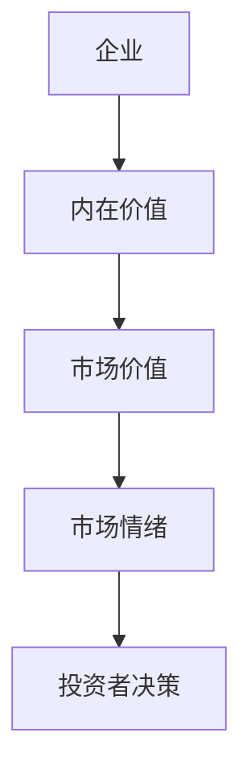
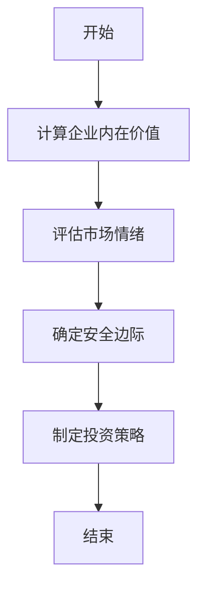
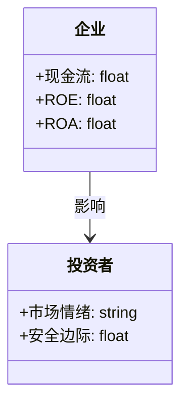

                 


# 价值投资在不同市场条件下的适应性策略

## 关键词：价值投资，市场周期，策略调整，风险管理，投资组合

## 摘要：本文深入探讨了价值投资在不同市场条件下的适应性策略，从理论基础到实战案例，详细分析了如何根据市场环境动态调整投资策略，确保投资组合的稳健增长。通过数学模型、流程图和实际案例，本文为投资者提供了实用的指导。

---

## 第一部分: 价值投资的核心概念与理论基础

### 第1章: 价值投资的基本概念

#### 1.1 价值投资的定义与核心理念

##### 1.1.1 价值投资的起源与发展

价值投资是一种长期投资策略，起源于20世纪初，由本杰明·格雷厄姆和戴维·多德提出。其核心思想是寻找市场低估的股票，通过长期持有实现资本增值。随着市场的发展，价值投资逐步演变为一种成熟的策略，广泛应用于机构和个人投资。

##### 1.1.2 价值投资的核心要素

价值投资的核心要素包括企业基本面分析、估值方法和市场情绪分析。基本面分析关注企业的盈利能力、财务状况和竞争优势；估值方法通过市盈率、市净率等指标评估股票的内在价值；市场情绪分析则帮助投资者识别市场的非理性波动。

##### 1.1.3 价值投资与其他投资策略的对比

与成长投资相比，价值投资更注重企业的当前价值和安全边际；与趋势投资相比，价值投资强调长期持有和逆向思维；与套利投资相比，价值投资风险更低，收益更稳定。

#### 1.2 价值投资的理论基础

##### 1.2.1 股票的内在价值与市场价值

股票的内在价值是基于企业未来现金流的现值，而市场价值则是投资者对股票的估值。内在价值与市场价值的差异为价值投资提供了机会。

##### 1.2.2 股东价值最大化与企业价值评估

股东价值最大化是企业财务的目标，企业价值评估是通过ROE、ROA等指标评估企业的盈利能力。

##### 1.2.3 价值投资与市场周期的关系

价值投资的成功与市场周期密切相关，经济周期的波动会影响股票的内在价值和市场价值，投资者需根据周期调整策略。

---

### 第2章: 价值投资的核心要素与属性

#### 2.1 价值投资的核心要素

##### 2.1.1 企业基本面分析

企业基本面分析包括盈利能力、财务状况和竞争优势。通过分析这些因素，投资者可以评估企业的内在价值。

##### 2.1.2 估值方法与安全边际

估值方法包括市盈率、市净率等指标，安全边际是股票价格低于其内在价值的部分，提供了风险缓冲。

##### 2.1.3 市场情绪与投资者心理

市场情绪和投资者心理影响股票的市场价值，逆向投资是价值投资的重要策略。

#### 2.2 核心概念对比表

| 投资策略 | 核心目标 | 关注点 | 风险 | 适合市场环境 |
|----------|----------|--------|------|--------------|
| 价值投资 | 长期收益 | 内在价值 | 较低 | 市场低估阶段 |
| 成长投资 | 高增长收益 | 营收和利润增长 | 较高 | 高增长阶段 |
| 趋势投资 | 随趋势收益 | 市场趋势 | 中等 | 流动性好阶段 |

#### 2.3 ER实体关系图



---

### 第3章: 价值投资的数学模型与算法原理

#### 3.1 价值投资的数学模型

##### 3.1.1 内在价值计算公式

股票的内在价值可以通过现金流折现模型计算：

$$ V = \frac{CF}{(r - g)} $$

其中，CF为现金流，r为折现率，g为增长率。

##### 3.1.2 市盈率与市净率模型

市盈率公式：

$$ P/E = \frac{Price}{Earnings} $$

市净率公式：

$$ P/B = \frac{Price}{Book\ Value} $$

##### 3.1.3 安全边际计算

安全边际 = 内在价值 - 市场价格

#### 3.2 价值投资的算法流程图



#### 3.3 算法实现代码

```python
def calculate_intrinsic_value(cash_flow, required_return, growth_rate):
    return cash_flow / (required_return - growth_rate)
```

---

### 第4章: 价值投资的系统分析与架构设计

#### 4.1 问题场景介绍

在不同市场条件下，价值投资需要动态调整策略。例如，在市场下跌阶段，增加安全边际；在市场上涨阶段，评估企业价值是否合理。

#### 4.2 系统功能设计

领域模型：



系统架构图：


序列图：

```mermaid
graph TD
    I[投资者] --> M[市场分析模块]: 分析市场情绪
    M --> V[估值模块]: 估值企业价值
    V --> S[策略调整模块]: 判断安全边际
    S --> O[投资组合优化]: 调整投资组合
```

---

## 第二部分: 价值投资在不同市场条件下的策略调整

### 第5章: 市场周期分析

#### 5.1 经济周期对投资策略的影响

经济周期分为复苏、过热、滞胀和衰退阶段，不同阶段适合不同的投资策略。

#### 5.2 不同市场阶段的特征

- **复苏阶段**：企业盈利增长，适合价值投资。
- **过热阶段**：市场高估，需谨慎。
- **滞胀阶段**：企业盈利下降，需选择防御性股票。
- **衰退阶段**：寻找价值低估股票。

#### 5.3 市场拐点识别

通过市盈率、市净率等指标识别市场拐点，利用技术分析工具辅助判断。

---

### 第6章: 策略调整方法

#### 6.1 动态再平衡

定期检查投资组合，调整资产配置，保持合理风险和收益。

#### 6.2 行业轮动

根据行业周期和市场趋势，调整投资组合的行业分布。

#### 6.3 仓位管理

根据市场环境调整仓位，控制风险。

---

### 第7章: 风险管理与投资组合优化

#### 7.1 风险控制的重要性

通过分散投资、止损策略和风险对冲控制风险。

#### 7.2 防御性投资组合的构建

选择具有稳定现金流和高分红的企业，降低投资组合的波动性。

#### 7.3 风险管理工具

使用期权、期货等工具对冲市场风险。

---

## 第三部分: 实战案例分析与策略总结

### 第8章: 实战案例分析

#### 8.1 案例背景

选择某行业在经济衰退阶段的公司，分析其价值投资机会。

#### 8.2 投资策略实施

通过基本面分析和估值，制定投资计划。

#### 8.3 案例分析与总结

总结案例中的经验教训，提炼出实用的策略。

---

### 第9章: 总结与展望

#### 9.1 价值投资的总结

价值投资是一种长期有效的策略，需根据市场环境灵活调整。

#### 9.2 展望与建议

建议投资者加强市场分析能力，提升风险管理水平，长期坚持价值投资理念。

---

## 附录

### 术语表

列出文章中使用的专业术语，如内在价值、市盈率等。

### 数据来源

引用数据来源，如经济指标、市场报告等。

### 参考文献

列出参考的书籍、文章和报告。

### 索引

文章内容的索引，方便读者查找。

---

通过以上结构，您可以根据需要撰写详细的内容，确保每个部分都有足够的深度和细节，帮助读者系统地理解和应用价值投资策略。

