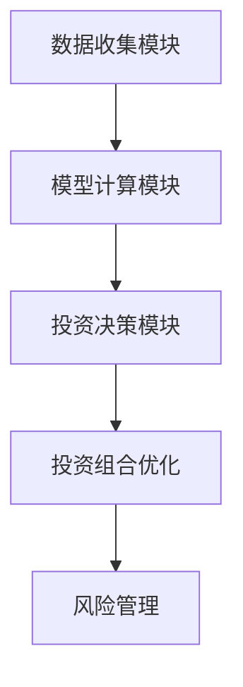

                 

# 价值投资在不同市场环境下的应用

> 关键词：价值投资，市场环境，内在价值，安全边际，投资策略

> 摘要：本文将深入探讨价值投资在不同市场环境下的应用策略，通过分析牛市、熊市和震荡市的特点，结合数学模型和实际案例，详细讲解如何在不同市场环境中应用价值投资的核心理念，包括内在价值计算、安全边际设定、投资组合优化等方法，帮助投资者在复杂多变的市场中做出明智的投资决策。

---

# 第1章：价值投资的核心理念与背景

## 1.1 价值投资的定义与核心理念

### 1.1.1 投资的定义与分类

投资是将资金投入到能够产生收益的资产或项目中，其目的是通过资产增值或收益最大化实现财富增长。投资可以分为股票投资、债券投资、房地产投资等多种形式，而价值投资是一种以基本面分析为基础的长期投资策略。

### 1.1.2 价值投资的核心理念

价值投资的核心理念是通过分析企业的内在价值，寻找市场价格低于内在价值的资产进行投资。这种策略强调安全性和稳健性，注重长期收益而非短期波动。

### 1.1.3 价值投资与其他投资策略的对比

| 投资策略       | 核心关注点       | 时间框架 | 风险承受 |
|----------------|------------------|----------|----------|
| 价值投资       | 内在价值         | 长期      | 低        |
| 技术分析       | 股价波动         | 短期      | 高        |
| 股票投机       | 市场情绪         | 短期      | 高        |

---

## 1.2 价值投资的哲学基础

### 1.2.1 投资的三大要素：安全、稳健与长期

价值投资强调安全边际，即买入价格低于内在价值，以确保在市场波动中能够承受短期亏损的风险。稳健性要求投资者在选择标的时注重基本面，而长期性则意味着投资者需要具备耐心，等待市场回归理性。

### 1.2.2 价值投资与市场波动的关系

市场波动是价值投资者的朋友，而非敌人。当市场价格偏离内在价值时，波动为投资者提供了买入或卖出的机会。价值投资的成功往往依赖于对市场波动的正确理解和利用。

### 1.2.3 投资者心理与行为分析

投资者心理是价值投资的重要组成部分。贪婪和恐惧是人性的弱点，常常导致投资者做出非理性的决策。价值投资者需要克服这些心理障碍，保持理性，专注于长期目标。

---

## 1.3 价值投资在不同市场环境下的表现

### 1.3.1 牛市环境

牛市环境的特点是市场情绪高涨，股价往往高于内在价值。价值投资者在这种环境下需要保持冷静，避免被市场的乐观情绪所左右，寻找那些被低估的标的进行投资。

### 1.3.2 熊市环境

熊市环境的特点是市场情绪低落，股价往往低于内在价值。价值投资者在这种环境下可以积极寻找优质标的，利用市场的恐慌情绪进行布局。

### 1.3.3 震荡市环境

震荡市环境的特点是市场波动剧烈，股价难以预测。价值投资者在这种环境下需要灵活调整策略，注重风险控制，避免过度暴露在波动性较高的资产中。

---

# 第2章：价值投资的核心分析方法

## 2.1 内在价值的计算与安全边际

### 2.1.1 内在价值的定义与计算

内在价值是基于企业基本面分析得出的合理估值，常用的计算方法包括股利折现模型（DDM）和贴现现金流模型（DCF）。

#### 股利折现模型（DDM）

$$ V = \frac{D}{r - g} $$

其中：
- \( V \) 是内在价值
- \( D \) 是预期股利
- \( r \) 是折现率
- \( g \) 是股利增长率

#### 贴现现金流模型（DCF）

$$ V = \sum_{t=1}^{n} \frac{CF_t}{(1 + r)^t} + \frac{TV}{(1 + r)^n} $$

其中：
- \( CF_t \) 是第 \( t \) 年的现金流
- \( TV \) 是终值
- \( r \) 是折现率
- \( n \) 是预测期数

### 2.1.2 安全边际的设定

安全边际是买入价格与内在价值之间的差额，用于缓冲市场波动带来的风险。

$$ \text{安全边际} = \text{内在价值} - \text{买入价格} $$

---

## 2.2 价值投资的数学模型与公式

### 2.2.1 内在价值计算公式

$$ V = \sum_{t=1}^{\infty} \frac{CF_t}{(1 + r)^t} $$

其中：
- \( CF_t \) 是第 \( t \) 年的现金流
- \( r \) 是折现率

### 2.2.2 安全边际计算公式

$$ \text{安全边际} = V - P $$

其中：
- \( V \) 是内在价值
- \( P \) 是市场价格

---

## 2.3 价值投资的系统架构设计

### 2.3.1 系统功能模块

- 数据收集模块：收集企业的财务数据和市场数据。
- 模型计算模块：计算企业的内在价值和安全边际。
- 投资决策模块：根据计算结果制定投资策略。

### 2.3.2 系统架构图

---

# 第3章：价值投资在不同市场环境下的策略

## 3.1 牛市环境下的策略

### 3.1.1 避免过度乐观

在牛市中，市场情绪往往过于乐观，价值投资者需要避免被市场情绪所左右，专注于寻找被低估的标的。

### 3.1.2 选择防御性股票

防御性股票在牛市中表现相对稳定，适合在牛市后期阶段布局。

## 3.2 熊市环境下的策略

### 3.2.1 寻找优质标的

熊市中，优质标的往往被市场低估，是布局的好时机。

### 3.2.2 增加安全边际

在熊市中，增加安全边际可以有效降低投资风险。

## 3.3 震荡市环境下的策略

### 3.3.1 灵活调整投资组合

在震荡市中，投资者需要灵活调整投资组合，以应对市场的不确定性。

### 3.3.2 降低投资风险

通过分散投资和增加安全边际，降低投资风险。

---

# 第4章：价值投资的实战案例

## 4.1 环境配置与数据收集

### 4.1.1 环境配置

安装必要的数据分析工具，如Python、Pandas、NumPy等。

### 4.1.2 数据收集

收集目标公司的财务数据和市场数据，包括收入、利润、现金流等。

## 4.2 投资组合优化与风险管理

### 4.2.1 投资组合优化

通过优化算法，选择最优的投资组合，以最大化收益并最小化风险。

### 4.2.2 风险管理

通过设置止损和止盈，控制投资风险。

---

# 第5章：总结与展望

## 5.1 总结

价值投资是一种长期稳健的投资策略，通过分析企业的内在价值和市场环境，投资者可以在不同市场环境下制定合理的投资策略。

## 5.2 未来展望

随着市场环境的变化，价值投资需要不断适应新的挑战和机遇，投资者需要不断学习和调整策略，以应对复杂多变的市场环境。

---

# 附录：价值投资相关工具与资源

- 数据分析工具：Python、Pandas、NumPy
- 财务分析工具：Excel、Power BI
- 书籍推荐：《价值投资入门》、《投资学原理》

---

通过以上结构和内容，您可以撰写一篇详细的技术博客文章，涵盖价值投资在不同市场环境下的应用策略。

