                 


# 价值投资在不同资产类别中的应用

---

## 关键词：价值投资，资产配置，股票分析，债券投资，房地产评估，商品市场，加密货币

---

## 摘要

价值投资是一种长期有效的投资策略，通过深入分析资产的内在价值，寻找价格被低估的投资机会。本文探讨了价值投资在股票、债券、房地产、商品、货币和加密货币等不同资产类别中的应用。通过分析每个资产类别的特点、估值方法和投资策略，结合系统架构设计和算法原理，本文为投资者提供了全面的指导和实践案例。

---

# 第一部分: 价值投资的基本原理

## 第1章: 价值投资的起源与核心理念

### 1.1 价值投资的起源

价值投资的起源可以追溯到20世纪初，由本杰明·格雷厄姆和戴维·多德提出。他们强调以低于内在价值的价格购买资产，以实现长期稳定的收益。

- **定义**: 价值投资是一种投资策略，通过分析资产的内在价值，寻找市场价格低于其真实价值的投资机会。

- **核心理念**: 
  - 资产的内在价值是其未来现金流的现值。
  - 市场价格波动为价值投资者提供了以折扣价买入的机会。
  - 长期持有优质资产，避免频繁交易。

- **与其他策略的区别**: 
  - 技术分析依赖价格和成交量的波动，而价值投资注重基本面分析。
  - 主动交易策略追求短期收益，而价值投资注重长期回报。

### 1.2 价值投资的核心概念

价值投资的核心概念包括内在价值、安全边际和竞争优势。

- **内在价值**: 资产未来现金流的现值，是其真实价值的衡量标准。
- **安全边际**: 购买价格低于内在价值的部分，提供了保护投资者免受市场波动影响的缓冲区。
- **竞争优势**: 企业具备的长期竞争优势，如品牌、技术或成本优势，确保其能够持续创造价值。

### 1.3 价值投资与其他投资策略的区别

- **技术分析**: 基于价格和成交量预测市场走势，而价值投资注重基本面分析。
- **指数投资**: 通过投资指数基金分散风险，而价值投资追求超额收益。
- **成长投资**: 侧重于高增长企业，而价值投资关注低估值企业。

---

## 第2章: 价值投资的核心概念

### 2.1 核心概念原理

价值投资的核心原理是通过分析资产的内在价值，寻找价格低于其真实价值的投资机会。

- **内在价值公式**: 
  \[
  V = \sum_{t=1}^{\infty} \frac{C_t}{(1+r)^t}
  \]
  其中，\( V \) 是内在价值，\( C_t \) 是第 \( t \) 年的现金流，\( r \) 是折现率。

### 2.2 核心概念属性特征对比表格

| 概念         | 特性                 | 价值投资视角 |
|--------------|----------------------|---------------|
| 内在价值     | 现金流的现值         | 关键衡量标准 |
| 安全边际     | 购买价格与内在价值的差异 | 投资安全垫     |
| 竞争优势     | 长期竞争优势         | 企业核心竞争力 |

### 2.3 ER实体关系图架构的 Mermaid 流程图

```mermaid
erDiagram
    investor[T投资者] {
        姓名: string
        投资金额: integer
    }
    asset[资产] {
        名称: string
        内在价值: float
        市场价格: float
    }
    strategy[策略] {
        类型: string
        风险: integer
    }
    investor --> strategy : 选择
    strategy --> asset : 应用
    asset --> investor : 评估
```

---

# 第二部分: 股票投资中的价值投资策略

## 第3章: 股票市场的价值投资分析

### 3.1 股票市场的特点

股票市场是投资者进行价值投资的重要场所，具有流动性高、波动性强等特点。

- **流动性**: 买卖方便，市场参与者众多。
- **波动性**: 价格受市场情绪影响较大，为价值投资者提供了低位买入的机会。

### 3.2 价值投资在股票市场中的应用

- **基本面分析**: 通过分析公司的财务报表、盈利能力、成长性和行业地位，评估其内在价值。
- **估值方法**: 使用市盈率（P/E）、市净率（P/B）等指标，判断股票是否被低估。
- **行业分析**: 选择具有长期增长潜力的行业，投资其中的龙头公司。

### 3.3 股票估值方法

- **市盈率（P/E）**: 
  \[
  P/E = \frac{股价}{每股收益}
  \]
  低于行业平均水平的股票可能被低估。

- **市净率（P/B）**: 
  \[
  P/B = \frac{股价}{每股净资产}
  \]
  低于1的股票可能具有投资价值。

### 3.4 股票投资的算法原理

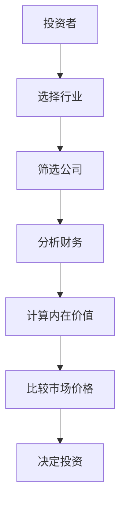

---

## 第4章: 股票投资的系统分析与架构设计方案

### 4.1 问题场景介绍

投资者需要一个系统化的工具，帮助他们分析股票的内在价值，制定投资策略。

### 4.2 系统功能设计（领域模型Mermaid类图）

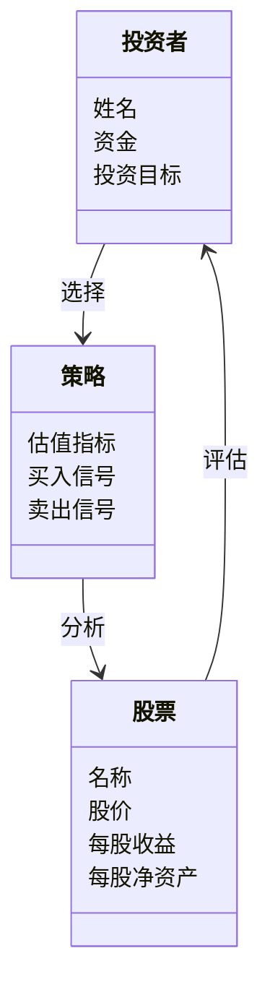

### 4.3 系统架构设计Mermaid架构图


---

# 第三部分: 债券投资中的价值投资

## 第5章: 债券市场的价值投资分析

### 5.1 债券市场的特点

债券市场提供相对稳定的收益，适合风险厌恶型投资者。

- **安全性**: 债券通常具有较高的安全性，违约风险较低。
- **收益性**: 利息固定，收益相对稳定。

### 5.2 价值投资在债券市场中的应用

- **信用评级**: 分析债券发行方的信用状况，选择评级高的债券。
- **利率风险**: 考虑债券的期限和当前利率水平，避免利率上升带来的价格下跌风险。

### 5.3 债券估值方法

- **到期收益率（YTM）**: 
  \[
  YTM = \left( \frac{C + \left( F - P \right)}{n} \right)
  \]
  其中，\( C \) 是每年的利息，\( F \) 是面值，\( P \) 是当前价格，\( n \) 是期限。

### 5.4 债券投资的算法原理

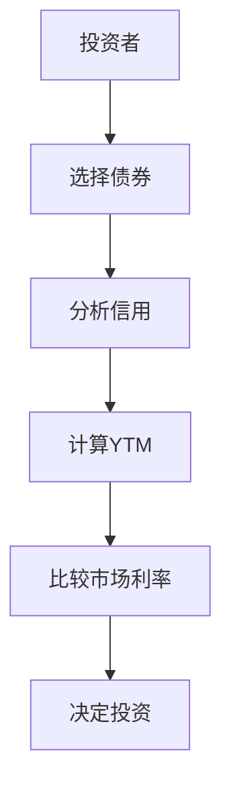

---

## 第6章: 债券投资的系统分析与架构设计方案

### 6.1 问题场景介绍

投资者需要一个系统来分析债券的信用风险和利率风险，制定投资策略。

### 6.2 系统功能设计（领域模型Mermaid类图）

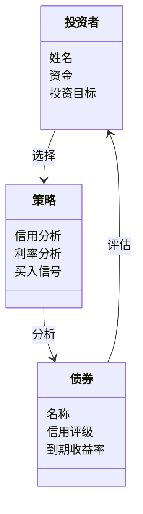

### 6.3 系统架构设计Mermaid架构图


---

# 第四部分: 房地产投资中的价值投资

## 第7章: 房地产市场的价值投资分析

### 7.1 房地产市场的特点

房地产市场具有高价值、低流动性、周期性等特点。

- **高价值**: 房地产是长期财富的重要组成部分。
- **低流动性**: 房地产买卖需要时间和资源，流动性较低。

### 7.2 价值投资在房地产市场中的应用

- **区域分析**: 选择经济发展良好、人口增长迅速的区域。
- **价值评估**: 使用市场比较法或收益法评估房地产的内在价值。

### 7.3 房地产估值方法

- **市场比较法**: 比较类似房地产的交易价格，确定评估对象的合理价格。
- **收益法**: 通过预测未来的租金收入，计算房地产的现值。

### 7.4 房地产投资的算法原理

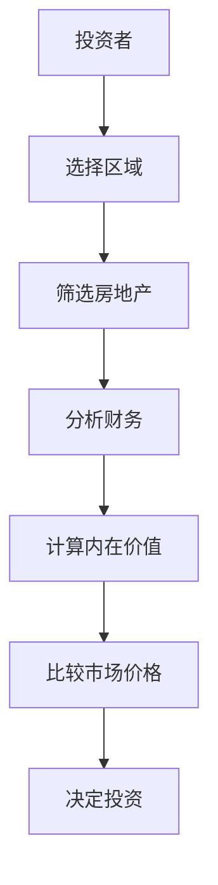

---

## 第8章: 房地产投资的系统分析与架构设计方案

### 8.1 问题场景介绍

投资者需要一个系统来分析房地产的区域经济和价值评估，制定投资策略。

### 8.2 系统功能设计（领域模型Mermaid类图）

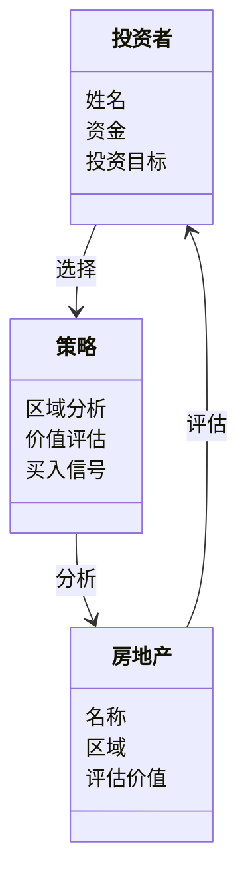

### 8.3 系统架构设计Mermaid架构图


---

# 第五部分: 商品投资中的价值投资

## 第9章: 商品市场的价值投资分析

### 9.1 商品市场的特点

商品市场具有周期性、波动性强等特点。

- **周期性**: 商品价格受供需关系和宏观经济因素影响，呈现周期性波动。
- **波动性强**: 商品价格受市场情绪影响较大，波动性高。

### 9.2 价值投资在商品市场中的应用

- **宏观经济分析**: 分析宏观经济指标，如GDP、通胀率等，判断商品价格走势。
- **库存管理**: 关注商品库存水平，判断供需关系。

### 9.3 商品估值方法

- **相对估值法**: 比较商品价格与历史价格，判断是否被高估或低估。
- **宏观经济模型**: 使用宏观经济模型预测商品价格走势。

### 9.4 商品投资的算法原理

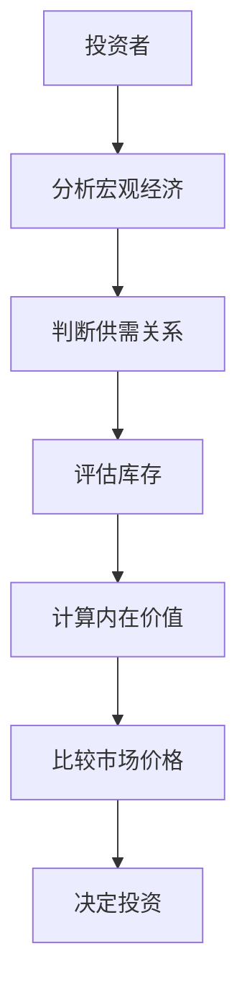

---

## 第10章: 商品投资的系统分析与架构设计方案

### 10.1 问题场景介绍

投资者需要一个系统来分析商品的宏观经济因素和库存水平，制定投资策略。

### 10.2 系统功能设计（领域模型Mermaid类图）

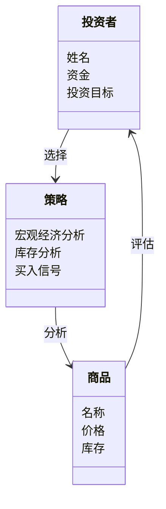

### 10.3 系统架构设计Mermaid架构图


---

# 第六部分: 货币和外汇投资中的价值投资

## 第11章: 货币和外汇市场的价值投资分析

### 11.1 货币和外汇市场的特点

货币和外汇市场是全球最大的金融市场，具有高流动性和高波动性。

- **高流动性**: 汇率波动频繁，交易量大。
- **高波动性**: 汇率受宏观经济和政治因素影响，波动性强。

### 11.2 价值投资在货币和外汇市场中的应用

- **货币政策分析**: 关注各国央行的货币政策，判断货币的强弱趋势。
- **经济指标分析**: 通过GDP、通胀率、就业率等指标，判断货币的经济基本面。

### 11.3 货币投资的算法原理

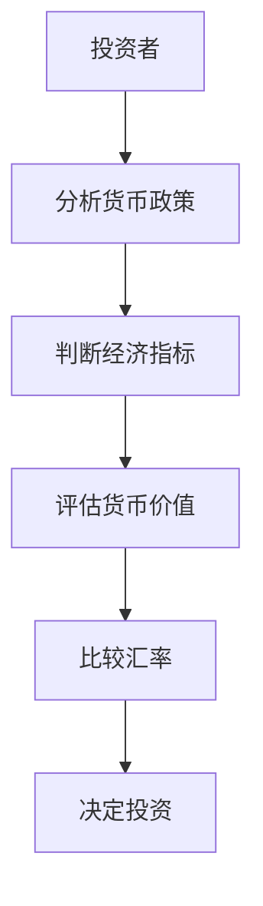

---

## 第12章: 货币和外汇投资的系统分析与架构设计方案

### 12.1 问题场景介绍

投资者需要一个系统来分析货币的宏观经济因素和经济指标，制定投资策略。

### 12.2 系统功能设计（领域模型Mermaid类图）

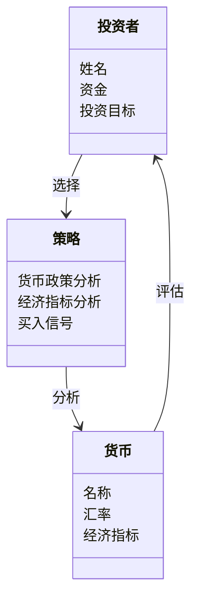

### 12.3 系统架构设计Mermaid架构图


---

# 第七部分: 加密货币投资中的价值投资

## 第13章: 加密货币市场的价值投资分析

### 13.1 加密货币市场的特点

加密货币市场具有高波动性、去中心化等特点。

- **高波动性**: 加密货币价格波动剧烈，受市场情绪影响大。
- **去中心化**: 加密货币基于区块链技术，去中心化的特性降低了信任风险。

### 13.2 价值投资在加密货币市场中的应用

- **技术分析**: 分析区块链的技术优势和未来发展潜力。
- **市场分析**: 关注市场容量、用户增长和交易量等指标。

### 13.3 加密货币估值方法

- **技术评估**: 分析区块链的技术成熟度和创新性。
- **市场评估**: 关注加密货币的市场容量和用户基础。

### 13.4 加密货币投资的算法原理

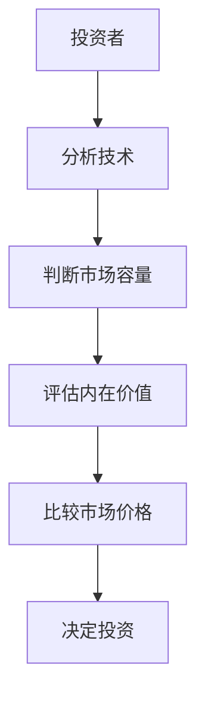

---

## 第14章: 加密货币投资的系统分析与架构设计方案

### 14.1 问题场景介绍

投资者需要一个系统来分析加密货币的技术和市场因素，制定投资策略。

### 14.2 系统功能设计（领域模型Mermaid类图）

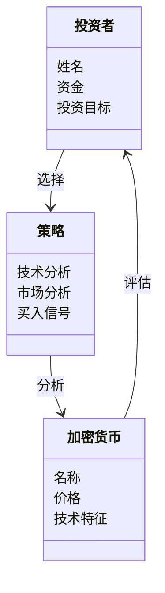

### 14.3 系统架构设计Mermaid架构图


---

# 第八部分: 价值投资的综合应用

## 第15章: 不同资产类别间的配置策略

### 15.1 资产配置的重要性

资产配置是价值投资成功的关键，通过合理分配资金在不同资产类别中，降低风险，提高收益。

- **风险分散**: 将资金分配到不同资产类别，降低单一资产带来的风险。
- **收益优化**: 根据市场环境调整资产配置，捕捉不同资产的收益机会。

### 15.2 资产配置的策略

- **固定比例**: 根据个人风险偏好设定各类资产的固定比例。
- **动态调整**: 根据市场变化和内在价值评估，动态调整资产配置。

### 15.3 资产配置的数学模型

- **马科维茨优化模型**: 
  \[
  \text{最小化} \sigma^2 \text{，在给定的期望收益下}
  \]
  其中，\( \sigma^2 \) 是投资组合的方差。

---

## 第16章: 风险管理与价值投资

### 16.1 风险管理的重要性

风险管理是价值投资成功的关键，通过控制风险，确保投资组合的稳定性和可持续性。

- **风险识别**: 识别投资中的各种风险，如市场风险、流动性风险和信用风险。
- **风险控制**: 通过分散投资、设定止损点等方式，控制投资风险。

### 16.2 风险管理策略

- **分散投资**: 将资金分配到不同资产类别和行业中，降低风险。
- **止损策略**: 设定止损点，避免重大损失。
- **定期复盘**: 定期评估投资组合的表现，调整投资策略。

---

## 第17章: 价值投资的长期视角

### 17.1 长期投资的重要性

价值投资是一种长期投资策略，通过长期持有优质资产，实现财富的稳步增长。

- **复利效应**: 长期投资能够充分利用复利效应，实现财富的指数增长。
- **市场波动**: 长期视角下，短期市场波动对长期收益影响较小。

### 17.2 长期投资的策略

- **持续学习**: 保持对市场和企业的学习，不断提升投资能力。
- **长期持有**: 长期持有优质资产，避免频繁交易带来的成本和风险。

---

## 第18章: 价值投资的未来展望

### 18.1 数字化与智能化

随着科技的发展，价值投资将更加依赖于数据分析和人工智能技术。

- **大数据分析**: 利用大数据技术，分析更多的市场信息，发现投资机会。
- **人工智能**: 使用机器学习技术，预测市场走势，优化投资策略。

### 18.2 全球化与多元化

全球化背景下，投资者需要更加多元化地配置资产，降低风险。

- **全球化投资**: 投资于全球市场，分散风险，捕捉更多投资机会。
- **多元化配置**: 将资金分配到不同国家和地区的资产，降低区域风险。

---

## 第19章: 价值投资的综合应用

### 19.1 综合应用的策略

- **跨资产配置**: 将资金分配到股票、债券、房地产、商品等不同资产类别中，实现风险分散和收益优化。
- **长期视角**: 保持长期投资心态，避免短期波动的干扰。

### 19.2 综合应用的案例

- **案例分析**: 某投资者将资金分配到股票、债券和房地产，通过长期持有优质资产，实现财富的稳步增长。

---

## 第20章: 价值投资的总结与展望

### 20.1 总结

价值投资是一种长期有效的投资策略，通过深入分析资产的内在价值，寻找价格被低估的投资机会。本文详细探讨了价值投资在不同资产类别中的应用，为投资者提供了系统的指导和实践案例。

### 20.2 展望

随着科技的发展和市场的变化，价值投资将面临新的挑战和机遇。投资者需要不断学习和适应，利用新技术和新方法，优化投资策略，实现长期稳定的收益。

---

## 最佳实践 Tips

- **分散投资**: 将资金分配到不同资产类别和行业中，降低风险。
- **长期持有**: 保持长期投资心态，避免频繁交易带来的成本和风险。
- **持续学习**: 保持对市场和企业的学习，不断提升投资能力。

---

## 总结

价值投资是一种长期有效的投资策略，通过深入分析资产的内在价值，寻找价格被低估的投资机会。本文详细探讨了价值投资在股票、债券、房地产、商品、货币和加密货币等不同资产类别中的应用，结合系统架构设计和算法原理，为投资者提供了全面的指导和实践案例。未来，随着科技的发展和市场的变化，价值投资将面临新的挑战和机遇，投资者需要不断学习和适应，优化投资策略，实现长期稳定的收益。

---

**注**：以上内容为详细的技术博客文章结构和部分章节内容，完整的文章将涵盖每个章节的详细分析和具体实施步骤，确保内容丰富、逻辑清晰、结构完整。

