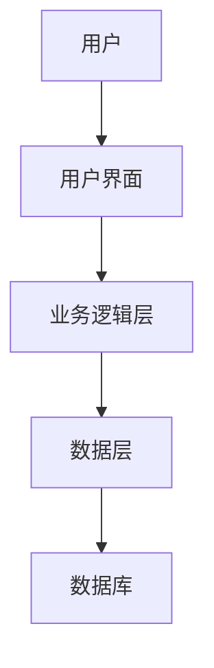

                 


# 价值投资在房地产市场的应用：REITs的机遇与风险

## 关键词：
- 价值投资、房地产市场、REITs、风险管理、投资策略

## 摘要：
本文探讨了价值投资在房地产市场中的应用，重点分析了房地产投资信托基金（REITs）的投资机遇与风险。文章从价值投资的基本原理出发，结合REITs的运作机制，详细阐述了REITs在房地产投资中的优势与挑战。通过案例分析、风险管理策略和技术分析，本文为投资者提供了基于价值投资理念的REITs投资策略和风险控制方法。

---

## 第一部分: 价值投资与房地产市场的基础

### 第1章: 价值投资的基本概念

#### 1.1 价值投资的定义与核心理念
- **价值投资的起源与发展**  
  - 价值投资的起源：本杰明·格雷厄姆与戴维·多德的理论基础。
  - 价值投资的核心理念：寻找市场定价低于内在价值的投资标的。
- **价值投资的核心原则**  
  - 质量优先：选择具有强大基本面的企业。
  - 安全边际：买入价格低于内在价值。
  - 长期持有：耐心等待市场回归理性。
- **价值投资在房地产市场的适用性**  
  - 房地产市场的周期性与价值投资的契合点。

#### 1.2 价值投资与房地产市场的关联
- **房地产市场的周期性分析**  
  - 房地产市场的周期：复苏期、成长期、成熟期、衰退期。
  - 价值投资在不同周期中的策略调整。
- **房地产市场的核心驱动因素**  
  - 经济指标（GDP、利率、就业率）。
  - 人口增长与城市化进程。
  - 政策环境（房地产调控、税收政策）。

### 第2章: REITs的基本概念与运作机制

#### 2.1 REITs的定义与特点
- **REITs的定义**  
  - 房地产投资信托基金（REITs）：一种通过发行股份募集资金，投资于房地产项目并获得收益的金融工具。
- **REITs的核心特点**  
  - 流动性高：投资者可以通过二级市场买卖REITs份额。
  - 透明度高：定期披露财务信息，便于投资者分析。
  - 投资门槛低：通过购买REITs，中小投资者可以间接投资房地产市场。
- **REITs与传统房地产投资的区别**  
  - 传统房地产投资：直接购买房地产资产，流动性低，管理成本高。
  - REITs：通过信托基金形式，投资者可以分散投资，降低风险。

#### 2.2 REITs的运作机制
- **REITs的组织结构**  
  - REITs的管理结构：管理公司、托管银行、审计机构。
  - REITs的收益分配机制：定期分红，通常为季度或年度分红。
- **REITs的市场运作流程**  
  - 发行REITs：通过公开招股或私募方式募集资金。
  - 投资管理：管理团队负责房地产项目的投资、开发与运营。
  - 分红与收益分配：定期向投资者分配收益。

### 第3章: 房地产市场的基本分析

#### 3.1 房地产市场的核心要素
- **房地产市场的周期性分析**  
  - 房地产市场的周期性波动对REITs的影响。
  - 不同周期中REITs的表现差异。
- **房地产市场的核心驱动因素**  
  - 经济因素：GDP增长率、利率水平、通货膨胀率。
  - 人口因素：人口增长、城市化率、家庭结构变化。
  - 政策因素：房地产调控政策、土地供应政策、税收政策。
- **房地产市场的风险因素**  
  - 市场风险：房地产价格波动。
  - 利率风险：利率上升对房地产贷款成本的影响。
  - 流动性风险：房地产资产的变现能力。

#### 3.2 REITs在房地产市场中的角色
- **REITs在房地产投资中的地位**  
  - REITs为投资者提供了一种间接投资房地产市场的渠道。
  - REITs通过专业化管理，降低投资者的管理成本。
- **REITs对房地产市场的促进作用**  
  - 提高房地产市场的流动性。
  - 优化资源配置，推动房地产市场健康发展。
- **REITs与房地产市场波动的关系**  
  - REITs价格波动与房地产市场价格波动的相关性。
  - REITs作为房地产市场风向标的理论与实践。

---

## 第二部分: 价值投资在REITs中的应用

### 第4章: 价值投资策略在REITs中的应用

#### 4.1 价值投资策略的核心要素
- **价值投资的选股标准**  
  - 公司基本面分析：收入、利润、现金流。
  - 市盈率（P/E）、市净率（P/B）等估值指标。
- **价值投资的估值方法**  
  - 股权自由现金流模型：DCF模型。
  - 内在价值计算：基于未来现金流的折现。
- **价值投资的风险控制**  
  - 安全边际：买入价格与内在价值的折扣率。
  - 组合投资：分散投资以降低风险。

#### 4.2 REITs的价值投资筛选标准
- **REITs的财务指标分析**  
  - 净资产收益率（ROE）、股息率、杠杆率。
  - 偿债能力分析：流动比率、速动比率。
- **REITs的市场地位评估**  
  - 市场占有率：REITs在房地产市场的影响力。
  - 管理团队能力：管理公司的经验与业绩。
- **REITs的管理团队评价**  
  - 管理团队的历史业绩。
  - 管理团队的战略规划能力。

### 第5章: REITs投资的案例分析

#### 5.1 典型REITs投资案例
- **美国市场的REITs投资案例**  
  - 美国房地产市场的特点。
  - 典型REITs的投资策略与收益。
- **亚洲市场的REITs投资案例**  
  - 亚洲房地产市场的特点。
  - 典型REITs的投资策略与收益。
- **欧洲市场的REITs投资案例**  
  - 欧洲房地产市场的特点。
  - 典型REITs的投资策略与收益。

#### 5.2 REITs投资的成功与失败经验
- **成功投资的经验总结**  
  - 选择具有强大基本面的REITs。
  - 长期持有，避免短期波动干扰。
- **失败投资的教训分析**  
  - 过度依赖单一市场或资产类型。
  - 忽视风险管理，导致重大损失。
- **REITs投资的未来趋势**  
  - 全球化趋势：跨国配置REITs资产。
  - 数字化趋势：科技赋能REITs投资。

---

## 第三部分: REITs投资的风险管理

### 第6章: REITs投资的风险评估

#### 6.1 REITs投资的主要风险
- **市场风险**  
  - 房地产市场价格波动对REITs的影响。
  - 经济周期对REITs收益的影响。
- **利率风险**  
  - 利率上升对REITs价格的影响。
  - 利率下降对REITs收益的影响。
- **流动性风险**  
  - REITs市场的流动性风险。
  - 二级市场交易的流动性影响。

#### 6.2 REITs风险的量化分析
- **风险的度量方法**  
  - 风险价值（VaR）：衡量投资组合的最大潜在损失。
  - 信用风险模型：评估REITs的信用风险。
- **风险的分散策略**  
  - 跨资产配置：通过配置不同资产类型降低风险。
  - 跨地域配置：通过配置不同地区的REITs分散风险。
- **风险的对冲机制**  
  - 利用金融衍生品对冲风险。
  - 通过多元化的投资组合降低风险。

### 第7章: REITs投资的风险控制策略

#### 7.1 风险控制的基本原则
- **风险控制的目标**  
  - 降低投资组合的整体风险。
  - 优化投资回报与风险的匹配。
- **风险控制的工具**  
  - 金融衍生品：期货、期权、掉期。
  - 投资组合多样化：配置不同资产类别和地域。
- **风险控制的流程**  
  - 风险识别：识别潜在风险因素。
  - 风险评估：评估风险的严重程度。
  - 风险应对：制定应对策略并实施。

#### 7.2 风险控制的具体实施
- **风险识别与评估**  
  - 通过数据分析识别潜在风险。
  - 通过情景分析评估风险影响。
- **风险应对策略**  
  - 利用多元化投资降低风险。
  - 通过金融衍生品对冲风险。
  - 通过定期再平衡优化投资组合。

---

## 第四部分: 价值投资在REITs中的技术分析

### 第8章: 技术分析在REITs投资中的应用

#### 8.1 技术分析的基本原理
- **技术分析的定义**  
  - 通过分析历史价格数据预测未来价格走势。
  - 技术分析的核心假设：市场行为反映所有信息、价格走势具有趋势性、历史模式会重复。
- **技术分析的核心工具**  
  - K线图：显示价格的开盘价、收盘价、最高价和最低价。
  - 移动平均线（MA）：显示价格的平均趋势。
  - 相对强弱指数（RSI）：衡量价格的超买或超卖状态。
  - 布林格带（Bollinger Bands）：衡量价格的波动范围。

#### 8.2 技术分析在REITs投资中的应用
- **趋势分析**  
  - 上升趋势：REITs价格持续上涨。
  - 下降趋势：REITs价格持续下跌。
  - 横盘整理：REITs价格在一定区间内波动。
- **形态分析**  
  - 头肩形：价格走势形成头肩形态，预示趋势反转。
  - 双底形态：价格走势形成双底形态，预示趋势反转。
  - 矩形形态：价格走势形成矩形形态，预示趋势延续。
- **技术指标分析**  
  - MACD指标：衡量价格的动量变化。
  - 威廉指标（W%R）：衡量价格的超买或超卖状态。
  - 布林格带：衡量价格的波动范围。

### 第9章: REITs投资的系统架构设计

#### 9.1 系统功能设计
- **功能需求分析**  
  - 数据采集：采集REITs的市场数据、财务数据。
  - 数据分析：分析REITs的投资价值、风险。
  - 投资决策：根据分析结果制定投资策略。
- **系统架构设计**  
  - 数据层：数据存储、数据处理。
  - 业务逻辑层：数据分析、投资策略。
  - 用户界面层：用户交互、结果展示。
- **系统流程设计**  
  - 数据采集→数据处理→数据分析→投资决策。

#### 9.2 系统架构图


#### 9.3 系统交互设计
- **用户交互流程**  
  - 用户输入投资目标。
  - 系统分析REITs的投资价值。
  - 系统生成投资建议。
  - 用户根据建议进行投资决策。

---

## 第五部分: 项目实战与总结

### 第10章: 项目实战

#### 10.1 环境配置
- **开发环境**  
  - 操作系统：Windows/Mac/Linux。
  - 编程语言：Python。
  - 数据库：MySQL/PostgreSQL。
  - 开发工具：Jupyter Notebook、VS Code。

#### 10.2 核心实现源代码
```python
import pandas as pd
import numpy as np
import matplotlib.pyplot as plt
from sklearn import linear_model

# 数据加载
data = pd.read_csv('reits.csv')

# 数据清洗
data = data.dropna()

# 数据分析
X = data[['GDP增长率', '利率', '人口增长率']]
y = data['REITs价格']

# 线性回归模型
model = linear_model.LinearRegression()
model.fit(X, y)

# 模型预测
predictions = model.predict(X)

# 模型可视化
plt.scatter(X, y, color='blue')
plt.plot(X, predictions, color='red')
plt.xlabel('自变量')
plt.ylabel('REITs价格')
plt.show()
```

#### 10.3 代码解读与分析
- **数据加载与清洗**  
  - 使用pandas库加载数据，并删除缺失值。
- **数据分析**  
  - 选择相关变量进行分析，建立线性回归模型。
- **模型预测**  
  - 使用线性回归模型预测REITs价格。
- **模型可视化**  
  - 通过散点图和回归线展示模型预测结果。

#### 10.4 案例分析与解读
- **案例分析**  
  - 以某REITs为例，分析其历史价格走势。
  - 利用技术分析方法预测其未来价格走势。
- **结果分析**  
  - 对模型预测结果进行分析，评估模型的准确性。
  - 根据分析结果制定投资策略。

### 第11章: 总结与展望

#### 11.1 总结
- **文章总结**  
  - 本文探讨了价值投资在房地产市场中的应用，重点分析了REITs的投资机遇与风险。
  - 通过技术分析和系统设计，为投资者提供了基于价值投资理念的REITs投资策略和风险控制方法。

#### 11.2 展望
- **未来研究方向**  
  - 进一步研究REITs的投资策略，结合人工智能技术优化投资模型。
  - 探讨REITs与其他资产类别的配置策略，降低整体投资风险。
- **投资建议**  
  - 投资者应根据自身风险承受能力，选择适合自己的REITs投资策略。
  - 通过多元化投资和风险管理，提高投资收益，降低投资风险。

---

## 关键词：
- 价值投资、房地产市场、REITs、风险管理、投资策略

---

## 小结
本文通过系统的分析和案例研究，探讨了价值投资在REITs投资中的应用，为投资者提供了基于价值投资理念的REITs投资策略和风险控制方法。通过技术分析和系统设计，本文为投资者提供了优化的投资策略和风险管理工具，帮助投资者在房地产市场中实现长期稳定的收益。

