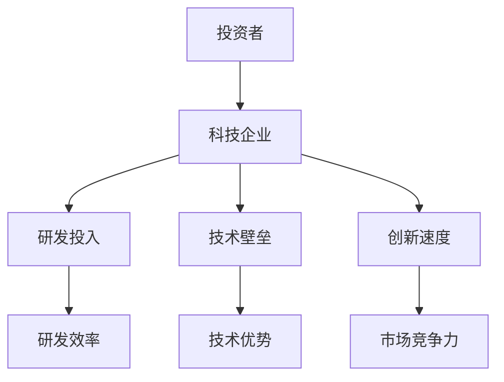
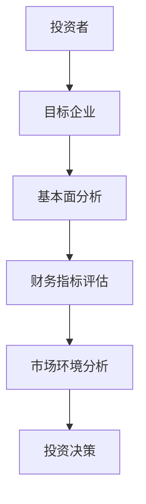

                 


# 价值投资在新经济时代的适应与变革

---

## 关键词：  
价值投资、新经济、科技驱动、数字化转型、风险管理、投资策略、系统架构

---

## 摘要：  
在新经济时代，价值投资面临前所未有的挑战与变革。随着科技的飞速发展、商业模式的创新以及全球市场的不确定性增加，传统的价值投资方法需要进行适应性调整。本文从价值投资的核心理论出发，结合新经济时代的特点，探讨其在投资策略、风险管理、技术驱动等维度的适应与变革。通过系统分析与案例研究，本文提出了价值投资在新经济时代的重构路径，并为投资者提供了实践指南。

---

## 第1章：价值投资的核心理论与新经济时代的背景

### 1.1 价值投资的基本概念与核心原则

#### 1.1.1 核心概念术语说明
- **价值投资**：一种以基本面分析为基础的投资策略，旨在通过识别市场低估的资产，实现长期稳健的收益。
- **内在价值**：资产在合理市场条件下所能体现的真实价值，与市场波动无关。
- **安全边际**：投资标的市场价格与内在价值之间的差距，用以降低投资风险。

#### 1.1.2 问题背景与描述
- 传统价值投资在新经济时代的适用性受到质疑。
- 新经济时代的特点包括科技驱动、数据化、平台化、全球化等，这些变化对价值投资的逻辑和方法提出了挑战。

#### 1.1.3 问题解决与边界
- 价值投资的核心逻辑依然有效，但需要结合新经济的特点进行调整。
- 边界：价值投资适用于具备清晰商业模式、竞争优势和财务健康的企业。

#### 1.1.4 核心要素与概念结构
- 核心要素：内在价值、安全边际、长期视角。
- 概念结构：通过ER实体关系图展示企业、市场、投资者三者的关系。

**ER实体关系图：**

```mermaid
er
  entity 投资者 {
    id: string
    名称: string
    投资目标: string
  }
  entity 企业 {
    id: string
    名称: string
    内在价值: float
  }
  entity 市场 {
    id: string
    名称: string
    市场价格: float
  }
  relationship 投资者 -> 企业: 投资
  relationship 企业 -> 市场: 上市
  relationship 投资者 -> 市场: 交易
```

---

## 第2章：价值投资的核心指标与分析框架

### 2.1 财务指标分析与数学模型

#### 2.1.1 核心指标与公式
- **市盈率（P/E）**：市场价格 / 每股收益。
  $$ P/E = \frac{P}{E} $$
- **市净率（P/B）**：市场价格 / 每股净资产。
  $$ P/B = \frac{P}{B} $$
- **ROE（净资产收益率）**：净利润 / 净资产。
  $$ ROE = \frac{净利润}{净资产} $$

#### 2.1.2 财务分析的算法原理
- 使用Python代码对企业的财务指标进行分析，识别潜在投资机会。

**Python代码示例：**

```python
import pandas as pd

def calculate_financial_ratios(financial_data):
    # 计算市盈率
    pe_ratio = financial_data['市场价格'] / financial_data['每股收益']
    # 计算市净率
    pb_ratio = financial_data['市场价格'] / financial_data['每股净资产']
    # 计算ROE
    roe = financial_data['净利润'] / financial_data['净资产']
    return {'市盈率': pe_ratio, '市净率': pb_ratio, 'ROE': roe}

# 示例数据
financial_data = {
    '市场价格': 100,
    '每股收益': 20,
    '每股净资产': 50,
    '净利润': 10,
    '净资产': 50
}

# 调用函数
ratios = calculate_financial_ratios(financial_data)
print(ratios)
```

---

## 第3章：新经济时代的价值投资挑战与变革

### 3.1 新经济时代的投资机会与风险

#### 3.1.1 科技驱动与数字化转型
- 科技企业的价值评估需要考虑研发投入、技术壁垒和创新速度。
- 通过系统架构设计，构建科技企业的价值评估模型。

**系统架构设计图：**



---

## 第4章：价值投资策略的重构与风险管理

### 4.1 新经济时代的投资策略重构

#### 4.1.1 传统价值投资与新经济策略的对比

| 对比维度 | 传统价值投资 | 新经济价值投资 |
|----------|---------------|----------------|
| 核心指标 | P/E、P/B、ROE | 市场份额、研发投入、创新速度 |
| 投资逻辑 | 内在价值驱动 | 科技驱动与商业模式创新 |
| 风险管理 | 安全边际优先 | 组合分散与动态调整 |

---

## 第5章：价值投资的系统分析与案例研究

### 5.1 投资决策框架

#### 5.1.1 投资决策流程图



---

## 第6章：价值投资在新经济时代的最佳实践

### 6.1 投资者行为建议

- **持续学习**：关注科技趋势和行业动态。
- **风险管理**：构建多元化的投资组合。
- **技术驱动**：利用大数据和人工智能辅助决策。

---

## 第7章：价值投资的未来展望

### 7.1 新经济时代的价值投资趋势

- **技术驱动**：人工智能将助力价值投资的量化分析。
- **全球化**：跨国投资将成为主流。
- **可持续发展**：ESG（环境、社会、治理）投资将越来越重要。

---

## 第8章：项目实战与代码实现

### 8.1 价值投资模型的Python实现

#### 8.1.1 环境安装
- 安装Python、Pandas、NumPy等工具。

#### 8.1.2 核心代码实现

```python
import pandas as pd

def calculate_intrinsic_value(finance_data):
    # 计算自由现金流
    fcf = finance_data['净利润'] - finance_data['资本支出']
    # 计算加权平均资本成本
    wacc = (finance_data['债务成本'] * finance_data['债务占比'] +
            finance_data['股权成本'] * finance_data['股权占比'])
    # 计算内在价值
    intrinsic_value = fcf / (wacc - finance_data['增长率'])
    return intrinsic_value

# 示例数据
finance_data = {
    '净利润': 100,
    '资本支出': 30,
    '债务成本': 5,
    '债务占比': 0.3,
    '股权成本': 10,
    '股权占比': 0.7,
    '增长率': 3
}

# 调用函数
iv = calculate_intrinsic_value(finance_data)
print(f"内在价值: {iv}")
```

---

## 第9章：总结与建议

### 9.1 小结

- 价值投资在新经济时代的适应与变革需要投资者具备更强的分析能力和技术驱动的决策支持。
- 通过系统化的方法和工具，投资者可以更好地应对新经济带来的挑战。

### 9.2 注意事项

- 投资者需保持对市场的敏感性，及时调整投资策略。
- 风险管理是价值投资的核心，无论时代如何变化。

### 9.3 拓展阅读

- 建议深入学习科技企业的财务分析方法和人工智能在投资中的应用。

---

**全文完。**

