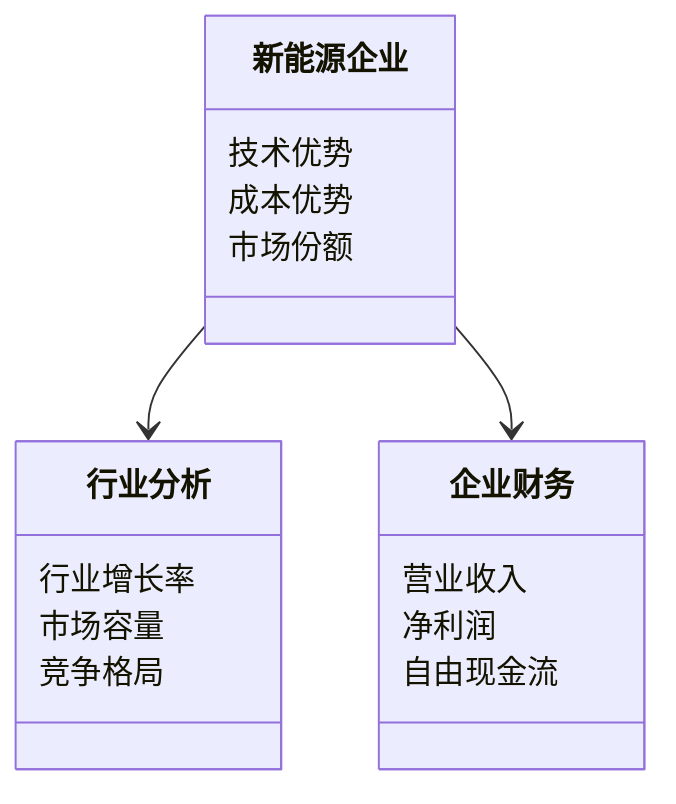
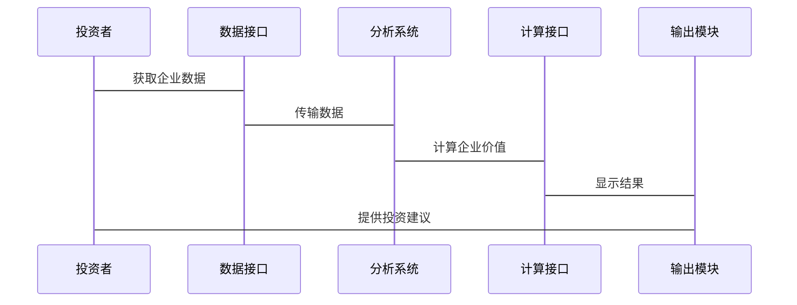

                 


# 价值投资在新能源领域的应用：绿色革命的机遇

---

## 关键词

- 价值投资、新能源、绿色革命、现金流折现模型、DCF、新能源行业、投资分析

---

## 摘要

价值投资作为一种长期有效的投资策略，在新能源领域展现出了独特的优势。随着全球能源结构向清洁化、低碳化转型，新能源行业正处于高速发展阶段，蕴藏着巨大的投资机遇。本文从价值投资的核心理念出发，结合新能源行业的特点，分析了如何在绿色革命中应用价值投资策略，揭示了新能源行业的内在价值与投资潜力。通过现金流折现模型（DCF）等工具，本文详细探讨了新能源企业的估值方法，并结合实际案例，展示了如何通过深入分析企业基本面，挖掘具有长期竞争优势的新能源企业。同时，本文也指出了新能源投资中的风险与挑战，并提出了应对策略。

---

# 第1章：价值投资的基本概念与背景

## 1.1 价值投资的核心理念

### 1.1.1 价值投资的定义与起源

价值投资是一种以企业内在价值为核心的投资策略，由本杰明·格雷厄姆和戴维·多德在20世纪初提出。其核心理念是寻找市场价格低于其内在价值的股票进行投资，长期持有，等待市场价值回归。与短期交易相比，价值投资更注重企业的基本面分析，强调安全边际和长期盈利能力。

### 1.1.2 价值投资的核心原则

1. **安全边际**：买入价格低于内在价值，确保投资的安全性。
2. **长期视角**：关注企业的长期盈利能力，而非短期市场波动。
3. **深入分析**：对企业财务状况、行业地位和竞争优势进行详细评估。

### 1.1.3 价值投资与成长投资的区别

| 特性 | 价值投资 | 成长投资 |
|------|-----------|----------|
| 投资目标 | 价格低于内在价值 | 价格反映高增长潜力 |
| 投资期限 | 长期持有 | 短期或中期收益 |
| 风险偏好 | 低风险偏好 | 高风险偏好 |

---

## 1.2 新能源行业的现状与发展

### 1.2.1 新能源行业的定义与范围

新能源行业是指以太阳能、风能、生物质能等可再生能源为主要能源来源，以及新能源汽车、智能电网等新兴领域组成的产业。随着全球能源转型的推进，新能源行业正成为推动全球经济可持续发展的重要力量。

### 1.2.2 新能源行业的现状分析

1. **全球能源转型加速**：各国政府纷纷制定碳中和目标，推动新能源产业发展。
2. **技术进步与成本下降**：光伏、风电等技术不断进步，成本持续下降，竞争力增强。
3. **政策支持**：政府通过补贴、税收优惠等政策，支持新能源行业的发展。

### 1.2.3 绿色革命的背景与意义

绿色革命指的是通过发展清洁能源和绿色技术，减少对化石能源的依赖，降低碳排放，实现可持续发展的过程。新能源行业作为绿色革命的核心领域，具有广阔的发展前景和投资机遇。

---

## 1.3 价值投资在新能源领域的应用前景

### 1.3.1 新能源行业的投资机会

1. **可再生能源领域**：太阳能、风能等可再生能源的市场需求持续增长。
2. **新能源汽车领域**：电动汽车及其产业链的投资机会显著。
3. **智能电网与储能领域**：储能技术和智能电网的发展为行业带来新机遇。

### 1.3.2 价值投资在新能源领域的独特优势

1. **长期视角**：价值投资适合新能源行业的长期发展趋势。
2. **安全边际**：通过深入分析企业基本面，寻找具有竞争优势的标的。
3. **抵御短期波动**：新能源行业的波动性较高，价值投资能够帮助投资者避免短期市场波动的影响。

### 1.3.3 新能源行业的投资风险与挑战

1. **技术风险**：技术更新换代快，企业技术落后可能导致竞争优势丧失。
2. **政策风险**：政策变化可能影响行业的发展和企业的盈利能力。
3. **市场竞争风险**：行业竞争加剧可能导致企业盈利能力下降。

---

## 1.4 本章小结

本章从价值投资的核心理念出发，分析了新能源行业的现状与发展，探讨了价值投资在新能源领域的应用前景。通过对比价值投资与成长投资，明确了价值投资在新能源行业的独特优势和风险挑战，为后续分析奠定了基础。

---

# 第2章：新能源行业的核心概念与分析框架

## 2.1 新能源行业的核心要素

### 2.1.1 新能源行业的关键驱动因素

1. **技术进步**：技术创新是推动新能源行业发展的核心动力。
2. **政策支持**：政府政策对行业的发展起着至关重要的作用。
3. **市场需求**：消费者对新能源产品的需求是行业发展的基础。

### 2.1.2 新能源企业的核心竞争力

1. **技术优势**：企业的技术水平和创新能力是核心竞争力的关键。
2. **成本优势**：规模化生产和技术进步带来的成本优势。
3. **品牌影响力**：知名品牌在市场中的竞争优势。

### 2.1.3 新能源行业的周期性与波动性

新能源行业具有较强的周期性，受政策、技术、市场需求等多种因素影响，行业波动性较大。价值投资者需要关注行业的周期性，选择在行业低谷期介入，获取超额收益。

---

## 2.2 价值投资在新能源领域的核心概念

### 2.2.1 企业内在价值的定义与计算

企业内在价值是指企业在未来自由现金流的现值，反映了企业的实际价值。计算内在价值需要考虑企业的未来现金流和适当的折现率。

### 2.2.2 股东权益与企业价值的关系

股东权益是企业价值的重要组成部分，反映了股东对企业的所有权和收益权。企业价值包括股东权益、债权等其他权益。

### 2.2.3 现金流折现模型（DCF）的应用

现金流折现模型（DCF）是价值投资中常用的估值工具，通过将企业未来现金流折现，计算企业的内在价值。公式为：

$$ \text{企业价值} = \sum_{t=1}^{n} \frac{\text{自由现金流}}{(1 + r)^t} + \frac{\text{终值}}{(1 + r)^n} $$

其中，$r$ 是折现率，$n$ 是预测期数。

---

## 2.3 新能源行业的估值方法

### 2.3.1 市盈率（P/E）与市净率（P/B）分析

市盈率（P/E）= 股价 / 每股净利润，市净率（P/B）= 股价 / 每股净资产。

1. **市盈率分析**：适用于盈利稳定的企业，反映市场对企业的估值。
2. **市净率分析**：适用于资产密集型企业，反映市场对企业的资产价值评估。

### 2.3.2 现金流折现模型（DCF）的应用

通过DCF模型，可以准确评估新能源企业的内在价值，尤其是那些具有稳定现金流和明确增长前景的企业。

### 2.3.3 市场价值与内在价值的对比

市场价值是市场价格，内在价值是企业的实际价值。当市场价格低于内在价值时，投资机会出现。

---

## 2.4 本章小结

本章详细介绍了新能源行业的核心要素，分析了价值投资在新能源领域的核心概念，探讨了新能源行业的估值方法，为后续分析提供了理论基础。

---

# 第3章：现金流折现模型（DCF）的原理与应用

## 3.1 DCF模型的核心原理

### 3.1.1 自由现金流的定义与计算

自由现金流=净利润 + 折旧和摊销 - 资本支出。

### 3.1.2 折现率的确定与影响

折现率通常采用加权平均资本成本（WACC）计算，公式为：

$$ \text{WACC} = w_d \times k_d + w_l \times k_l $$

其中，$w_d$ 是债务权重，$k_d$ 是债务成本，$w_l$ 是股权权重，$k_l$ 是股权成本。

### 3.1.3 终值的计算与假设

终值=自由现金流×(1+g)/(WACC - g)，其中$g$是永续增长率。

---

## 3.2 DCF模型的步骤与流程

1. **预测未来现金流**：基于企业历史数据和行业趋势，预测未来5-10年的自由现金流。
2. **确定折现率**：计算企业的加权平均资本成本（WACC）。
3. **计算终值**：假设永续增长率，计算终值。
4. **计算企业价值**：将未来现金流折现并加总，加上终值，得到企业价值。
5. **评估安全边际**：将企业价值与市场价格对比，判断投资机会。

---

## 3.3 DCF模型的Python实现

以下是一个简单的DCF模型Python代码示例：

```python
def discounted_cash_flow(cash_flows, discount_rate):
    present_value = sum(cash_flow / (1 + discount_rate) ** t for t, cash_flow in enumerate(cash_flows))
    return present_value

# 示例数据
cash_flows = [100, 150, 200, 250, 300]
discount_rate = 0.08

pv = discounted_cash_flow(cash_flows, discount_rate)
print(f"现值总和为：{pv}")
```

---

## 3.4 本章小结

本章通过详细讲解现金流折现模型（DCF）的原理和应用，展示了如何在新能源企业估值中使用DCF模型，帮助投资者准确评估企业的内在价值。

---

# 第4章：系统分析与架构设计方案

## 4.1 问题场景介绍

新能源行业的复杂性要求投资者采用系统化的分析方法，通过构建系统的分析框架，全面评估企业的基本面。

---

## 4.2 项目介绍

以某新能源汽车企业为例，分析其财务状况、行业地位和竞争优势。

---

## 4.3 系统功能设计

### 4.3.1 领域模型（Mermaid 类图）



---

## 4.4 系统架构设计（Mermaid 架构图）


---

## 4.5 系统接口设计

1. 数据接口：获取企业财务数据和行业数据。
2. 计算接口：计算企业价值和市场价格。
3. 输出接口：展示分析结果和投资建议。

---

## 4.6 系统交互（Mermaid 序列图）



---

## 4.7 本章小结

本章通过系统分析和架构设计，展示了如何构建一个全面的新能源企业分析框架，为投资者提供了系统的分析工具和方法。

---

# 第5章：项目实战与案例分析

## 5.1 环境安装

安装Python和必要的数据分析库，如Pandas、NumPy、Matplotlib。

## 5.2 核心实现源代码

以下是一个新能源企业估值的Python代码示例：

```python
import pandas as pd
import numpy as np

def calculate_intrinsic_value(fcf, discount_rate, growth_rate, terminal_growth_rate):
    present_value = 0
    for year in range(1, 6):
        cash_flow = fcf * (1 + growth_rate) ** (year - 1)
        present_value += cash_flow / (1 + discount_rate) ** year
    terminal_value = fcf * (1 + terminal_growth_rate) / (discount_rate - terminal_growth_rate)
    present_value += terminal_value / (1 + discount_rate) ** 5
    return present_value

# 示例数据
fcf = 100
discount_rate = 0.08
growth_rate = 0.1
terminal_growth_rate = 0.02

intrinsic_value = calculate_intrinsic_value(fcf, discount_rate, growth_rate, terminal_growth_rate)
print(f"企业内在价值为：{intrinsic_value}")
```

---

## 5.3 代码应用解读与分析

通过代码计算企业的内在价值，与市场价格进行对比，判断是否存在投资机会。

---

## 5.4 实际案例分析

以某新能源企业为例，详细分析其财务数据、行业地位和竞争优势，计算其内在价值，评估投资机会。

---

## 5.5 本章小结

本章通过项目实战和案例分析，展示了如何将价值投资的理念应用于新能源企业的估值，帮助投资者找到具有长期竞争优势的投资标的。

---

# 第6章：最佳实践与投资策略

## 6.1 最佳实践 tips

1. **深入研究企业基本面**：重点关注企业的财务状况、行业地位和技术优势。
2. **关注政策变化**：及时了解政府政策对行业的影响。
3. **分散投资风险**：通过分散投资降低行业波动带来的风险。

## 6.2 小结

总结全文，强调价值投资在新能源领域的应用潜力和投资机会。

## 6.3 注意事项

1. **避免过度依赖模型**：DCF模型只是一个工具，需要结合实际情况进行调整。
2. **关注行业周期性**：新能源行业波动较大，需关注周期性风险。
3. **保持长期视角**：价值投资需要耐心，避免短期波动干扰。

## 6.4 拓展阅读

推荐相关书籍和文献，帮助读者进一步深入学习价值投资和新能源行业的知识。

---

# 结语

通过本文的分析，我们可以看到，价值投资在新能源领域具有广阔的应用前景。通过深入分析企业的内在价值，投资者可以在绿色革命中找到具有长期竞争优势的投资标的。尽管新能源行业存在一定的风险和挑战，但通过科学的分析和合理的投资策略，投资者可以在新能源领域实现稳健的投资回报。

--- 

**注：由于篇幅限制，本文仅为部分章节内容的示例，完整文章可根据上述大纲进一步扩展和详细撰写。**

