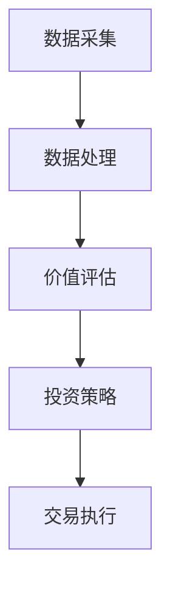
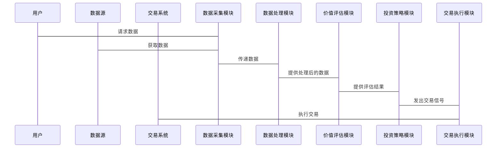

                 


# 价值投资在波动市场中的优势

> 关键词：价值投资、波动市场、投资策略、风险管理、内在价值、安全边际、长期视角

> 摘要：价值投资作为一种长期有效的投资策略，在波动剧烈的市场环境中展现出独特的优势。本文从价值投资的核心概念出发，分析其在波动市场中的优势，探讨如何通过系统性分析和数学模型构建投资决策系统，帮助投资者在动荡的市场中实现稳健收益。文章详细阐述了价值投资的内在价值计算、安全边际评估、风险管理策略，并通过实际案例分析，展示了如何在波动市场中识别低估资产，把握投资机会，实现长期稳健的投资回报。

---

## 第一部分: 价值投资基础与波动市场的特点

### 第1章: 价值投资的基本概念

#### 1.1 价值投资的定义与核心理念
- **价值投资的起源与发展**  
  价值投资的起源可以追溯到本杰明·格雷厄姆和戴维·多德的工作，他们提出了“安全边际”和“内在价值”等核心概念。价值投资在20世纪30年代经济大萧条期间形成，并在之后的几十年中不断发展和完善，成为投资领域的重要流派。

- **价值投资的核心原则**  
  价值投资的核心原则包括：  
  1. 购买低于内在价值的资产。  
  2. 长期持有优质资产，避免频繁交易。  
  3. 注重企业的基本面分析，而非市场情绪。  

- **价值投资与其它投资策略的对比**  
  与技术分析、趋势投资等策略相比，价值投资更注重企业的内在价值，强调长期持有和安全边际。以下是一个对比分析表格：

| 投资策略 | 核心关注点 | 适用场景 | 优势 | 局限性 |
|----------|------------|----------|------|--------|
| 价值投资 | 内在价值、基本面分析 | 波动市场、长期投资 | 抗波动性强，风险可控 | 对短期波动不敏感，可能错失短期收益 |
| 技术分析 | 价格走势、成交量 | 短期交易 | 灵活性高 | 易受情绪影响，风险较大 |

#### 1.2 波动市场的特点与投资者行为
- **市场波动的成因分析**  
  市场波动主要由投资者情绪、经济周期、政策变化和市场流动性等因素引起。波动性高的市场通常伴随着资产价格的剧烈波动，这为价值投资者提供了挖掘低估资产的机会。

- **投资者情绪与市场波动的关系**  
  投资者情绪往往呈现周期性波动，从乐观到悲观，再回到乐观。在波动市场中，情绪化决策会导致资产价格的短期偏离，这为价值投资者提供了买入优质资产的时机。

- **波动市场中的常见投资者行为**  
  在波动市场中，投资者常常表现出以下行为：  
  1. 过度交易：频繁买卖以试图捕捉短期收益，增加交易成本。  
  2. 非理性决策：受市场情绪影响，做出冲动性投资决策。  
  3. 羊群效应：跟随市场趋势，缺乏独立判断。  

### 第2章: 价值投资的核心概念与数学模型

#### 2.1 价值投资的核心概念
- **安全边际**  
  安全边际是指资产的市场价格低于其内在价值的部分。安全边际的存在为投资者提供了风险缓冲，确保在市场波动中仍能获得正收益。  

- **内在价值**  
  内在价值是资产在理性分析下应有的价格，通常通过基本面分析计算得出。例如，股票的内在价值可以通过现金流折现模型（DCF）计算：

$$ V = \frac{CF}{r - g} $$

其中，$CF$ 是未来现金流，$r$ 是折现率，$g$ 是现金流增长率。  

- **股价与价值的偏离**  
  股价围绕内在价值波动，当股价低于内在价值时，资产被低估，适合买入；当股价高于内在价值时，资产被高估，适合卖出或避免买入。

#### 2.2 价值投资的数学模型
- **内在价值计算公式**  
  内在价值的计算是价值投资的核心，以下是几种常用的计算模型：

  - **股利折现模型（DDM）**  
    $$ V = \frac{D}{r - g} $$  
    其中，$D$ 是预期股利，$r$ 是折现率，$g$ 是股利增长率。

  - **现金流折现模型（DCF）**  
    $$ V = \sum_{t=1}^{n} \frac{CF_t}{(1+r)^t} + \frac{TVF}{(1+r)^n} $$  
    其中，$CF_t$ 是第$t$年的现金流，$TVF$ 是终值，$r$ 是折现率，$n$ 是预测期。

- **股价波动与市场预期的关系**  
  股价波动反映了市场对资产未来现金流的预期变化。当市场预期上升时，股价可能上涨；当市场预期下降时，股价可能下跌。价值投资者关注的是资产的内在价值，而非市场预期的变化。

- **波动市场中资产定价的模型**  
  在波动市场中，资产价格可能偏离其内在价值。以下是一个简单的资产定价模型，考虑了市场情绪和内在价值的影响：

$$ P = V + \epsilon $$  

其中，$P$ 是市场价格，$V$ 是内在价值，$\epsilon$ 是情绪偏差。

### 第3章: 波动市场中的投资者行为分析

#### 3.1 投资者情绪与决策偏差
- **心理偏差对投资决策的影响**  
  心理偏差是投资者在波动市场中常见的行为偏差，例如：

  - **过度自信效应**：投资者倾向于过高估计自己的能力，可能导致过度交易和风险误判。  
  - **沉没成本谬误**：投资者在已经亏损的情况下，继续投入以“回本”，这在波动市场中尤为常见。  
  - **从众心理与羊群效应**：投资者跟随市场趋势，缺乏独立判断，容易导致集体非理性行为。

- **市场情绪周期与投资者行为**  
  市场情绪通常呈现周期性变化，从乐观到悲观，再回到乐观。投资者在情绪高涨时往往高估资产价值，而在情绪低落时低估资产价值。价值投资者可以在情绪低谷时买入低估资产，在情绪高涨时卖出高估资产。

- **非理性决策的典型案例**  
  例如，在2008年金融危机期间，许多投资者因恐慌性抛售股票，导致进一步亏损。而价值投资者则利用市场的恐慌情绪，买入优质资产，最终获得了长期收益。

#### 3.2 波动市场中的认知偏差
- **过度自信效应**  
  投资者往往过度自信于自己的分析能力，导致决策失误。例如，认为自己能够准确预测市场走势，从而进行频繁交易。

- **沉没成本谬误**  
  投资者在已经亏损的情况下，继续投入以“回本”，这在波动市场中尤为常见。例如，买入一只股票后股价下跌，但投资者继续加仓，试图通过补仓来降低平均成本。

- **从众心理与羊群效应**  
  投资者在市场波动时容易受到从众心理影响，跟随市场趋势，缺乏独立判断。例如，在市场上涨时盲目追涨，市场下跌时盲目杀跌。

### 第4章: 价值投资在波动市场中的优势

#### 4.1 价值投资的优势分析
- **长期视角的优势**  
  价值投资注重长期收益，而非短期波动。在波动市场中，短期波动可能掩盖资产的长期价值，但长期视角可以帮助投资者抵御短期波动的干扰。

- **价值投资的抗波动性**  
  价值投资通过寻找低估资产，构建高质量的投资组合，能够在市场波动中保持相对稳定。例如，在市场下跌时，优质资产的内在价值不会随市场波动而改变，因此能够为投资者提供安全边际。

- **高质量企业的稳定性**  
  价值投资者倾向于投资具有强大基本面和竞争优势的企业，这些企业在市场波动中表现相对稳定。例如，在经济衰退期间，具有强大现金流和低杠杆的企业能够更好地抵御市场冲击。

#### 4.2 波动市场中价值投资的策略
- **寻找低估资产的方法**  
  价值投资者通过基本面分析，寻找市场价格低于内在价值的资产。例如，计算股票的市盈率（P/E）和市净率（P/B），并与行业平均水平进行比较，找出低估股票。

- **把握市场波动中的机会**  
  在市场波动时，资产价格可能偏离其内在价值，为价值投资者提供了买入低估资产的机会。例如，在市场恐慌时，优质资产可能被抛售，导致价格低于内在价值。

- **价值投资的风险控制**  
  价值投资者通过分散投资、严格选股和长期持有，降低投资组合的波动性。例如，投资于多个行业的优质企业，避免过度集中于单一行业或资产。

### 第5章: 价值投资的系统性分析与架构设计

#### 5.1 投资决策系统的构建
- **数据收集与分析模块**  
  该模块负责收集和分析市场数据，包括股票价格、财务报表、行业数据等。通过数据清洗和预处理，提取有用的信息，为后续分析提供支持。

- **价值评估模型的设计**  
  价值评估模型是投资决策系统的核心，负责计算资产的内在价值和安全边际。常用的模型包括现金流折现模型（DCF）、股利折现模型（DDM）等。

- **投资策略的制定与执行**  
  投资策略基于价值评估结果制定，包括买入低估资产、卖出高估资产等。策略执行模块负责根据策略信号生成交易指令，实现自动化的投资决策。

#### 5.2 系统架构设计
- **系统功能模块划分**  
  投资决策系统可以划分为以下几个功能模块：

  - 数据采集模块：负责从多个数据源获取市场数据，包括股票价格、财务报表、经济指标等。  
  - 数据处理模块：对获取的数据进行清洗、转换和预处理，为后续分析提供支持。  
  - 价值评估模块：基于处理后的数据，计算资产的内在价值和安全边际。  
  - 投资策略模块：根据价值评估结果，制定投资策略并生成交易信号。  
  - 交易执行模块：根据交易信号，执行买入或卖出操作，实现自动化交易。

- **系统架构的Mermaid图**  
  下图展示了投资决策系统的总体架构：



- **系统接口设计**  
  系统接口包括数据接口、交易接口和用户接口。数据接口用于与数据源对接，交易接口用于与交易系统对接，用户接口用于与用户交互。

- **系统交互的Mermaid序列图**  
  下图展示了系统交互的流程：



### 第6章: 项目实战

#### 6.1 环境安装
- **Python环境的安装与配置**  
  需要安装Python 3.8及以上版本，并安装必要的库，包括Pandas、NumPy、Matplotlib等。

#### 6.2 系统核心实现源代码
- **数据采集模块**  
  使用Python的`requests`库和`BeautifulSoup`库从网页上采集数据：

  ```python
  import requests
  from bs4 import BeautifulSoup

  def fetch_data(url):
      response = requests.get(url)
      soup = BeautifulSoup(response.text, 'html.parser')
      data = []
      for row in soup.find_all('tr'):
          cols = row.find_all('td')
          data.append([col.text for col in cols])
      return data
  ```

- **价值评估模块**  
  使用现金流折现模型（DCF）计算股票的内在价值：

  ```python
  def calculate_intrinsic_value(free_cash_flow, discount_rate, growth_rate):
      return free_cash_flow / (discount_rate - growth_rate)
  ```

- **交易策略模块**  
  根据价值评估结果制定交易策略：

  ```python
  def generate_trading_signals(intrinsic_value, market_price):
      if market_price < intrinsic_value:
          return 'Buy'
      elif market_price > intrinsic_value * 1.1:
          return 'Sell'
      else:
          return 'Hold'
  ```

#### 6.3 代码应用解读与分析
- **数据采集模块**  
  该模块负责从多个数据源获取股票价格和财务数据，包括Yahoo Finance、Google Finance等。

- **价值评估模块**  
  该模块使用现金流折现模型计算股票的内在价值，并与市场价格进行比较，找出低估资产。

- **交易策略模块**  
  该模块根据价值评估结果生成交易信号，指导投资者在合适时机买入或卖出资产。

#### 6.4 实际案例分析
- **案例背景**  
  在2020年新冠疫情爆发期间，许多股票价格大幅下跌，提供了价值投资的机会。

- **案例分析**  
  以某科技公司为例，假设其自由现金流为$100 million，折现率为8%，增长率为5%。根据DCF模型，其内在价值为：

  $$ V = \frac{100}{0.08 - 0.05} = 3333.33 \text{百万美元} $$

  当市场价格低于3333.33百万美元时，该股票被低估，适合买入。

#### 6.5 项目小结
- **项目总结**  
  通过系统性分析和数学模型，价值投资者可以在波动市场中识别低估资产，制定有效的投资策略。

- **项目成果**  
  本文构建了一个基于Python的投资决策系统，能够自动采集数据、评估价值、制定策略并执行交易，为价值投资者提供了有力工具。

---

## 第二部分: 最佳实践与小结

### 第7章: 最佳实践与注意事项

#### 7.1 最佳实践
- **持续学习与更新**  
  市场环境不断变化，投资者需要持续学习，更新投资策略和分析方法。

- **风险管理**  
  通过分散投资、严格选股和严格的风险控制，降低投资组合的波动性。

- **长期持有**  
  长期持有优质资产，避免频繁交易，降低交易成本和税务负担。

#### 7.2 小结
- **价值投资的优势**  
  价值投资通过长期视角、基本面分析和安全边际，在波动市场中展现出独特的优势。

- **系统性分析的重要性**  
  通过系统性分析和数学模型，投资者可以更好地识别低估资产，制定有效的投资策略。

### 第8章: 注意事项与拓展阅读

#### 8.1 投资注意事项
- **避免情绪化决策**  
  投资者应避免受市场情绪影响，坚持长期视角和基本面分析。

- **严格遵守投资纪律**  
  投资者应严格遵守投资计划，避免随意更改策略。

- **持续监控与调整**  
  投资组合需要定期监控和调整，确保与市场环境和投资目标一致。

#### 8.2 拓展阅读
- **经典书籍**  
  - 《聪明的投资者》——本杰明·格雷厄姆  
  - 《投资之道》——彼得·林奇  
  - 《价值投资实战策略》——李录  

- **在线资源**  
  - 投资论坛：如雪球、东方财富网等。  
  - 数据源：Yahoo Finance、Google Finance等。  
  - 学术论文：如《价值投资与市场波动》等。

---

## 第三部分: 价值投资在波动市场中的应用实例

### 第9章: 价值投资的数学模型与实际应用

#### 9.1 内在价值的计算与实际应用
- **内在价值的计算**  
  以某公司为例，假设其自由现金流为$50 million，折现率为8%，增长率为5%。根据DCF模型，其内在价值为：

  $$ V = \frac{50}{0.08 - 0.05} = 1666.67 \text{百万美元} $$

- **市场价格与投资决策**  
  当市场价格低于1666.67百万美元时，该股票被低估，适合买入；当市场价格高于1666.67百万美元时，该股票被高估，适合卖出。

#### 9.2 波动市场中的风险管理
- **风险控制策略**  
  通过分散投资、严格选股和严格的风险管理，降低投资组合的波动性。例如，投资于多个行业的优质企业，避免过度集中于单一行业或资产。

- **资产配置策略**  
  根据市场环境和投资目标，调整资产配置比例。例如，在市场波动加剧时，增加防御性资产的比例，减少高风险资产的比例。

### 第10章: 价值投资的系统性分析与实战应用

#### 10.1 系统性分析的必要性
- **系统性分析的优势**  
  系统性分析能够帮助投资者更好地识别低估资产，制定有效的投资策略，并在波动市场中保持稳定收益。

- **系统性分析的步骤**  
  1. 数据采集与处理。  
  2. 价值评估与分析。  
  3. 投资策略制定与执行。  
  4. 投资组合监控与调整。  

#### 10.2 实战应用案例
- **案例分析**  
  以某科技公司为例，假设其自由现金流为$100 million，折现率为8%，增长率为5%。根据DCF模型，其内在价值为：

  $$ V = \frac{100}{0.08 - 0.05} = 3333.33 \text{百万美元} $$

  当市场价格为3000百万美元时，该股票被低估，适合买入；当市场价格为3500百万美元时，该股票被高估，适合卖出。

---

## 第四部分: 价值投资的未来发展与挑战

### 第11章: 价值投资的未来发展趋势

#### 11.1 人工智能与大数据在价值投资中的应用
- **人工智能在价值投资中的应用**  
  人工智能技术可以帮助投资者更好地分析数据、识别低估资产，并制定有效的投资策略。例如，使用机器学习算法预测市场趋势，识别潜在投资机会。

- **大数据在价值投资中的应用**  
  大数据技术可以为投资者提供更全面、更准确的市场信息，帮助投资者更好地进行基本面分析。例如，通过分析社交媒体数据，了解市场情绪的变化。

#### 11.2 价值投资的未来挑战
- **市场环境的变化**  
  随着市场环境的变化，价值投资面临的挑战也在不断变化。例如，市场的波动性可能增加，优质资产的识别难度可能提高。

- **技术进步的挑战**  
  随着技术的进步，价值投资的分析方法也在不断演变。投资者需要不断学习，更新分析工具和方法，以应对新的挑战。

### 第12章: 价值投资的全球视角与跨市场应用

#### 12.1 价值投资的全球视角
- **全球化投资策略**  
  价值投资者可以通过全球化投资策略，分散风险，寻找全球范围内的低估资产。例如，投资于新兴市场的优质企业，可以获得更高的收益。

- **跨市场比较与分析**  
  通过比较不同市场的特点和投资机会，价值投资者可以制定更有效的投资策略。例如，比较美国市场和中国市场，寻找具有比较优势的行业和企业。

#### 12.2 价值投资的跨市场应用
- **跨市场投资的优势**  
  跨市场投资可以帮助投资者分散风险，同时发现更多的投资机会。例如，在中国市场波动较大时，可以投资于相对稳定的海外市场。

- **跨市场投资的挑战**  
  跨市场投资需要投资者具备更广泛的知识和经验，了解不同市场的特点和风险。例如，投资于新兴市场需要考虑政治风险、经济波动等多重因素。

---

## 第五部分: 结语与展望

### 第13章: 结语与未来展望

#### 13.1 结语
- **价值投资的核心理念**  
  价值投资的核心理念是寻找低估资产，长期持有，注重基本面分析。在波动市场中，价值投资的优势更加明显，能够帮助投资者实现稳健收益。

- **系统性分析的重要性**  
  通过系统性分析和数学模型，投资者可以更好地识别低估资产，制定有效的投资策略，并在波动市场中保持稳定收益。

#### 13.2 未来展望
- **技术进步的推动**  
  随着技术的进步，价值投资的分析方法和工具将不断完善，帮助投资者更好地应对市场波动。

- **价值投资的未来发展**  
  价值投资作为长期有效的投资策略，在未来将继续发挥重要作用。随着市场的不断发展，价值投资将更加注重科技创新、可持续发展和全球化布局。

---

# 总结

通过以上章节的详细分析，可以看出价值投资在波动市场中的独特优势。无论是从理论分析还是实际应用，价值投资都能够帮助投资者在波动市场中实现稳健收益。未来，随着技术的进步和市场的不断发展，价值投资将更加注重系统性分析和科技创新，为投资者提供更有效的投资策略和工具。

