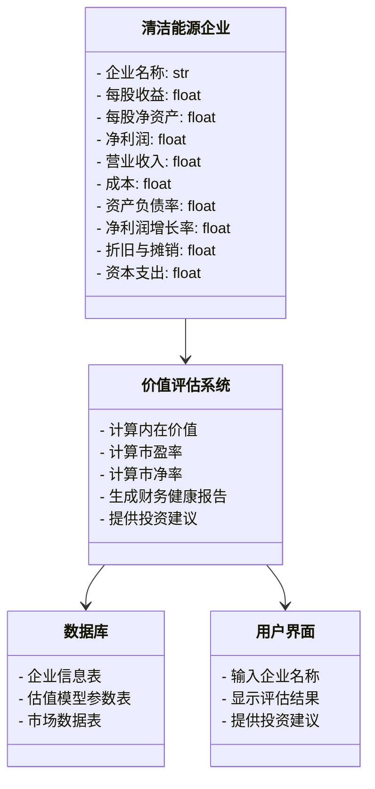
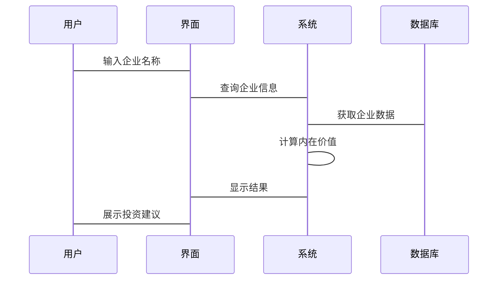

                 


# 价值投资在清洁能源转型中的角色：风险与机遇

> 关键词：价值投资，清洁能源转型，风险与机遇，投资策略，系统架构

> 摘要：本文探讨了价值投资在清洁能源转型中的重要性，分析了清洁能源转型中的风险与机遇，详细讲解了价值投资策略的应用，结合系统架构设计和项目实战，提供了深入的见解和最佳实践。

---

## 第一部分：背景介绍

### 第1章：问题背景与核心概念

#### 1.1 清洁能源转型的背景

随着全球气候变化的加剧和能源需求的增长，清洁能源转型成为全球关注的焦点。清洁能源转型旨在减少化石燃料的使用，转向风能、太阳能等可再生能源，以减少碳排放并实现可持续发展。

##### 1.1.1 全球能源结构的变化

传统能源结构以化石燃料为主，但随着环保压力的增加，清洁能源占比逐步提高。全球能源需求的增长与环保目标的冲突促使各国加速清洁能源转型。

##### 1.1.2 气候变化与可持续发展的需求

气候变化导致的极端天气事件频发，迫使各国政府和企业采取行动，推动清洁能源的使用。可持续发展成为全球共识，清洁能源转型成为实现这一目标的关键。

##### 1.1.3 政策驱动与技术进步

各国政府通过政策支持和法规推动清洁能源的发展，例如碳排放交易机制、可再生能源补贴等。技术进步如太阳能电池效率提升和储能技术的发展，进一步推动了清洁能源的应用。

#### 1.2 价值投资的定义与特点

价值投资是一种长期投资策略，注重企业内在价值，寻找被市场低估的投资标的。

##### 1.2.1 价值投资的核心概念

价值投资由本杰明·格雷厄姆提出，强调以低于内在价值的价格买入优质企业股票。核心在于分析企业的基本面，寻找具有持续竞争优势和良好管理的公司。

##### 1.2.2 价值投资的特点

- 长期投资：关注企业的长期价值，而非短期波动。
- 低估值：寻找市场价格低于内在价值的股票。
- 高质量：投资于财务健康、管理优秀的企业。

##### 1.2.3 与其他投资策略的对比

与成长投资相比，价值投资更注重当前的低估值和安全边际，而成长投资则关注高增长潜力。与指数投资相比，价值投资强调主动选择个股，追求超额收益。

---

## 第二部分：清洁能源转型中的风险与机遇

### 第2章：风险分析

#### 2.1 市场风险

##### 2.1.1 清洁能源市场的波动性

清洁能源市场受政策、技术、经济等因素影响，价格波动较大，投资者需应对市场波动带来的风险。

##### 2.1.2 技术替代风险

技术进步可能导致现有技术迅速过时，投资者需关注技术创新，避免投资于技术落后的企业。

#### 2.2 政策风险

##### 2.2.1 政策不确定性的影响

清洁能源转型依赖于政府政策的支持，政策变动可能影响行业格局，投资者需关注政策变化。

##### 2.2.2 国际贸易与地缘政治风险

国际贸易摩擦和地缘政治冲突可能影响清洁能源供应链，进而影响投资回报。

### 第3章：投资机会

#### 3.1 技术创新带来的机会

##### 3.1.1 新能源技术的突破

技术创新降低了清洁能源的成本，提高了效率，为投资者提供了更多机会。

##### 3.1.2 数字化与智能化的应用

数字化技术如智能电网和能源管理系统的应用，提高了清洁能源系统的效率和稳定性，创造了新的投资机会。

#### 3.2 市场结构变化带来的机会

##### 3.2.1 新能源汽车产业链的崛起

电动汽车的普及带动了电池、充电设施等相关产业的发展，为投资者提供了新的投资领域。

##### 3.2.2 可再生能源发电成本的下降

随着技术进步，可再生能源发电成本不断下降，具有竞争优势，吸引了更多的投资。

---

## 第三部分：价值投资策略的应用

### 第4章：价值投资策略

#### 4.1 价值评估模型

##### 4.1.1 市盈率与市净率的计算

市盈率（P/E）= 股价 / 每股收益

市净率（P/B）= 股价 / 每股净资产

##### 4.1.2 现金流折现法的应用

企业自由现金流（FCFF）= 经营活动现金流 - 净投资

折现率（r）= 无风险利率 + 风险溢价

企业价值 = FCFF / (r - g)

##### 4.1.3 修正现值法（DCF）的应用

DCF模型通过将未来现金流折现，评估企业的内在价值。适用于对具有稳定现金流的企业进行估值。

##### 4.1.4 风险调整贴现率法（RDN）

考虑企业特定风险，调整折现率，以更准确地反映风险因素。

##### 4.1.5 股权自由现金流模型（FCFE）

FCFE = FCFF + 净投资 + 折旧摊销 - 资本支出

股权价值 = FCFE / (r - g)

##### 4.1.6 内在价值计算公式

内在价值 = (净利润 × (1 + g)) / (r - g)

##### 4.1.7 市场价格与内在价值比较

通过比较市场价格与内在价值，寻找被低估的投资标的。

##### 4.1.8 财务指标的交叉验证

结合市盈率、市净率、ROE等指标，全面评估企业价值。

##### 4.1.9 企业竞争优势分析

分析企业的核心竞争力，包括成本优势、技术优势、市场地位等。

##### 4.1.10 财务健康状况分析

评估企业的财务状况，包括资产负债表、利润表和现金流量表。

#### 4.2 投资组合构建

##### 4.2.1 资产配置策略

根据市场情况，动态调整资产配置比例，平衡风险与收益。

##### 4.2.2 风险分散与收益平衡

通过多元化投资，分散行业和地区的风险，平衡投资组合的整体收益。

##### 4.2.3 定期再平衡

定期调整投资组合，确保与市场变化保持一致，优化投资收益。

##### 4.2.4 买入并持有策略

价值投资强调长期持有，避免频繁交易，降低交易成本和税务负担。

##### 4.2.5 安全边际的考虑

在估值模型的基础上，预留安全边际，降低投资风险。

---

## 第五部分：项目实战

### 第5章：项目实战

#### 5.1 环境安装

##### 5.1.1 安装Python和相关库

安装Python 3.x，安装pandas、numpy、scipy、matplotlib等库。

#### 5.2 价值评估模型实现

##### 5.2.1 Python代码实现

```python
import numpy as np
import pandas as pd
import scipy.stats as stats

def calculate_intrinsic_value(eps, growth_rate, discount_rate):
    # 计算内在价值，使用DCF模型
    if eps == 0:
        return 0
    # 假设未来现金流以固定增长率增长
    terminal_growth_rate = 0.02  # 终值增长率，通常低于GDP增长率
    # 计算永续年金现值
    terminal_value = eps * (1 + growth_rate) / (discount_rate - terminal_growth_rate)
    # 计算未来现金流的现值
    present_value = terminal_value / (1 + discount_rate)
    # 计算当前股价
    intrinsic_value = present_value
    return intrinsic_value

# 示例数据
growth_rate = 0.05  # 假设净利润年增长率为5%
discount_rate = 0.08  # 折现率8%
eps = 2  # 每股收益

intrinsic_value = calculate_intrinsic_value(eps, growth_rate, discount_rate)
print(f"计算的内在价值为：{intrinsic_value:.2f}")
```

##### 5.2.2 代码解读与分析

上述代码实现了一个简单的DCF模型，计算企业的内在价值。通过调整增长率、折现率等参数，可以评估不同情况下的内在价值。实际应用中，需要更多的数据和复杂的模型。

##### 5.2.3 案例分析

以某家清洁能源公司为例，计算其内在价值，对比市场价格，判断是否存在低估。

---

## 第六部分：系统分析与架构设计

### 第6章：系统分析与架构设计

#### 6.1 问题场景介绍

设计一个价值评估系统，用于分析清洁能源企业的内在价值，辅助投资决策。

#### 6.2 系统功能设计

##### 6.2.1 领域模型（Mermaid类图）



#### 6.3 系统架构设计（Mermaid架构图）

```mermaid
container 价值评估系统 {
    [数据输入]
    [数据处理]
    [模型计算]
    [结果输出]
}

container 数据库 {
    [企业信息表]
    [估值模型参数表]
    [市场数据表]
}

container 用户界面 {
    [输入界面]
    [结果展示]
}

价值评估系统 --> 数据库
价值评估系统 --> 用户界面
```

#### 6.4 系统接口设计

##### 6.4.1 输入接口

- 企业名称：用于查询企业信息。
- 市场数据：包括股价、成交量等。

##### 6.4.2 输出接口

- 内在价值计算结果。
- 财务健康报告。
- 投资建议。

#### 6.5 系统交互设计（Mermaid序列图）



---

## 第七部分：最佳实践和小结

### 第7章：最佳实践和小结

#### 7.1 投资策略的注意事项

- 保持长期视角，避免短期波动干扰。
- 深入研究企业基本面，确保信息的准确性。
- 定期评估模型，根据市场变化调整策略。

#### 7.2 如何应对风险

- 分散投资，降低单一风险。
- 保持对政策和技术变化的关注。
- 建立安全边际，降低投资风险。

#### 7.3 未来趋势

- 清洁能源技术的持续创新将带来更多投资机会。
- 全球政策支持将继续推动清洁能源发展。
- 数字化和智能化将提升能源系统的效率，带来新的投资方向。

#### 7.4 项目小结

通过本文的分析和实战，读者可以掌握价值投资在清洁能源转型中的应用，理解如何在风险与机遇中寻找投资机会。系统架构设计和项目实战部分提供了具体的实施方法和工具，帮助读者更好地应用价值投资策略。

---

## 第八部分：参考文献和扩展阅读

### 8.1 参考文献

- 格雷厄姆，本杰明. 《The Intelligent Investor》
- 巴菲特，沃伦. 《巴菲特致股东的信》
- 市场分析相关的学术论文和研究报告

### 8.2 拓展阅读

- 清洁能源技术的发展趋势
- 全球能源政策分析
- 可持续投资的伦理与实践

---

通过以上目录和内容，您可以根据需要进一步扩展和撰写具体的章节内容。

