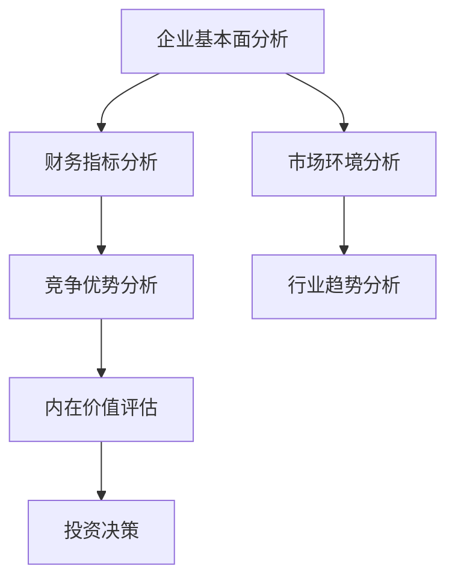
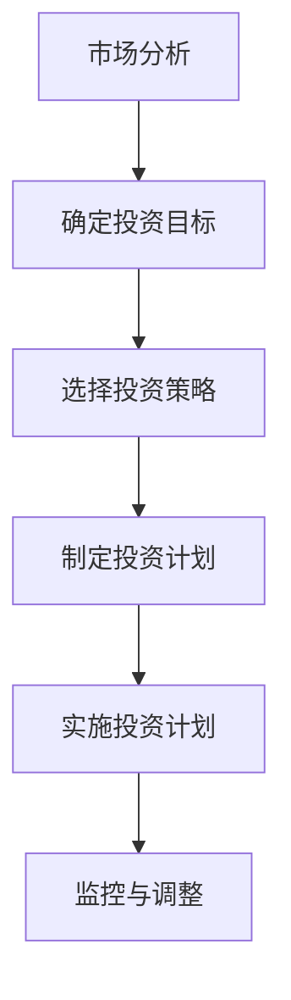
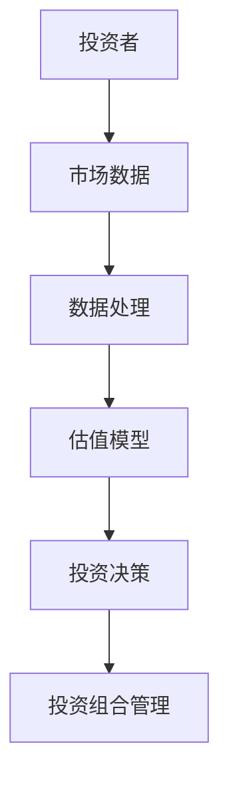

                 


# 价值投资在熊市中的应用：危机中的投资机会

> **关键词**：价值投资、熊市、投资机会、风险管理、长期投资  
> **摘要**：本文探讨了价值投资在熊市中的应用，分析了如何在市场低迷时期识别投资机会，通过安全边际、优质企业识别和估值方法等策略进行投资，并结合风险管理、逆向投资等策略，帮助投资者在危机中实现稳健回报。

---

## 目录大纲

### 第一部分：价值投资基础

#### 第1章：价值投资的核心理念

##### 1.1 价值投资的定义与起源

- **1.1.1 价值投资的定义**
  - 价值投资是通过深入分析企业的基本面，寻找市场价格低于其内在价值的投资标的。
- **1.1.2 价值投资的起源与发展**
  - 价值投资的鼻祖本·格雷厄姆的理论基础。
- **1.1.3 价值投资与其它投资策略的区别**
  - 与成长投资、指数投资的区别。

##### 1.2 熊市的定义与特点

- **1.2.1 熊市的定义**
  - 股市持续下跌，投资者情绪低迷的市场状态。
- **1.2.2 熊市的周期性与影响**
  - 熊市的周期长度和对市场参与者的心理影响。
- **1.2.3 熊市与牛市的区别**
  - 市场情绪、价格走势、投资者行为的对比。

#### 第2章：价值投资的核心原则

##### 2.1 安全边际

- **2.1.1 安全边际的定义**
  - 安全边际 = 内在价值 - 市场价格。
- **2.1.2 安全边际的重要性**
  - 确保在市场波动中能够获得超额收益。
- **2.1.3 如何计算安全边际**
  - 使用市盈率、市净率等指标进行估值，并与市场价格比较。

##### 2.2 长期投资

- **2.2.1 长期投资的意义**
  - 通过时间的推移，企业价值的提升带来投资回报。
- **2.2.2 长期投资的风险与收益**
  - 短期波动的风险较低，长期回报相对稳定。
- **2.2.3 如何选择长期投资标的**
  - 选择具有持续盈利能力和竞争优势的企业。

#### 第3章：优质企业的识别标准

##### 3.1 企业的财务指标分析

- **3.1.1 财务报表分析**
  - 利润表、资产负债表、现金流量表的解读。
- **3.1.2 资产负债表分析**
  - 关注负债率、流动资产与流动负债的比例。
- **3.1.3 利润表分析**
  - 收入增长、净利润率、毛利率的变化。

##### 3.2 企业的竞争优势分析

- **3.2.1 核心竞争力的定义**
  - 企业相较于竞争对手的独特优势，如成本优势、技术优势等。
- **3.2.2 企业的竞争优势分析**
  - 使用 SWOT 分析法评估企业的优劣势。
- **3.2.3 如何评估企业的竞争优势**
  - 行业地位、市场份额、品牌影响力等指标的综合评估。

#### 第4章：价值投资的估值方法

##### 4.1 市盈率法

- **4.1.1 市盈率的定义**
  - 市盈率 = 股价 / 每股净利润。
- **4.1.2 市盈率的计算方法**
  - 通过企业过去几年的平均净利润计算。
- **4.1.3 市盈率的应用**
  - 将目标企业的市盈率与行业平均水平进行比较。

##### 4.2 市净率法

- **4.2.1 市净率的定义**
  - 市净率 = 股价 / 每股净资产。
- **4.2.2 市净率的计算方法**
  - 计算企业净资产的价值。
- **4.2.3 市净率的应用**
  - 适用于银行、房地产等资产密集型行业。

##### 4.3 现金流折现法

- **4.3.1 现金流折现法的定义**
  - 将未来现金流折现到当前价值，评估企业内在价值。
- **4.3.2 现金流折现法的计算方法**
  - 使用DCF模型计算企业价值。
- **4.3.3 现金流折现法的应用**
  - 适用于高成长性企业的估值。

### 第二部分：熊市中的投资策略

#### 第5章：熊市中的投资策略

##### 5.1 逆向投资策略

- **5.1.1 逆向投资的定义**
  - 在市场恐慌时买入，市场乐观时卖出。
- **5.1.2 逆向投资的原理**
  - 利用市场情绪的非理性，寻找被低估的投资标的。
- **5.1.3 逆向投资的实施步骤**
  - 确定估值标准、选择优质企业、分批建仓。

##### 5.2 资产配置策略

- **5.2.1 资产配置的定义**
  - 将资金分配到不同的资产类别中，分散风险。
- **5.2.2 资产配置的重要性**
  - 通过分散投资降低风险。
- **5.2.3 如何进行资产配置**
  - 根据市场环境和个人风险承受能力调整配置比例。

##### 5.3 风险管理策略

- **5.3.1 风险管理的定义**
  - 通过策略和工具控制投资风险。
- **5.3.2 风险管理的方法**
  - 使用止损订单、分散投资、定期评估投资组合。
- **5.3.3 如何控制投资风险**
  - 确定止损点、避免过度集中投资、定期审视投资组合。

#### 第6章：价值投资的长期回报

##### 6.1 长期投资案例分析

- **6.1.1 长期投资的实例**
  - 以某企业为例，分析其长期股价走势与企业价值增长的关系。
- **6.1.2 长期投资的回报表现**
  - 通过历史数据对比，展示价值投资在长期内的收益优势。

##### 6.2 风险管理的重要性

- **6.2.1 风险管理在长期投资中的作用**
  - 确保投资组合的稳定性，避免重大损失。
- **6.2.2 如何在长期投资中进行风险管理**
  - 定期调整投资组合、跟踪企业基本面变化、应对市场波动。

---

## 第三部分：系统分析与架构设计

#### 第7章：系统架构设计

##### 7.1 企业分析框架



##### 7.2 投资策略框架



---

## 第四部分：项目实战

#### 第8章：价值投资实战案例

##### 8.1 环境安装

- **8.1.1 数据收集工具**
  - 使用Yahoo Finance、Google Finance等工具获取历史数据。
- **8.1.2 分析工具**
  - 使用Excel、Python（Pandas库）进行数据分析。

##### 8.2 核心实现源代码

```python
import pandas as pd
import yfinance as yf

def calculate_value(ticker, years=5):
    df = yf.download(ticker, period=f'y{years}')
    df['PE'] = df['Close'] / df['EPS'].mean()
    df['PB'] = df['Close'] / df['Book Value'].mean()
    return df[['PE', 'PB']].mean()

ticker = 'AAPL'
valuation = calculate_value(ticker)
print(f'Average PE: {valuation.PE}, Average PB: {valuation.PB}')
```

##### 8.3 实际案例分析

- **案例分析**：以苹果公司为例，分析其市盈率和市净率的长期变化，判断其是否被低估。
- **数据可视化**：使用Matplotlib绘制市盈率和市净率的变动趋势图。

---

## 第五部分：最佳实践与小结

#### 第9章：最佳投资实践

##### 9.1 投资理念与心态

- **9.1.1 长期投资心态的培养**
  - 保持耐心，避免短期波动的干扰。
- **9.1.2 风险管理的重要性**
  - 设定止损点，避免过度风险暴露。

##### 9.2 实战经验总结

- **9.2.1 价值投资的关键点**
  - 深入分析企业基本面，寻找安全边际。
- **9.2.2 熊市中的投资机会**
  - 利用市场恐慌，逆向投资优质企业。

##### 9.3 未来投资展望

- **9.3.1 全球化视角下的投资机会**
  - 关注新兴市场和高科技行业的投资潜力。
- **9.3.2 技术进步带来的投资机会**
  - 人工智能、区块链等领域的长期投资价值。

---

## 第六部分：系统架构与数学模型

#### 第10章：数学模型与系统架构

##### 10.1 价值投资数学模型

- **10.1.1 安全边际计算模型**
  - 内在价值 = 股息率 + 增长率。
- **10.1.2 估值模型**
  - 使用DCF模型计算企业价值。

##### 10.2 系统架构设计



---

## 第七部分：结论

#### 第11章：总结与展望

##### 11.1 总结

- 价值投资在熊市中具有显著的优势，通过深入分析企业基本面，寻找被低估的投资标的，能够在市场低迷时期实现稳健回报。

##### 11.2 展望

- 随着市场的不断发展，价值投资策略需要与时俱进，结合新技术和新行业的特点，寻找新的投资机会。

---

## 参考文献

- 格雷厄姆《证券分析》
- 巴菲特《致股东的信》
- 纳西姆·尼古拉斯·塔勒布《黑天鹅》

---

通过以上结构，文章将详细分析价值投资在熊市中的应用，结合理论与实践，帮助投资者在危机中找到投资机会，实现稳健的长期回报。

