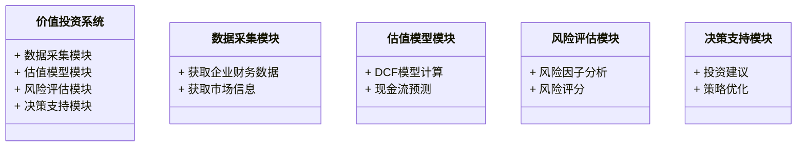

                 


# 价值投资在私募市场中的应用：PE和VC的启示

> **关键词**：价值投资、私募市场、PE、VC、风险评估、内在价值、投资策略  
> **摘要**：本文探讨了价值投资在私募市场中的应用，特别是私募股权（PE）和风险投资（VC）领域的具体实践。通过分析价值投资的核心原理、PE和VC的运作模式，以及实际案例，本文揭示了如何在私募市场中运用价值投资策略来实现长期收益。文章还结合系统设计和实战指导，为读者提供了全面的视角和实用的建议。

---

## 第一部分: 引言

### 1.1 价值投资的起源与核心理念
价值投资是一种以基本面分析为基础的投资策略，起源于20世纪初，由本杰明·格雷厄姆和戴维·多德提出。其核心理念是寻找市场价值低于内在价值的资产，通过长期持有实现超额收益。价值投资强调安全边际、逆向思维和长期视角。

#### 核心概念：
- **内在价值**：资产在未来现金流的现值。
- **安全边际**：市场价格与内在价值的差距，提供风险缓冲。
- **逆向思维**：在市场恐慌时寻找低估资产，在市场狂热时保持冷静。

### 1.2 PE和VC的基本概念
私募股权（PE）和风险投资（VC）是私募市场中的两大重要领域，主要区别在于投资对象和阶段：
- **PE**：投资于成熟企业，通过重组、优化和增值实现退出。
- **VC**：投资于初创企业，侧重于高成长潜力和创新性。

---

## 第二部分: 价值投资理论基础

### 2.1 价值投资的核心概念
价值投资的核心在于识别市场低估的资产。以下是其关键要素：
- **基本面分析**：通过财务报表分析企业的盈利能力、成长性和财务健康状况。
- **估值方法**：使用DCF（现金流折现模型）等方法估算资产的内在价值。
- **市场情绪**：利用市场非理性波动寻找投资机会。

#### 核心公式：
$$ \text{内在价值} = \sum_{t=1}^{n} \frac{\text{现金流}_t}{(1+r)^t} $$

### 2.2 股票内在价值的评估方法
价值投资者通过以下步骤评估股票价值：
1. **预测未来现金流**：基于企业历史业绩和行业趋势预测未来现金流。
2. **确定折现率**：使用无风险利率加风险溢价作为折现率。
3. **计算现值**：将未来现金流折现求和，得到内在价值。

#### 示例：
假设某企业未来5年的现金流分别为100万、120万、150万、180万、200万，折现率为10%。
$$ \text{内在价值} = \frac{100}{1.1} + \frac{120}{1.1^2} + \frac{150}{1.1^3} + \frac{180}{1.1^4} + \frac{200}{1.1^5} \approx 402.11 \text{万} $$

### 2.3 市场周期与价值投资策略
市场周期分为复苏、增长、成熟和衰退阶段。在衰退阶段，价值投资者寻找被市场低估的企业，而在增长阶段，关注高成长性企业。

#### 图表：


---

## 第三部分: PE和VC的运作模式

### 3.1 PE的运作流程
私募股权基金的投资流程包括：
1. **资金募集**：通过机构投资者或高净值客户募集资金。
2. **目标筛选**：寻找具有增值潜力的企业。
3. **尽职调查**：评估企业财务、法律和运营风险。
4. **投资决策**：基于尽职调查结果决定是否投资。
5. **投资执行**：签订投资协议，完成资金注入。
6. **价值创造**：通过重组、管理优化提升企业价值。
7. **退出机制**：通过IPO、并购或股权转让退出，实现收益。

#### 图表：


### 3.2 VC的运作流程
风险投资基金的投资流程包括：
1. **项目筛选**：寻找具有高成长潜力的初创企业。
2. **尽职调查**：评估项目技术、市场和团队可行性。
3. **投资决策**：基于风险收益分析决定是否投资。
4. **投资执行**：签订投资协议，完成资金注入。
5. **增值服务**：提供战略、市场和技术支持。
6. **退出机制**：通过IPO或并购退出，实现收益。

#### 图表：


---

## 第四部分: 价值投资在PE和VC中的应用

### 4.1 PE中的价值投资策略
私募股权基金通过以下方式实现价值投资：
- **目标筛选**：寻找具有稳定现金流和低估的中型企业。
- **价值重塑**：通过战略调整、管理优化提升企业价值。
- **风险控制**：通过多元化投资和杠杆收购降低风险。

#### 示例：
某PE基金投资于一家估值低于其DCF价值的制造企业，通过管理优化提升利润率，最终通过IPO实现退出。

### 4.2 VC中的价值投资策略
风险投资基金通过以下方式实现价值投资：
- **项目筛选**：寻找具有高成长潜力和技术壁垒的初创企业。
- **增值服务**：提供战略支持和资源对接，提升企业竞争力。
- **风险分担**：通过多轮融资分散投资风险。

#### 示例：
某VC基金投资于一家人工智能初创企业，通过技术合作和市场拓展，帮助企业快速成长，最终通过并购退出。

---

## 第五部分: 案例分析

### 5.1 PE案例：XX制造企业的投资
某PE基金通过以下步骤实现投资回报：
1. **目标筛选**：发现一家估值低于DCF价值的制造企业。
2. **尽职调查**：评估企业财务状况和市场前景。
3. **投资决策**：决定投资并提供管理支持。
4. **价值创造**：优化生产流程，提升利润率。
5. **退出机制**：通过IPO实现退出，获得超额收益。

### 5.2 VC案例：XX科技公司的投资
某VC基金通过以下步骤实现投资回报：
1. **项目筛选**：发现一家具有高成长潜力的人工智能初创企业。
2. **尽职调查**：评估技术可行性和市场潜力。
3. **投资决策**：决定投资并提供战略支持。
4. **增值服务**：帮助企业建立技术合作伙伴关系。
5. **退出机制**：通过并购退出，获得高额回报。

---

## 第六部分: 系统设计与架构

### 6.1 系统功能设计
价值投资系统需要实现以下功能：
1. **数据采集**：获取企业财务数据和市场信息。
2. **估值模型**：基于DCF模型计算内在价值。
3. **风险评估**：评估投资项目的潜在风险。
4. **决策支持**：提供投资建议和策略优化。

#### 图表：


---

## 第七部分: 项目实战

### 7.1 环境安装
需要安装以下工具：
- Python编程语言
- Pandas和NumPy库
- Matplotlib和Seaborn可视化库
- Mermaid图生成工具

### 7.2 核心实现代码
以下代码实现DCF模型的现金流计算：
```python
import numpy as np

def calculate_intrinsic_value(fcf, discount_rate, years):
    pv = 0
    for i in range(years):
        cash_flow = fcf * (1 + 0.05)**i  # 假设每年现金流增长5%
        pv += cash_flow / (1 + discount_rate)**(i+1)
    return pv

# 示例计算
fcf = 1000000  # 自由现金流
discount_rate = 0.10  # 折现率
years = 5  # 年数
iv = calculate_intrinsic_value(fcf, discount_rate, years)
print(f"内在价值为：${iv:.2f}")
```

### 7.3 实际案例分析
以某制造企业为例，计算其内在价值：
- 自由现金流：1000万
- 折现率：10%
- 年数：5年
- 假设每年现金流增长5%
$$ \text{内在价值} = \sum_{t=1}^{5} \frac{1000 \times (1.05)^{t-1}}{1.1^t} \approx 3923.23 \text{万} $$

---

## 第八部分: 总结与展望

### 8.1 总结
价值投资在私募市场中具有重要的应用价值，通过基本面分析和内在价值评估，投资者可以在PE和VC领域实现长期稳定的收益。本文结合理论、案例和系统设计，为读者提供了全面的视角。

### 8.2 展望
未来，价值投资在私募市场中的应用将更加智能化和数据化。通过大数据分析和人工智能技术，投资者可以更精准地识别低估资产，优化投资策略，提升投资回报。

---

通过以上思考和分析，我们可以得出结论：价值投资在私募市场中的应用需要结合理论、实践和系统设计，才能实现长期稳定的投资收益。

