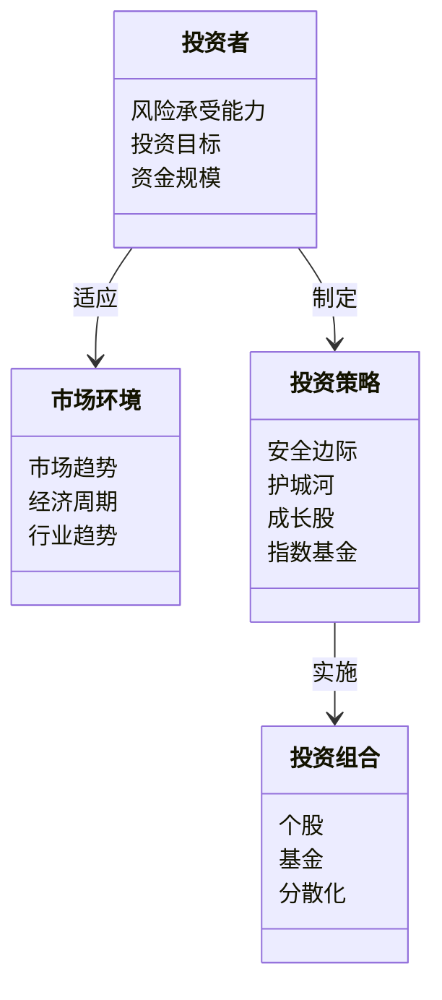
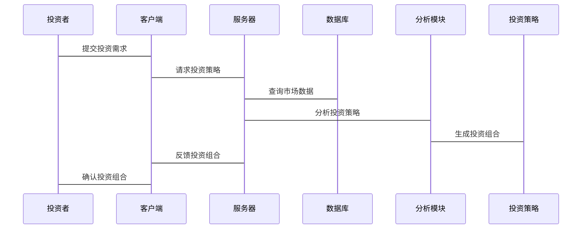

                 


# 价值投资大师的智慧：格雷厄姆、巴菲特、费雪和约翰·伯格

> 关键词：价值投资，本杰明·格雷厄姆，沃伦·巴菲特，彼得·费雪，约翰·伯格，投资策略，内在价值，安全边际，护城河，成长股

> 摘要：本文深入探讨了四位价值投资大师——本杰明·格雷厄姆、沃伦·巴菲特、彼得·费雪和约翰·伯格的投资理念、策略和成功经验。通过分析他们的投资哲学，结合实际案例和数学模型，揭示了价值投资的核心要素，为投资者提供了系统的指导和实践建议。

---

## 第一部分：价值投资概述

### 1.1 价值投资的定义与核心理念

#### 1.1.1 价值投资的定义
价值投资是一种基于对股票内在价值的深入分析，寻找市场价格低于内在价值的投资策略。其核心在于通过研究企业的基本面，寻找被市场低估的投资机会。

#### 1.1.2 价值投资的核心理念
- **安全边际**：买入价格低于内在价值，以降低投资风险。
- **长期视角**：关注企业的长期价值，而非短期市场波动。
- **深入研究**：通过财务分析、行业研究和竞争优势分析，识别优质企业。

#### 1.1.3 价值投资与其他投资策略的区别
- **区别于投机**：价值投资强调基本面分析，而投机依赖市场情绪。
- **区别于趋势投资**：价值投资关注长期价值，趋势投资关注短期趋势。

### 1.2 价值投资的历史与发展

#### 1.2.1 价值投资的起源
价值投资起源于20世纪初，由本杰明·格雷厄姆和戴维·多德提出，强调安全边际和内在价值。

#### 1.2.2 价值投资的发展历程
从格雷厄姆的安全边际理论，到巴菲特的护城河概念，再到彼得·费雪的成长股策略，价值投资不断丰富和发展。

#### 1.2.3 价值投资在现代金融中的地位
价值投资是投资领域的基石，影响了全球资本市场和机构投资者的决策。

### 1.3 价值投资的主要流派

#### 1.3.1 格雷厄姆学派
格雷厄姆的学派强调安全边际和估值，寻找被低估的股票。

#### 1.3.2 巴菲特定律
巴菲特继承并发展了格雷厄姆的理论，引入护城河和长期价值的概念。

#### 1.3.3 费雪的成长股投资
费雪强调长期增长潜力，关注具有竞争优势的企业。

#### 1.3.4 约翰·伯格的指数基金投资
伯格倡导通过指数基金实现长期投资目标。

---

## 第二部分：格雷厄姆的价值投资理论

### 2.1 本杰明·格雷厄姆的生平简介

#### 2.1.1 格雷厄姆的早年经历
格雷厄姆出生于1894年，早年经历坎坷，但在金融领域展现了非凡的天赋。

#### 2.1.2 格雷厄姆的学术贡献
他与戴维·多德合著《证券分析》，奠定了价值投资的理论基础。

#### 2.1.3 格雷厄姆的投资实践
他创立了格雷厄姆-纽曼公司，成功应用价值投资策略。

### 2.2 格雷厄姆的投资理念

#### 2.2.1 安全边际的概念
安全边际 = 内在价值 - 市场价格。

#### 2.2.2 股票的内在价值评估
通过市盈率、市净率等指标评估企业的真实价值。

#### 2.2.3 避免情绪化投资的重要性
强调理性分析，避免市场情绪干扰。

### 2.3 格雷厄姆的投资策略

#### 2.3.1 买入低于内在价值的股票
通过安全边际筛选投资标的。

#### 2.3.2 分散投资以降低风险
避免过度集中，降低投资组合的整体风险。

#### 2.3.3 长期持有的优势
通过长期持有，避免短期波动的影响。

### 2.4 格雷厄姆的成功案例分析

#### 2.4.1 格雷厄姆的经典投资案例
例如，购买价格远低于内在价值的股票，实现超额收益。

#### 2.4.2 格雷厄姆的投资哲学对后世的影响
格雷厄姆的理论影响了巴菲特、彼得·林奇等投资大师。

---

## 第三部分：巴菲特的价值投资理论

### 3.1 沃伦·巴菲特的生平简介

#### 3.1.1 巴菲特的早年经历
巴菲特从小展现出对投资的兴趣，师从格雷厄姆。

#### 3.1.2 巴菲特的合伙公司时期
与合伙人共同管理资金，应用格雷厄姆的理论实现收益。

#### 3.1.3 巴菲特的伯克希尔时期
将伯克希尔打造成投资帝国，践行价值投资理念。

### 3.2 巴菲特的投资理念

#### 3.2.1 格雷厄姆的影响
巴菲特继承了格雷厄姆的安全边际理论。

#### 3.2.2 巴菲特的“护城河”概念
寻找具有竞争优势的企业，建立可持续的竞争优势。

#### 3.2.3 长期价值投资策略
关注企业的长期价值，而非短期市场波动。

### 3.3 巴菲特的投资策略

#### 3.3.1 股东权益的重要性
通过ROE等指标评估企业盈利能力。

#### 3.3.2 股票的内在价值评估
结合财务指标和行业分析，评估企业的内在价值。

#### 3.3.3 耐心持有优质股票
长期持有优质企业，分享其成长收益。

### 3.4 巴菲特的成功案例分析

#### 3.4.1 巴菲特的经典投资案例
例如，投资可口可乐和苹果公司，长期持有实现超额收益。

#### 3.4.2 巴菲特的投资哲学对个人投资者的启示
强调深入研究和长期持有，避免短期波动。

---

## 第四部分：彼得·费雪的价值投资理论

### 4.1 彼得·费雪的生平简介

#### 4.1.1 费雪的早年经历
费雪在年轻时展现出对投资的兴趣，师从格雷厄姆。

#### 4.1.2 费雪的学术贡献
著有多本投资书籍，传播价值投资理念。

#### 4.1.3 费雪的投资实践
通过长期持有成长股实现投资收益。

### 4.2 费雪的投资理念

#### 4.2.1 成长股的概念
成长股是指那些具有持续增长潜力的股票。

#### 4.2.2 股票的长期增长潜力
通过深入研究企业的竞争优势，评估其长期增长能力。

#### 4.2.3 股票的内在价值与市场价值的关系
长期来看，市场价值会回归内在价值。

### 4.3 费雪的投资策略

#### 4.3.1 选择具有竞争优势的公司
通过分析企业的市场地位和竞争优势，选择具有长期增长潜力的企业。

#### 4.3.2 长期持有优质股票
避免频繁交易，长期持有优质股票，分享其成长收益。

#### 4.3.3 通过研究发现投资机会
深入研究企业的财务数据、行业趋势和竞争优势，发现投资机会。

### 4.4 费雪的成功案例分析

#### 4.4.1 费雪的经典投资案例
例如，投资英特尔公司，长期持有实现超额收益。

#### 4.4.2 费雪的投资哲学对后世的影响
费雪的成长股理念影响了后来的价值投资策略。

---

## 第五部分：约翰·伯格的价值投资理论

### 5.1 约翰·伯格的生平简介

#### 5.1.1 伯格的早年经历
伯格在投资领域展现了非凡的天赋，师从格雷厄姆。

#### 5.1.2 伯格的学术贡献
著有多本投资书籍，传播价值投资理念。

#### 5.1.3 伯格的投资实践
通过长期持有指数基金实现投资收益。

### 5.2 伯格的投资理念

#### 5.2.1 指数基金的概念
指数基金通过跟踪指数，实现分散化投资。

#### 5.2.2 降低投资风险的重要性
通过分散化投资，降低投资组合的整体风险。

#### 5.2.3 长期投资的优势
通过长期持有指数基金，实现财富的稳步增长。

### 5.3 伯格的投资策略

#### 5.3.1 选择具有代表性的指数基金
通过跟踪指数，实现分散化投资。

#### 5.3.2 长期持有指数基金
避免频繁交易，长期持有指数基金，实现财富增长。

#### 5.3.3 通过分散化降低风险
通过投资指数基金，降低投资组合的整体风险。

### 5.4 伯格的成功案例分析

#### 5.4.1 伯格的经典投资案例
例如，投资 Vanguard 指数基金，长期持有实现超额收益。

#### 5.4.2 伯格的投资哲学对个人投资者的启示
强调分散化和长期投资，实现财富的稳步增长。

---

## 第六部分：综合分析与启示

### 6.1 价值投资的共同点与差异

#### 6.1.1 共同点
四位大师都强调深入研究、长期持有和安全边际。

#### 6.1.2 差异
格雷厄姆注重估值，巴菲特注重护城河，费雪注重成长股，伯格注重指数基金。

### 6.2 价值投资的关键要素

#### 6.2.1 深入研究企业基本面
通过财务数据、行业趋势和竞争优势分析，评估企业的内在价值。

#### 6.2.2 安全边际的设定
买入价格低于内在价值，以降低投资风险。

#### 6.2.3 长期视角
关注企业的长期价值，避免短期市场波动的干扰。

### 6.3 对投资者的启示

#### 6.3.1 深入研究的重要性
通过深入研究企业基本面，发现投资机会。

#### 6.3.2 长期持有的优势
通过长期持有优质企业，实现财富增长。

#### 6.3.3 分散化投资的风险控制
通过分散化投资，降低投资组合的整体风险。

---

## 第七部分：价值投资的系统分析与架构设计方案

### 7.1 问题场景介绍
投资者在选择投资策略时，需要考虑市场环境、个人风险承受能力和投资目标。

### 7.2 系统功能设计

#### 7.2.1 领域模型（mermaid类图）


### 7.3 系统架构设计（mermaid架构图）


### 7.4 系统接口设计
投资者通过客户端提交投资需求，服务器根据需求生成投资策略，并反馈投资组合。

### 7.5 系统交互（mermaid序列图）


---

## 第八部分：项目实战

### 8.1 环境安装
安装Python和相关库，如numpy、pandas、matplotlib。

### 8.2 系统核心实现源代码

#### 8.2.1 计算内在价值
```python
import pandas as pd
import numpy as np

def calculate_intrinsic_value(financial_data):
    # 示例：计算市盈率
    pe_ratio = financial_data['市盈率']
    # 示例：计算市净率
    pb_ratio = financial_data['市净率']
    return pe_ratio * financial_data['每股收益'], pb_ratio * financial_data['每股净资产']
```

#### 8.2.2 计算安全边际
```python
def calculate_margin_of_safety(intrinsic_value, market_price):
    return intrinsic_value - market_price
```

### 8.3 代码应用解读与分析
通过代码计算企业的内在价值和安全边际，辅助投资者做出投资决策。

### 8.4 实际案例分析
以苹果公司为例，分析其内在价值和投资策略。

### 8.5 项目小结
通过实战项目，验证价值投资理论的可行性，并总结经验教训。

---

## 第九部分：最佳实践 tips、小结、注意事项、拓展阅读

### 9.1 最佳实践 tips
- 定期复盘投资组合，评估表现。
- 保持学习，更新投资知识。
- 严格遵守投资纪律，避免情绪化决策。

### 9.2 小结
价值投资是一种长期有效的投资策略，通过深入研究和长期持有，实现财富的稳步增长。

### 9.3 注意事项
- 避免过度杠杆，控制投资风险。
- 保持分散化，降低投资组合的整体风险。
- 理解市场波动，避免短期交易。

### 9.4 拓展阅读
推荐阅读《证券分析》、《巴菲特传》等书籍，深入理解价值投资的精髓。

---

## 结语

通过本文的分析，读者可以系统地了解四位价值投资大师的智慧，并将其应用到实际投资中。价值投资不仅是一种投资策略，更是一种长期坚持的哲学，值得投资者深入研究和实践。

