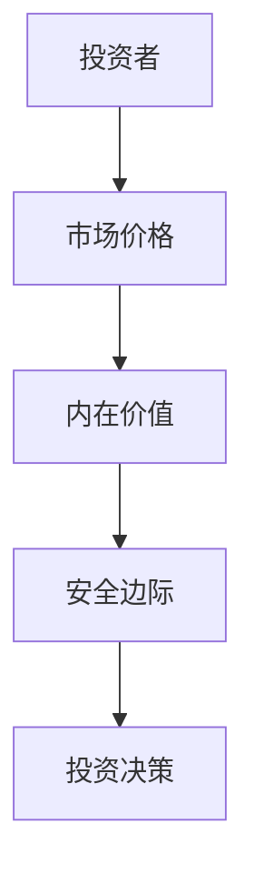
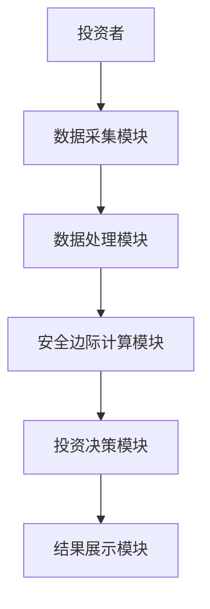

                 


# 价值投资的核心原则：安全边际

> 关键词：价值投资、安全边际、投资策略、风险管理、内在价值

> 摘要：本文深入探讨了价值投资的核心原则——安全边际，从理论基础到实践应用，详细分析了其在投资决策中的重要性。通过数学模型、系统架构和项目实战等多维度的阐述，帮助投资者理解和应用这一关键原则，以实现稳健的投资收益。

---

## 第一部分：价值投资的背景与概述

### 第1章：价值投资的背景与发展

#### 1.1 投资学的基本概念

- **投资学**是研究如何通过合理配置资金以实现财富最大化的一门学科。其核心在于理解资产的价值、风险和收益之间的关系。
- **资产**可以是股票、债券、房地产等，每种资产都有其独特的价值评估方法。
- **收益**是投资者最关注的指标之一，通常以投资回报率（ROI）或内部收益率（IRR）来衡量。

#### 1.2 价值投资的定义与核心理念

- **价值投资**是一种以基本面分析为基础的投资策略，强调以低于资产内在价值的价格买入资产。
- 其核心理念是**买便宜货**，即寻找市场低估的资产，而非关注短期市场波动。
- 价值投资与**趋势投资**和**技术分析**不同，更注重长期基本面因素。

#### 1.3 价值投资的历史与发展

- 价值投资的鼻祖是**本杰明·格雷厄姆**，他在20世纪30年代提出了安全边际的概念。
- 后来，**菲利普·费雪**和**沃伦·巴菲特**等人进一步发展了价值投资理论，使其更加系统化和实用化。

### 第2章：安全边际的定义与作用

#### 2.1 安全边际的定义

- **安全边际**是指资产的市场价格与内在价值之间的差距，即 $ \text{安全边际} = \text{内在价值} - \text{市场价格} $。
- 这一概念确保了投资者在买入资产时有一定的“缓冲空间”，即使未来出现不利因素，也能避免重大损失。

#### 2.2 安全边际在投资中的重要性

- 安全边际是价值投资的核心，它帮助投资者降低风险，提高投资的确定性。
- 在市场波动较大的情况下，安全边际能够为投资者提供保护，避免因价格波动导致的损失。

#### 2.3 安全边际与投资风险的关系

- 高安全边际意味着低风险，因为资产价格远低于其内在价值。
- 低安全边际意味着高风险，因为资产价格接近或超过其内在价值。

---

## 第二部分：安全边际的核心概念与原理

### 第3章：安全边际的数学模型与公式

#### 3.1 安全边际的计算公式

- **内在价值**是资产的真实价值，可以通过 discounted cash flow（DCF）模型等方法计算。
- **市场价格**是资产在市场上的交易价格。
- **安全边际率**可以表示为 $ \text{安全边际率} = \frac{\text{内在价值} - \text{市场价格}}{\text{市场价格}} $。

#### 3.2 安全边际的属性特征对比

| 属性 | 安全边际 | 投资风险 | 投资收益 |
|------|----------|----------|----------|
| 计算方式 | 市场价格与内在价值之差 | 标准差或方差 | 净现值或内部收益率 |
| 影响因素 | 市场价格、内在价值 | 资产波动性 | 资产盈利能力 |
| 目的 | 降低投资风险 | 量化风险 | 提高投资收益 |

#### 3.3 安全边际的ER实体关系图



### 第4章：安全边际的算法原理与实现

#### 4.1 安全边际的算法流程

- 确定投资目标：选择特定资产或行业。
- 评估资产的内在价值：使用DCF模型等方法。
- 计算安全边际：比较市场价格与内在价值。
- 调整投资策略：根据安全边际调整买入或卖出决策。

#### 4.2 安全边际的Python实现

```python
def calculate_margin_of_safety(intrinsic_value, market_price):
    return intrinsic_value - market_price

# 示例：计算某股票的安全边际
intrinsic_value = 100  # 内在价值
market_price = 80      # 市场价格
margin_of_safety = calculate_margin_of_safety(intrinsic_value, market_price)
print(f"安全边际为：{margin_of_safety}")
```

---

## 第三部分：安全边际的系统分析与架构设计

### 第5章：投资决策系统的场景介绍

#### 5.1 投资者需求

- 投资者希望通过安全边际评估资产价值，制定合理的投资策略。
- 系统需要提供实时数据、历史分析和风险评估功能。

#### 5.2 系统功能设计

- **数据采集**：获取资产的市场价格和基本面数据。
- **内在价值评估**：使用算法计算资产的内在价值。
- **安全边际计算**：比较市场价格与内在价值，计算安全边际。
- **投资决策支持**：根据安全边际提供买入或卖出的建议。

#### 5.3 系统架构设计



---

## 第四部分：项目实战与最佳实践

### 第6章：项目实战

#### 6.1 环境安装

- 安装Python和相关库（如Pandas、NumPy）。
- 配置数据源（如Yahoo Finance API）。

#### 6.2 核心实现

```python
import pandas as pd

def calculate_intrinsic_value(cash_flow, discount_rate):
    return cash_flow / (1 + discount_rate)

# 示例：计算某公司的内在价值
cash_flow = 1000000
discount_rate = 0.1
intrinsic_value = calculate_intrinsic_value(cash_flow, discount_rate)
print(f"内在价值为：{intrinsic_value}")
```

#### 6.3 实际案例分析

- 某公司的股票市场价格为 $50，内在价值为 $60，其安全边际为 $10，意味着该股票具有较高的投资价值。

---

## 第五部分：总结与展望

### 7.1 最佳实践 Tips

- 保持合理的安全边际，尤其是在市场波动较大的情况下。
- 定期评估投资组合的安全边际，及时调整投资策略。

### 7.2 小结

安全边际是价值投资的核心原则，它帮助投资者在不确定的市场中降低风险，实现稳健的投资收益。通过系统的分析和实际的案例分析，我们可以更好地理解和应用这一原则。

### 7.3 注意事项

- 安全边际只是投资决策的一个方面，还需要结合其他因素（如行业趋势、管理团队等）进行综合评估。
- 避免过度依赖单一指标，保持对市场的敏感性和灵活性。

### 7.4 拓展阅读

- 《The Intelligent Investor》 by Benjamin Graham
- 《The Warren Buffett Way》 by Bruce Greenwald

---

通过以上详细分析，我们希望能够帮助读者深入理解价值投资的核心原则——安全边际，并能够在实际投资中灵活运用这一原则，实现长期稳健的投资收益。

