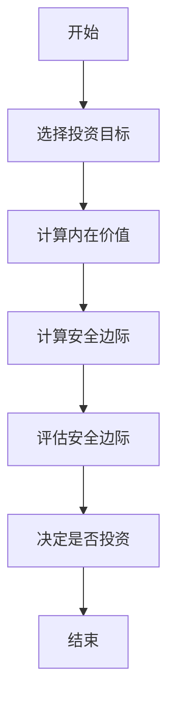
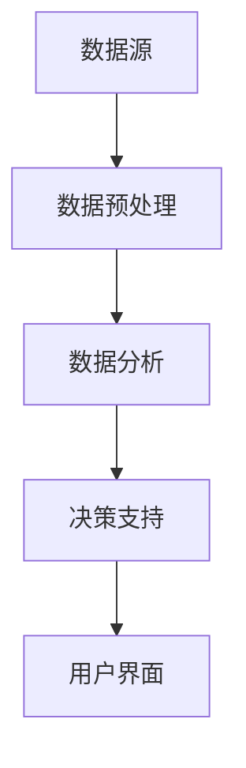

                 

# 价值投资的核心原则：安全边际

## 关键词：价值投资、安全边际、内在价值、投资策略、风险管理

## 摘要

价值投资是一种以基本面分析为基础的投资策略，其核心在于寻找被市场低估的股票，通过长期持有实现资本增值。安全边际是价值投资中的重要原则，它通过计算股票的内在价值与市场价格之间的差异，帮助投资者降低风险，确保投资决策的稳健性。本文将深入探讨安全边际的定义、计算方法及其在投资策略中的应用，结合实际案例和系统分析，为投资者提供全面的指导。

---

# 目录大纲：《价值投资的核心原则：安全边际》

## 第一部分：价值投资的背景与核心概念

### 第1章：价值投资的起源与发展

#### 1.1 价值投资的起源
- 1.1.1 价值投资的定义
- 1.1.2 价值投资的历史背景
- 1.1.3 价值投资的核心思想

#### 1.2 安全边际的概念
- 1.2.1 安全边际的定义
- 1.2.2 安全边际的重要性
- 1.2.3 安全边际与投资风险的关系

### 第2章：价值投资的核心原则

#### 2.1 投资者心态与决策
- 2.1.1 投资者心理偏差
- 2.1.2 理性决策的重要性
- 2.1.3 投资者情绪对市场的影响

#### 2.2 安全边际的计算方法
- 2.2.1 内在价值的计算
- 2.2.2 安全边际的计算公式
- 2.2.3 安全边际与市场价格的关系

---

## 第二部分：安全边际的数学模型与算法原理

### 第3章：安全边际的数学模型

#### 3.1 内在价值的计算
- 3.1.1 现金流折现模型
- 3.1.2 市盈率法
- 3.1.3 市净率法

#### 3.2 安全边际的计算公式
- 3.2.1 安全边际 = 内在价值 - 市场价格
- 3.2.2 安全边际的百分比计算
- 3.2.3 安全边际与投资风险的数学关系

### 第4章：算法原理与流程图

#### 4.1 投资决策流程图

---

## 第三部分：系统分析与架构设计

### 第5章：投资分析的系统架构

#### 5.1 项目介绍
- 5.1.1 项目目标
- 5.1.2 项目范围
- 5.1.3 项目背景

#### 5.2 系统功能设计
- 5.2.1 数据收集模块
- 5.2.2 数据分析模块
- 5.2.3 决策支持模块

#### 5.3 系统架构设计

---

## 第四部分：项目实战与案例分析

### 第6章：项目实战

#### 6.1 环境安装
- 6.1.1 安装Python
- 6.1.2 安装数据分析库（Pandas、NumPy）

#### 6.2 核心实现
- 6.2.1 计算内在价值
- 6.2.2 计算安全边际
- 6.2.3 生成投资报告

#### 6.3 案例分析
- 6.3.1 选择目标公司
- 6.3.2 计算安全边际
- 6.3.3 评估投资价值

---

## 第五部分：最佳实践与注意事项

### 第7章：最佳实践

#### 7.1 小结
- 7.1.1 安全边际的重要性
- 7.1.2 投资策略的稳健性
- 7.1.3 风险管理的有效性

#### 7.2 注意事项
- 7.2.1 市场波动的风险
- 7.2.2 数据的滞后性
- 7.2.3 投资者的心理偏差

#### 7.3 拓展阅读
- 7.3.1 推荐书籍
- 7.3.2 相关研究

---

## 结语

通过本文的系统分析和详细讲解，读者可以全面理解安全边际在价值投资中的重要性，并能够在实际投资中应用这些方法，做出更为稳健的投资决策。

