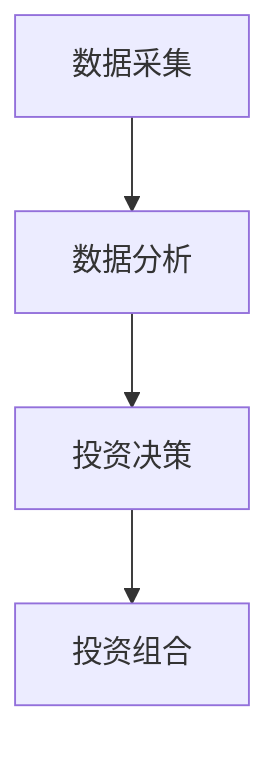

                 


# 《价值投资的核心原则：安全边际理论解析》

## 关键词：价值投资，安全边际，内在价值，投资策略，风险管理

## 摘要：  
本文深入解析了价值投资的核心原则之一——安全边际理论。通过详细分析其定义、计算方法、数学模型以及实际应用案例，帮助投资者理解如何在投资决策中运用安全边际理论，以降低风险并实现稳健收益。文章结合理论与实践，提供了一个系统化的框架，帮助读者在复杂多变的市场环境中做出明智的投资决策。

---

## 第一部分：引言

### 第1章：引言

#### 1.1 价值投资的背景与重要性

##### 1.1.1 价值投资的定义与起源  
价值投资是一种以基本面分析为基础的投资策略，起源于20世纪初，由本杰明·格雷厄姆等投资大师提出。其核心在于寻找市场价格低于其内在价值的股票，通过长期持有实现收益。

##### 1.1.2 安全边际在价值投资中的核心地位  
安全边际是价值投资中不可或缺的概念，它通过在市场价格与内在价值之间设定一个缓冲区，帮助投资者在面对市场波动时降低风险。

##### 1.1.3 本书的目的与读者群体  
本书旨在为投资者提供一个系统化的框架，帮助他们在实际投资中运用安全边际理论，适用于个人投资者、机构投资者及相关领域研究者。

#### 1.2 价值投资的基本原则

##### 1.2.1 质值分析的核心概念  
质值分析强调通过对企业基本面的深入研究，评估其内在价值，寻找市场价格低于内在价值的投资机会。

##### 1.2.2 投资者心理与行为偏差  
投资者常常受到心理偏差的影响，如过度自信和从众心理，这些偏差可能导致非理性的投资决策，安全边际理论帮助投资者克服这些偏差。

##### 1.2.3 安全边际在投资决策中的作用  
安全边际通过提供一个价格保护层，确保在市场价格波动时，投资者不会遭受重大损失，从而实现稳健的投资回报。

---

## 第二部分：安全边际的核心概念

### 第2章：安全边际的定义与计算

#### 2.1 安全边际的定义

##### 2.1.1 安全边际的多维度解析  
安全边际是指市场价格低于内在价值的部分，是内在价值与市场价格之间的差额。它为投资者提供了在市场价格波动时的保护。

##### 2.1.2 安全边际与内在价值的关系  
内在价值是企业未来现金流的现值，安全边际是内在价值与市场价格的差额，差额越大，安全边际越高，投资风险越小。

##### 2.1.3 安全边际的动态调整机制  
随着市场环境的变化，内在价值和市场价格都会发生变化，安全边际需要根据最新数据进行动态调整，以适应市场变化。

#### 2.2 安全边际的计算方法

##### 2.2.1 基本公式与计算步骤  
内在价值公式：  
$$ V = \sum_{t=1}^{n} \frac{CF_t}{(1 + r)^t} $$  
安全边际计算公式：  
$$ \text{安全边际} = V - P $$  
其中，\( V \) 是内在价值，\( P \) 是市场价格。

##### 2.2.2 市盈率与市净率的比较分析  
市盈率（P/E）= 市场价格 / 每股收益  
市净率（P/B）= 市场价格 / 每股净资产  
通过比较市盈率和市净率，可以评估市场价格与内在价值的偏离程度。

##### 2.2.3 财务指标的权重分配与计算  
不同行业和企业的财务指标权重不同，需根据具体情况调整，以准确反映企业的真实价值。

#### 2.3 安全边际与投资风险的平衡

##### 2.3.1 风险评估的基本框架  
通过分析企业的财务状况、行业地位和市场环境，评估投资风险。

##### 2.3.2 安全边际在风险管理中的应用  
通过设定合理的安全边际，降低市场价格波动对企业价值的影响。

##### 2.3.3 不同市场环境下的安全边际调整  
在牛市中，适当降低安全边际；在熊市中，适当提高安全边际，以应对市场波动。

---

## 第三部分：安全边际的数学模型与算法

### 第3章：安全边际的数学模型

#### 3.1 基本模型与假设条件

##### 3.1.1 内在价值的计算公式  
$$ V = \sum_{t=1}^{n} \frac{CF_t}{(1 + r)^t} $$  
其中，\( CF_t \) 是第 \( t \) 年的现金流，\( r \) 是折现率。

##### 3.1.2 安全边际的宽度计算  
$$ \text{安全边际宽度} = V - P $$  
其中，\( V \) 是内在价值，\( P \) 是市场价格。

##### 3.1.3 市场波动对安全边际的影响  
通过波动率和相关指标，调整安全边际的计算。

#### 3.2 数据可视化

##### 3.2.1 内在价值与市场价格的关系  
使用散点图展示内在价值与市场价格的关系，分析市场价格偏离内在价值的程度。

##### 3.2.2 安全边际与投资回报的关系  
绘制折线图，展示不同安全边际宽度下的投资回报率。

---

## 第四部分：系统架构与数据流分析

### 第4章：系统架构与数据流分析

#### 4.1 系统架构设计

##### 4.1.1 价值投资系统的组成模块  
- 数据采集模块：收集企业财务数据、市场数据等。
- 数据分析模块：计算内在价值、安全边际等指标。
- 投资决策模块：根据分析结果制定投资策略。

##### 4.1.2 系统架构图  


#### 4.2 数据流分析

##### 4.2.1 数据采集流程  
从数据库中获取企业财务数据和市场数据，清洗并预处理数据。

##### 4.2.2 数据分析流程  
使用Python进行数据处理和分析，计算内在价值和安全边际。

##### 4.2.3 决策流程  
根据分析结果，生成投资建议，调整投资组合。

---

## 第五部分：项目实战：案例分析

### 第5章：项目实战：案例分析

#### 5.1 案例选择

##### 5.1.1 公司介绍  
以苹果公司为例，分析其财务状况和市场表现。

#### 5.1.2 数据采集与处理  
收集苹果公司的财务数据和市场数据，清洗并预处理。

#### 5.1.3 安全边际计算  
计算苹果公司的内在价值和安全边际，评估投资价值。

#### 5.1.4 投资策略制定  
根据安全边际分析结果，制定长期投资策略。

#### 5.2 代码实现

##### 5.2.1 数据处理代码  
```python
import pandas as pd

# 读取数据
df = pd.read_csv('apple_data.csv')

# 数据清洗
df.dropna(inplace=True)
df['Revenue'].fillna(0, inplace=True)
```

##### 5.2.2 安全边际计算代码  
```python
def calculate_intrinsic_value(FCF, WACC):
    return sum(FCF / (1 + WACC)**t for t in range(1, 5))
    
V = calculate_intrinsic_value(FCF, WACC)
P = df['Price'].mean()
safety_margin = V - P
```

---

## 第六部分：总结与最佳实践

### 第6章：总结与最佳实践

#### 6.1 回顾与总结

##### 6.1.1 核心内容回顾  
安全边际是价值投资中降低风险、实现稳健收益的关键因素。

##### 6.1.2 投资理念总结  
长期持有优质资产，通过安全边际分析，捕捉低估的投资机会。

#### 6.2 最佳实践 tips

##### 6.2.1 投资策略建议  
- 定期评估投资组合的安全边际。
- 根据市场变化动态调整安全边际。

##### 6.2.2 风险管理建议  
- 设置止损点，控制投资风险。
- 分散投资，降低个股风险。

##### 6.2.3 持续学习与适应  
- 关注市场变化，学习新知识。
- 总结投资经验，优化投资策略。

---

## 结语

通过本文的系统化分析，读者可以深入理解安全边际理论的核心原理，并将其应用于实际投资中，提升投资决策的科学性和稳健性。安全边际不仅是一种风险管理工具，更是一种投资智慧，帮助投资者在复杂多变的市场中把握机遇，规避风险。

