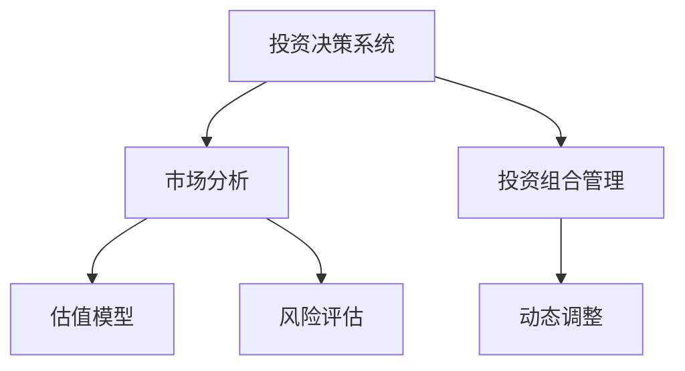

                 

# 价值投资者如何应对市场泡沫

## 关键词：价值投资、市场泡沫、风险管理、投资策略、投资者心理、估值模型

## 摘要：  
本文探讨了价值投资者在市场泡沫中的应对策略，通过分析市场泡沫的形成机制、投资者心理以及价值投资的核心原则，为投资者提供应对市场波动的实用方法。文章结合历史案例和系统分析，详细阐述了如何在泡沫中保持理性，构建稳健的投资组合，并通过风险管理工具来保护投资价值。

---

# 引言

## 1.1 问题背景与重要性  
市场泡沫是金融市场中的常见现象，投资者在泡沫周期中往往面临决策困境。价值投资者需要在市场狂热中保持冷静，在市场恐慌中把握机会。本文将深入探讨价值投资者如何在泡沫环境中制定策略，保护投资组合并实现长期收益。

---

# 第一部分：价值投资的基础

## 第1章：价值投资的定义与历史发展

### 1.1 价值投资的基本原理  
价值投资是一种基于对公司内在价值评估的投资方法。其核心在于寻找市场价格低于内在价值的公司。  
**关键公式**：  
内在价值 = (未来现金流的现值)  
$$ V = \sum_{t=1}^{n} \frac{CF_t}{(1+r)^t} $$  
其中，CF_t为第t年的现金流，r为折现率。

### 1.2 市场泡沫的形成与破灭机制  
市场泡沫的形成源于投资者心理偏差和市场情绪的波动。  
**投资者心理分析**：  
- **从众心理**：投资者盲目跟随市场潮流，忽视基本面分析。  
- **乐观偏差**：投资者过度自信，认为市场永远上涨。  
- **羊群效应**：投资者在恐慌时跟随市场抛售，加剧市场下跌。  

### 1.3 价值投资与成长投资的区别  
价值投资注重低估值和安全边际，而成长投资关注高成长性和高市盈率。  
**对比表格**：  
| 投资策略 | 价值投资 | 成长投资 |  
|----------|-----------|----------|  
| 核心关注点 | 内在价值 | 市场情绪 |  
| 估值方法 | P/E、P/B | 高市盈率 |  

---

## 第2章：市场泡沫的形成与破灭机制

### 2.1 投资者心理与市场情绪  
市场情绪的变化是泡沫形成的关键因素。  
**投资者心理阶段**：  
1. **乐观阶段**：投资者相信市场会持续上涨。  
2. **狂热阶段**：投资者忽略基本面，盲目投资。  
3. **恐慌阶段**：市场崩盘，投资者恐慌抛售。  

### 2.2 市场泡沫的阶段分析  
- **膨胀阶段**：市场估值远高于基本面。  
- **破裂阶段**：泡沫破裂，价格回归理性。  
- **修复阶段**：市场逐步恢复，价值投资者介入。  

### 2.3 历史案例分析  
以互联网泡沫为例，1999-2000年期间，纳斯达克指数从1200点涨至5000点，随后暴跌至1800点以下。  

---

## 第3章：价值投资者的应对策略

### 3.1 泡沫前的防御策略  
- **构建安全边际**：选择估值低、基本面稳健的公司。  
- **分散投资**：避免过度集中在高风险资产。  
- **制定投资计划**：明确买入和卖出条件。  

### 3.2 泡沫中的应对措施  
- **保持冷静**：避免恐慌性抛售。  
- **寻找低估机会**：利用市场恐慌，买入优质资产。  
- **动态调整**：根据市场变化，及时调整投资组合。  

### 3.3 泡沫后的修复策略  
- **评估损失**：分析投资组合的表现。  
- **调整策略**：修复投资组合，回归价值投资原则。  
- **总结经验**：从泡沫中吸取教训，优化投资策略。  

---

## 第4章：风险管理与心理调适

### 4.1 风险管理的核心原则  
- **分散投资**：降低特定资产的风险。  
- **设定止损**：避免重大损失。  
- **动态调整**：根据市场变化，及时止损或止盈。  

### 4.2 心理调适的技巧  
- **避免情绪化决策**：保持理性分析。  
- **长期视角**：关注长期收益，忽略短期波动。  
- **持续学习**：提升投资知识，增强判断力。  

---

## 第5章：系统分析与架构设计

### 5.1 投资决策系统的构建  
- **市场分析模块**：分析市场趋势和情绪。  
- **估值模型模块**：计算公司内在价值。  
- **风险评估模块**：评估投资组合风险。  

### 5.2 系统架构图  

---

## 第6章：项目实战

### 6.1 模拟投资案例  
- **案例背景**：2008年金融危机期间，某投资者选择低估值的银行股。  
- **策略制定**：利用市场恐慌，买入低估资产。  
- **风险管理**：设定止损点，分散投资。  

### 6.2 投资组合调整  
- **买入时机**：市场底部区域。  
- **卖出时机**：泡沫达到顶峰，估值远高于内在价值。  

---

## 结论

## 7.1 总结与展望  
价值投资者在市场泡沫中应保持冷静，遵循基本面分析，制定合理的投资策略。未来，随着市场环境的变化，价值投资的核心原则仍将是抵御市场波动的有效工具。

## 7.2 最佳实践 Tips  
- 定期复盘投资组合，评估策略的有效性。  
- 保持学习，紧跟市场变化。  
- 风险管理是投资成功的关键。  

---

通过以上结构，文章系统地探讨了价值投资者在市场泡沫中的应对策略，结合理论分析和实战案例，为投资者提供了实用的指导。

