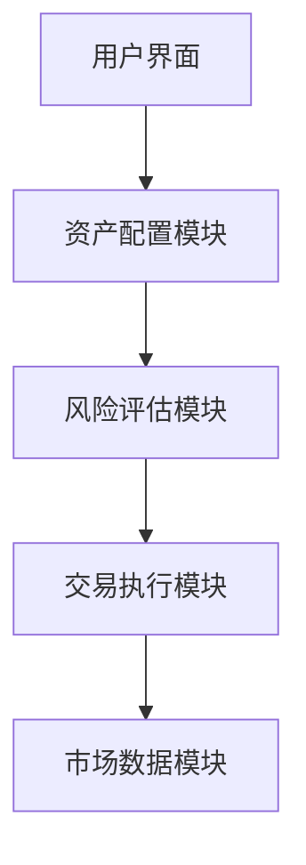

                 


# 价值投资者如何构建多元化投资组合

> 关键词：价值投资、多元化投资、投资组合、风险管理、资产配置、现代投资组合理论

> 摘要：本文将详细探讨价值投资者如何构建一个有效的多元化投资组合。通过分析价值投资的核心理念、多元化投资的重要性以及构建投资组合的策略，结合现代投资组合理论（MPT）和风险管理方法，帮助投资者实现风险可控、收益稳定的财务目标。

---

## 第一部分：价值投资与多元化投资组合的背景

### 第1章：价值投资的起源与核心理念

#### 1.1 价值投资的定义与历史演变

价值投资是一种基于对公司内在价值分析的投资策略，起源于20世纪初，由本杰明·格雷厄姆和戴维·多德共同提出。其核心理念是寻找市场定价低于其内在价值的公司，长期持有，等待价格回归其价值。

- **定义**：价值投资不仅仅是购买股票，而是买入低于其实际价值的资产，长期持有，赚取市场先生的错误定价带来的收益。
- **历史演变**：从格雷厄姆的“烟屁股”投资法到巴菲特的价值投资进化论，价值投资理念经过百年演变，成为全球投资者的重要策略。

#### 1.2 多元化投资组合的重要性

- **基本概念**：多元化投资是指将资金分配到不同资产类别、行业、地域或市场中，以降低投资风险。
- **风险分散**：通过分散投资，投资者可以减少特定资产或市场的波动对整体投资组合的影响。
- **理论基础**：马科维茨的现代投资组合理论（MPT）为多元化投资提供了科学依据。

---

## 第二部分：多元化投资组合的构建基础

### 第2章：资产配置与风险分散

#### 2.1 资产配置的基本原理

- **定义与分类**：资产配置是指将投资资金分配到不同资产类别（如股票、债券、房地产等）的过程。资产配置策略可以是保守型、平衡型或成长型。
- **不同资产类别的风险与收益特征**：
  - 股票：高风险、高收益。
  - 债券：低风险、稳定收益。
  - 现金及货币市场工具：低风险、低收益。
- **资产配置在投资组合中的作用**：通过合理配置资产，投资者可以在不同市场条件下平衡风险和收益。

#### 2.2 现代投资组合理论（MPT）概述

- **马科维茨的均值-方差模型**：MPT通过优化投资组合的收益与风险关系，找到最优资产配置。
  - **公式**：投资组合的最优解是使得在给定风险水平下，收益最大化，或在给定收益水平下，风险最小化。
  - **数学模型**：$$\text{Minimize } \sigma^2 \text{ subject to } \mu \geq \text{目标收益}$$

- **有效前沿的概念**：有效前沿是所有可能投资组合中收益最高或风险最低的集合，代表最优投资组合的选择范围。

---

## 第三部分：构建多元化投资组合的策略

### 第3章：资产配置策略

#### 3.1 战术性资产配置

- **定义与特点**：战术性资产配置根据市场环境的变化，短期调整资产配置比例。
- **实施步骤**：
  1. 确定市场当前趋势。
  2. 调整资产配置比例。
  3. 定期监控并调整。

#### 3.2 战略性资产配置

- **定义与特点**：战略性资产配置基于长期投资目标，设定资产配置比例，并在市场波动中维持该比例。
- **实施步骤**：
  1. 设定长期投资目标。
  2. 确定初始资产配置。
  3. 定期再平衡。

---

## 第四部分：风险管理与投资组合优化

### 第4章：风险评估与管理策略

#### 4.1 风险评估

- **风险类型**：
  - 市场风险：整体市场波动带来的风险。
  - 信用风险：债券发行人违约的风险。
  - 流动性风险：资产无法快速变现的风险。
- **VaR（在险值）与CVaR（条件在险值）**：
  - **VaR**：在一定置信水平下，投资组合可能遭受的最大损失。
  - **CVaR**：在VaR超过一定水平时的平均损失。

#### 4.2 止损策略

- **止损订单**：设定一个价格水平，当价格触及该水平时自动卖出，以限制亏损。
- **动态止损**：根据市场波动调整止损水平。

#### 4.3 投资组合再平衡

- **定义**：定期调整投资组合以维持初始资产配置比例。
- **步骤**：
  1. 评估当前资产配置。
  2. 确定偏离目标的比例。
  3. 通过买卖调整至目标比例。

---

## 第五部分：系统分析与架构设计方案

### 第5章：投资组合管理系统

#### 5.1 系统功能设计

- **功能模块**：
  - 数据采集：获取市场数据。
  - 风险评估：计算VaR、CVaR等风险指标。
  - 资产配置：优化投资组合。
  - 交易执行：根据策略执行交易。

#### 5.2 系统架构设计



---

## 第六部分：项目实战

### 第6章：环境安装与系统实现

#### 6.1 环境安装

- **工具安装**：安装Python、Pandas、NumPy、Matplotlib等库。

#### 6.2 核心代码实现

```python
import numpy as np
import pandas as pd

# 示例：计算投资组合的VaR
def calculate VaR(returns, confidence_level):
    sorted_returns = np.sort(returns)
    var_index = int(len(sorted_returns) * (1 - confidence_level))
    var = sorted_returns[var_index]
    return var

# 示例：资产配置优化
def optimize_portfolio(assets, returns, covariance_matrix):
    # 使用均值-方差模型优化
    mu = np.mean(returns)
    sigma = np.sqrt(covariance_matrix)
    # 求解最优权重
    # 简化示例，实际应用中需要更复杂的优化方法
    pass
```

#### 6.3 案例分析与解读

- **案例**：构建一个包含股票、债券和房地产信托的投资组合，使用Python代码计算最优配置比例和风险指标。

---

## 第七部分：总结与展望

### 第7章：总结与未来趋势

- **总结**：价值投资者通过多元化投资组合可以有效降低风险，实现长期稳定的收益。
- **未来展望**：人工智能和大数据技术将进一步提升投资组合优化和风险管理能力。

---

通过以上步骤，价值投资者可以系统地构建一个多元化投资组合，实现风险可控、收益稳定的投资目标。

