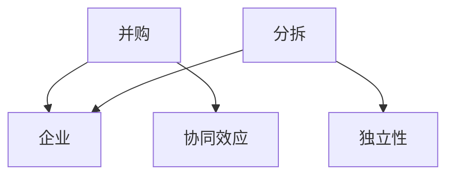
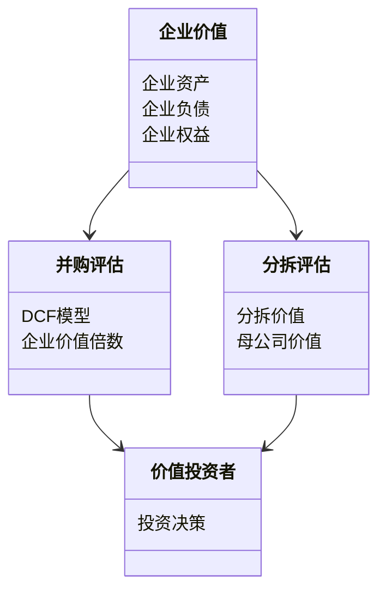
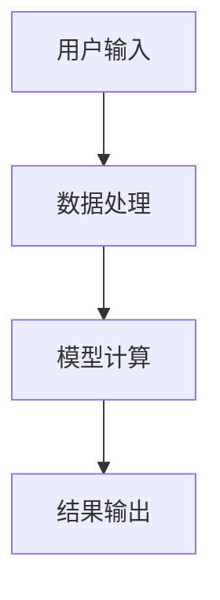
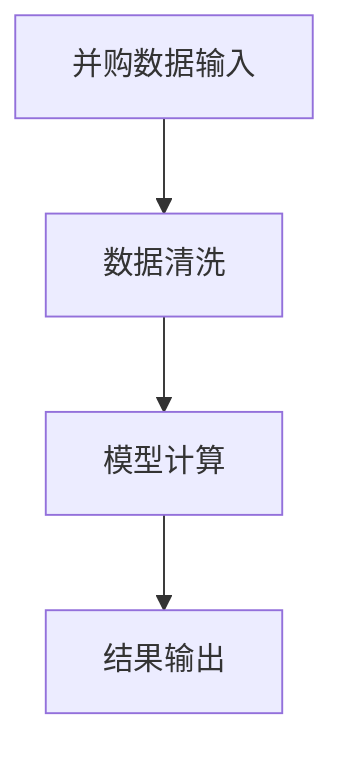
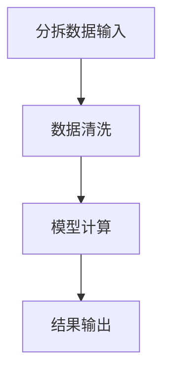

                 


# 价值投资者如何看待并购和分拆

## 关键词：价值投资，并购，分拆，企业价值，数学模型，案例分析

## 摘要：本文从价值投资者的视角，深入分析并购和分拆的策略、评估方法和实际案例。通过数学模型、系统分析和案例研究，探讨并购与分拆对投资组合的影响，帮助投资者做出明智决策。

---

# 第1章: 并购与分拆的核心概念

## 1.1 并购与分拆的基本概念

### 1.1.1 并购的定义与分类

- **并购（Mergers and Acquisitions, M&A）**是指一家企业合并或收购另一家企业，以实现规模扩张或战略目标。
- **横向并购**：同一行业内的并购，旨在扩大市场份额。
- **纵向并购**：上下游产业的并购，以控制供应链。
- **混合并购**：跨行业并购，寻求协同效应。

### 1.1.2 分拆的定义与分类

- **分拆（Spin-off）**：企业将其一部分业务剥离，成为独立的公司。
- **分拆的类型**：
  - **完全分拆**：子公司完全独立，不再与母公司有任何关联。
  - **部分分拆**：子公司保留与母公司的某些业务联系。

### 1.1.3 并购与分拆的边界与外延

- **边界**：并购和分拆的范围和规模。
- **外延**：通过并购或分拆实现的业务扩展或收缩。

## 1.2 价值投资者的视角

### 1.2.1 价值投资者的核心理念

- **基本面分析**：关注企业的财务状况、盈利能力和发展潜力。
- **长期投资**：价值投资者注重长期价值，而非短期市场波动。

### 1.2.2 并购与分拆对价值投资者的影响

- **并购**：可能带来协同效应，提升企业价值。
- **分拆**：剥离非核心业务，优化资产配置。

### 1.2.3 并购与分拆在投资组合中的作用

- **分散风险**：通过并购和分拆，投资者可以分散投资风险。
- **价值发现**：并购和分拆可能带来未被市场发现的价值。

## 1.3 并购与分拆的市场背景

### 1.3.1 当前经济环境下的并购趋势

- **经济周期**：并购活动通常在经济复苏或扩张期增加。
- **行业整合**：并购是行业整合的重要手段。

### 1.3.2 分拆在企业战略中的地位

- **战略调整**：分拆是企业调整业务结构的重要手段。
- **聚焦核心业务**：通过分拆，企业可以专注于核心业务。

### 1.3.3 并购与分拆的驱动因素分析

- **市场机会**：并购可能带来新的市场机会。
- **成本压力**：分拆可能是应对成本压力的一种方式。

## 1.4 本章小结

---

# 第2章: 并购与分拆的核心概念与联系

## 2.1 并购与分拆的核心概念原理

### 2.1.1 并购的核心要素

- **战略协同**：并购后能否产生协同效应。
- **财务效应**：并购是否能提升企业财务表现。

### 2.1.2 分拆的核心要素

- **业务独立性**：分拆后的业务是否具备独立性。
- **资产优化**：分拆是否优化了资产配置。

### 2.1.3 并购与分拆的协同效应

- **协同效应**：并购后，企业能否实现成本节约或收入增长。
- **分拆后的独立性**：分拆后的企业是否能更好地发展。

## 2.2 并购与分拆的概念属性特征对比

| 特征       | 并购                 | 分拆                 |
|------------|----------------------|----------------------|
| 定义       | 合并或收购           | 剥离一部分业务       |
| 目的       | 战略扩张或协同效应     | 优化资产结构         |
| 风险       | 高                   | 中                   |
| 价值影响   | 可能提升企业价值     | 可能释放被剥离业务价值|

### 2.2.1 并购的特征分析

- **高风险**：并购失败可能导致财务损失。
- **高回报**：成功并购可能带来显著收益。

### 2.2.2 分拆的特征分析

- **中风险**：分拆通常风险较低，但需考虑市场反应。
- **独立性**：分拆后的企业可能更具灵活性。

### 2.2.3 并购与分拆的异同点对比

- **相同点**：都是企业调整业务结构的方式。
- **不同点**：并购是整合，分拆是剥离。

## 2.3 并购与分拆的ER实体关系图



## 2.4 本章小结

---

# 第3章: 并购与分拆的数学模型与公式

## 3.1 并购评估的数学模型

### 3.1.1 DCF模型

$$DCF = \sum_{t=1}^{n} \frac{CF_t}{(1+r)^t} + \frac{TV}{(1+r)^n}$$

- **DCF**： discounted cash flow，折现现金流。
- **CF_t**：第t年的现金流。
- **r**：折现率。
- **TV**：终值。

### 3.1.2 企业价值倍数

$$EV = \frac{Market\ Value}{EV/EBITDA\ Multiple}$$

- **EV**：企业价值。
- **Market\ Value**：市场价值。
- **EV/EBITDA\ Multiple**：企业价值与息税折旧及摊销前利润的倍数。

## 3.2 分拆评估的数学模型

### 3.2.1 分拆价值评估公式

$$Split-Off\ Value = \sum_{t=1}^{n} \frac{CF_t}{(1+r)^t}$$`

- **Split-Off\ Value**：分拆价值。
- **CF_t**：第t年的现金流。
- **r**：折现率。

### 3.2.2 分拆对母公司价值的影响

$$Parent\ Value = Child\ Value + \text{剩余价值}$$

- **Parent\ Value**：母公司价值。
- **Child\ Value**：子公司价值。
- **剩余价值**：母公司其他业务的价值。

## 3.3 实际案例分析

### 3.3.1 某公司并购案例的数学模型应用

假设某公司并购一家年收入为1000万美元的企业，预计未来5年的现金流分别为500万、600万、700万、800万和900万，折现率为10%。

$$DCF = \frac{500}{1.1} + \frac{600}{1.1^2} + \frac{700}{1.1^3} + \frac{800}{1.1^4} + \frac{900}{1.1^5} \approx 2345.45\text{万美元}$$

### 3.3.2 某公司分拆案例的数学模型应用

假设某公司分拆其子公司，预计未来5年的现金流分别为400万、450万、500万、550万和600万，折现率为8%。

$$Split-Off\ Value = \frac{400}{1.08} + \frac{450}{1.08^2} + \frac{500}{1.08^3} + \frac{550}{1.08^4} + \frac{600}{1.08^5} \approx 2045.67\text{万美元}$$`

## 3.4 本章小结

---

# 第4章: 并购与分拆的系统分析与架构设计

## 4.1 系统分析

### 4.1.1 并购与分拆的系统功能设计

- **数据输入**：企业财务数据、市场数据。
- **模型计算**：DCF模型、企业价值倍数。
- **结果输出**：并购或分拆的可行性分析。

### 4.1.2 并购与分拆的领域模型



### 4.1.3 并购与分拆的系统架构设计



## 4.2 系统架构设计

### 4.2.1 并购评估系统架构



### 4.2.2 分拆评估系统架构



## 4.3 项目实战

### 4.3.1 环境安装

- **Python**：安装Python 3.x。
- **库安装**：安装`pandas`, `numpy`, `scipy`。

### 4.3.2 核心实现源代码

```python
import numpy as np
import pandas as pd

def dcf_model(cash_flows, discount_rate, terminal_value):
    return np.sum(cash_flows / (1 + discount_rate) ** np.arange(len(cash_flows))) + terminal_value / (1 + discount_rate) ** len(cash_flows)

cash_flows = [500, 600, 700, 800, 900]
discount_rate = 0.1
terminal_value = 1000
print("DCF Value:", dcf_model(cash_flows, discount_rate, terminal_value))
```

### 4.3.3 案例分析与解读

- **并购案例**：某公司并购案例的DCF模型计算。
- **分拆案例**：某公司分拆案例的DCF模型计算。

## 4.4 本章小结

---

# 第5章: 价值投资者的并购与分拆策略

## 5.1 价值投资者的并购策略

### 5.1.1 策略制定

- **基本面分析**：关注企业的财务状况和盈利能力。
- **协同效应**：评估并购后的协同效应。

### 5.1.2 风险管理

- **估值风险**：确保并购价格合理。
- **整合风险**：评估整合的可行性。

## 5.2 价值投资者的分拆策略

### 5.2.1 策略制定

- **业务独立性**：确保分拆后的业务独立。
- **资产优化**：优化资产配置。

### 5.2.2 风险管理

- **市场风险**：评估分拆对市场的影响。
- **法律风险**：确保分拆符合法规。

## 5.3 投资策略与案例分析

### 5.3.1 并购策略

- **案例分析**：分析某公司并购案例，说明策略的有效性。

### 5.3.2 分拆策略

- **案例分析**：分析某公司分拆案例，说明策略的有效性。

## 5.4 本章小结

---

# 第6章: 并购与分拆的未来趋势与挑战

## 6.1 并购与分拆的未来趋势

### 6.1.1 数字化转型

- **技术驱动**：并购和分拆将更多涉及技术领域。

### 6.1.2 可持续发展

- **绿色并购**：关注环保和可持续发展。

## 6.2 并购与分拆的挑战

### 6.2.1 全球化

- **跨国并购**：面临更多的法律和文化挑战。

### 6.2.2 技术变革

- **技术分拆**：技术变革可能导致业务分拆。

## 6.3 应对策略

### 6.3.1 全球化战略

- **跨国并购**：制定全球化并购策略。

### 6.3.2 技术驱动

- **技术创新**：利用技术创新应对挑战。

## 6.4 本章小结

---

# 第7章: 并购与分拆的总结与展望

## 7.1 本章总结

### 7.1.1 核心概念回顾

- **并购**：整合资源，实现协同效应。
- **分拆**：优化结构，释放价值。

### 7.1.2 数学模型总结

- DCF模型：评估并购和分拆的价值。

## 7.2 未来展望

### 7.2.1 技术创新

- **人工智能**：在并购和分拆中的应用。

### 7.2.2 可持续发展

- **绿色投资**：关注环保和社会责任。

## 7.3 本章小结

---

# 关键词索引

- 价值投资
- 并购
- 分拆
- 企业价值
- 数学模型
- 案例分析

---

通过以上结构，本文从价值投资者的视角，全面分析了并购和分拆的核心概念、数学模型、系统架构和实际案例，为投资者提供了实用的分析工具和策略建议。

