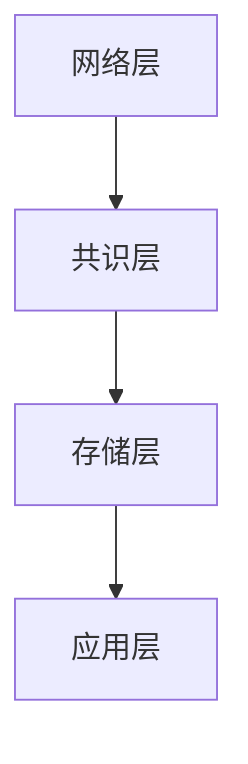
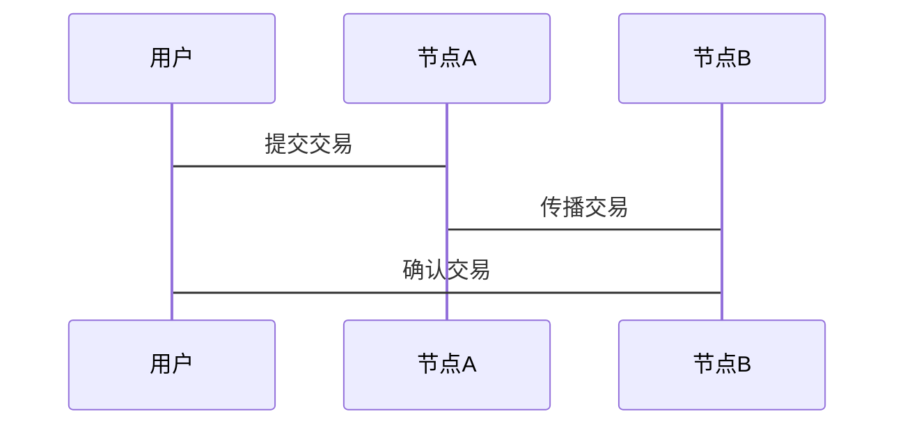
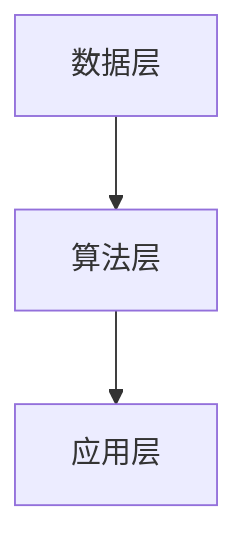
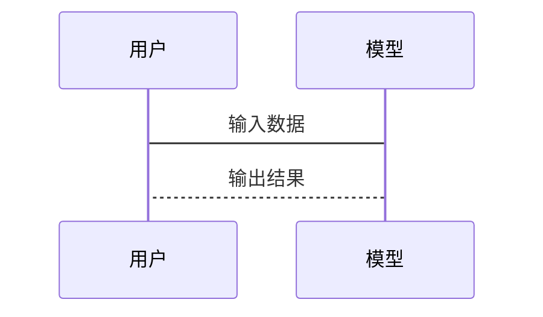

                 


# 价值投资者如何看待新兴技术：区块链、AI等

> 关键词：区块链、人工智能、价值投资、通证经济、分布式系统

> 摘要：本文旨在探讨价值投资者如何评估区块链和人工智能等新兴技术的潜在价值。通过对区块链的分布式账本、共识机制、智能合约以及人工智能的机器学习算法、深度学习模型等技术的分析，本文揭示了这些技术如何改变传统金融和投资模式，并为价值投资者提供了如何在新兴技术领域寻找投资机会的实用建议。

---

## 第一部分：区块链与价值投资

### 第1章：区块链技术与投资概述

#### 1.1 区块链技术的核心概念

##### 1.1.1 区块链的基本定义与特点
区块链是一种去中心化的分布式账本技术，通过密码学和分布式网络实现数据的安全性和一致性。其核心特点包括去中心化、不可篡改、透明性和抗审查性。

##### 1.1.2 区块链的分布式账本原理
区块链通过将数据以区块形式存储，并通过链式结构连接，形成一个不可篡改的账本。每个区块包含交易数据、时间戳和哈希值，确保数据的完整性和一致性。

##### 1.1.3 区块链与传统金融系统的区别
区块链通过去中心化的方式实现价值转移和存储，而传统金融系统依赖于中心化的机构（如银行）。区块链降低了信任成本，提高了交易效率，但其去中心化特性也带来了新的挑战。

#### 1.2 区块链的共识机制

##### 1.2.1 工作量证明（PoW）机制
PoW机制通过计算哈希值来验证交易，确保网络的安全性。比特币是采用PoW机制的典型例子。其优点是安全性高，但缺点是能耗高且效率低。

##### 1.2.2 权益证明（PoS）机制
PoS机制通过质押代币的方式选择验证节点，减少能源消耗。以太坊2.0采用PoS机制，其优点是能耗低，但存在“寡头化”的风险。

##### 1.2.3 其他共识机制的对比分析
除了PoW和PoS，还有DPoS（ delegated Proof of Stake）、BFT（拜占庭容错）等共识机制。每种机制都有其优缺点，适用于不同的场景。

#### 1.3 智能合约与去中心化应用（DApps）

##### 1.3.1 智能合约的定义与功能
智能合约是运行在区块链上的自动执行程序，用于自动执行合同条款。其功能包括自动执行交易、管理权限和支付报酬。

##### 1.3.2 DApps的开发与应用场景
DApps基于区块链构建，具有去中心化、透明和不可篡改的特点。其应用场景包括去中心化金融（DeFi）、供应链管理、数字身份验证等。

##### 1.3.3 智能合约的安全性与风险
智能合约的安全性依赖于代码的正确性，但代码漏洞可能导致严重的经济损失。因此，智能合约的安全审计至关重要。

#### 1.4 区块链的经济模型与通证设计

##### 1.4.1 通证经济的基本原理
通证是区块链上的价值载体，用于表示资产、权益或访问权限。通证经济通过激励机制促进网络的活跃性和价值增长。

##### 1.4.2 通证发行的常见模式
通证发行模式包括 ICO（Initial Coin Offering）、IGO（Initial Game Offering）和 IFO（Initial Farm Offering）。每种模式都有其独特的特点和适用场景。

##### 1.4.3 通证价值的评估方法
通证价值评估需要考虑技术实现、应用场景、市场需求、团队能力和经济模型等多个因素。

#### 1.5 区块链对价值投资的影响

##### 1.5.1 区块链技术的长期价值
区块链技术通过去中心化和不可篡改的特性，提高了交易的信任度和效率，为多个行业带来了革命性的变化。

##### 1.5.2 区块链投资的机遇与挑战
区块链投资的机遇包括技术创新、市场需求和政策支持，但同时也面临技术风险、市场波动和监管不确定性等挑战。

##### 1.5.3 区块链投资的未来趋势
随着技术的成熟和应用的扩展，区块链将逐步从“ hype”走向“实用”，价值投资者需要关注技术创新和市场需求的结合。

---

### 第2章：人工智能与价值投资

#### 2.1 人工智能技术的核心概念

##### 2.1.1 人工智能的基本定义与特点
人工智能是模拟人类智能的技术，包括学习、推理和自适应能力。其核心特点包括数据驱动、算法优化和场景应用广泛。

##### 2.1.2 机器学习与深度学习的区别
机器学习是人工智能的核心技术，通过数据训练模型进行预测和分类。深度学习是机器学习的子领域，专注于神经网络的训练和优化。

##### 2.1.3 人工智能的典型应用场景
人工智能在金融领域的应用场景包括股票预测、风险控制、客户画像和欺诈检测等。

#### 2.2 人工智能的算法原理

##### 2.2.1 机器学习的数学基础
机器学习的核心是优化模型的损失函数，常用梯度下降算法。例如，线性回归的损失函数为：
$$ L = \sum_{i=1}^{n} (y_i - \hat{y}_i)^2 $$
其中，$y_i$ 是真实值，$\hat{y}_i$ 是预测值。

##### 2.2.2 深度学习的神经网络结构
深度学习通过多层神经网络实现特征提取和非线性映射。例如，卷积神经网络（CNN）在图像识别中表现优异，其结构包括卷积层、池化层和全连接层。

##### 2.2.3 人工智能算法的优缺点对比
- 优点：数据驱动、自动学习、高准确性。
- 缺点：数据依赖性高、计算资源消耗大、黑箱问题。

#### 2.3 人工智能在金融领域的应用

##### 2.3.1 人工智能在股票预测中的应用
通过历史数据训练模型，预测股票价格的涨跌趋势。例如，使用LSTM（长短期记忆网络）进行时间序列预测。

##### 2.3.2 人工智能在风险控制中的应用
人工智能可以通过分析客户的信用记录和行为数据，评估贷款风险。例如，使用随机森林算法进行信用评分。

##### 2.3.3 人工智能在客户画像中的应用
通过自然语言处理（NLP）技术，分析客户的文本数据，构建客户画像。例如，使用词嵌入技术（如Word2Vec）进行情感分析。

---

### 第3章：系统分析与架构设计方案

#### 3.1 区块链系统的架构设计

##### 3.1.1 系统功能设计
区块链系统的功能包括交易验证、区块生成、智能合约执行和节点同步。

##### 3.1.2 系统架构设计
区块链的架构包括网络层、共识层、存储层和应用层。其架构图如下：



##### 3.1.3 系统接口设计
区块链系统需要支持的接口包括交易提交接口、区块查询接口和智能合约调用接口。

##### 3.1.4 系统交互设计
区块链系统的交互流程如下：



#### 3.2 人工智能系统的架构设计

##### 3.2.1 系统功能设计
人工智能系统的功能包括数据采集、特征提取、模型训练和结果输出。

##### 3.2.2 系统架构设计
人工智能系统的架构包括数据层、算法层和应用层。其架构图如下：



##### 3.2.3 系统接口设计
人工智能系统需要支持的接口包括数据输入接口、模型训练接口和结果输出接口。

##### 3.2.4 系统交互设计
人工智能系统的交互流程如下：



---

### 第4章：项目实战

#### 4.1 区块链项目实战

##### 4.1.1 环境安装
安装以太坊开发环境，包括Geth、Solidity和Web3.js。

##### 4.1.2 核心实现
实现一个简单的智能合约，用于数字资产的发行和转让。

```solidity
// SPDX-License-Identifier: MIT
pragma solidity ^0.8.0;

contract MyToken {
    mapping(address => uint) public balances;

    function mint(address recipient, uint amount) public {
        balances[recipient] += amount;
    }

    function burn(address sender, uint amount) public {
        balances[sender] -= amount;
    }
}
```

##### 4.1.3 项目小结
通过实战，我们了解了区块链项目的开发流程和关键点，包括智能合约的编写、测试和部署。

#### 4.2 人工智能项目实战

##### 4.2.1 环境安装
安装TensorFlow和PyTorch框架，配置GPU环境。

##### 4.2.2 核心实现
实现一个简单的股票预测模型，使用LSTM进行时间序列预测。

```python
import numpy as np
import tensorflow as tf

model = tf.keras.Sequential([
    tf.keras.layers.LSTM(64, input_shape=(None, 1)),
    tf.keras.layers.Dense(1)
])

model.compile(loss='mean_squared_error', optimizer='adam')
```

##### 4.2.3 项目小结
通过实战，我们掌握了人工智能项目的基本流程，包括数据采集、模型训练和结果分析。

---

## 第五部分：总结与展望

### 5.1 总结
通过本文的探讨，我们了解了区块链和人工智能技术的核心概念、算法原理和应用场景。这些技术为价值投资者提供了新的投资机会，但也带来了新的挑战。

### 5.2 展望
未来，区块链和人工智能技术将继续深度融合，推动金融和投资领域的创新。价值投资者需要紧跟技术发展，结合市场需求，寻找具有长期价值的投资机会。

---

## 关键词：区块链、人工智能、价值投资、通证经济、分布式系统

---

## 结语
价值投资者在面对新兴技术时，需要具备技术分析能力，同时关注市场需求和经济模型。通过本文的分析，我们相信区块链和人工智能技术将为投资领域带来深远的影响。

