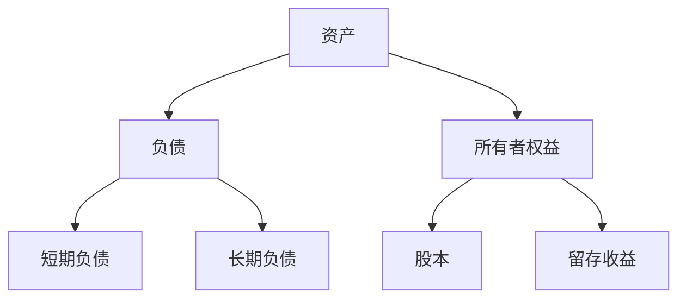
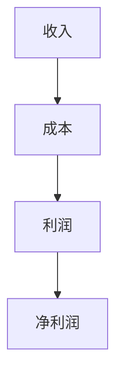
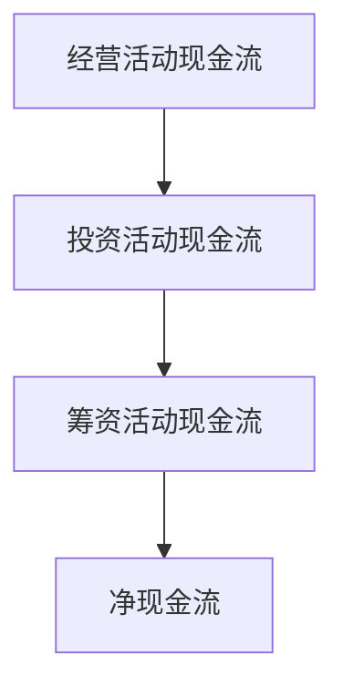
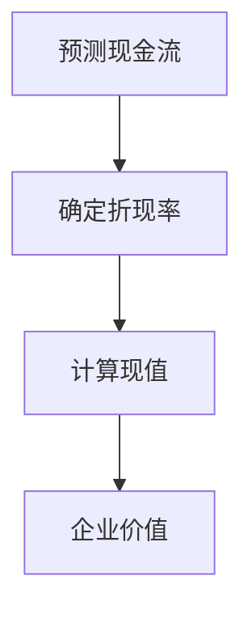

                 


# 价值投资者必备：企业估值技巧

## 关键词：价值投资，企业估值，DCF模型，财务分析，投资策略

## 摘要：
企业估值是价值投资的核心技能，它帮助投资者识别被低估的投资标的，实现长期稳定的收益。本文从价值投资的基本概念出发，系统讲解企业估值的关键方法，包括财务分析、现金流贴现模型（DCF）、相对估值法等。通过实际案例分析，帮助投资者掌握如何将理论应用于实践，构建科学的投资决策体系。

---

# 第1章: 价值投资概述

## 1.1 价值投资的核心理念

### 1.1.1 价值投资的定义与起源
价值投资是一种以低于内在价值的价格买入优质资产的投资策略。它起源于20世纪初，以本杰明·格雷厄姆和戴维·多德为代表，强调安全边际和对公司内在价值的深入研究。

### 1.1.2 价值投资的基本原则
- **安全边际**：买入价格低于内在价值，留有安全空间。
- **长期视角**：关注企业的长期盈利能力，而非短期价格波动。
- **独立思考**：避免盲目跟风，坚持独立分析。

### 1.1.3 价值投资与其它投资策略的区别
- **区别**：价值投资注重基本面分析，寻找低估标的；趋势投资关注价格走势，技术分析为主。
- **联系**：两者都以追求超额收益为目标，但方法和理念不同。

## 1.2 企业估值的基本概念

### 1.2.1 企业估值的定义
企业估值是通过对企业未来现金流的折现，估算其内在价值的过程。它是衡量企业投资价值的重要指标。

### 1.2.2 企业估值的核心要素
- **现金流**：企业未来产生的自由现金流。
- **折现率**：反映资金的时间价值和风险溢价。
- **永续增长率**：长期稳定增长的假设。

### 1.2.3 企业估值的常见方法
- **绝对估值法**：DCF模型、股权自由现金流模型。
- **相对估值法**：市盈率、市净率、EV/EBITDA。

## 1.3 价值投资者的思维模式

### 1.3.1 价值投资者的特质
- 理性、耐心、独立思考。
- 专注于长期价值，而非短期波动。

### 1.3.2 价值投资者的决策框架
- 确定投资目标。
- 深入研究标的公司。
- 评估安全边际。
- 严格执行纪律。

### 1.3.3 价值投资者的风险管理策略
- 分散投资，降低风险。
- 设置止损，避免重大损失。
- 定期复盘，优化策略。

---

# 第2章: 企业基本面分析

## 2.1 财务报表分析

### 2.1.1 资产负债表分析
- 资产：企业拥有的资源，如现金、应收账款、存货等。
- 负债：企业的债务，如应付账款、短期借款等。
- 所有者权益：企业的净资产。

**Mermaid图表：资产负债表结构**



### 2.1.2 利润表分析
- 收入：企业的营业收入。
- 成本：生产成本和销售费用。
- 利润：净利润为核心指标。

**Mermaid图表：利润表结构**



### 2.1.3 现金流量表分析
- 经营活动现金流：企业日常运营产生的现金流。
- 投资活动现金流：投资于固定资产或其它资产的现金流。
- 筹资活动现金流：通过借款或发行股票获得的现金流。

**Mermaid图表：现金流量表结构**



## 2.2 财务指标分析

### 2.2.1 偿债能力指标
- **流动比率**：流动资产/流动负债。
- **速动比率**：（流动资产 - 存货）/流动负债。

**对比表格：偿债能力指标**

| 指标名称   | 计算公式              | 指标意义                     |
|------------|----------------------|------------------------------|
| 流动比率   | 流动资产/流动负债    | 衡量企业短期偿债能力          |
| 速动比率   | （流动资产-存货）/流动负债 | 更为严格的短期偿债能力衡量 |

### 2.2.2 营运能力指标
- **应收账款周转率**：营业收入/平均应收账款。
- **存货周转率**：营业成本/平均存货。

**对比表格：营运能力指标**

| 指标名称       | 计算公式             | 指标意义                     |
|----------------|---------------------|------------------------------|
| 应收账款周转率 | 营业收入/平均应收账| 衡量企业应收账款管理效率     |
| 存货周转率     | 营业成本/平均存货   | 衡量企业存货管理效率         |

### 2.2.3 盈利能力指标
- **净利率**：净利润/营业收入。
- **ROE**：净利润/股东权益。

**对比表格：盈利能力指标**

| 指标名称 | 计算公式       | 指标意义                     |
|----------|---------------|------------------------------|
| 净利率   | 净利润/营业收入 | 衡量企业盈利水平             |
| ROE      | 净利润/股东权益| 衡量股东投资回报效率       |

## 2.3 行业分析与竞争优势

### 2.3.1 行业生命周期分析
行业分为导入期、成长期、成熟期、衰退期，不同阶段的企业估值方法不同。

### 2.3.2 企业的竞争优势分析
- **成本优势**：生产效率高，成本低。
- **技术优势**：拥有独特的技术专利。
- **品牌优势**：知名品牌溢价能力。

### 2.3.3 企业的市场地位分析
- **市场份额**：企业在行业中的占比。
- **竞争对手分析**：主要竞争对手的优劣势。

---

# 第3章: 企业估值方法论

## 3.1 现金流贴现模型（DCF）

### 3.1.1 DCF模型的原理与步骤

**DCF模型原理**：
企业价值 = 现金流的现值，通过将未来现金流折现到当前价值。

**步骤**：
1. 预测未来现金流。
2. 确定折现率。
3. 计算现值。
4. 加上残值（如有）。

**Mermaid图表：DCF模型流程**



### 3.1.2 DCF模型的假设与限制
- 现金流预测的准确性。
- 折现率的选择。
- 永续增长率的合理性。

### 3.1.3 DCF模型的优缺点

**优点**：
- 考虑了时间价值和风险。
- 更加注重基本面分析。

**缺点**：
- 对未来现金流预测敏感。
- 假设企业永续经营。

### 3.1.4 DCF模型的数学公式

$$
\text{企业价值} = \sum_{t=1}^{n} \frac{\text{现金流}_t}{(1 + r)^t} + \frac{\text{残值}}{(1 + r)^n}
$$

其中，$r$ 是折现率，$n$ 是预测期数。

**Python代码示例**：

```python
import numpy as np

def dcf_valuation(cash_flows, discount_rate, terminal_value):
    # 计算现值
    pv = 0
    for t, cf in enumerate(cash_flows):
        pv += cf / (1 + discount_rate) ** t
    # 加上残值
    pv += terminal_value / (1 + discount_rate) ** len(cash_flows)
    return pv

# 示例数据
cash_flows = [100, 150, 200]
discount_rate = 0.1
terminal_value = 500

# 计算企业价值
enterprise_value = dcf_valuation(cash_flows, discount_rate, terminal_value)
print(f"企业价值：{enterprise_value}")
```

---

## 3.2 相对估值法

### 3.2.1 市盈率（P/E）分析

$$
P/E = \frac{\text{股价}}{\text{每股净利润}}
$$

### 3.2.2 市净率（P/B）分析

$$
P/B = \frac{\text{股价}}{\text{每股净资产}}
$$`

### 3.2.3 EV/EBITDA倍数分析

$$
EV/EBITDA = \frac{\text{企业价值}}{\text{息税折旧及摊销前利润}}
$$

---

## 3.3 股权自由现金流模型

### 3.3.1 FCFF（Free Cash Flow to Firm）的计算

$$
\text{FCFF} = \text{净利润} + \text{非现金费用} - \text{资本支出}
$$`

### 3.3.2 WACC（Weighted Average Cost of Capital）的计算

$$
WACC = w_d \times r_d \times (1 - t) + w_e \times r_e
$$`

其中，$w_d$ 是债务权重，$r_d$ 是债务成本，$t$ 是税率，$w_e$ 是股权权重，$r_e$ 是股权成本。

### 3.3.3 股权价值的计算公式

$$
\text{股权价值} = \text{企业价值} - \text{债务价值}
$$`

---

# 第4章: 套利机会与估值偏差

## 4.1 市场无效性与估值偏差

### 4.1.1 市场无效性的表现
- 价格短期波动。
- 市场参与者情绪影响。

### 4.1.2 估值偏差的常见原因
- 信息不对称。
- 市场情绪影响。

### 4.1.3 如何利用估值偏差进行投资
- 识别低估值股票。
- 投资优质资产的便宜价格。

## 4.2 套利机会的识别

### 4.2.1 低估值股票的识别
- P/E、P/B低于行业平均水平。

### 4.2.2 高估值股票的识别
- P/E、P/B高于行业平均水平。

### 4.2.3 套利机会的评估与风险控制
- 评估安全边际。
- 设置止损点。

---

# 第5章: 投资组合构建与风险管理

## 5.1 投资组合的构建策略

### 5.1.1 投资目标的设定
- 长期收益目标。
- 风险承受能力。

### 5.1.2 资产配置的优化
- 股票、债券、现金的配置比例。

### 5.1.3 个股选择的标准
- 估值合理。
- 公司治理优秀。

## 5.2 风险管理与组合调整

### 5.2.1 风险的识别与评估
- 市场风险。
- 信用风险。

### 5.2.2 投资组合的动态调整
- 定期复盘。
- 调整持仓。

### 5.2.3 风险控制的策略与工具
- 分散投资。
- 期权对冲。

## 5.3 长期投资策略的制定

### 5.3.1 长期投资的目标设定
- 稳定的复利增长。
- 资产保值增值。

### 5.3.2 长期投资的风险管理
- 避免过度集中。
- 定期审视持仓。

### 5.3.3 长期投资的绩效评估
- 回撤控制。
- 收益稳定性。

---

# 第6章: 企业估值实战案例分析

## 6.1 案例一：零售行业的估值分析

### 6.1.1 行业分析
- 零售行业的特点。
- 主要竞争对手分析。

### 6.1.2 公司基本面分析
- 财务数据解读。
- 竞争优势分析。

### 6.1.3 估值模型应用
- 使用DCF模型计算内在价值。
- 对比相对估值指标。

---

# 总结与展望

企业估值是价值投资的核心，需要结合多种方法，灵活运用。未来，随着市场环境的变化，投资者需要不断学习和调整，提升自己的估值能力。通过深入分析企业基本面，合理运用估值模型，价值投资者能够在复杂的市场中找到优质的标的，实现长期稳定的收益。

---

# 推荐阅读

- 《股票投资实战技术》
- 《价值投资入门指南》
- 《财务报表分析与企业估值》

---

通过本文的学习，读者可以系统掌握企业估值的核心方法，结合实际案例，提升自己的投资能力。

