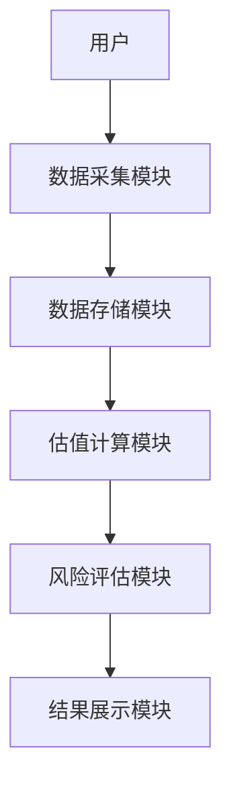

                 


# 价值投资者的操守：在利益与道德之间做出选择

## 关键词：价值投资、道德决策、利益最大化、投资伦理、DCF模型、系统架构

## 摘要：  
在金融投资领域，价值投资者常常面临利益与道德的双重考验。本文深入探讨了价值投资的核心原则、伦理框架、数学模型以及系统架构，结合实际案例分析，帮助投资者在追求利益的同时，坚守道德操守，实现可持续投资目标。

---

# 引言

在金融市场中，价值投资者追求的是长期稳定的收益，而这种收益往往与道德决策密切相关。本文将从价值投资的定义、伦理框架、数学模型、系统架构等多方面进行探讨，帮助投资者在利益与道德之间找到平衡点。

---

## 第一部分：价值投资的背景与概念

### 第1章：价值投资的定义与核心原则

#### 1.1 价值投资的起源与演变

价值投资起源于20世纪初，由本杰明·格雷厄姆和戴维·多德等人提出。他们强调以低于内在价值的价格买入优质股票，长期持有，等待市场回归理性。随着时代的发展，价值投资逐渐扩展到更多领域，包括私募股权、房地产投资等。

#### 1.2 价值投资的核心原则

- **质值分析**：关注企业的基本面，如盈利能力、财务状况和行业地位。
- **长期投资**：避免短期市场波动，注重企业的长期价值。
- **安全边际**：以低于内在价值的价格买入，降低投资风险。

---

## 第二部分：价值投资的伦理框架

### 第2章：利益与道德的冲突与平衡

#### 2.1 投资中的利益驱动

- **短期利益**：投资者往往追求短期收益，可能导致过度交易和道德风险。
- **长期利益**：关注企业的可持续发展，投资于有社会责任的企业。

#### 2.2 价值投资者的道德责任

- **社会责任**：投资应考虑企业对社会、环境的影响。
- **道德决策**：避免投资于有道德瑕疵的企业，如烟草、武器制造等。

---

## 第三部分：价值评估的数学模型与算法原理

### 第3章：价值评估的核心算法

#### 3.1 贴现现金流模型（DCF）

贴现现金流模型是价值评估的核心工具，通过将未来现金流折现为现值，计算企业的真实价值。公式如下：

$$
\text{DCF Value} = \sum_{t=1}^{n} \frac{CF_t}{(1 + r)^t} + \frac{TV}{(1 + r)^n}
$$

其中，\( CF_t \) 是第t年的现金流，\( r \) 是贴现率，\( TV \) 是终值。

#### 3.2 市盈率与市净率分析

市盈率（P/E）=股价 / 每股净利润  
市净率（P/B）=股价 / 每股净资产

通过比较市盈率和市净率与行业平均水平，判断企业估值是否合理。

---

## 第四部分：投资决策的系统架构与实现

### 第4章：价值投资决策支持系统的构建

#### 4.1 系统功能设计

- **数据采集**：获取企业的财务数据、行业信息。
- **估值模型计算**：应用DCF模型等算法计算企业价值。
- **风险评估**：分析企业的道德风险，如社会责任履行情况。

#### 4.2 系统架构设计

以下是系统的架构图：



---

## 第五部分：项目实战与案例分析

### 第5章：价值投资实战案例

#### 5.1 实战环境安装

- 安装Python和相关库（pandas、numpy、scipy）。

#### 5.2 核心代码实现

以下是DCF模型的Python实现：

```python
import pandas as pd
import numpy as np

def discounted_cash_flow(cash_flows, discount_rate, terminal_value):
    """
    计算DCF价值
    """
    value = 0
    for t, cf in enumerate(cash_flows):
        if t == 0:
            continue
        else:
            value += cf / (1 + discount_rate) ** t
    value += terminal_value / (1 + discount_rate) ** len(cash_flows)
    return value

# 示例数据
cash_flows = [100, 150, 200, 250]
discount_rate = 0.08
terminal_value = 500

dcf_value = discounted_cash_flow(cash_flows, discount_rate, terminal_value)
print(f"DCF Value: {dcf_value}")
```

---

## 第六部分：最佳实践与小结

### 6.1 小结

价值投资者需要在利益与道德之间找到平衡，既要追求收益，又要履行社会责任。通过DCF模型等工具，结合系统的架构设计，能够更好地进行投资决策。

### 6.2 注意事项

- 避免过度依赖单一模型，结合多种方法进行分析。
- 定期更新数据和模型，适应市场变化。

### 6.3 拓展阅读

- 《价值 investing》——本杰明·格雷厄姆
- 《道德投资：社会责任与金融回报》——约翰·多恩

---

# 结语

价值投资者的操守不仅关乎个人的收益，更关乎整个金融市场的健康发展。通过科学的模型和系统的架构，投资者可以在追求利益的同时，履行社会责任，实现可持续发展的投资目标。

---

