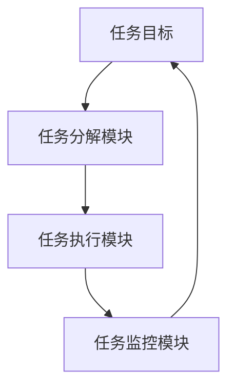
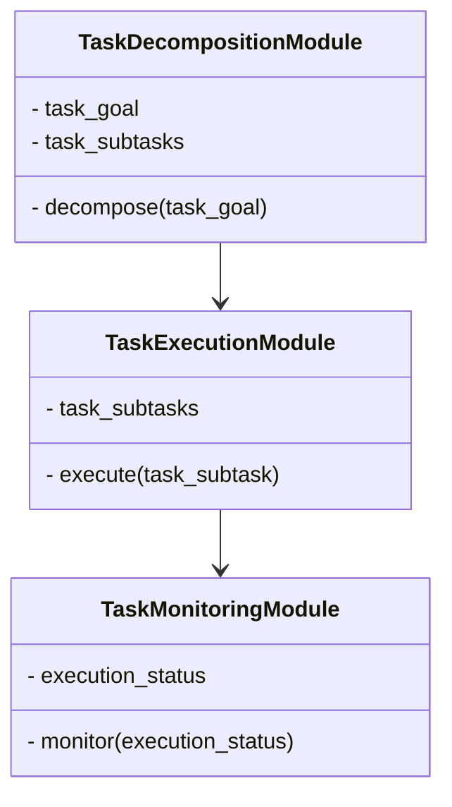
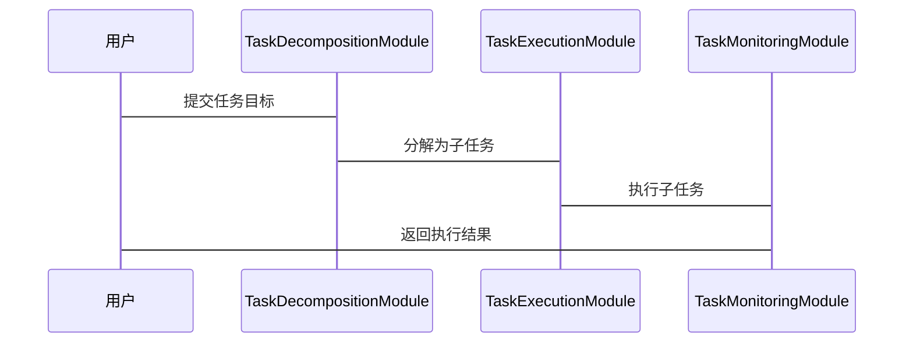

                 


# 《任务导向型 AI Agent：基于 LLM 的目标完成系统》

---

## 文章关键词  
- 任务导向型 AI Agent  
- 大型语言模型（LLM）  
- 任务分解与执行  
- 系统架构设计  
- 实践应用  

---

## 摘要  
任务导向型 AI Agent 是一种基于大型语言模型（LLM）的目标完成系统，它能够理解任务目标、分解任务并执行操作。本文从核心概念、算法原理、系统架构到项目实战，全面解析任务导向型 AI Agent 的构建与应用，帮助读者掌握其设计与实现的关键技术。

---

## 第1章：任务导向型 AI Agent 的背景与问题背景  

### 1.1 问题背景  

#### 1.1.1 传统 AI 系统的局限性  
传统的 AI 系统通常基于规则或有限的预定义逻辑运行，难以应对复杂多变的任务目标。  

#### 1.1.2 任务导向型 AI Agent 的需求与目标  
任务导向型 AI Agent 需要能够理解任务目标、分解任务并执行操作，以实现复杂目标。  

#### 1.1.3 任务导向型 AI Agent 的应用场景与边界  
应用场景包括智能助手、自动化流程、客服系统等，边界在于任务目标的复杂性和系统能力的限制。  

---

### 1.2 问题描述  

#### 1.2.1 任务导向型 AI Agent 的核心问题  
如何将任务目标分解为可执行的子任务，并通过 LLM 实现任务的高效完成。  

#### 1.2.2 任务分解与执行的挑战  
任务分解的复杂性、任务优先级的动态变化、任务执行的不确定性。  

#### 1.2.3 目标与任务之间的关系  
目标是高层次的意图，任务是目标的具体实现步骤。  

---

### 1.3 问题解决与解决方案  

#### 1.3.1 任务导向型 AI Agent 的解决方案  
结合 LLM 的自然语言处理能力与任务规划算法，实现任务分解与执行。  

#### 1.3.2 基于 LLM 的目标完成方法  
通过 LLM 分解任务、生成执行步骤并监控任务完成情况。  

#### 1.3.3 解决方案的优缺点与适用性  
优点：灵活性高、可扩展性强；缺点：依赖 LLM 的性能和数据质量。  

---

### 1.4 核心概念与结构  

#### 1.4.1 任务导向型 AI Agent 的定义与核心要素  
定义：能够理解任务目标、分解任务并执行操作的智能系统。  
核心要素：任务目标、任务分解、任务执行、任务监控。  

#### 1.4.2 相关概念对比（表格）  
| 概念 | 定义 | 特点 |  
|------|------|------|  
| AI Agent | 智能体 | 能够感知环境并采取行动 |  
| LLM | 大型语言模型 | 基于深度学习的自然语言处理模型 |  
| 任务导向型 AI Agent | 基于任务目标的智能系统 | 结合 LLM 与任务规划 |  

#### 1.4.3 系统架构与核心模块  
核心模块：任务目标输入模块、任务分解模块、任务执行模块、任务监控模块。  

---

## 第2章：任务导向型 AI Agent 的核心概念  

### 2.1 AI Agent 的基本原理  

#### 2.1.1 AI Agent 的定义与分类  
定义：智能体能够感知环境并采取行动。  
分类：基于反应式和基于规划式 AI Agent。  

#### 2.1.2 基于 LLM 的 AI Agent 的特点  
自然语言处理能力强、任务分解能力突出。  

#### 2.1.3 任务导向型 AI Agent 的核心属性  
目标驱动性、任务分解能力、动态适应性。  

---

### 2.2 任务分解与执行机制  

#### 2.2.1 任务分解的原理与方法  
将复杂任务分解为简单子任务，确保每个子任务独立可执行。  

#### 2.2.2 任务优先级与调度策略  
根据任务的重要性和紧急性进行优先级排序，动态调整执行顺序。  

#### 2.2.3 任务执行的监控与反馈  
实时监控任务执行状态，根据反馈调整执行策略。  

---

### 2.3 LLM 在任务导向型 AI Agent 中的作用  

#### 2.3.1 LLM 作为知识库与推理引擎  
LLM 作为知识库，提供任务分解的逻辑推理能力。  

#### 2.3.2 LLM 在任务分解与规划中的应用  
通过 LLM 分解任务并生成执行步骤。  

#### 2.3.3 LLM 与任务执行的结合  
LLM 生成任务执行指令并驱动执行模块。  

---

## 第3章：任务导向型 AI Agent 的算法原理  

### 3.1 算法原理概述  

#### 3.1.1 算法概述  
任务分解算法、任务执行算法、任务监控算法。  

---

### 3.2 算法实现步骤  

#### 3.2.1 任务分解算法  
步骤：  
1. 输入任务目标。  
2. 使用 LLM 分解任务。  
3. 输出子任务列表。  

#### 3.2.2 任务执行算法  
步骤：  
1. 选择子任务优先级。  
2. 执行子任务。  
3. 监控执行状态。  

#### 3.2.3 任务监控算法  
步骤：  
1. 实时跟踪任务执行状态。  
2. 根据反馈调整执行策略。  

---

### 3.3 算法实现的数学模型与公式  

#### 3.3.1 任务分解模型  
公式：$$ task\_decomposition = f_{LLM}(task\_goal) $$  
解释：任务分解是通过 LLM 函数将任务目标分解为子任务。  

#### 3.3.2 任务执行模型  
公式：$$ task\_execution = \argmax_{i} (priority\_score_i) $$  
解释：根据优先级分数选择优先执行的任务。  

---

## 第4章：任务导向型 AI Agent 的系统分析与架构设计  

### 4.1 系统架构设计  

#### 4.1.1 系统架构图  


#### 4.1.2 领域模型  


---

### 4.2 系统接口与交互设计  

#### 4.2.1 系统接口设计  
接口：任务目标输入、任务分解接口、任务执行接口、任务监控接口。  

#### 4.2.2 系统交互流程  
流程图：  


---

## 第5章：任务导向型 AI Agent 的项目实战  

### 5.1 环境安装与配置  

#### 5.1.1 环境安装  
安装 Python 和所需的依赖库（如 OpenAI 库）。  

#### 5.1.2 配置 API 键  
设置 OpenAI API 密钥，用于调用 GPT-3.5-turbo 模型。  

---

### 5.2 核心代码实现  

#### 5.2.1 任务分解模块  
```python  
import openai  

def decompose_task(task_goal):  
    # 调用 LLM 分解任务  
    completion = openai.ChatCompletion.create(  
        model="gpt-3.5-turbo",  
        messages=[  
            {"role": "user", "content": f"分解任务：{task_goal}"}  
        ]  
    )  
    return [message.content for message in completion.choices[0].messages if message.role == "assistant"]  
```

#### 5.2.2 任务执行模块  
```python  
def execute_task(subtasks):  
    # 模拟任务执行过程  
    for task in subtasks:  
        print(f"执行任务：{task}")  
        # 模拟执行时间  
        import time  
        time.sleep(1)  
    return True  
```

#### 5.2.3 任务监控模块  
```python  
def monitor_execution(execution_status):  
    # 监控任务执行状态  
    if execution_status["status"] == "failed":  
        return "任务执行失败，请检查原因。"  
    else:  
        return "任务执行成功。"  
```

---

### 5.3 实际案例分析  

#### 5.3.1 案例描述  
任务目标：完成一篇技术博客文章。  

#### 5.3.2 分解步骤  
1. 分解为：收集资料、撰写大纲、编写正文、校对修改。  
2. 执行步骤：按优先级顺序完成每个子任务。  

---

### 5.4 系统优化与扩展  

#### 5.4.1 系统优化  
优化任务分解算法，提高任务执行的效率。  

#### 5.4.2 系统扩展  
支持多任务并行执行，增加任务优先级动态调整功能。  

---

## 第6章：任务导向型 AI Agent 的最佳实践与总结  

### 6.1 最佳实践  

#### 6.1.1 设计原则  
模块化设计、可扩展性设计、容错性设计。  

#### 6.1.2 实施建议  
选择合适的 LLM 模型、优化任务分解算法、加强任务监控能力。  

---

### 6.2 小结  

任务导向型 AI Agent 是结合 LLM 和任务规划的智能系统，能够高效完成复杂任务。  

---

### 6.3 注意事项  

#### 6.3.1 系统性能问题  
确保 LLM 的调用效率和任务执行的实时性。  

#### 6.3.2 数据质量问题  
任务分解和执行的效果依赖于 LLM 的数据质量。  

---

### 6.4 拓展阅读  

#### 6.4.1 推荐书籍  
- 《人工智能：现代方法》  
- 《大语言模型的原理与应用》  

#### 6.4.2 推荐论文  
- 基于 LLM 的任务规划研究  
- 智能 Agent 的最新进展  

---

## 总结  
任务导向型 AI Agent 是一个结合 LLM 和任务规划的复杂系统，通过合理的架构设计和算法实现，能够高效完成复杂任务。本文通过背景、原理、架构到实战的全面解析，为读者提供了构建此类系统的详细指南。

