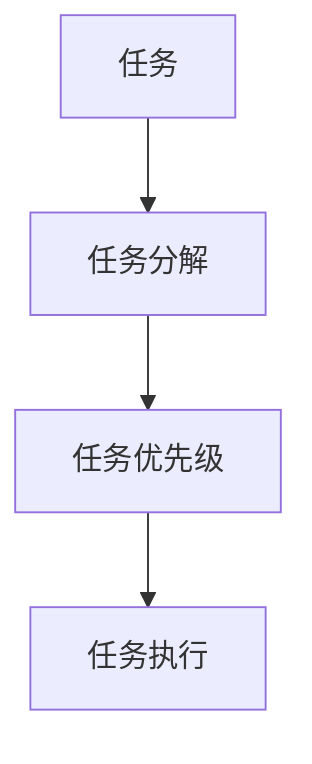
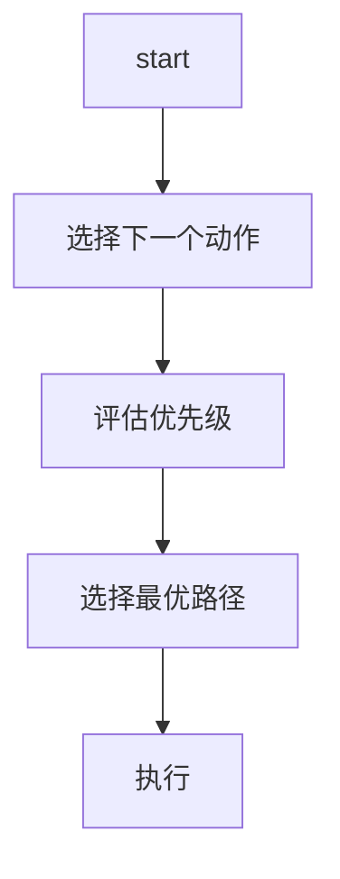
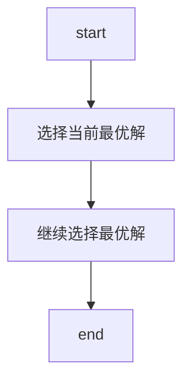
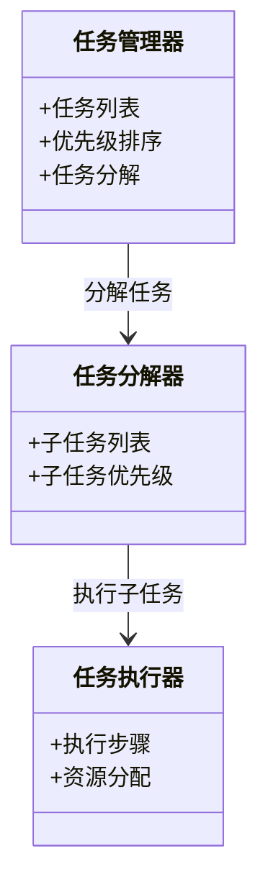
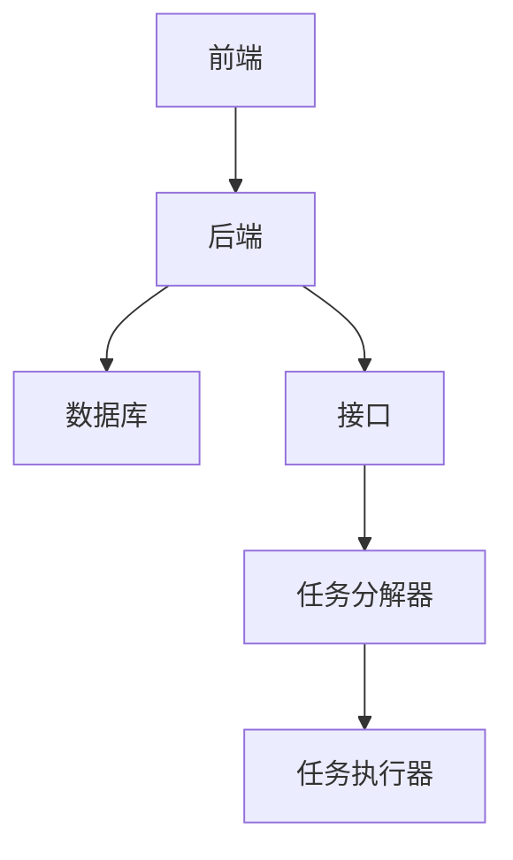

                 


# 《任务规划与分解：提高AI Agent的问题解决能力》

---

## 关键词：
- 任务规划
- 任务分解
- AI Agent
- 问题解决
- 算法原理
- 系统架构
- 项目实战

---

## 摘要：
本文围绕AI Agent在任务规划与分解中的问题解决能力展开，系统地分析了任务规划与分解的核心概念、算法原理、系统架构设计、项目实战以及最佳实践。通过详细讲解任务分解与任务规划的原理、算法实现、系统架构设计和实际案例，本文旨在帮助读者全面理解并掌握AI Agent任务规划与分解的关键技术，从而提高其在复杂问题中的解决能力。

---

# 第1章: 任务规划与分解的背景与核心概念

## 1.1 问题背景

### 1.1.1 问题背景介绍
任务规划与分解是AI Agent实现智能决策的核心能力之一。随着AI技术的快速发展，AI Agent需要在复杂环境中完成各种任务，例如自动驾驶中的路径规划、智能助手的任务分配等。然而，复杂的任务往往需要分解为多个子任务，通过优先级排序和协同执行来完成整体目标。

### 1.1.2 问题描述与分析
在实际应用中，AI Agent面临的问题通常是多目标、多约束的复杂问题。例如，一个智能助手需要根据用户的请求分解任务，优先处理重要任务，同时考虑资源限制和时间约束。任务规划与分解的目标是将复杂任务拆解为可执行的子任务，并制定合理的执行计划。

### 1.1.3 问题解决的必要性
任务规划与分解是AI Agent实现高效问题解决的关键。通过任务分解，AI Agent可以更好地应对复杂问题，提高执行效率和准确性。同时，任务规划可以帮助AI Agent在多目标冲突时做出最优选择，确保任务的顺利执行。

## 1.2 任务规划与分解的核心概念

### 1.2.1 核心概念的定义
- **任务分解**：将复杂任务拆解为多个子任务，每个子任务具有明确的目标和约束条件。
- **任务规划**：根据任务分解的结果，制定任务的执行顺序和资源分配策略。
- **任务优先级**：根据任务的重要性和紧急性，确定任务的执行顺序。

### 1.2.2 任务规划与分解的边界与外延
- **边界**：任务分解和规划仅关注任务本身，不涉及具体执行细节。
- **外延**：任务分解和规划的结果将为任务执行提供输入，但不直接参与执行过程。

### 1.2.3 概念结构与核心要素组成
- **核心要素**：任务目标、任务分解、任务优先级、任务约束、资源分配。
- **概念结构**：任务目标是核心，任务分解和优先级是关键手段，任务约束和资源分配是辅助条件。

---

# 第2章: 任务规划与分解的核心概念与联系

## 2.1 核心概念的原理

### 2.1.1 任务分解的基本原理
任务分解通过将复杂任务拆解为多个子任务，每个子任务具有明确的目标和约束条件。例如，自动驾驶中的路径规划可以分解为路径搜索、障碍物避让等子任务。

### 2.1.2 任务规划的逻辑框架
任务规划的核心是制定任务的执行顺序和资源分配策略。例如，智能助手的任务分配可以根据用户的优先级和资源限制进行规划。

### 2.1.3 任务优先级的确定方法
任务优先级通常基于任务的重要性和紧急性。例如，紧急任务优先级高于常规任务。

## 2.2 核心概念的属性特征对比

| **属性**       | **任务分解**       | **任务规划**         | **任务优先级**       |
|----------------|--------------------|----------------------|----------------------|
| **核心目标**    | 拆解任务结构       | 制定执行计划         | 确定执行顺序         |
| **依赖条件**    | 子任务目标         | 优先级和资源约束     | 任务的重要性和紧急性 |
| **结果形式**    | 子任务列表         | 执行顺序和资源分配   | 优先级排序           |

### 2.3 ER实体关系图架构


---

# 第3章: 任务规划与分解的算法原理

## 3.1 算法原理概述

### 3.1.1 任务分解的基本算法
任务分解可以通过贪心算法、动态规划等方法实现。例如，贪心算法可以逐步选择最优子任务进行分解。

### 3.1.2 任务规划的核心算法
任务规划的核心算法包括A*算法、Dijkstra算法等。例如，A*算法可以在路径规划中找到最优路径。

### 3.1.3 算法的优缺点对比
| **算法**      | **优点**                     | **缺点**                   |
|---------------|----------------------------|---------------------------|
| A*算法        | 能找到最优路径               | 计算复杂度较高             |
| 贪心算法      | 计算简单，适合在线任务处理     | 可能无法找到全局最优解       |

## 3.2 算法原理的详细讲解

### 3.2.1 A*算法在任务规划中的应用
A*算法是一种常用的任务规划算法，通过评估节点的优先级来选择最优路径。公式如下：
$$f(n) = g(n) + h(n)$$
其中，$g(n)$表示已走的路径成本，$h(n)$表示启发函数估计的剩余路径成本。



### 3.2.2 贪心算法在任务分解中的应用
贪心算法在任务分解中通常用于快速选择当前最优解。例如，在路径规划中，贪心算法可以选择最近的障碍物进行避让。



---

# 第4章: 任务规划与分解的系统分析与架构设计

## 4.1 项目介绍

### 4.1.1 项目背景
本项目旨在设计一个AI Agent的任务规划与分解系统，用于解决复杂任务中的多目标冲突问题。

### 4.1.2 项目目标
- 实现任务分解功能
- 实现任务优先级排序
- 实现任务执行监控

## 4.2 系统功能设计

### 4.2.1 领域模型


### 4.2.2 系统架构设计


---

# 第5章: 任务规划与分解的项目实战

## 5.1 环境安装

### 5.1.1 环境要求
- Python 3.8及以上版本
- 安装依赖库：numpy、pandas、scipy

### 5.1.2 安装命令
```bash
pip install numpy pandas scipy
```

## 5.2 系统核心实现

### 5.2.1 核心代码实现
```python
import numpy as np
import pandas as pd

def task_decomposition(tasks):
    # 任务分解算法
    return decomposed_tasks

def task_priority(tasks):
    # 任务优先级排序算法
    return prioritized_tasks

def task_execution(decomposed_tasks):
    # 任务执行模块
    pass

# 示例代码
tasks = ["任务1", "任务2", "任务3"]
decomposed_tasks = task_decomposition(tasks)
prioritized_tasks = task_priority(decomposed_tasks)
task_execution(prioritized_tasks)
```

### 5.2.2 代码解读与分析
- `task_decomposition`函数：将输入的任务列表分解为子任务。
- `task_priority`函数：根据优先级对子任务进行排序。
- `task_execution`函数：执行分解后的任务。

## 5.3 案例分析

### 5.3.1 案例背景
假设一个智能助手需要处理用户的查询请求，例如“安排明天的会议”。

### 5.3.2 案例分析
1. **任务分解**：将“安排明天的会议”分解为“创建会议邀请”、“发送邮件”、“提醒参会人员”等子任务。
2. **任务优先级**：根据重要性排序，优先处理“创建会议邀请”。
3. **任务执行**：智能助手执行优先级最高的任务。

## 5.4 项目小结
通过本项目，我们可以看到任务分解和任务规划在实际应用中的重要性。任务分解可以帮助AI Agent更好地应对复杂任务，而任务规划则可以提高任务执行的效率和准确性。

---

# 第6章: 任务规划与分解的最佳实践

## 6.1 小结
任务规划与分解是AI Agent实现智能决策的关键技术。通过合理分解任务和制定执行计划，AI Agent可以在复杂环境中高效解决问题。

## 6.2 注意事项
- **任务分解的粒度**：任务分解的粒度应适中，过细会增加计算复杂度，过粗会影响执行效率。
- **任务优先级的动态调整**：任务优先级应根据实时情况动态调整，例如紧急任务优先级高于常规任务。

## 6.3 拓展阅读
- 《人工智能：现代方法》
- 《算法导论》
- 《分布式系统：概念与设计》

---

# 附录: 术语表
- **任务分解**：将复杂任务拆解为多个子任务。
- **任务规划**：制定任务的执行顺序和资源分配策略。
- **任务优先级**：根据任务的重要性和紧急性确定的执行顺序。

---

通过以上内容，我们全面分析了任务规划与分解在AI Agent中的应用，从核心概念到算法实现，再到系统设计和项目实战，为读者提供了系统的知识体系和实践指导。

