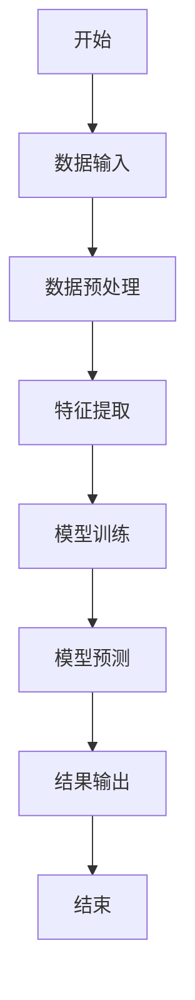
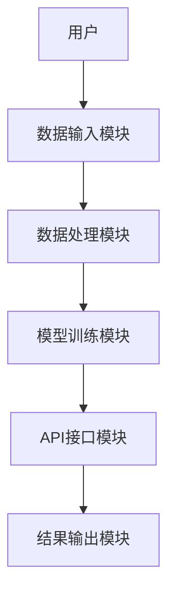
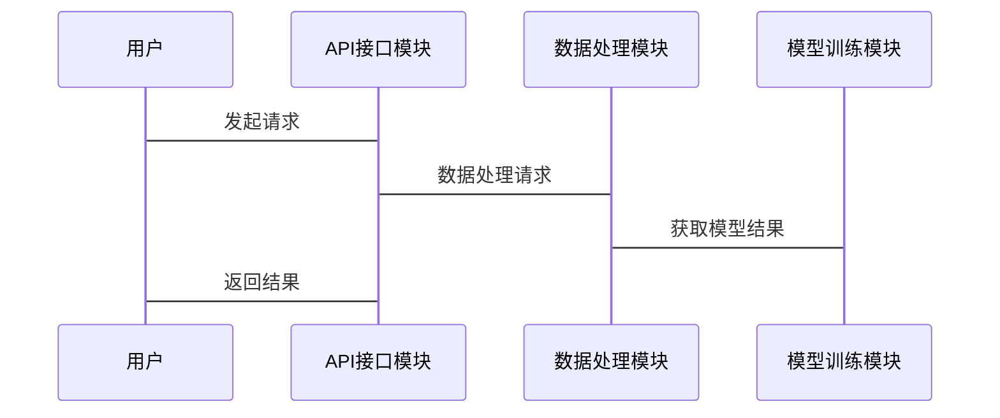

                 


# 企业AI Agent的API设计与管理

## 关键词：
- 企业AI Agent
- API设计
- API管理
- 系统架构
- AI算法
- 数学模型
- 项目实战

## 摘要：
随着人工智能技术的快速发展，企业AI Agent的应用场景越来越广泛。API作为企业AI Agent的核心接口，其设计与管理至关重要。本文将从企业AI Agent的基本概念出发，详细探讨其核心算法、系统架构、API设计原则与管理策略，并通过实际案例分析，为企业在AI Agent的API设计与管理提供实用的指导和最佳实践。

---

# 第1章: 企业AI Agent的基本概念与背景

## 1.1 AI Agent的基本概念
### 1.1.1 什么是AI Agent
- AI Agent的定义
- AI Agent的核心特征
- AI Agent与传统程序的区别

### 1.1.2 企业AI Agent的定义与特点
- 企业AI Agent的定义
- 企业AI Agent的特点（智能化、自动化、可扩展性）
- 企业AI Agent的应用场景

### 1.1.3 企业AI Agent的背景与发展趋势
- 企业智能化转型的背景
- AI Agent在企业中的价值
- 企业AI Agent的发展趋势

## 1.2 企业AI Agent的应用场景
### 1.2.1 智能客服
- 自动化客服系统
- 个性化服务
- 实时问题解决

### 1.2.2 智能推荐系统
- 基于AI的推荐算法
- 用户行为分析
- 动态推荐策略

### 1.2.3 企业流程自动化
- RPA与AI Agent的结合
- 自动化任务处理
- 流程优化

## 1.3 企业AI Agent的API设计与管理的重要性
### 1.3.1 API在企业AI Agent中的作用
- API作为AI Agent的核心接口
- API的设计原则
- API的可扩展性与兼容性

### 1.3.2 企业AI Agent中的API管理挑战
- 多系统集成的复杂性
- API的安全性与可靠性
- API性能优化

### 1.3.3 本章小结
- 企业AI Agent的API设计与管理是企业智能化转型的关键
- 需要结合企业需求与技术特点，制定合理的API设计与管理策略

---

# 第2章: 企业AI Agent的核心概念与原理

## 2.1 AI Agent的组成与结构
### 2.1.1 AI Agent的组成模块
- 数据输入模块
- 数据处理模块
- 决策模块
- 执行模块

### 2.1.2 各模块之间的关系
- 数据流与信息传递
- 模块之间的协同工作
- 模块化设计的优势

### 2.1.3 实体关系图（ER图）
```mermaid
erd
  title 实体关系图
  User
    username
    role
    permissions
  AI-Agent
    agent_id
    name
    description
  API_Interface
    api_id
    interface_name
    method
    endpoint
  ...
  User --o> AI-Agent: "用户使用AI Agent"
  AI-Agent --o> API_Interface: "AI Agent调用API接口"
```

## 2.2 AI Agent的工作原理
### 2.2.1 AI Agent的执行流程
- 输入数据的接收与解析
- 数据处理与分析
- 决策与执行
- 结果反馈

### 2.2.2 数据流与信息处理
- 数据预处理
- 数据分析与建模
- 数据驱动决策

### 2.2.3 任务分解与协同
- 任务分解的原理
- 多任务协同的机制
- 任务优先级的确定

## 2.3 AI Agent的API设计原则
### 2.3.1 API设计的基本原则
- RESTful设计
- 易用性
- 可扩展性

### 2.3.2 企业级API设计的特殊要求
- 高可用性
- 安全性
- 性能优化

### 2.3.3 API版本管理与兼容性
- 版本控制策略
- 向后兼容性
- 版本回滚机制

---

# 第3章: 企业AI Agent的算法原理与数学模型

## 3.1 AI Agent的核心算法概述
### 3.1.1 常见AI算法简介
- 机器学习算法
- 深度学习算法
- 自然语言处理算法

### 3.1.2 AI Agent算法的分类
- 监督学习
- 无监督学习
- 强化学习

### 3.1.3 算法选择与优化
- 算法选择的依据
- 算法优化技巧
- 算法性能评估

## 3.2 AI Agent的数学模型与公式
### 3.2.1 基本数学模型
- 线性回归模型
- 逻辑回归模型
- 支持向量机模型

### 3.2.2 算法流程图（Mermaid）


### 3.2.3 数学公式与推导
- 线性回归公式：$y = \beta_0 + \beta_1x + \epsilon$
- 逻辑回归公式：$P(y=1|x) = \frac{e^{\beta_0 + \beta_1x}}{1 + e^{\beta_0 + \beta_1x}}$
- 支持向量机目标函数：$$\min_{\mathbf{w}, b, \xi} \frac{1}{2}\|\mathbf{w}\|^2 + C\sum_{i=1}^{n}\xi_i$$
  $$\text{subject to } y_i(\mathbf{w}\cdot \mathbf{x}_i + b) \geq 1 - \xi_i, \xi_i \geq 0$$

## 3.3 算法实现与优化
### 3.3.1 算法实现步骤
- 数据输入与预处理
- 模型训练与优化
- 结果输出与反馈

### 3.3.2 算法优化技巧
- 参数调优
- 模型压缩
- 并行计算

### 3.3.3 算法复杂度分析
- 时间复杂度
- 空间复杂度
- 计算效率优化

---

# 第4章: 企业AI Agent的系统架构与设计

## 4.1 系统架构概述
### 4.1.1 系统整体架构
- 分层架构
- 微服务架构
- 组件化设计

### 4.1.2 系统功能模块划分
- 数据处理模块
- 模型训练模块
- API接口模块
- 监控与日志模块

### 4.1.3 系统架构图（Mermaid）


## 4.2 API设计与管理的系统实现
### 4.2.1 API设计规范
- RESTful API设计
- JSON格式规范
- API文档编写

### 4.2.2 API管理平台的功能设计
- API分组管理
- 权限管理
- 监控与统计

### 4.2.3 API调用与监控
- 调用流程
- 性能监控
- 错误处理

## 4.3 系统交互设计
### 4.3.1 系统交互流程
- 用户发起请求
- 系统处理请求
- 返回处理结果

### 4.3.2 系统交互图（Mermaid）


---

# 第5章: 企业AI Agent的项目实战

## 5.1 项目介绍
### 5.1.1 项目背景
- 智能客服系统开发
- 需求分析
- 项目目标

### 5.1.2 项目技术选型
- 技术栈选择
- 开发工具
- 依赖管理

## 5.2 核心代码实现
### 5.2.1 环境安装
- Python版本要求
- 依赖安装（如pip install requests、numpy等）

### 5.2.2 核心代码解读
```python
# 示例代码：AI Agent的API调用
import requests

url = "http://localhost:8080/api/v1/agent"
payload = {
    "input": "用户查询内容",
    "parameters": {
        "mode": "text",
        "timeout": 30
    }
}
response = requests.post(url, json=payload)
print(response.json())
```

### 5.2.3 代码实现步骤
- 环境配置
- API接口开发
- 模型训练与部署
- 系统集成与测试

## 5.3 项目案例分析
### 5.3.1 案例背景
- 某企业智能客服系统
- 需求分析
- 解决方案设计

### 5.3.2 系统实现与分析
- API设计与实现
- 模型训练与部署
- 系统运行与测试

## 5.4 项目总结与优化
### 5.4.1 项目总结
- 项目成果
- 经验与教训

### 5.4.2 项目优化建议
- 系统性能优化
- API设计优化
- 模型优化建议

---

# 第6章: 企业AI Agent的API设计与管理的最佳实践

## 6.1 最佳实践
### 6.1.1 API设计原则
- 易用性
- 可扩展性
- 安全性

### 6.1.2 API管理策略
- 版本管理
- 权限控制
- 性能优化

## 6.2 小结
- 企业AI Agent的API设计与管理是企业智能化转型的关键
- 需要结合企业需求与技术特点，制定合理的API设计与管理策略

## 6.3 注意事项
- 数据安全与隐私保护
- 系统性能与稳定性
- 人员培训与技术支持

## 6.4 拓展阅读
- 《RESTful API设计规范》
- 《微服务架构设计》
- 《AI算法实现与优化》

---

# 总结

企业AI Agent的API设计与管理是一个复杂但重要的任务。通过本文的详细讲解，我们了解了企业AI Agent的基本概念、核心算法、系统架构、API设计原则与管理策略，并通过实际案例分析，提供了实用的指导和最佳实践。未来，随着AI技术的不断发展，企业AI Agent的应用场景将更加广泛，API设计与管理也将面临更多的挑战和机遇。

