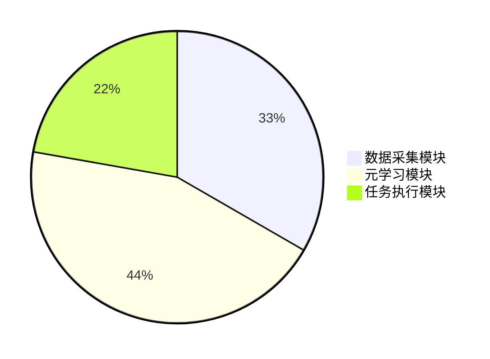

                 


# 企业AI Agent的元学习框架：快速适应新任务与领域

> **关键词**：企业AI Agent、元学习框架、快速适应新任务、领域适应、AI系统优化、Meta-Learning、AI Agent设计

> **摘要**：  
> 随着人工智能技术的快速发展，企业AI Agent在各个领域的应用越来越广泛。然而，AI Agent在面对新任务和新领域时，通常需要大量的数据和时间进行重新训练，这限制了其在企业中的快速部署和广泛应用。为了解决这一问题，元学习框架应运而生。本文将详细探讨企业AI Agent的元学习框架，从核心概念、算法原理、系统设计到实际应用，逐步分析元学习框架如何帮助AI Agent快速适应新任务和新领域。通过本文的讲解，读者将能够理解元学习框架的原理、实现方法以及在企业中的实际应用价值。

---

## 第一部分：企业AI Agent与元学习框架的背景介绍

### 第1章：企业AI Agent的定义与背景

#### 1.1 AI Agent的基本概念
- **1.1.1 AI Agent的定义**
  AI Agent（人工智能代理）是一种能够感知环境、自主决策并执行任务的智能实体。它能够通过传感器获取信息，利用计算模型进行分析，并通过执行器与外部环境交互。

- **1.1.2 AI Agent的核心特征**
  - **自主性**：能够在没有外部干预的情况下自主决策。
  - **反应性**：能够实时感知环境并做出反应。
  - **目标导向性**：具有明确的目标，并通过行动实现目标。
  - **学习能力**：能够通过经验或数据进行自我优化和改进。

- **1.1.3 AI Agent与传统AI的区别**
  - 传统AI通常专注于特定任务，而AI Agent具有更强的自主性和适应性。
  - AI Agent能够与环境交互，而传统AI更多是静态的计算工具。

#### 1.2 元学习的定义与特点
- **1.2.1 元学习的定义**
  元学习（Meta-Learning）是一种机器学习方法，旨在通过学习多个任务的共同特征，使得模型能够快速适应新任务，而无需从头开始训练。

- **1.2.2 元学习的核心优势**
  - **快速适应新任务**：通过学习任务之间的共同特征，元学习模型能够在少量数据下快速适应新任务。
  - **减少数据依赖**：传统机器学习需要大量标注数据，而元学习可以在数据稀缺的情况下仍保持较好的性能。
  - **泛化能力更强**：元学习模型能够更好地泛化到未见过的任务和领域。

- **1.2.3 元学习与传统机器学习的对比**
  | 对比维度 | 传统机器学习 | 元学习 |
  |----------|--------------|--------|
  | 数据需求 | 需要大量标注数据 | 需要少量标注数据 |
  | 适应新任务 | 需要重新训练 | 可以快速适应新任务 |
  | 泛化能力 | 较弱 | 较强 |

#### 1.3 企业AI Agent的场景与应用
- **1.3.1 企业AI Agent的应用场景**
  - **客户支持**：通过自然语言处理（NLP）与客户交互，提供智能客服服务。
  - **业务流程自动化**：自动处理订单、跟踪物流、管理供应链。
  - **风险管理**：实时监控企业运营中的风险，并提出应对策略。

- **1.3.2 企业AI Agent的潜在价值**
  - 提高企业运营效率。
  - 减少人工成本。
  - 提供24/7的全天候服务。

- **1.3.3 企业AI Agent的挑战与机遇**
  - **挑战**：快速适应新任务和新领域的能力不足，数据隐私和安全问题。
  - **机遇**：通过元学习框架快速提升AI Agent的适应能力，拓展应用场景。

---

## 第二部分：企业AI Agent的元学习框架核心概念与联系

### 第2章：元学习框架的核心概念与原理

#### 2.1 元学习框架的组成要素
- **2.1.1 元学习器（Meta-Learner）**
  元学习器是元学习框架的核心组件，负责学习任务之间的共同特征，并生成适用于具体任务的模型参数。

- **2.1.2 任务适配器（Task Adapter）**
  任务适配器的作用是将不同任务的特征转换为元学习器能够理解的形式，以便快速生成适用于具体任务的模型。

- **2.1.3 知识库（Knowledge Base）**
  知识库存储了企业中相关的知识和经验，能够为元学习器提供上下文信息，帮助其更好地适应新任务。

#### 2.2 元学习与传统机器学习的对比
- **2.2.1 学习目标的对比**
  - 传统机器学习：通过大量数据训练一个适用于特定任务的模型。
  - 元学习：通过学习多个任务的共同特征，生成适用于任意新任务的模型。

- **2.2.2 学习过程的对比**
  - 传统机器学习：每个任务独立训练。
  - 元学习：通过元训练过程，学习任务之间的共同特征。

- **2.2.3 性能评估的对比**
  - 传统机器学习：在特定任务上评估模型性能。
  - 元学习：在未见过的任务上评估模型的泛化能力。

#### 2.3 元学习框架的ER实体关系图
```mermaid
er
actor: 用户
role: 管理员
entity: 元学习框架
    - id
    - 元学习算法
    - 知识库
    - 任务适配器
```

---

## 第三部分：企业AI Agent的元学习框架算法原理

### 第3章：元学习算法的原理与实现

#### 3.1 元学习算法的基本原理
- **3.1.1 元学习的目标函数**
  $$ L_{meta}(θ, θ') = \sum_{i=1}^{N} L_i(θ', θ_i) $$
  其中，θ是元学习器的参数，θ_i是具体任务i的模型参数，L_i是任务i的损失函数。

- **3.1.2 元学习的优化过程**
  通过优化元学习器的参数θ，使得在多个任务上的损失函数最小化。

#### 3.2 基于梯度的元学习算法
- **3.2.1 Meta-AAML算法**
  ```mermaid
  graph LR
  A[开始] --> B[初始化元学习器参数θ]
  B --> C[选择一批任务]
  C --> D[对每个任务i，计算梯度梯度_i]
  D --> E[更新元学习器参数θ]
  E --> F[结束]
  ```

  ```python
  def meta_learning_step(meta_model, tasks, inner_lr, outer_lr):
      for task in tasks:
          # 训练任务模型
          with torch.no_grad():
              task_model_params = meta_model(train_data, train_labels)
          # 更新任务模型参数
          task_model_params = task_model_params - inner_lr * task_model_params.grad
          # 更新元学习器参数
          meta_model.update(task_model_params, outer_lr)
  ```

---

## 第四部分：企业AI Agent的元学习框架系统设计

### 第4章：企业AI Agent的系统功能设计

#### 4.1 系统功能模块
- **4.1.1 数据采集模块**
  - 负责采集企业中的各种数据，包括文本、图像、结构化数据等。

- **4.1.2 元学习模块**
  - 负责对多个任务进行元学习，生成适用于具体任务的模型参数。

- **4.1.3 任务执行模块**
  - 根据生成的模型参数，执行具体的任务，并返回结果。

#### 4.2 系统架构设计


---

## 第五部分：企业AI Agent的元学习框架项目实战

### 第5章：企业AI Agent的元学习框架实现

#### 5.1 项目环境配置
```bash
pip install torch
pip install numpy
pip install matplotlib
```

#### 5.2 系统核心实现源代码
```python
import torch
import torch.nn as nn
import torch.optim as optim

class MetaLearner(nn.Module):
    def __init__(self, input_size, hidden_size, output_size):
        super(MetaLearner, self).__init__()
        self.fc1 = nn.Linear(input_size, hidden_size)
        self.fc2 = nn.Linear(hidden_size, output_size)

    def forward(self, x):
        x = torch.relu(self.fc1(x))
        x = self.fc2(x)
        return x

def meta_learning_step(meta_model, tasks, inner_lr, outer_lr):
    for task in tasks:
        # 训练任务模型
        with torch.no_grad():
            task_model_params = meta_model(task.input)
        # 更新任务模型参数
        task_model_params = task_model_params - inner_lr * task_model_params.grad
        # 更新元学习器参数
        meta_model.update(task_model_params, outer_lr)
```

---

## 第六部分：企业AI Agent的元学习框架优化与部署

### 第6章：元学习框架的优化与部署

#### 6.1 模型优化技术
- **6.1.1 模型压缩**
  通过剪枝、量化等技术减少模型参数量，提升推理速度。

- **6.1.2 分布式训练**
  利用分布式计算框架（如分布式数据并行）加速模型训练。

#### 6.2 模型部署与监控
- **6.2.1 模型部署**
  将元学习框架部署到企业现有的IT系统中，提供API接口供其他系统调用。

- **6.2.2 模型监控**
  实时监控模型的性能和健康状况，及时发现并解决问题。

---

## 第七部分：总结与展望

### 第7章：总结与展望

#### 7.1 总结
本文详细探讨了企业AI Agent的元学习框架，从核心概念、算法原理、系统设计到实际应用，逐步分析了元学习框架如何帮助AI Agent快速适应新任务和新领域。通过本文的讲解，读者能够理解元学习框架的原理、实现方法以及在企业中的实际应用价值。

#### 7.2 展望
未来，随着元学习技术的不断发展，企业AI Agent的适应能力将不断提升。我们可以期待更多创新的元学习算法和系统架构，为企业AI Agent的应用带来更大的可能性。

---

通过以上目录和内容的详细设计，读者可以系统地学习企业AI Agent的元学习框架，从理论到实践，逐步掌握如何利用元学习框架快速适应新任务和新领域。

