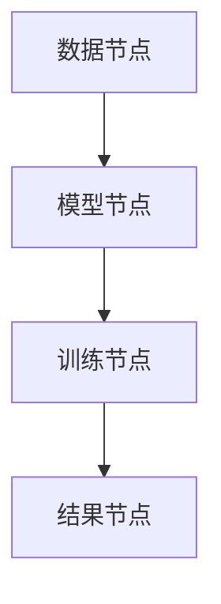
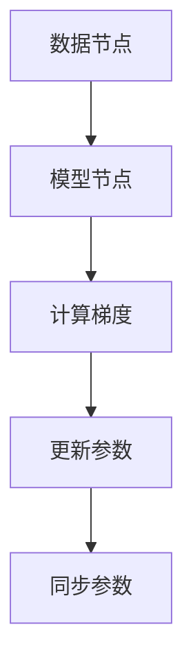
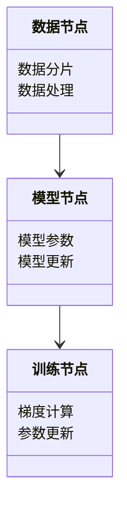
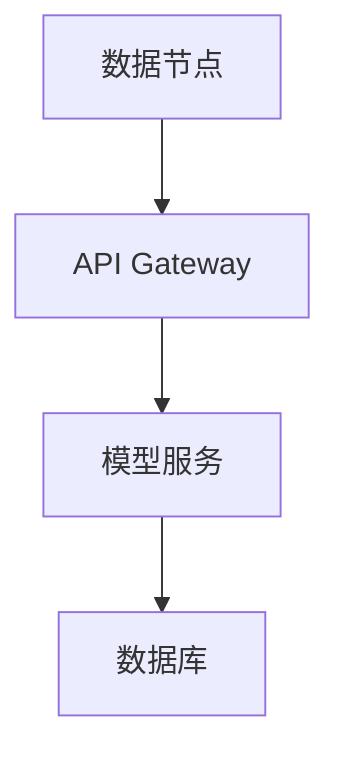

                 


# 企业AI Agent的分布式学习框架

> 关键词：企业AI Agent，分布式学习，机器学习，系统架构，Python实现

> 摘要：本文深入探讨了企业AI Agent的分布式学习框架，从背景介绍、核心概念到算法原理、系统架构，再到项目实战，全面解析了如何构建高效的分布式学习框架，帮助企业在复杂的环境中实现智能决策和优化。

---

# 第一部分: 企业AI Agent的分布式学习框架概述

## 第1章: 企业AI Agent与分布式学习框架概述

### 1.1 企业AI Agent的基本概念

#### 1.1.1 AI Agent的定义与核心功能

AI Agent（人工智能代理）是指能够感知环境、自主决策并执行任务的智能体。企业AI Agent通过感知企业内外的信息，利用机器学习、自然语言处理等技术，为企业提供自动化决策支持。

**核心功能：**
- **感知环境：** 通过数据采集、分析和理解，获取环境中的关键信息。
- **自主决策：** 基于历史数据和实时信息，进行推理和判断，生成决策方案。
- **执行任务：** 执行决策指令，完成预设目标，如优化资源分配、提升效率等。

#### 1.1.2 分布式学习框架的背景与意义

随着企业数据量的指数级增长，单一计算节点已无法满足AI Agent的学习需求。分布式学习框架通过并行计算和资源扩展，显著提升了模型训练效率和处理能力。

**关键优势：**
- **扩展性：** 分布式架构能够轻松扩展，适应企业数据规模的增长。
- **容错性：** 通过任务分片和节点冗余，提高了系统的稳定性和容错能力。
- **效率提升：** 并行计算加速了模型训练过程，缩短了训练时间。

#### 1.1.3 企业AI Agent的应用场景

- **实时数据分析：** 企业需要实时处理大量数据，快速做出决策。
- **自动化决策支持：** 在金融、物流等领域，AI Agent辅助人类做出高效决策。
- **个性化服务推荐：** 根据用户行为和偏好，提供个性化的产品或服务推荐。

### 1.2 分布式学习框架的核心概念

#### 1.2.1 分布式学习框架的定义

分布式学习框架是一种将学习任务分解为多个子任务，在多个计算节点上并行执行的架构。通过协调节点与数据节点的协作，实现模型参数的同步更新，提升整体学习效率。

#### 1.2.2 分布式学习框架的关键特性

| 特性 | 描述 |
|------|------|
| 分布式计算 | 将数据和计算任务分散到多个节点 |
| 并行训练 | 多个节点同时处理不同的数据子集 |
| 模型同步 | 定期将各节点的模型参数同步到主模型 |

#### 1.2.3 分布式学习框架与传统集中式学习的区别

| 对比维度 | 分布式学习 | 集中式学习 |
|----------|------------|-------------|
| 计算能力 | 高 | 有限 |
| 数据处理 | 大规模 | 有限规模 |
| 系统稳定性 | 高 | 较低 |

### 1.3 企业AI Agent的分布式学习框架的必要性

#### 1.3.1 企业AI Agent的复杂性与挑战

- **数据量大：** 企业数据通常来自多个源，数据量庞大，难以在单节点上处理。
- **实时性要求高：** 企业需要实时处理数据，快速做出决策。
- **计算资源有限：** 高性能计算需求需要分布式架构来分担负载。

#### 1.3.2 分布式学习框架在企业中的优势

- **提升计算效率：** 分布式计算能够显著提升模型训练速度，降低计算成本。
- **增强系统稳定性：** 通过节点冗余和任务分片，提高了系统的容错性和稳定性。
- **支持大规模数据处理：** 分布式架构能够处理PB级的数据，满足企业的数据处理需求。

#### 1.3.3 企业AI Agent的分布式学习框架的未来趋势

- **边缘计算：** 随着边缘计算的发展，分布式学习框架将更加注重边缘节点的计算能力。
- **自动化扩展：** 云计算技术的发展使得分布式架构能够实现自动化的资源扩展。
- **智能化协同：** 通过更智能的协同算法，提升分布式学习框架的效率和性能。

### 1.4 本章小结

本章介绍了企业AI Agent的基本概念和分布式学习框架的核心概念，分析了分布式学习框架在企业中的必要性和优势，展望了其未来的发展趋势。

---

## 第2章: 分布式学习框架的核心概念与联系

### 2.1 分布式学习框架的原理

#### 2.1.1 数据流的分布式处理

数据在分布式系统中通过分片、分区等方式进行分布，每个节点处理一部分数据，最终汇总结果。

#### 2.1.2 模型参数的同步机制

模型参数在各个节点上进行更新，通过同步或异步的方式将参数更新到主模型中。

#### 2.1.3 分布式训练的优化策略

- **数据并行：** 各节点处理不同数据子集，同步更新模型参数。
- **模型并行：** 将模型分解，各节点处理不同部分，同步更新参数。

### 2.2 核心概念对比表

| 概念 | 特性 | 描述 |
|------|------|------|
| 数据分片 | 分片方式 | 按样本、特征或模型参数分片 |
| 模型同步 | 同步频率 | 同步频率（同步、异步） |
| 节点通信 | 通信方式 | 基于网络、共享内存等 |

### 2.3 ER实体关系图



### 2.4 本章小结

本章详细讲解了分布式学习框架的核心概念，包括数据流的处理和模型参数的同步机制，并通过对比表和ER图展示了各概念之间的关系。

---

## 第3章: 分布式学习框架的算法原理

### 3.1 分布式随机梯度下降（SGD）算法

#### 3.1.1 算法原理

分布式SGD算法通过将数据分发到多个节点，在每个节点上进行梯度计算，然后将梯度汇总到主节点，更新模型参数。

#### 3.1.2 算法实现

```python
def distributed_sgd(data_shard, model, learning_rate):
    for shard in data_shard:
        gradients = compute_gradients(shard, model)
        update_model(gradients, learning_rate)
```

#### 3.1.3 算法流程图



---

## 第4章: 分布式学习框架的系统分析与架构设计

### 4.1 项目背景介绍

随着企业数据量的快速增长，传统的集中式学习框架已无法满足需求，分布式学习框架成为必然选择。

### 4.2 系统功能设计

#### 4.2.1 领域模型类图



#### 4.2.2 系统架构设计



#### 4.2.3 接口设计

- **数据接口：** 数据节点与API Gateway交互，接收数据请求。
- **模型接口：** API Gateway与模型服务交互，进行模型训练和更新。

---

## 第5章: 企业AI Agent的分布式学习框架项目实战

### 5.1 环境安装与配置

#### 5.1.1 安装TensorFlow

```bash
pip install tensorflow
```

#### 5.1.2 安装Kubernetes

```bash
curl -fsSL https://get.k3s.io | sh -
```

### 5.2 核心代码实现

#### 5.2.1 数据分片代码

```python
import tensorflow as tf

def distribute_dataset(data, num_shards):
    shards = [[] for _ in range(num_shards)]
    for i, record in enumerate(data):
        shards[i % num_shards].append(record)
    return shards
```

#### 5.2.2 分布式训练代码

```python
def train_model(data_shards, model, epochs, batch_size):
    for epoch in range(epochs):
        for shard in data_shards:
            train_step(shard, model, batch_size)
```

---

## 第6章: 最佳实践、小结、注意事项与拓展阅读

### 6.1 最佳实践

- **代码审查：** 定期审查代码，确保代码质量和可维护性。
- **性能优化：** 通过 profiling 工具优化模型训练和推理性能。
- **日志监控：** 实施全面的日志监控，及时发现和解决问题。
- **扩展性设计：** 在架构设计中考虑未来的扩展性，便于后续功能的添加和性能的提升。

### 6.2 小结

本文详细介绍了企业AI Agent的分布式学习框架，从背景、概念、算法到系统架构和项目实战，全面解析了如何构建高效的分布式学习框架，帮助企业在复杂环境中实现智能决策和优化。

### 6.3 注意事项

- **数据安全：** 确保数据在分布式系统中的安全性和隐私性。
- **网络延迟：** 分布式系统中的节点间通信可能会引入网络延迟，需进行优化。
- **资源分配：** 合理分配计算资源，避免资源浪费和瓶颈。

### 6.4 拓展阅读

- 《分布式系统：概念与设计》
- 《深度学习实战》
- 《TensorFlow分布式训练指南》

---

通过本文的学习，读者能够全面理解企业AI Agent的分布式学习框架，并掌握其设计和实现的关键点。希望本文对企业的智能化转型和AI技术的应用有所帮助。

