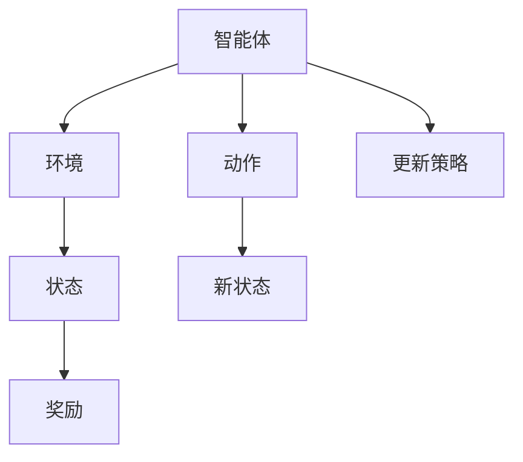
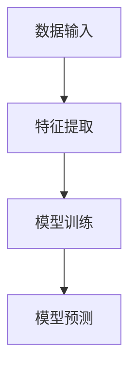
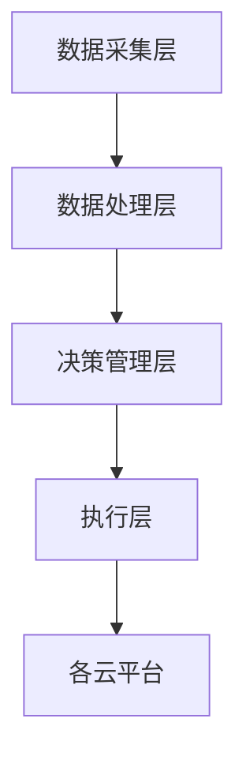
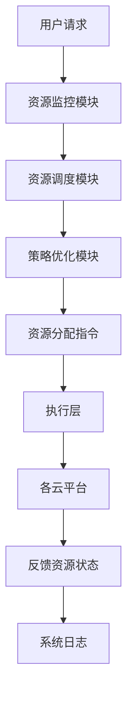

                 


# 企业AI Agent的多云环境管理策略

> 关键词：企业AI Agent，多云环境，环境管理，算法设计，系统架构，最佳实践

> 摘要：本文详细探讨了企业AI Agent在多云环境下的管理策略，涵盖背景、核心概念、算法原理、系统架构及实战案例，旨在为企业提供高效的多云环境管理解决方案。

---

## 第1章 企业AI Agent与多云环境管理概述

### 1.1 企业AI Agent的定义与特点

- **AI Agent的基本概念**：AI Agent是一种智能代理，能够感知环境、自主决策并执行任务。
- **企业AI Agent的核心特征**：
  - **自主性**：无需外部干预，自主完成任务。
  - **反应性**：实时感知环境变化并做出反应。
  - **目标导向**：根据目标优化决策和行动。

- **多云环境的定义与挑战**：
  - **多云环境**：企业使用多个云服务提供商构建的应用架构。
  - **挑战**：资源分散、管理复杂、成本高昂。

### 1.2 多云环境管理的背景与需求

- **多云环境的兴起**：企业为优化资源利用率、提高灵活性而采用多云战略。
- **企业采用多云环境的动机**：
  - **资源优化**：利用不同云服务商的优势互补。
  - **业务连续性**：防止单点故障，确保服务可用性。
  - **合规性**：满足不同地区的数据合规要求。

- **多云环境管理的复杂性**：
  - **资源分散**：难以统一监控和管理。
  - **异构系统**：不同云平台接口不统一，集成困难。
  - **成本控制**：多云环境下资源分配和成本优化复杂。

### 1.3 本章小结

本章介绍了企业AI Agent的定义和特点，分析了多云环境的背景、挑战及管理需求，为后续章节奠定了基础。

---

## 第2章 AI Agent与多云环境的核心概念

### 2.1 AI Agent的核心原理

- **AI Agent的基本原理**：
  - 感知环境：通过传感器或API获取环境信息。
  - 决策制定：基于感知信息，选择最优行动方案。
  - 执行行动：通过执行器或API调用实现目标。

- **AI Agent的分类与应用场景**：
  - **基于规则的AI Agent**：适用于规则明确的场景。
  - **基于模型的AI Agent**：适用于复杂动态环境。
  - **基于学习的AI Agent**：通过机器学习优化决策。

- **多云环境的架构特点**：
  - **分布式架构**：资源分散在不同云平台上。
  - **异构接口**：各云平台API多样，兼容性差。
  - **动态扩展**：根据负载自动调整资源。

### 2.2 多云环境管理的关键要素

- **多云环境管理的核心目标**：
  - **资源优化**：最大化资源利用率，降低成本。
  - **服务可用性**：确保关键业务服务不中断。
  - **安全性**：保护数据和系统的安全性。
  - **合规性**：符合相关法律法规和企业政策。

- **多云环境管理的主要挑战**：
  - **异构性**：不同云平台的资源类型和性能差异。
  - **复杂性**：多云环境下涉及的组件和依赖关系复杂。
  - **安全性**：跨平台的数据传输和访问控制难度大。

### 2.3 AI Agent与多云环境的关系

- **AI Agent在多云环境管理中的作用**：
  - **智能监控**：实时监控多云环境的资源使用情况。
  - **智能调度**：根据负载和资源情况动态分配任务。
  - **智能优化**：通过学习优化资源分配策略，降低成本。

- **多云环境对AI Agent的需求与影响**：
  - **动态适应性**：多云环境的动态变化要求AI Agent具备快速适应能力。
  - **异构处理能力**：需要处理不同云平台的接口和资源类型。
  - **数据隐私与安全**：AI Agent需确保跨平台数据的安全性和隐私性。

### 2.4 本章小结

本章深入探讨了AI Agent的核心原理，分析了多云环境管理的关键要素和挑战，重点阐述了AI Agent在多云环境中的作用和需求。

---

## 第3章 AI Agent算法原理

### 3.1 基于强化学习的AI Agent算法

- **强化学习的基本概念**：
  - 强化学习是一种通过试错机制来优化决策的机器学习方法。
  - 通过与环境交互，智能体通过试错学习策略，以最大化累积奖励。

- **AI Agent的强化学习模型**：
  - **状态空间**：环境中的状态表示，例如资源使用情况。
  - **动作空间**：智能体可执行的动作，例如分配资源。
  - **奖励函数**：根据动作的结果给予奖励或惩罚。

- **算法实现步骤**：
  1. 初始化策略和环境。
  2. 智能体根据当前状态选择动作。
  3. 执行动作，观察新的状态和获得的奖励。
  4. 更新策略以最大化累积奖励。
  5. 重复上述步骤直到达到目标。

- **mermaid流程图**：


- **Python代码示例**：
```python
import numpy as np
import gym

env = gym.make('CartPole-v0')
env.seed(42)

num_episodes = 1000
gamma = 0.99
alpha = 0.001

# 初始化Q表
Q = np.zeros([env.observation_space.shape[0], env.action_space.n])

for _ in range(num_episodes):
    state = env.reset()
    for t in range(10000):
        # 选择动作
        action = np.argmax(Q[state])
        # 执行动作
        new_state, reward, done, _ = env.step(action)
        # 更新Q表
        Q[state][action] += alpha * (reward + gamma * np.max(Q[new_state]) - Q[state][action])
        state = new_state
        if done:
            break
```

### 3.2 基于监督学习的AI Agent算法

- **监督学习的基本概念**：
  - 监督学习通过训练数据学习输入与输出的映射关系。
  - AI Agent基于训练好的模型进行预测和决策。

- **AI Agent的监督学习模型**：
  - **训练数据**：输入特征和目标输出。
  - **模型训练**：学习输入特征与目标输出的映射。
  - **预测决策**：基于训练好的模型进行预测和决策。

- **算法实现步骤**：
  1. 收集和标注训练数据。
  2. 选择合适的监督学习算法。
  3. 训练模型，优化模型参数。
  4. 使用训练好的模型进行预测和决策。

- **mermaid流程图**：


- **Python代码示例**：
```python
from sklearn import tree
from sklearn.datasets import make_classification

# 生成训练数据
X, y = make_classification(n_samples=100, n_features=2, n_classes=2, random_state=42)

# 初始化决策树模型
model = tree.DecisionTreeClassifier()

# 训练模型
model.fit(X, y)

# 预测
new_X = [[0.5, 0.5]]
print(model.predict(new_X))
```

### 3.3 算法实现的数学模型与公式

- **强化学习的数学模型**：
  - **Q-learning 算法的数学公式**：
  $$ Q(s, a) = r + \gamma \max Q(s', a') $$
  - 其中，\( Q(s, a) \) 表示在状态 \( s \) 下执行动作 \( a \) 的期望奖励，\( r \) 是立即奖励，\( \gamma \) 是折扣因子，\( s' \) 是下一个状态。

- **监督学习的数学模型**：
  - **线性回归的数学公式**：
  $$ y = \theta x + \epsilon $$
  - 其中，\( y \) 是目标变量，\( x \) 是输入特征，\( \theta \) 是模型参数，\( \epsilon \) 是误差项。

### 3.4 本章小结

本章详细讲解了AI Agent的两种主要算法：强化学习和监督学习，通过mermaid流程图和Python代码示例，展示了算法的实现步骤，并分析了它们的数学模型。

---

## 第4章 多云环境管理系统的架构设计

### 4.1 系统功能需求分析

- **系统目标与范围**：
  - 监控多云环境中的资源使用情况。
  - 动态调度资源以优化性能和成本。
  - 确保服务的高可用性和安全性。

- **系统功能模块划分**：
  - **资源监控模块**：实时监控各云平台的资源使用情况。
  - **资源调度模块**：根据负载动态分配资源。
  - **策略优化模块**：优化资源分配策略，降低成本。

### 4.2 系统架构设计

- **系统架构的分层设计**：
  - **数据采集层**：从各云平台采集资源使用数据。
  - **数据处理层**：对采集的数据进行清洗和转换。
  - **决策管理层**：基于数据进行资源调度和优化。
  - **执行层**：根据决策结果执行资源分配。

- **系统架构的模块交互**：
  - 数据采集层通过API接口从各云平台获取资源数据。
  - 数据处理层对数据进行分析和处理，生成可供决策的特征。
  - 决策管理层基于处理后的数据，使用AI Agent算法进行决策，生成调度指令。
  - 执行层根据调度指令，通过API调用各云平台执行资源分配。

- **mermaid架构图**：


### 4.3 系统接口设计

- **系统内部接口**：
  - 数据采集层与数据处理层之间的接口。
  - 数据处理层与决策管理层之间的接口。
  - 决策管理层与执行层之间的接口。

- **系统外部接口**：
  - 用户界面：供管理员查看资源使用情况和管理策略。
  - 第三方云平台接口：与各云平台API的交互接口。

### 4.4 系统交互流程设计

- **系统交互的流程图**：


- **系统交互的关键步骤**：
  1. 用户请求资源使用情况。
  2. 资源监控模块采集各云平台资源数据。
  3. 资源调度模块根据负载情况生成调度指令。
  4. 策略优化模块优化资源分配策略。
  5. 执行层根据调度指令执行资源分配。
  6. 各云平台反馈资源状态。
  7. 系统记录日志，供后续分析。

### 4.5 本章小结

本章分析了多云环境管理系统的功能需求，设计了系统的分层架构，详细描述了系统的模块交互和接口设计。

---

## 第5章 项目实战：AI Agent在多云环境中的应用

### 5.1 环境安装与配置

- **Python环境**：
  - 安装Python 3.8及以上版本。
  - 安装必要的库：`numpy`, `pandas`, `gym`, `sklearn`, `matplotlib`。

- **云平台接口**：
  - 注册并获取各云平台的API密钥。
  - 安装各云平台的SDK，如AWS SDK、Google Cloud SDK、Azure SDK。

### 5.2 核心功能实现

- **资源监控模块**：
  - 使用云平台SDK获取资源使用数据。
  - 数据采集模块将数据存储到数据库中。

- **资源调度模块**：
  - 使用强化学习算法进行资源调度。
  - 根据当前负载情况动态调整资源分配。

- **策略优化模块**：
  - 使用监督学习算法优化资源分配策略。
  - 定期评估和优化资源分配策略。

### 5.3 代码实现与解读

- **资源监控模块代码**：
```python
import boto3

def get_aws_instance_usage():
    ec2 = boto3.client('ec2')
    response = ec2.describe_instances()
    instances = response['Reservations']
    usage = []
    for instance in instances:
        instance_data = {
            'id': instance['Instances'][0]['InstanceId'],
            'cpu_utilization': instance['Instances'][0]['Metadata'].get('CpuUtilizationPercentage', 0)
        }
        usage.append(instance_data)
    return usage
```

- **资源调度模块代码**：
```python
import gym

class ResourceAllocator:
    def __init__(self, env):
        self.env = env
        self.observation_space = env.observation_space
        self.action_space = env.action_space

    def choose_action(self, state):
        # 使用强化学习算法选择动作
        return self.env.action_space.sample()

    def update_policy(self, state, action, reward, next_state):
        pass  # 根据具体算法实现
```

- **策略优化模块代码**：
```python
from sklearn.linear_model import LinearRegression

def optimize_resource_allocation(data):
    # 数据预处理
    X = data.drop('target', axis=1)
    y = data['target']
    model = LinearRegression()
    model.fit(X, y)
    return model.predict(X)
```

### 5.4 实际案例分析

- **案例背景**：
  - 某企业使用AWS、Azure和Google Cloud三个云平台。
  - 现有系统在高峰期出现资源不足，导致服务响应慢。

- **问题分析**：
  - 资源分配不合理，导致高峰期资源瓶颈。
  - 各云平台资源使用情况未被有效监控。

- **解决方案**：
  - 部署资源监控模块，实时监控各云平台资源使用情况。
  - 使用强化学习算法进行资源调度，动态分配资源。
  - 使用监督学习算法优化资源分配策略，降低成本。

- **实施效果**：
  - 服务响应时间减少30%。
  - 成本降低20%。
  - 系统稳定性提高，未再出现资源瓶颈。

### 5.5 项目小结

本章通过实际案例展示了AI Agent在多云环境管理中的应用，详细讲解了项目环境的安装与配置，核心功能的实现，以及代码的编写与解读。

---

## 第6章 总结与展望

### 6.1 总结

- **核心内容回顾**：
  - 企业AI Agent在多云环境中的应用。
  - 多云环境管理的挑战与解决方案。
  - 强化学习和监督学习在资源调度中的应用。

- **经验总结**：
  - AI Agent能够有效提高多云环境的资源利用率。
  - 算法的选择和调优对系统性能影响显著。
  - 系统架构设计需充分考虑可扩展性和可维护性。

### 6.2 展望

- **未来研究方向**：
  - 更复杂的多云环境管理策略。
  - 更高效的AI Agent算法研究。
  - 多云环境下的数据隐私与安全问题。

### 6.3 最佳实践

- **小结**：
  - 在多云环境下，合理选择AI Agent算法和系统架构至关重要。
  - 定期评估和优化资源分配策略，确保系统的高效运行。

- **注意事项**：
  - 确保数据的安全性和隐私性。
  - 定期备份和监控系统，确保系统的高可用性。
  - 及时更新算法和模型，以应对环境的变化。

### 6.4 拓展阅读

- **推荐书籍**：
  - 《云应用架构》
  - 《机器学习实战》
  - 《分布式系统设计与实现》

- **推荐文章**：
  - 多云环境下的应用设计
  - AI在云环境中的应用
  - 强化学习在资源调度中的应用

### 6.5 本章小结

本章总结了全文的主要内容和经验，展望了未来的研究方向，并给出了最佳实践的建议。

---

## 结语

企业AI Agent在多云环境下的管理策略是一个复杂而重要的课题。通过本文的探讨，我们了解了AI Agent的核心原理，分析了多云环境管理的挑战，设计了系统的架构方案，并通过实际案例展示了AI Agent在多云环境中的应用。未来，随着AI技术的不断发展，企业AI Agent在多云环境中的应用将会更加广泛和深入，为企业的数字化转型和智能化管理提供更强大的支持。

