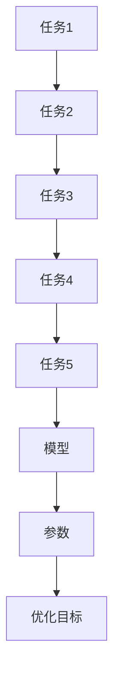
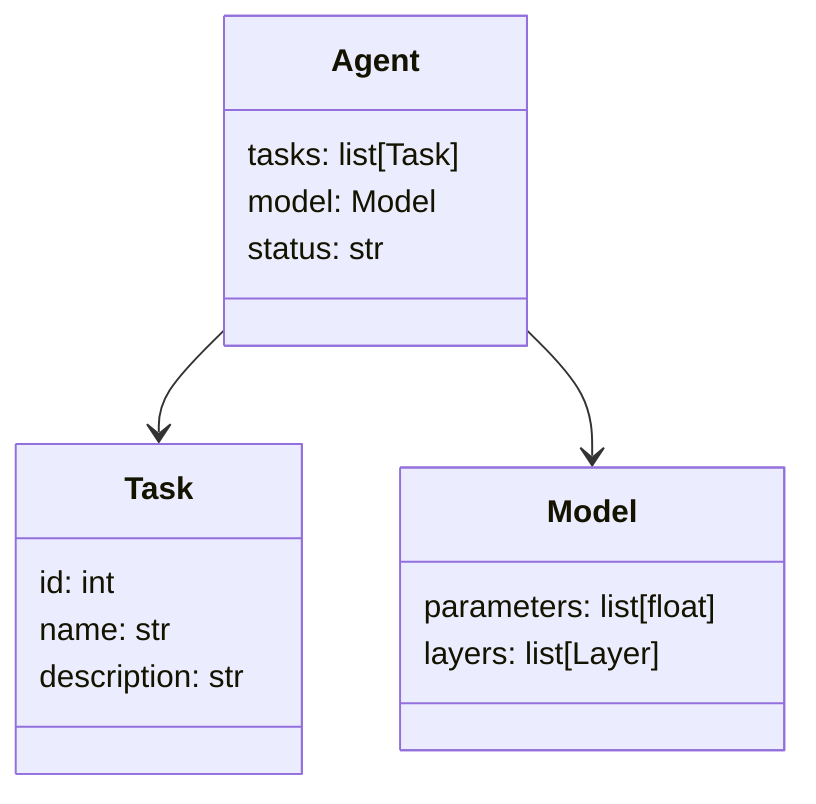

                 


# 企业AI Agent的多任务学习框架：提升模型通用性与迁移效率

> 关键词：AI Agent，多任务学习，模型通用性，迁移效率，企业应用

> 摘要：本文深入探讨了企业AI Agent的多任务学习框架，分析了其在提升模型通用性和迁移效率方面的关键技术和实际应用。通过理论结合实践，详细阐述了多任务学习的核心概念、算法原理、系统架构设计以及项目实战，为企业在AI Agent领域的技术落地提供了系统性的指导。

---

## 第一部分：企业AI Agent的多任务学习框架概述

### 第1章：AI Agent与多任务学习的背景

#### 1.1 AI Agent的基本概念

- **1.1.1 AI Agent的定义与特点**
  - AI Agent（智能体）是指能够感知环境、做出决策并采取行动以实现目标的智能系统。
  - 其特点包括自主性、反应性、目标导向性和学习能力。

- **1.1.2 AI Agent在企业中的应用场景**
  - 企业AI Agent广泛应用于任务调度、客户支持、数据分析、风险管理等领域。
  - 例如，在客户支持中，AI Agent可以同时处理多种语言请求，提供个性化服务。

- **1.1.3 多任务学习的背景与重要性**
  - 随着企业需求的多样化，AI Agent需要同时处理多种任务。
  - 多任务学习通过共享模型参数，提升模型的通用性和迁移效率。

#### 1.2 多任务学习的背景

- **1.2.1 多任务学习的定义与核心思想**
  - 多任务学习（Multi-Task Learning, MTL）是指让模型同时学习多个相关任务，共享模型参数以提升性能。
  - 核心思想是通过任务间的关联性，提升模型的泛化能力。

- **1.2.2 企业AI Agent中多任务学习的必要性**
  - 企业AI Agent通常需要处理多个任务，如自然语言处理、图像识别等。
  - MTL可以降低训练数据需求，提升模型的泛化能力。

- **1.2.3 多任务学习与单任务学习的对比**
  - 单任务学习专注于单一任务，模型难以泛化。
  - 多任务学习通过共享参数，提升模型的通用性。

#### 1.3 企业AI Agent的多任务学习框架

- **1.3.1 多任务学习框架的分类**
  - 基于任务相似性：任务高度相关时，共享更多参数。
  - 基于任务独立性：任务差异较大时，参数共享较少。

- **1.3.2 企业AI Agent的通用性与迁移效率**
  - 通用性：模型能够适应不同任务的能力。
  - 迁移效率：模型在新任务上的快速适应能力。

- **1.3.3 多任务学习框架的挑战与解决方案**
  - 挑战：任务间干扰、参数共享的优化。
  - 解决方案：使用门控机制、任务权重调整等方法。

### 第2章：多任务学习的核心概念与联系

#### 2.1 多任务学习的原理

- **2.1.1 多任务学习的基本原理**
  - 通过共享参数，模型同时优化多个任务的损失函数。
  - 任务间的关系决定了参数共享的策略。

- **2.1.2 任务之间的关系与依赖**
  - 相关任务：如问答系统和文本摘要。
  - 独立任务：如图像分类和语音识别。

- **2.1.3 多任务学习的数学模型**
  - 损失函数组合：$ L = \lambda_1 L_1 + \lambda_2 L_2 + ... + \lambda_n L_n $，其中$\lambda_i$为任务权重。

#### 2.2 核心概念的联系

- **2.2.1 任务表示与模型结构**
  - 任务通过输入和输出表示，模型结构决定参数共享方式。

- **2.2.2 参数共享与任务间关系**
  - 参数共享程度取决于任务相似性：任务高度相关时，共享更多参数。

- **2.2.3 优化目标与损失函数**
  - 优化目标是同时最小化多个任务的损失函数。
  - 使用门控机制动态调整任务权重。

#### 2.3 多任务学习的ER实体关系图



---

## 第二部分：多任务学习的算法原理

### 第3章：多任务学习的算法原理

#### 3.1 多任务学习的算法流程

- **3.1.1 数据输入与任务分配**
  - 数据预处理：将多任务数据合并，分配到不同任务。
  - 任务分配策略：基于任务相似性动态分配。

- **3.1.2 参数共享与模型训练**
  - 模型结构设计：确定参数共享方式。
  - 训练过程：同时优化多个任务的损失函数。

- **3.1.3 损失函数计算与优化**
  - 计算每个任务的损失函数。
  - 组合多个任务的损失函数，进行梯度下降优化。

#### 3.2 多任务学习的数学模型

- **3.2.1 参数共享的数学表示**
  - $ y_i = f(x_i; \theta) $，其中$\theta$为共享参数。

- **3.2.2 任务损失函数的组合**
  - $ L = \sum_{i=1}^n \lambda_i L_i $，其中$\lambda_i$为任务权重。

- **3.2.3 梯度下降优化**
  - $ \theta = \theta - \eta \frac{\partial L}{\partial \theta} $，其中$\eta$为学习率。

#### 3.3 算法实现的Python代码

```python
import torch

class MultiTaskModel(torch.nn.Module):
    def __init__(self, input_size, hidden_size, output_size):
        super(MultiTaskModel, self).__init__()
        self.shared_layer = torch.nn.Linear(input_size, hidden_size)
        self.task_layers = torch.nn.ModuleList([
            torch.nn.Linear(hidden_size, output_size) for _ in range(num_tasks)
        ])
    
    def forward(self, x):
        x = torch.relu(self.shared_layer(x))
        outputs = []
        for i in range(num_tasks):
            outputs.append(self.task_layers[i](x))
        return outputs
```

---

## 第三部分：系统分析与架构设计

### 第4章：系统分析与架构设计方案

#### 4.1 问题场景介绍

- **4.1.1 项目介绍**
  - 开发一个企业级AI Agent，支持多任务处理。
  - 应用场景包括客户支持、数据分析等。

- **4.1.2 系统功能设计**
  - 任务管理：分配和调度多任务。
  - 模型训练：支持多任务学习框架。
  - 接口设计：提供API供其他系统调用。

#### 4.2 领域模型类图



#### 4.3 系统架构设计

- **4.3.1 系统架构图**
  ```mermaid
  graph TD
      Agent --> Model
      Model --> Task1
      Model --> Task2
      Model --> Task3
  ```

- **4.3.2 系统接口设计**
  - 输入接口：接收多任务请求。
  - 输出接口：返回多个任务的处理结果。

- **4.3.3 系统交互序列图**
  ```mermaid
  sequenceDiagram
      Agent ->> Model: Initialize model
      Model ->> Task1: Process task1
      Model ->> Task2: Process task2
      Model ->> Agent: Return results
  ```

---

## 第四部分：项目实战

### 第5章：项目实战

#### 5.1 环境安装

- **5.1.1 安装Python环境**
  - 使用Anaconda或虚拟环境，确保Python版本为3.8以上。

- **5.1.2 安装依赖库**
  - 使用`pip install torch`安装PyTorch。
  - 安装其他依赖如numpy、scikit-learn等。

#### 5.2 系统核心实现源代码

```python
import torch
import torch.nn as nn
import torch.optim as optim

class MultiTaskModel(nn.Module):
    def __init__(self, input_dim, hidden_dim, output_dims):
        super(MultiTaskModel, self).__init__()
        self.shared_layer = nn.Linear(input_dim, hidden_dim)
        self.task_layers = nn.ModuleList([
            nn.Linear(hidden_dim, output_dims[i]) for i in range(len(output_dims))
        ])
    
    def forward(self, x, tasks):
        x = torch.relu(self.shared_layer(x))
        outputs = []
        for i in range(len(tasks)):
            outputs.append(self.task_layers[tasks[i]](x))
        return outputs

def train_model(model, optimizer, criterion, tasks, epochs=100):
    for epoch in range(epochs):
        optimizer.zero_grad()
        inputs = ...  # 根据任务输入
        outputs = model(inputs, tasks)
        loss = sum(criterion(output, target) for output, target in zip(outputs, targets))
        loss.backward()
        optimizer.step()
    return model
```

#### 5.3 案例分析与代码解读

- **5.3.1 案例分析**
  - 假设企业需要同时进行文本分类和情感分析。
  - 使用多任务学习框架，共享中间层参数。

- **5.3.2 代码解读**
  - `MultiTaskModel`类定义了共享层和任务特定层。
  - `train_model`函数实现了多任务模型的训练过程。

#### 5.4 项目小结

- **5.4.1 项目总结**
  - 成功实现了多任务学习框架，提升了模型的通用性和迁移效率。
  - 通过案例分析，验证了框架的有效性。

- **5.4.2 实践中的注意事项**
  - 参数共享策略需要根据任务相似性动态调整。
  - 任务权重的动态调整有助于优化模型性能。

---

## 第五部分：总结与展望

### 第6章：总结与展望

#### 6.1 总结

- 本文详细探讨了企业AI Agent的多任务学习框架，分析了其在提升模型通用性和迁移效率方面的关键技术。
- 通过理论结合实践，展示了多任务学习在企业中的实际应用。

#### 6.2 未来展望

- **6.2.1 挑战与未来方向**
  - 如何进一步优化参数共享策略。
  - 研究更高效的多任务学习算法。

- **6.2.2 应用前景**
  - 多任务学习将在企业AI Agent中发挥越来越重要的作用。
  - 预期未来会有更多的企业级应用案例。

---

通过本文的系统阐述，企业可以更好地理解和应用多任务学习框架，提升AI Agent的性能和效率，为企业智能化转型提供有力支持。

