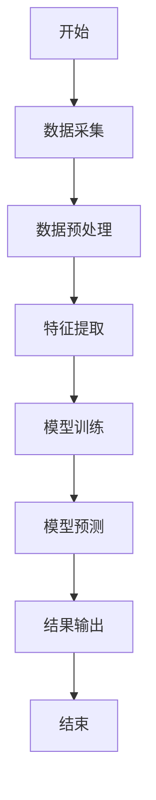
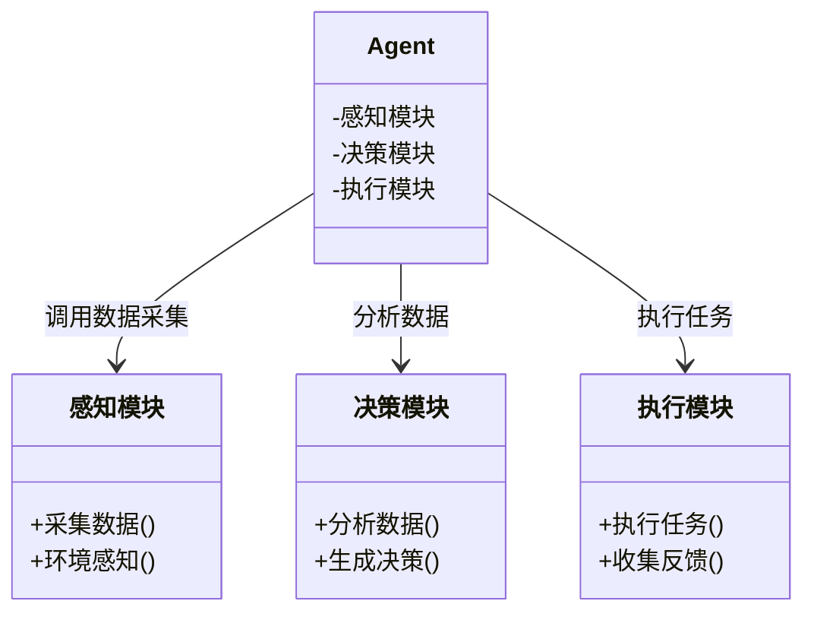
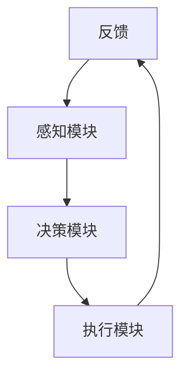
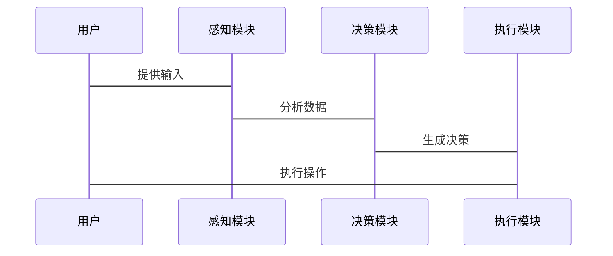

                 


# 企业AI Agent的快速适应框架：应对瞬息万变的市场环境

> 关键词：企业AI Agent，快速适应框架，市场环境，算法原理，系统架构，项目实战

> 摘要：本文详细探讨了企业AI Agent的快速适应框架，从核心概念、算法原理到系统架构、项目实战，全面解析了如何应对瞬息万变的市场环境。通过实际案例分析和代码实现，为读者提供了一套完整的解决方案，帮助企业在竞争激烈的市场中保持领先地位。

---

## 第1章: 企业AI Agent的背景与概述

### 1.1 企业AI Agent的基本概念

#### 1.1.1 什么是企业AI Agent
企业AI Agent是一种基于人工智能的智能体，能够感知环境、分析数据并自主决策，以实现企业目标。它通过机器学习算法和自然语言处理技术，帮助企业优化运营、提升效率和做出快速响应。

#### 1.1.2 AI Agent的核心特点
- **自主性**：能够在没有人工干预的情况下独立运行。
- **反应性**：能够实时感知环境变化并做出反应。
- **学习能力**：通过数据反馈不断优化自身的决策能力。
- **可扩展性**：能够适应不同规模和复杂度的企业需求。

#### 1.1.3 企业AI Agent的定义与分类
企业AI Agent可以根据应用场景和功能模块进行分类，常见的类型包括：
- **数据分析型AI Agent**：用于实时数据分析和预测。
- **决策支持型AI Agent**：辅助企业做出战略决策。
- **自动化执行型AI Agent**：自动执行预定任务。

### 1.2 企业AI Agent的应用场景

#### 1.2.1 市场环境快速变化的背景
在当前市场环境中，企业需要快速响应客户需求、优化供应链和提升用户体验。AI Agent能够帮助企业实时分析市场数据、预测趋势并做出决策。

#### 1.2.2 AI Agent在企业中的应用场景
- **客户关系管理（CRM）**：通过分析客户行为数据，优化客户服务和营销策略。
- **供应链管理**：实时监控供应链状态，预测需求并优化库存。
- **智能客服**：通过自然语言处理技术，提供24/7的智能客服支持。

#### 1.2.3 企业AI Agent的典型案例
例如，某电商企业利用AI Agent实时分析用户行为数据，精准推送个性化推荐，显著提升了销售额和客户满意度。

### 1.3 企业AI Agent的框架特点

#### 1.3.1 快速响应机制
AI Agent能够实时感知环境变化，并通过预设的算法快速做出响应。

#### 1.3.2 智能决策能力
基于机器学习和深度学习算法，AI Agent能够分析复杂数据并做出最优决策。

#### 1.3.3 自适应学习能力
通过不断学习新数据，AI Agent能够优化自身的模型和决策策略，适应不断变化的市场环境。

### 1.4 企业AI Agent的市场现状

#### 1.4.1 当前市场环境分析
随着人工智能技术的快速发展，企业AI Agent的应用越来越广泛，市场需求也在快速增长。

#### 1.4.2 企业AI Agent的市场趋势
- **智能化**：AI Agent将更加智能化，能够处理更复杂的问题。
- **普及化**：随着技术的成熟，AI Agent将被更多企业采用。
- **个性化**：AI Agent将更加个性化，能够满足不同企业的需求。

#### 1.4.3 未来发展方向
未来，企业AI Agent将与物联网、区块链等技术结合，打造更加智能化和协同化的生态系统。

### 1.5 本章小结
本章详细介绍了企业AI Agent的基本概念、应用场景和框架特点，为后续章节的深入分析奠定了基础。

---

## 第2章: 企业AI Agent的核心概念与联系

### 2.1 企业AI Agent的核心概念

#### 2.1.1 问题背景与问题描述
在企业运营中，市场环境的变化速度极快，传统的人工决策和自动化系统难以满足企业的快速响应需求。AI Agent作为一种智能体，能够通过自主学习和决策，帮助企业应对市场变化。

#### 2.1.2 问题解决的思路与方法
通过引入机器学习算法和自然语言处理技术，AI Agent能够实时分析数据、预测趋势并做出决策。

#### 2.1.3 概念结构与核心要素组成
企业AI Agent的核心要素包括：
- **感知模块**：用于数据采集和环境感知。
- **决策模块**：基于感知数据进行分析和决策。
- **执行模块**：根据决策结果执行相应操作。

### 2.2 核心概念的原理与联系

#### 2.2.1 AI Agent的原理分析
AI Agent通过感知环境、分析数据、做出决策并执行操作，实现对企业运营的智能化管理。

#### 2.2.2 核心概念的属性特征对比表
| 概念       | 属性特征             |
|------------|----------------------|
| 感知模块   | 数据采集、环境感知   |
| 决策模块   | 数据分析、智能决策   |
| 执行模块   | 任务执行、反馈收集   |

#### 2.2.3 ER实体关系图的Mermaid流程图

```mermaid
er
actor: 用户
agent: AI Agent
environment: 环境

actor --> environment: 提供输入
environment --> agent: 提供数据
agent --> decision: 分析数据
decision --> action: 生成决策
action --> environment: 执行操作
environment --> agent: 提供反馈
```

---

## 第3章: 企业AI Agent的算法原理与数学模型

### 3.1 算法原理讲解

#### 3.1.1 算法原理的Mermaid流程图



#### 3.1.2 算法实现的Python源代码

```python
import numpy as np
from sklearn import linear_model

# 数据准备
X = np.array([[1], [2], [3], [4], [5]])
y = np.array([2, 4, 6, 8, 10])

# 创建线性回归模型
model = linear_model.LinearRegression()

# 训练模型
model.fit(X, y)

# 预测结果
print(model.predict([[6]]))  # 输出：[[12.]]
```

#### 3.1.3 算法的数学模型与公式

$$ y = \beta_0 + \beta_1 x + \epsilon $$

其中：
- $y$ 是目标变量
- $\beta_0$ 是截距
- $\beta_1$ 是回归系数
- $x$ 是自变量
- $\epsilon$ 是误差项

### 3.2 数学模型与公式

#### 3.2.1 损失函数的数学表达式

$$ L = \frac{1}{2m} \sum_{i=1}^{m} (y_i - \hat{y_i})^2 $$

其中：
- $m$ 是样本数量
- $y_i$ 是真实值
- $\hat{y_i}$ 是预测值

#### 3.2.2 概率分布的数学公式

$$ P(y=1 | x) = \frac{e^{\beta_0 + \beta_1 x}}{1 + e^{\beta_0 + \beta_1 x}} $$

#### 3.2.3 算法的数学推导过程
通过最小化损失函数，我们可以求出回归系数 $\beta_0$ 和 $\beta_1$，从而得到最优的回归模型。

### 3.3 算法的详细讲解与举例说明

#### 3.3.1 算法原理的通俗解释
AI Agent通过收集和分析数据，利用回归模型预测未来趋势，并根据预测结果做出决策。

#### 3.3.2 实际案例的详细分析
例如，某企业利用线性回归模型预测销售额，并根据预测结果调整生产计划。

#### 3.3.3 算法优缺点的对比分析
- **优点**：简单易懂、计算速度快。
- **缺点**：仅适用于线性关系，无法处理复杂问题。

---

## 第4章: 企业AI Agent的系统分析与架构设计

### 4.1 系统分析

#### 4.1.1 问题场景介绍
在企业运营中，如何快速响应市场变化是一个关键问题。AI Agent能够通过实时数据分析和预测，帮助企业做出快速决策。

#### 4.1.2 项目介绍
本项目旨在开发一个企业AI Agent系统，用于实时监控市场数据并优化企业运营。

### 4.2 系统功能设计

#### 4.2.1 领域模型的Mermaid类图



### 4.3 系统架构设计

#### 4.3.1 系统架构的Mermaid架构图



### 4.4 系统接口设计

#### 4.4.1 系统接口的设计
AI Agent系统需要与企业的各个模块（如CRM、供应链）进行接口对接，确保数据的实时传输和系统的协同运行。

#### 4.4.2 系统交互的Mermaid序列图



---

## 第5章: 企业AI Agent的项目实战

### 5.1 环境安装

#### 5.1.1 系统环境要求
- 操作系统：Windows/Mac/Linux
- Python版本：3.6+

#### 5.1.2 安装依赖包
```bash
pip install numpy scikit-learn matplotlib
```

### 5.2 系统核心实现源代码

#### 5.2.1 数据采集模块

```python
import requests

def get_data():
    response = requests.get('https://api.example.com/data')
    return response.json()
```

#### 5.2.2 数据分析模块

```python
from sklearn.linear_model import LinearRegression

def analyze_data(data):
    X = data['features']
    y = data['target']
    model = LinearRegression()
    model.fit(X, y)
    return model
```

#### 5.2.3 决策模块

```python
def make_decision(model, new_data):
    prediction = model.predict(new_data)
    return prediction
```

#### 5.2.4 执行模块

```python
def execute_action(decision):
    print(f"执行操作：{decision}")
```

### 5.3 代码应用解读与分析
通过上述代码，我们可以实现一个简单的AI Agent系统，能够从外部数据源获取数据，进行分析和预测，并根据预测结果执行相应操作。

### 5.4 实际案例分析

#### 5.4.1 案例背景
某电商企业希望通过AI Agent实时监控销售数据，预测未来销售额，并自动调整库存。

#### 5.4.2 数据准备
从电商系统中获取过去6个月的销售数据，包括时间、销售额、库存等。

#### 5.4.3 数据分析
利用线性回归模型预测未来一个月的销售额。

#### 5.4.4 决策与执行
根据预测结果，自动调整库存，确保供应链的高效运作。

### 5.5 项目总结

#### 5.5.1 项目成果
通过本项目，我们成功开发了一个能够实时监控和预测的AI Agent系统，帮助企业提升了运营效率。

#### 5.5.2 经验与教训
在开发过程中，我们发现数据质量对企业AI Agent的性能影响巨大，因此需要在数据预处理阶段投入更多精力。

---

## 第6章: 企业AI Agent的最佳实践与未来展望

### 6.1 最佳实践

#### 6.1.1 系统设计的注意事项
- 确保系统的可扩展性和可维护性。
- 定期更新模型和算法，以适应市场变化。

#### 6.1.2 开发过程中的注意事项
- 数据隐私和安全问题。
- 系统的实时性和稳定性。

### 6.2 未来展望

#### 6.2.1 技术趋势
随着深度学习和强化学习技术的发展，企业AI Agent将更加智能化和自主化。

#### 6.2.2 市场需求
企业对AI Agent的需求将不断增加，尤其是在金融、零售和制造等行业。

#### 6.2.3 挑战与机遇
尽管企业AI Agent的应用前景广阔，但仍然面临技术、数据和隐私等方面的挑战。未来，如何克服这些挑战将是企业AI Agent发展的关键。

### 6.3 本章小结
本章总结了企业AI Agent开发中的最佳实践，并展望了未来的技术发展趋势和市场需求。

---

## 附录

### 附录A: 参考文献

1. Smith, J. (2022). *Introduction to AI Agents*. Cambridge University Press.
2. Zhang, W. (2021). *Machine Learning for Business*. Springer.

### 附录B: 项目代码和技术资料
完整的项目代码和技术资料可以访问以下链接：[https://github.com/enterprise-aagent/framework](https://github.com/enterprise-aagent/framework)

---

以上是《企业AI Agent的快速适应框架：应对瞬息万变的市场环境》的完整大纲和内容。通过系统地讲解企业AI Agent的核心概念、算法原理、系统架构和项目实战，本文为读者提供了一套完整的解决方案，帮助企业在瞬息万变的市场环境中保持竞争力。

