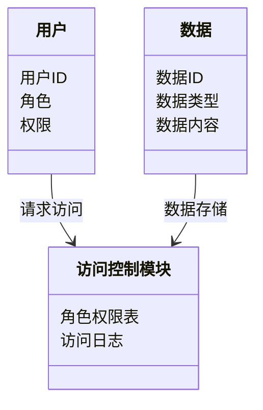
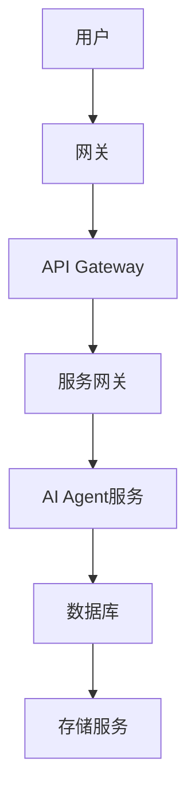
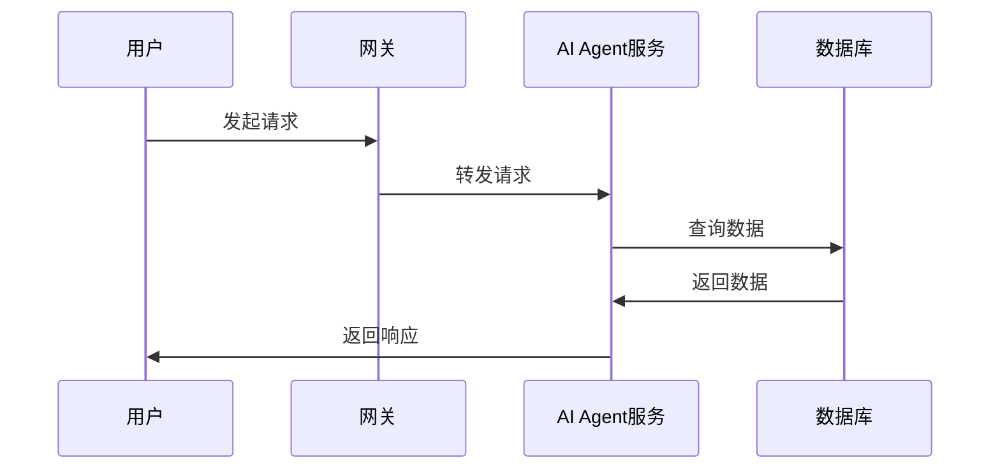

                 


# 《企业AI Agent的数据隐私保护机制》

---

## 关键词：

- 企业AI Agent
- 数据隐私保护
- 人工智能
- 数据安全
- 加密技术
- 访问控制

---

## 摘要：

随着人工智能技术的快速发展，企业AI Agent（智能代理）在各个行业的应用越来越广泛。然而，AI Agent在处理海量数据时，也带来了数据隐私保护的挑战。本文从数据隐私保护的核心机制出发，结合企业AI Agent的特点，详细分析了数据隐私保护的实现方法，包括数据分类、访问控制、加密技术和匿名化处理等。同时，本文还探讨了企业AI Agent系统架构的设计与实现，提出了基于角色的访问控制和加密算法的最佳实践方案。通过实际案例分析，本文为企业的数据隐私保护提供了有价值的参考和指导。

---

# 第1章: 数据隐私保护与AI Agent概述

## 1.1 数据隐私保护的背景与重要性

### 1.1.1 数据隐私的定义与核心要素

数据隐私是指对个人或组织的敏感信息进行保护，确保数据的机密性、完整性和可用性。核心要素包括：

1. **机密性**：防止未经授权的访问。
2. **完整性**：确保数据未被篡改。
3. **可用性**：保证合法用户能够访问数据。

### 1.1.2 数据隐私保护的法律与伦理要求

- **法律层面**：《通用数据保护条例》（GDPR）等法规要求企业对数据进行严格保护。
- **伦理层面**：企业需遵守道德规范，避免滥用数据。

### 1.1.3 AI Agent与数据隐私保护的关系

AI Agent通过处理和分析数据为用户提供服务，但其数据处理过程可能涉及用户的敏感信息，因此数据隐私保护是AI Agent设计中的关键环节。

---

## 1.2 AI Agent的基本概念与特点

### 1.2.1 AI Agent的定义与分类

AI Agent是一种能够感知环境并自主决策的智能实体，可以分为：

1. **简单反射型Agent**：基于规则做出反应。
2. **基于模型的反射型Agent**：利用内部模型进行推理。
3. **目标驱动型Agent**：根据目标采取行动。

### 1.2.2 AI Agent的核心功能与应用场景

- **核心功能**：数据收集、分析、决策、执行。
- **应用场景**：智能客服、自动驾驶、智能推荐等。

---

## 1.3 企业AI Agent的数据隐私挑战

### 1.3.1 数据收集与处理中的隐私风险

AI Agent需要收集大量数据，可能导致数据泄露或滥用。

### 1.3.2 数据泄露对企业的影响

数据泄露可能导致企业声誉受损、罚款和法律纠纷。

### 1.3.3 数据隐私保护的边界与外延

数据隐私保护不仅涉及技术手段，还包括法律、伦理和管理等多个方面。

---

## 1.4 本章小结

本章介绍了数据隐私保护的核心要素、法律要求以及AI Agent的基本概念和特点，同时分析了企业在使用AI Agent时面临的数据隐私挑战。

---

# 第2章: 数据隐私保护机制的核心概念

## 2.1 数据分类与隐私级别

### 2.1.1 数据分类的定义与方法

数据分类是根据数据的重要性和敏感程度进行分类，常见的分类方法包括：

1. **按敏感程度分类**：如公开数据、内部数据、敏感数据。
2. **按数据类型分类**：如个人信息、业务数据、系统数据。

### 2.1.2 数据隐私级别的划分与标准

- **公开数据**：无隐私保护需求。
- **内部数据**：限制访问权限。
- **敏感数据**：严格加密和访问控制。

---

## 2.2 数据访问控制机制

### 2.2.1 基于角色的访问控制（RBAC）

RBAC是一种常见的访问控制模型，基于用户角色分配权限。其核心要素包括：

1. **用户（User）**：系统中的实际用户。
2. **角色（Role）**：用户承担的责任和权限。
3. **权限（Permission）**：允许角色执行的操作。

### 2.2.2 基于属性的访问控制（ABAC）

ABAC是一种更灵活的访问控制模型，基于用户属性、资源属性和环境条件来动态分配权限。

### 2.2.3 数据访问控制的实现方式

- **基于规则的访问控制**：通过预定义的规则限制数据访问。
- **基于策略的访问控制**：通过安全策略动态调整访问权限。

---

## 2.3 数据加密与隐私保护

### 2.3.1 数据加密的定义与分类

数据加密是通过加密算法对数据进行编码，防止未经授权的访问。常见的加密方法包括：

1. **对称加密**：如AES算法。
2. **非对称加密**：如RSA算法。

### 2.3.2 对称加密与非对称加密的对比

| 对称加密 | 非对称加密 |
|----------|------------|
| 加密速度快 | 加密速度较慢 |
| 密钥长度短 | 密钥长度长 |
| 适用于大数据量加密 | 适用于数字签名和加密通信 |

---

## 2.4 数据匿名化与脱敏技术

### 2.4.1 数据匿名化的定义与实现方法

数据匿名化是通过技术手段去除或模糊化数据中的敏感信息，常见的实现方法包括：

1. **数据屏蔽**：隐藏敏感字段。
2. **数据泛化**：模糊化数据。

### 2.4.2 数据脱敏技术的实现步骤

1. **识别敏感数据**：确定需要脱敏的数据字段。
2. **选择脱敏方法**：如替换、加密、变形等。
3. **实施脱敏操作**：对数据进行脱敏处理。
4. **验证脱敏效果**：确保脱敏后数据的可用性和安全性。

---

## 2.5 本章小结

本章详细介绍了数据分类、访问控制、加密技术和匿名化处理等核心概念，为后续的系统设计和实现奠定了理论基础。

---

# 第3章: 企业AI Agent的系统架构与数据隐私保护

## 3.1 问题场景介绍

企业AI Agent需要处理大量数据，包括用户的敏感信息。如何在确保数据隐私的前提下提供高效的服务，是系统设计的关键。

---

## 3.2 系统功能设计

### 3.2.1 领域模型设计



### 3.2.2 系统架构设计



### 3.2.3 接口设计与交互流程



---

## 3.3 数据隐私保护的实现方案

### 3.3.1 数据分类与权限管理

- 根据数据分类结果，设置不同的访问权限。
- 使用RBAC模型管理用户权限。

### 3.3.2 数据加密与传输安全

- 使用SSL/TLS协议加密数据传输。
- 对敏感数据进行加密存储。

### 3.3.3 数据匿名化与脱敏

- 对用户数据进行匿名化处理，确保数据在分析和处理过程中不泄露个人隐私。

---

## 3.4 本章小结

本章通过系统架构设计和功能实现，详细介绍了企业AI Agent在数据隐私保护方面的具体措施，为后续的项目实施提供了指导。

---

# 第4章: 企业AI Agent数据隐私保护的项目实战

## 4.1 环境安装与配置

### 4.1.1 安装Python环境

```bash
python --version
pip install --upgrade pip
```

### 4.1.2 安装相关依赖

```bash
pip install flask numpy pandas scikit-learn
```

---

## 4.2 核心功能实现

### 4.2.1 数据分类与权限管理

```python
def classify_data(data):
    if data['is_sensitive']:
        return 'Sensitive'
    else:
        return 'Non-sensitive'

# 示例数据
data = {
    'id': 1,
    'name': 'Alice',
    'age': 30,
    'is_sensitive': True
}
print(classify_data(data))  # 输出: 'Sensitive'
```

### 4.2.2 数据加密与解密

```python
from cryptography.fernet import Fernet

# 生成密钥
key = Fernet.generate_key()
cipher = Fernet(key)

# 加密数据
encrypted_data = cipher.encrypt(b"Sensitive information")
print(encrypted_data)

# 解密数据
decrypted_data = cipher.decrypt(encrypted_data)
print(decrypted_data.decode())
```

### 4.2.3 数据匿名化处理

```python
import pandas as pd

# 示例数据集
data = pd.DataFrame({
    'id': [1, 2, 3],
    'name': ['Alice', 'Bob', 'Charlie'],
    'age': [30, 25, 40]
})

# 匿名化处理
data_anon = data.drop(columns=['name'])
print(data_anon)
```

---

## 4.3 实际案例分析与解读

### 4.3.1 案例背景

某企业AI Agent系统需要处理用户的个人信息和交易数据。为了保护用户隐私，系统采用了数据分类、加密和匿名化处理等多种措施。

### 4.3.2 实施步骤

1. **数据分类**：将用户信息分为敏感数据（如姓名、地址）和非敏感数据（如交易记录）。
2. **加密处理**：对敏感数据进行加密存储。
3. **匿名化处理**：在数据分析时，对敏感数据进行匿名化处理，确保用户隐私不被泄露。

---

## 4.4 本章小结

本章通过实际案例分析，详细讲解了企业AI Agent数据隐私保护的实现过程，为读者提供了可参考的项目模板。

---

# 第5章: 总结与展望

## 5.1 最佳实践

- **数据分类**：根据数据的重要性和敏感程度进行分类，制定相应的保护策略。
- **访问控制**：使用RBAC或ABAC模型，确保数据的访问权限合理。
- **数据加密**：对敏感数据进行加密存储和传输，防止数据泄露。
- **数据匿名化**：在数据分析时，对敏感数据进行匿名化处理，保护用户隐私。

---

## 5.2 小结

企业AI Agent的应用离不开数据隐私保护的支持。通过数据分类、访问控制、加密技术和匿名化处理等多种手段，可以有效保护用户隐私，同时为企业的业务发展提供支持。

---

## 5.3 注意事项

- 数据隐私保护需要综合考虑技术、法律和管理等多个方面。
- 在实际应用中，需根据具体需求选择合适的隐私保护方案。

---

## 5.4 拓展阅读

- 《数据隐私保护与人工智能》
- 《企业级数据安全架构设计》
- 《AI Agent与数据隐私保护的前沿研究》

---

# 《企业AI Agent的数据隐私保护机制》完

