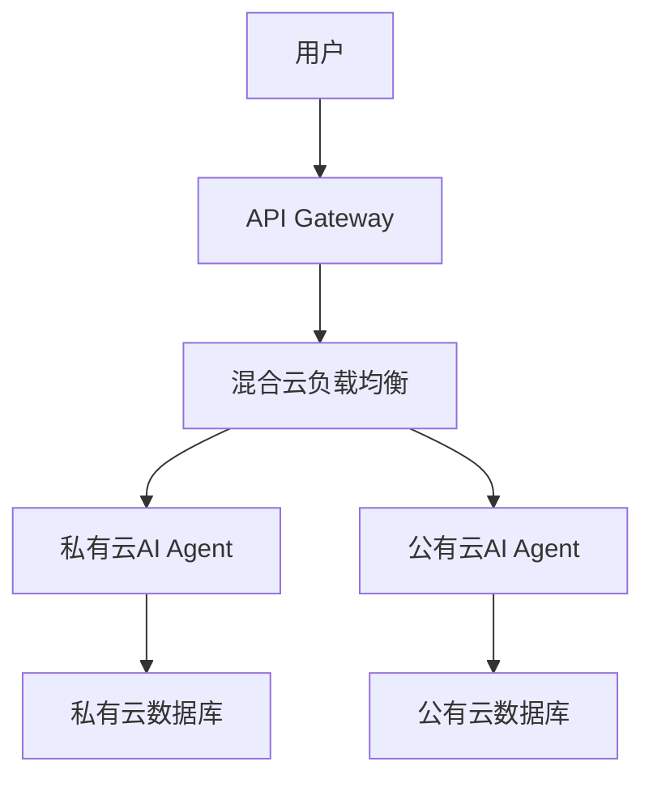
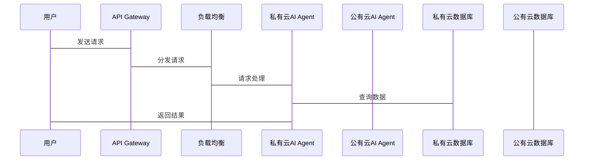

                 


# 企业AI Agent的混合云部署策略

> 关键词：企业AI Agent，混合云，部署策略，系统架构，算法原理

> 摘要：本文探讨了企业AI Agent在混合云环境中的部署策略，分析了混合云部署的核心概念、算法原理、系统架构设计以及项目实战，为企业在混合云环境下高效部署AI Agent提供了深度分析和实践指导。

---

# 第1章 企业AI Agent与混合云部署背景

## 1.1 企业AI Agent的定义与特点

### 1.1.1 企业AI Agent的核心概念

企业AI Agent（Artificial Intelligence Agent）是一种能够感知环境、自主决策并执行任务的智能体。它结合了机器学习、自然语言处理和自动化技术，能够帮助企业实现智能化的业务流程管理。

**核心概念：**
- **感知环境**：通过数据采集和分析，了解企业内外部环境的状态。
- **自主决策**：基于感知的信息，利用算法做出最优决策。
- **执行任务**：通过与系统或用户的交互，执行预定的任务。

### 1.1.2 企业AI Agent的关键特点

| 特性 | 描述 |
|------|------|
| 智能性 | 能够理解上下文并做出决策 |
| 自主性 | 无需人工干预即可执行任务 |
| 可扩展性 | 能够适应企业规模的变化 |
| 高可用性 | 在故障情况下仍能提供服务 |

### 1.1.3 企业AI Agent的分类与应用场景

企业AI Agent可以根据功能和应用场景分为以下几类：

- **决策型AI Agent**：用于企业决策支持，如财务预测、市场分析。
- **执行型AI Agent**：用于自动化执行任务，如订单处理、物流调度。
- **交互型AI Agent**：用于与用户交互，如智能客服、虚拟助手。

应用场景包括：
- **企业流程自动化**：优化业务流程，提高效率。
- **智能监控**：实时监控系统运行状态，及时发现异常。
- **数据驱动决策**：基于数据分析提供决策支持。

## 1.2 混合云部署的背景与优势

### 1.2.1 混合云的定义与特点

混合云是一种结合了公有云和私有云的部署模式，能够根据业务需求灵活分配资源。

**特点：**
- **灵活性**：可以根据负载需求动态调整资源分配。
- **成本优化**：通过公有云和私有云的结合，降低运营成本。
- **安全性**：敏感数据可以部署在私有云中，提高安全性。

### 1.2.2 企业选择混合云部署的原因

- **资源弹性扩展**：企业可以根据业务波动灵活调整资源。
- **成本控制**：通过公有云和私有云的结合，优化成本。
- **数据安全性**：关键业务数据可以部署在私有云中，提高安全性。

### 1.2.3 混合云部署的常见模式

- **架构模式**：
  - 数据存储在私有云，计算资源在公有云。
  - 关键业务在私有云，非关键业务在公有云。
- **优势**：
  - 资源利用率高。
  - 成本控制灵活。
  - 安全性与灵活性兼得。

## 1.3 企业AI Agent与混合云部署的结合

### 1.3.1 企业AI Agent对混合云的需求

- **弹性计算资源**：AI Agent需要处理大量数据，计算资源需求波动大。
- **数据隐私**：企业数据需要部分部署在私有云中，确保隐私安全。
- **高可用性**：混合云能够提供更高的可用性保障。

### 1.3.2 混合云部署对企业AI Agent的优势

- **资源弹性**：可以根据业务需求动态调整计算资源。
- **安全性**：关键数据部署在私有云中，降低数据泄露风险。
- **高可用性**：混合云架构能够提供更高的容灾能力。

### 1.3.3 企业AI Agent混合云部署的现状与趋势

- **现状**：越来越多的企业开始采用混合云部署AI Agent。
- **趋势**：随着AI技术的发展，混合云部署将成为主流。

---

# 第2章 企业AI Agent的核心原理

## 2.1 AI Agent的基本原理

### 2.1.1 AI Agent的体系结构

AI Agent的体系结构通常包括以下几个部分：

- **感知层**：负责数据的采集和分析。
- **决策层**：基于感知数据做出决策。
- **执行层**：根据决策执行具体任务。
- **通信层**：与外部系统或用户进行交互。

### 2.1.2 AI Agent的核心算法与模型

常用的算法包括：
- **监督学习**：用于分类和回归任务。
- **无监督学习**：用于聚类和降维任务。
- **强化学习**：用于需要策略优化的任务。

### 2.1.3 AI Agent的工作流程

1. **数据采集**：通过传感器或API获取数据。
2. **数据处理**：清洗、转换和分析数据。
3. **决策制定**：基于数据和模型做出决策。
4. **任务执行**：通过API或自动化工具执行任务。
5. **反馈机制**：根据执行结果优化决策。

### 2.1.4 案例分析：企业AI Agent在销售预测中的应用

**案例背景**：某企业希望利用AI Agent进行销售预测。

**流程**：
1. **数据采集**：收集过去几年的销售数据。
2. **数据处理**：清洗数据并建立时间序列模型。
3. **决策制定**：利用模型预测未来销售情况。
4. **任务执行**：生成销售预测报告并发送给相关部门。

## 2.2 企业AI Agent的独特性

### 2.2.1 企业级AI Agent的设计原则

- **高可用性**：确保系统在故障情况下仍能正常运行。
- **可扩展性**：能够适应企业规模的变化。
- **安全性**：保护企业数据的安全。

### 2.2.2 企业AI Agent的功能扩展

- **多模态交互**：支持多种交互方式，如语音、文本、图像。
- **复杂决策**：能够处理复杂的决策问题，如供应链优化。
- **实时响应**：能够在毫秒级时间内做出响应。

### 2.2.3 企业AI Agent的性能优化

- **分布式计算**：利用分布式技术提高计算效率。
- **缓存优化**：通过缓存技术减少重复计算。
- **负载均衡**：通过负载均衡技术优化资源利用率。

## 2.3 企业AI Agent与传统AI Agent的区别

### 2.3.1 功能上的区别

- **传统AI Agent**：主要用于简单的任务，如图像识别、语音识别。
- **企业AI Agent**：能够处理复杂的业务流程，如供应链管理、财务分析。

### 2.3.2 性能上的区别

- **传统AI Agent**：性能要求相对较低。
- **企业AI Agent**：要求高性能计算能力，能够处理海量数据。

### 2.3.3 应用场景上的区别

- **传统AI Agent**：主要用于科研、医疗等领域。
- **企业AI Agent**：主要用于企业内部的业务流程优化、决策支持等。

---

# 第3章 混合云部署的基础知识

## 3.1 混合云的定义与分类

### 3.1.1 混合云的定义

混合云是一种结合了公有云和私有云的部署模式，能够根据业务需求灵活分配资源。

### 3.1.2 混合云的分类

- **架构模式**：
  - 数据存储在私有云，计算资源在公有云。
  - 关键业务在私有云，非关键业务在公有云。

### 3.1.3 混合云的优缺点

- **优点**：
  - 资源弹性扩展。
  - 成本控制灵活。
  - 安全性与灵活性兼得。

- **缺点**：
  - 管理复杂度高。
  - 需要较高的技术投入。

## 3.2 混合云部署的关键技术

### 3.2.1 负载均衡技术

**作用**：通过负载均衡技术，将请求分发到不同的服务器，提高系统的可用性和性能。

### 3.2.2 跨云通信技术

**作用**：实现公有云和私有云之间的数据通信和交互。

### 3.2.3 资源调度技术

**作用**：根据业务需求动态调整资源分配。

## 3.3 混合云部署的常见模式

- **模式一**：数据存储在私有云，计算资源在公有云。
- **模式二**：关键业务在私有云，非关键业务在公有云。

---

# 第4章 企业AI Agent在混合云中的部署策略

## 4.1 部署规划

### 4.1.1 资源规划

- **计算资源**：根据AI Agent的计算需求，选择合适的计算资源。
- **存储资源**：根据数据量和存储需求，选择合适的存储方案。
- **网络资源**：确保公有云和私有云之间的网络通信畅通。

### 4.1.2 服务规划

- **核心服务**：如AI模型训练、数据处理、任务执行。
- **辅助服务**：如日志管理、监控报警、资源调度。

## 4.2 部署设计

### 4.2.1 系统架构设计

- **分层设计**：将系统分为感知层、决策层、执行层和通信层。
- **模块化设计**：将系统功能模块化，便于维护和扩展。

### 4.2.2 安全设计

- **数据加密**：对敏感数据进行加密处理。
- **访问控制**：通过权限管理控制访问范围。
- **身份认证**：通过多因素认证确保系统安全。

## 4.3 部署实施

### 4.3.1 环境搭建

- **公有云平台选择**：如AWS、Azure、阿里云等。
- **私有云平台搭建**：基于OpenStack或Kubernetes搭建私有云环境。

### 4.3.2 服务部署

- **AI Agent核心服务部署**：将AI Agent的核心服务部署到私有云中。
- **辅助服务部署**：将辅助服务部署到公有云中。

### 4.3.3 资源分配

- **动态分配**：根据业务需求动态调整资源分配。
- **静态分配**：将关键业务固定分配到私有云中。

## 4.4 部署优化

### 4.4.1 资源优化

- **负载均衡优化**：通过负载均衡技术优化资源利用率。
- **缓存优化**：通过缓存技术减少重复计算。

### 4.4.2 安全优化

- **数据加密优化**：进一步加强数据加密措施。
- **访问控制优化**：优化权限管理，确保最小权限原则。

---

# 第5章 混合云部署的系统架构设计

## 5.1 系统功能设计

### 5.1.1 系统功能模块

- **数据采集模块**：负责数据的采集和处理。
- **决策模块**：基于数据和模型做出决策。
- **执行模块**：根据决策执行具体任务。
- **通信模块**：与外部系统或用户进行交互。

### 5.1.2 系统功能流程

1. **数据采集**：通过传感器或API获取数据。
2. **数据处理**：清洗、转换和分析数据。
3. **决策制定**：基于数据和模型做出决策。
4. **任务执行**：通过API或自动化工具执行任务。
5. **反馈机制**：根据执行结果优化决策。

## 5.2 系统架构设计

### 5.2.1 系统架构图



### 5.2.2 系统交互流程

1. **用户请求**：用户通过API Gateway发送请求。
2. **负载均衡**：混合云负载均衡根据请求类型分配到私有云或公有云。
3. **AI Agent处理**：私有云或公有云中的AI Agent处理请求。
4. **数据存储**：处理结果存储在私有云或公有云数据库中。
5. **反馈**：处理结果返回给用户。

## 5.3 系统接口设计

### 5.3.1 接口定义

- **API Gateway**：负责接收和分发请求。
- **负载均衡**：负责根据请求类型分配资源。
- **AI Agent**：负责处理请求并返回结果。

### 5.3.2 接口协议

- **HTTP/HTTPS**：用于API通信。
- **RESTful API**：用于系统间的数据交互。

## 5.4 系统交互序列图



---

# 第6章 项目实战：混合云部署的企业AI Agent

## 6.1 环境搭建

### 6.1.1 公有云平台选择

- **选择公有云平台**：如AWS、Azure、阿里云等。
- **配置公有云环境**：创建云实例，安装必要的软件和工具。

### 6.1.2 私有云平台搭建

- **选择私有云框架**：如OpenStack、Kubernetes等。
- **搭建私有云环境**：安装和配置私有云平台。

## 6.2 核心代码实现

### 6.2.1 数据采集模块

```python
import requests

def fetch_data(url):
    response = requests.get(url)
    return response.json()
```

### 6.2.2 决策模块

```python
def make_decision(data):
    if data['status'] == 'critical':
        return 'alert'
    elif data['status'] == 'warning':
        return 'notification'
    else:
        return 'no action'
```

### 6.2.3 执行模块

```python
def execute_action(action):
    if action == 'alert':
        send_alert()
    elif action == 'notification':
        send_notification()
    else:
        pass

def send_alert():
    print("Sending alert...")

def send_notification():
    print("Sending notification...")
```

## 6.3 代码应用解读与分析

- **数据采集模块**：通过HTTP请求获取数据，并返回JSON格式的数据。
- **决策模块**：根据数据状态做出决策，返回相应的动作。
- **执行模块**：根据决策执行具体的任务，如发送警报或通知。

## 6.4 案例分析

### 6.4.1 案例背景

某企业希望利用混合云部署AI Agent，实现销售预测和库存管理。

### 6.4.2 实施步骤

1. **环境搭建**：搭建私有云和公有云环境。
2. **数据采集**：通过API获取销售数据。
3. **数据处理**：清洗和转换数据，建立时间序列模型。
4. **决策制定**：基于模型预测未来销售情况。
5. **任务执行**：生成销售预测报告并发送给相关部门。

## 6.5 项目小结

通过混合云部署，企业能够充分利用公有云和私有云的优势，实现资源的弹性扩展和成本的优化控制。同时，混合云部署为企业AI Agent提供了更高的可用性和安全性。

---

# 第7章 安全与优化

## 7.1 混合云部署中的安全问题

### 7.1.1 数据隐私

- **数据加密**：对敏感数据进行加密处理。
- **访问控制**：通过权限管理控制数据访问。

### 7.1.2 跨云通信安全

- **SSL/TLS加密**：确保跨云通信的安全性。
- **证书管理**：统一管理公有云和私有云的证书。

## 7.2 混合云部署的优化方法

### 7.2.1 资源优化

- **负载均衡优化**：通过负载均衡技术优化资源利用率。
- **缓存优化**：通过缓存技术减少重复计算。

### 7.2.2 安全优化

- **数据加密优化**：进一步加强数据加密措施。
- **访问控制优化**：优化权限管理，确保最小权限原则。

---

# 第8章 总结与展望

## 8.1 总结

本文详细探讨了企业AI Agent在混合云环境中的部署策略，分析了混合云部署的核心概念、算法原理、系统架构设计以及项目实战。通过混合云部署，企业能够充分利用公有云和私有云的优势，实现资源的弹性扩展和成本的优化控制。

## 8.2 未来展望

随着AI技术的不断发展，混合云部署将成为企业AI Agent的主要部署方式。未来，随着云计算和AI技术的进一步融合，企业AI Agent的混合云部署将更加智能化和自动化。

---

# 附录

## 附录A 工具与资源

- **公有云平台**：AWS、Azure、阿里云等。
- **私有云框架**：OpenStack、Kubernetes等。
- **开发工具**：Python、TensorFlow、Kubernetes等。

## 附录B 参考文献

- [1]《企业AI Agent的混合云部署策略》
- [2]《混合云部署的最佳实践》
- [3]《企业AI Agent的核心算法与模型》

---

通过以上内容，企业可以系统地了解混合云部署的核心概念、算法原理、系统架构设计以及项目实战，为企业的混合云部署提供深度指导和实践参考。

