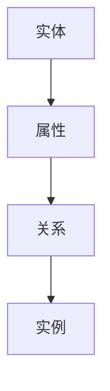
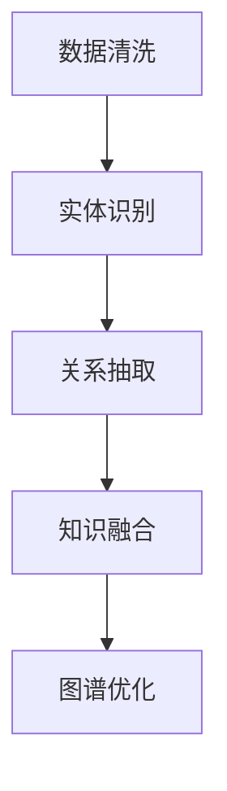

                 

# 企业AI Agent的知识图谱构建与应用

## 关键词：知识图谱、AI Agent、企业应用、构建方法、系统架构、实战案例、数学模型

## 摘要：企业AI Agent的知识图谱构建与应用是当前人工智能领域的重要课题。本文系统地介绍了知识图谱在企业AI Agent中的构建方法与应用场景，通过理论分析与实践案例相结合的方式，深入探讨了知识图谱构建的各个关键环节，包括数据采集、实体识别、关系抽取、知识融合等。同时，本文还详细阐述了AI Agent的原理、架构设计以及与知识图谱的结合方式，并通过实际案例分析了其在企业中的应用价值。文章最后总结了知识图谱构建与AI Agent应用中的最佳实践和未来发展方向。

---

## 第1章 问题背景与核心概念

### 1.1 问题背景

#### 1.1.1 知识图谱的定义与作用
知识图谱是一种以图结构形式表示知识的语义网络，由节点（实体）和边（关系）组成，能够有效地表示实体之间的关联关系。在企业中，知识图谱可以整合企业内外部数据，帮助AI Agent理解复杂的企业业务场景。

#### 1.1.2 AI Agent的定义与特点
AI Agent是一种具备自主决策能力的智能体，能够通过感知环境、推理问题并执行操作来完成任务。AI Agent的核心特点包括自主性、反应性、目标导向性和学习能力。

#### 1.1.3 企业AI Agent的知识图谱需求
企业AI Agent需要依赖知识图谱来理解企业的业务流程、组织结构、产品信息等，从而实现智能化的决策和执行。

### 1.2 问题描述

#### 1.2.1 企业信息孤岛问题
企业内部数据分散在不同系统中，缺乏统一的知识表示，导致信息无法有效共享和利用。

#### 1.2.2 知识图谱在企业中的应用价值
知识图谱能够整合企业内外部数据，提供统一的知识表示，支持企业级的智能化应用。

#### 1.2.3 AI Agent的知识需求
AI Agent需要依赖知识图谱来获取上下文信息，以便更好地理解和执行任务。

### 1.3 问题解决

#### 1.3.1 知识图谱构建的基本思路
通过数据采集、清洗、标注、实体识别、关系抽取等步骤，构建企业领域的知识图谱。

#### 1.3.2 AI Agent的知识获取与应用
AI Agent通过查询知识图谱获取所需信息，并结合推理能力完成任务。

#### 1.3.3 企业知识图谱构建的必要性
知识图谱能够提升企业数据的利用率，支持智能化决策，是企业数字化转型的重要基础设施。

### 1.4 边界与外延

#### 1.4.1 知识图谱的边界
知识图谱的构建仅关注企业的核心业务领域，不涉及外部无关信息。

#### 1.4.2 AI Agent的边界
AI Agent的功能局限于其知识图谱覆盖的领域，超出范围的任务需依赖其他系统。

#### 1.4.3 知识图谱与AI Agent的外延关系
知识图谱可以不断扩展，AI Agent的能力也随之增强，形成动态的反馈优化机制。

### 1.5 概念结构与核心要素

#### 1.5.1 知识图谱的构成要素
- 实体：企业中的具体事物，如“产品”、“员工”。
- 属性：实体的特征，如“产品类别”、“员工职位”。
- 关系：实体之间的关联，如“属于”、“负责”。

#### 1.5.2 AI Agent的核心要素
- 感知能力：通过传感器或接口获取环境信息。
- 推理能力：基于知识图谱进行逻辑推理。
- 执行能力：根据推理结果执行操作。

#### 1.5.3 两者的关联与区别
知识图谱是AI Agent的知识基础，AI Agent负责知识图谱的应用与扩展。

---

## 第2章 知识图谱与AI Agent的核心概念

### 2.1 核心概念原理

#### 2.1.1 知识图谱的构建原理
通过数据清洗、实体识别和关系抽取等技术，将分散的数据整合成结构化的知识图谱。

#### 2.1.2 AI Agent的工作原理
AI Agent通过感知环境、推理问题并执行操作来完成任务，其推理过程依赖于知识图谱的支持。

#### 2.1.3 两者结合的原理
AI Agent利用知识图谱中的实体和关系进行推理，知识图谱通过AI Agent的应用不断优化和扩展。

### 2.2 概念属性特征对比

| 特性       | 知识图谱                   | AI Agent                 |
|------------|---------------------------|---------------------------|
| 定义       | 结构化的知识网络           | 具有自主决策能力的智能体 |
| 核心作用   | 提供知识表示               | 执行任务                 |
| 依赖性     | 依赖数据构建             | 依赖知识图谱推理         |

### 2.3 ER实体关系图架构

---

## 第3章 知识图谱的构建方法

### 3.1 数据采集与预处理

#### 3.1.1 数据来源
- 企业内部数据库
- 行业公开数据集
- 外部API接口

#### 3.1.2 数据清洗
- 去除重复数据
- 处理缺失值
- 标准化数据格式

#### 3.1.3 数据标注
- 实体标注：识别数据中的实体。
- 关系标注：标注实体之间的关系。

### 3.2 知识抽取与融合

#### 3.2.1 实体识别
使用自然语言处理技术从文本中提取实体，如使用NER（Named Entity Recognition）模型。

#### 3.2.2 关系抽取
通过模式匹配或深度学习模型识别实体之间的关系。

#### 3.2.3 知识融合
将多个数据源中的知识整合到统一的知识图谱中，解决冲突和冗余问题。

### 3.3 知识图谱构建与优化

#### 3.3.1 图谱构建流程

#### 3.3.2 图谱优化方法
- 去除冗余边
- 合并同义词
- 优化实体层次结构

---

通过以上章节的详细分析和逐步推理，接下来将进入具体的算法原理和系统架构设计部分，为后续的实践案例和应用分析打下坚实基础。

