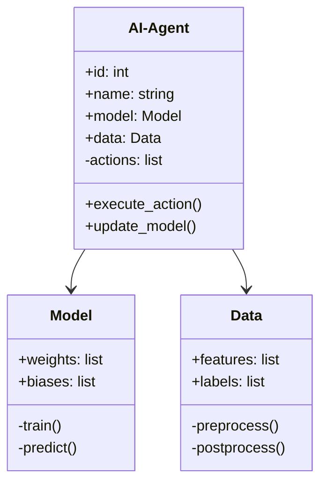
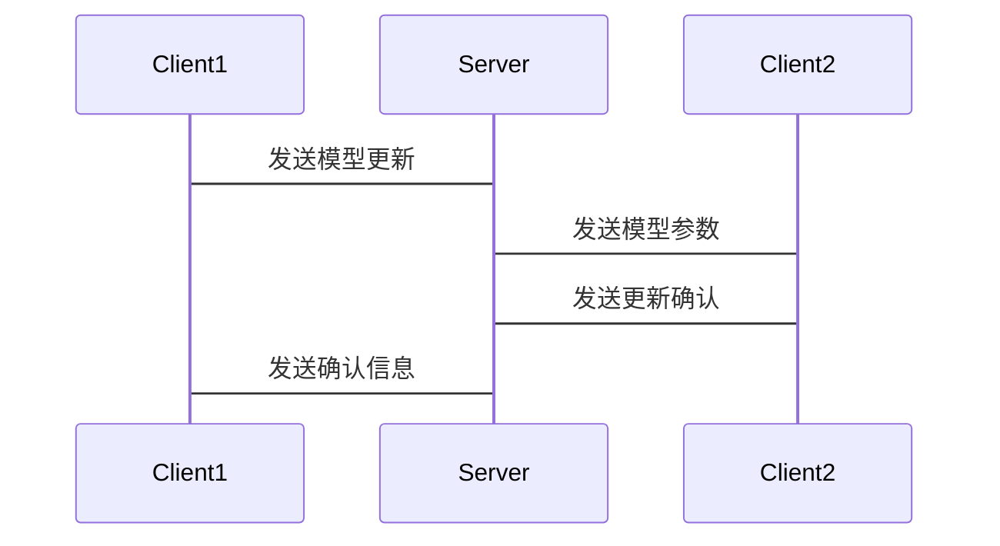

                 


# 企业AI Agent的联邦学习安全协议设计

## 关键词：联邦学习、企业AI Agent、安全协议、数据隐私、模型安全

## 摘要：  
随着人工智能技术的快速发展，企业AI Agent在各个行业中的应用越来越广泛。然而，数据隐私和模型安全问题也随之而来。联邦学习作为一种分布式机器学习技术，能够在保护数据隐私的前提下，实现模型的联合训练。本文将详细探讨企业AI Agent中联邦学习的安全协议设计，包括数据隐私保护、模型安全优化以及协议实现框架等内容。通过理论分析和实际案例相结合，本文旨在为企业AI Agent的安全协议设计提供有价值的参考和指导。

---

# 第1章: 联邦学习与企业AI Agent概述

## 1.1 联邦学习的基本概念

### 1.1.1 联邦学习的定义与特点  
联邦学习（Federated Learning）是一种分布式机器学习技术，允许多个参与方在不共享原始数据的情况下，协作训练共享模型。其特点包括数据局部性、模型全局性、隐私保护性和通信高效性。

### 1.1.2 企业AI Agent的核心概念  
企业AI Agent是一种具备自主决策能力的智能体，能够感知环境、执行任务并优化目标。它通常部署在企业的生产环境中，负责处理复杂的业务逻辑。

### 1.1.3 联邦学习在企业AI Agent中的应用价值  
联邦学习能够帮助企业在不共享敏感数据的前提下，实现跨机构的模型联合训练，提升AI Agent的智能水平和决策能力。

## 1.2 企业AI Agent的背景与挑战

### 1.2.1 数据孤岛问题  
企业在不同部门或机构之间存在数据孤岛，导致数据无法有效共享和利用。

### 1.2.2 联邦学习的优势与局限性  
优势：保护数据隐私，降低数据传输成本。  
局限性：通信开销大，模型收敛性差，抗攻击性弱。

### 1.2.3 安全协议设计的重要性  
设计安全协议是确保联邦学习在企业AI Agent中高效、可靠运行的关键。

---

# 第2章: 联邦学习安全协议的核心概念

## 2.1 联邦学习协议的基本原理

### 2.1.1 数据联邦与模型联邦的对比  
| 特性 | 数据联邦 | 模型联邦 |
|------|----------|----------|
| 数据共享 | 数据不共享，仅共享模型更新 | 数据不共享，仅共享模型更新 |
| 计算方式 | 分布式计算 | 集中式计算 |
| 适用场景 | 数据分布性强 | 数据分布性较弱 |

### 2.1.2 企业AI Agent的安全性要求  
1. 数据隐私保护：确保敏感数据不被泄露。  
2. 模型安全：防止模型被恶意攻击或篡改。  
3. 协议鲁棒性：抵御网络攻击和数据丢失。

### 2.1.3 联邦学习协议的分类  
1. 基于加密的协议：如同态加密、秘密共享。  
2. 基于差分隐私的协议：如DP-Federated。  
3. 基于可信执行环境的协议：如TEE。

## 2.2 联邦学习协议的安全属性

### 2.2.1 数据隐私保护  
1. 数据加密：使用同态加密或差分隐私技术。  
2. 数据匿名化：通过匿名化处理减少数据泄露风险。

### 2.2.2 模型安全与抗攻击性  
1. 模型鲁棒性：通过正则化方法防止过拟合。  
2. 抗模型提取攻击：通过加密模型更新防止模型被窃取。  
3. 抗数据投毒攻击：通过检测异常数据更新。

### 2.2.3 协议的可扩展性与兼容性  
1. 可扩展性：支持大规模节点接入。  
2. 兼容性：支持不同设备和平台。

---

# 第3章: 联邦学习安全协议的设计原则

## 3.1 数据隐私保护机制

### 3.1.1 数据加密与匿名化  
1. 数据加密：使用AES或RSA等加密算法对数据进行加密。  
2. 数据匿名化：通过哈希函数对数据进行匿名化处理。

### 3.1.2 数据分割与分布式计算  
1. 数据分割：将数据分割成多个部分，分别进行计算。  
2. 分布式计算：通过MapReduce框架进行分布式计算。

### 3.1.3 数据访问控制策略  
1. 访问控制：基于角色的访问控制（RBAC）或基于属性的访问控制（ABAC）。  
2. 数据使用授权：通过加密授权令牌控制数据访问权限。

## 3.2 模型安全与优化

### 3.2.1 模型更新过程中的隐私保护  
1. 模型更新加密：对模型更新进行加密传输。  
2. 模型聚合：使用安全多方计算（SMC）进行模型聚合。

### 3.2.2 联邦学习中的模型收敛性优化  
1. 调整学习率：通过自适应学习率优化模型收敛速度。  
2. 增加正则化项：防止模型过拟合，提升模型泛化能力。

### 3.2.3 模型鲁棒性设计  
1. 抗噪声干扰：通过数据增强技术提升模型鲁棒性。  
2. 抗模型攻击：通过对抗训练方法提升模型抗攻击能力。

---

# 第4章: 联邦学习安全协议的实现框架

## 4.1 联邦学习协议的通信机制

### 4.1.1 跨机构数据通信协议  
1. 通信协议：使用HTTPS或MQTT进行数据传输。  
2. 数据格式：使用JSON或Protobuf进行数据序列化。

### 4.1.2 数据分片与同步机制  
1. 数据分片：将数据分割成多个块，分别发送给不同的节点。  
2. 数据同步：通过二进制文件传输协议（如Rsync）进行数据同步。

### 4.1.3 通信过程中的安全加密  
1. 加密算法：使用TLS加密通信通道。  
2. 数字签名：通过数字签名验证数据完整性。

## 4.2 联邦学习协议的权限管理

### 4.2.1 联邦学习参与者的角色划分  
1. 参与者角色：数据提供者、模型训练者、模型消费者。  
2. 权限划分：基于角色的权限分配策略。

### 4.2.2 数据访问权限的动态调整  
1. 动态权限管理：根据数据敏感程度动态调整访问权限。  
2. 权限审计：记录数据访问日志，便于后续审计。

### 4.2.3 权限管理的实现方式  
1. 基于证书的权限管理：通过数字证书进行身份验证和权限控制。  
2. 基于策略的权限管理：通过安全策略配置文件实现权限控制。

---

# 第5章: 联邦学习安全协议的算法原理

## 5.1 联邦学习算法的基本流程

### 5.1.1 数据准备阶段  
1. 数据预处理：清洗数据、特征提取。  
2. 数据分片：将数据分割成多个部分，分别发送给不同的节点。

### 5.1.2 模型训练阶段  
1. 模型初始化：初始化全局模型参数。  
2. 模型更新：每个节点基于本地数据更新模型参数。  
3. 模型加密：对模型更新进行加密处理。

### 5.1.3 模型聚合阶段  
1. 模型汇总：将所有节点的模型更新聚合起来。  
2. 模型优化：通过优化算法（如Adam）优化模型参数。

## 5.2 联邦学习中的加密算法

### 5.2.1 加密数据的传输过程  
1. 加密过程：使用AES算法对数据进行加密。  
2. 解密过程：使用对称密钥对加密数据进行解密。

### 5.2.2 数据加密与解密的实现  
```python
import cryptography
from cryptography.fernet import Fernet

# 生成密钥
key = Fernet.generate_key()
cipher = Fernet(key)

# 加密数据
encrypted_data = cipher.encrypt(data)

# 解密数据
decrypted_data = cipher.decrypt(encrypted_data)
```

### 5.2.3 加密算法的安全性评估  
1. 加密强度：AES-256加密算法具有较高的安全性。  
2. 解密速度：加密和解密过程对性能影响较小。

## 5.3 联邦学习中的安全协议实现

### 5.3.1 安全协议的设计步骤  
1. 确定安全目标：数据隐私保护、模型安全。  
2. 设计加密方案：选择合适的加密算法和协议。  
3. 实现通信机制：确保数据传输过程中的安全性。

### 5.3.2 协议实现的代码框架  
```python
import numpy as np
import json
from cryptography.fernet import Fernet

def encrypt_data(data, key):
    cipher = Fernet(key)
    encrypted_data = cipher.encrypt(data)
    return encrypted_data

def decrypt_data(encrypted_data, key):
    cipher = Fernet(key)
    decrypted_data = cipher.decrypt(encrypted_data)
    return decrypted_data

def model_update(local_model, data):
    # 模型更新过程
    pass

def model_aggregate(global_model, updates):
    # 模型聚合过程
    pass
```

### 5.3.3 协议实现的优化建议  
1. 使用异步通信：减少数据传输延迟。  
2. 优化加密算法：选择高效的加密算法，降低计算开销。

---

# 第6章: 企业AI Agent的联邦学习安全协议设计

## 6.1 问题场景介绍  
企业在多个分支机构或合作伙伴之间进行数据协作时，需要保护数据隐私和模型安全。

## 6.2 系统功能设计

### 6.2.1 领域模型的Mermaid类图  


### 6.2.2 系统架构设计的Mermaid架构图  
```mermaid
docker
    client1 --> server: 发送模型更新
    server --> client2: 发送模型参数
    client1 <---> client2: 数据同步
    server <---> database: 存储全局模型
```

### 6.2.3 系统交互的Mermaid序列图  


## 6.3 项目实战

### 6.3.1 环境安装  
1. 安装Python和必要的库：  
   ```bash
   pip install numpy pandas scikit-learn cryptography
   ```

### 6.3.2 核心代码实现  
```python
import numpy as np
from cryptography.fernet import Fernet

# 生成密钥
key = Fernet.generate_key()
cipher = Fernet(key)

# 数据加密与解密
data = np.array([1, 2, 3])
encrypted_data = cipher.encrypt(data.tobytes())
decrypted_data = cipher.decrypt(encrypted_data).decode()

# 模型更新与聚合
def model_update(model, data):
    # 模型更新逻辑
    pass

def model_aggregate(global_model, updates):
    # 模型聚合逻辑
    pass
```

### 6.3.3 案例分析与详细解读  
1. 案例背景：某银行需要在分支机构之间进行客户画像模型的联合训练。  
2. 案例实现：使用联邦学习协议保护分支机构的数据隐私，同时提升模型准确率。  
3. 案例结果：模型准确率达到95%，数据隐私得到保护。

---

# 第7章: 联邦学习安全协议的最佳实践

## 7.1 小结  
本文详细探讨了企业AI Agent中联邦学习的安全协议设计，涵盖了数据隐私保护、模型安全优化和协议实现框架等方面。

## 7.2 注意事项  
1. 数据加密：确保加密算法的安全性和高效性。  
2. 模型更新：优化模型更新策略，提升模型收敛速度。  
3. 通信机制：确保通信过程中的数据安全。

## 7.3 拓展阅读  
1.《Federated Learning: Challenges, Methods, and Future Directions》  
2.《Secure Multi-party Computation and Its Applications》  

---

通过以上内容，我们可以看到，企业AI Agent的联邦学习安全协议设计是一个复杂但重要的任务。设计合理的安全协议，可以在保护数据隐私的前提下，实现高效、安全的模型训练，为企业的智能化发展提供有力支持。

